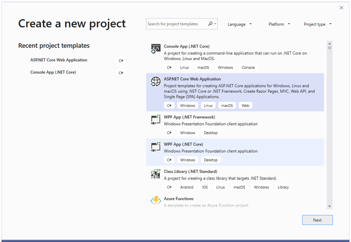
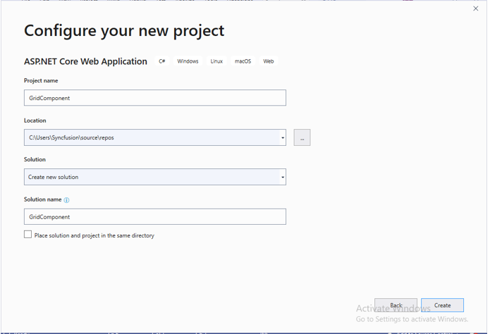
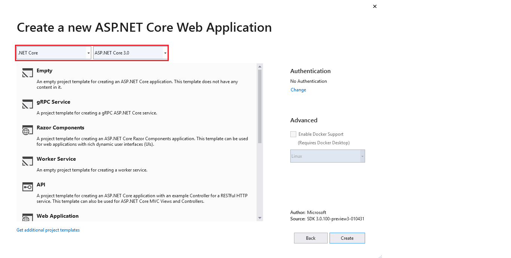
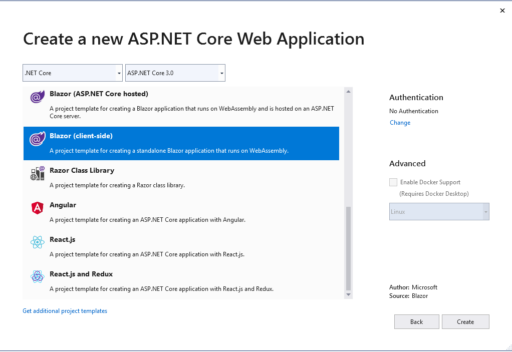
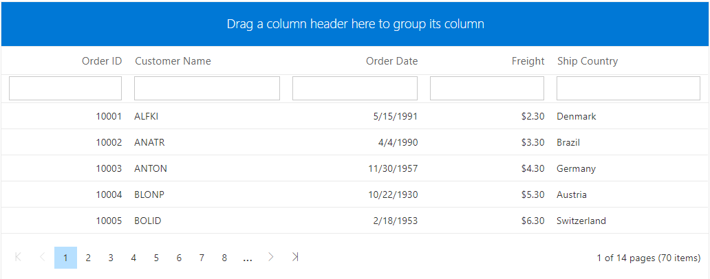

<!-- markdownlint-disable MD024 -->

# Getting Started with Essential JS 2 for Blazor client-side in Visual Studio 2019

This article provides a step-by-step introduction to create Blazor application add Syncfusion Razor component packages to the application. It also include initializing DataGrid Razor component and usage of features such as paging, sorting, filtering and grouping using the [Visual Studio 2019](https://visualstudio.microsoft.com/vs/preview/).

## Prerequisites

The official prerequisites to create and run an ASP.NET Core Razor Components on Windows environment are described in the [.NET Core Razor components documentation website](https://docs.microsoft.com/en-us/aspnet/core/client-side/spa/blazor/get-started?view=aspnetcore-3.0&tabs=visual-studio).

* [Visual Studio 2019](https://visualstudio.microsoft.com/vs/preview/) with the ASP.NET and web development workload
* [.NET Core SDK 3.0.100-preview6-012264](https://dotnet.microsoft.com/download/dotnet-core/3.0)
* [Blazor VS Extension](https://marketplace.visualstudio.com/items?itemName=aspnet.blazor)

## Create Blazor Application

**Step 1:** Install the [Blazor VS Extension](https://marketplace.visualstudio.com/items?itemName=aspnet.blazor) for getting the essential project templates in the Visual Studio 2019.

**Step 2:** Choose **File > New > Project...** in the Visual Studio menu bar.

 

**Step 3:** Configure your new project in ASP.NET Core WebApplication and give your **Project name**.

 

**Step 4:** Make sure **.NET Core** and **ASP.NET Core 3.0** are selected at the top.

 

**Step 5:** Choose the Razor components template and then click **Create**.

 

## Adding Syncfusion packages

**Step 1:** Now, add the **Syncfusion.Blazor** NuGet package to the new application by using the NuGet Package Manager. Right-click the project and select Manage NuGet Packages.

 

**Step 2:** Search the **Syncfusion.Blazor** keyword in the Browse tab and install **Syncfusion.Blazor** NuGet package in the application.

 

**Step 3:** The Essential JS 2 package will be included in the project, after the installation process is completed.

**Step 4:** Open **~/_Imports.razor** file and import the `Syncfusion.Blazor`.





        @using Syncfusion.Blazor
        @using Syncfusion.Blazor.Grids





## Adding Scripts and CSS reference

You can add the client-side resources through CDN in the `<head>` element of the **~/Pages/_Host.cshtml** page.





    <head>
    ....
    ....
    <link href="https://cdn.syncfusion.com/blazor/styles/fabric.css" rel="stylesheet" />
    </head>





## Add DataGrid Component

To initialize the DataGrid component add the below code to your **Index.razor** view page which is present under **~/Pages** folder. For example, the DataGrid component is added in the **~/Pages/Index.razor** page.





<SfGrid >

</SfGrid>





## Defining Row Data

To bind data for the DataGrid component, you can assign a IEnumerable object to the [`DataSource`](https://help.syncfusion.com/cr/blazor/Syncfusion.Blazor.Grids.SfGrid-1.html#Syncfusion_Blazor_Grids_SfGrid_1_DataSource) property. The list data source can also be provided as an instance of the `DataManager`. You can assign the data source through the **OnInitialized** lifecycle of the page.





<SfGrid DataSource="@gridData">

</SfGrid>

@code{
    public List<OrdersDetails> gridData { get; set; }
    protected override void OnInitialized()
    {
        gridData = OrdersDetails.GetAllRecords();
    }
}





## Defining Columns

The columns are automatically generated when columns declaration is empty or undefined while initializing the datagrid.

The DataGrid has an option to define columns using [`GridColumns`](https://help.syncfusion.com/cr/aspnetcore-blazor/Syncfusion.Blazor.Grids.GridColumns.html) component. In `GridColumn` component we have properties to customize columns.

Let’s check the properties used here:
* We have added [`Field`](https://help.syncfusion.com/cr/blazor/Syncfusion.Blazor.Grids.GridColumn.html#Syncfusion_Blazor_Grids_GridColumn_Field) to map with a property name an array of JavaScript objects.
* We have added [`HeaderText`](https://help.syncfusion.com/cr/blazor/Syncfusion.Blazor.Grids.GridColumn.html#Syncfusion_Blazor_Grids_GridColumn_HeaderText) to change the title of columns.
* We have used [`TextAlign`](https://help.syncfusion.com/cr/blazor/Syncfusion.Blazor.Grids.GridColumn.html#Syncfusion_Blazor_Grids_GridColumn_TextAlign) to change the alignment of columns. By default, columns will be left aligned. To change columns to right align, we need to define `TextAlign` as `Right`.
* Also, we have used another useful property, [`Format`](https://help.syncfusion.com/cr/blazor/Syncfusion.Blazor.Grids.GridColumn.html#Syncfusion_Blazor_Grids_GridColumn_Format). Using this, we can format number and date values to standard or custom formats.





<SfGrid DataSource="@gridData">
    <GridColumns>
        <GridColumn Field=@nameof(OrdersDetails.OrderID) HeaderText="Order ID" TextAlign="TextAlign.Right" Width="120"></GridColumn>
        <GridColumn Field=@nameof(OrdersDetails.CustomerID) HeaderText="Customer Name" Width="150"></GridColumn>
        <GridColumn Field=@nameof(OrdersDetails.OrderDate) HeaderText=" Order Date" Format="d" Type="ColumnType.Date" TextAlign="TextAlign.Right" Width="130"></GridColumn>
        <GridColumn Field=@nameof(OrdersDetails.Freight) HeaderText="Freight" Format="C2" TextAlign="TextAlign.Right" Width="120"></GridColumn>
        <GridColumn Field=@nameof(OrdersDetails.ShipCountry) HeaderText="Ship Country" Width="150"></GridColumn>
    </GridColumns>
</SfGrid>

@code{
    public List<OrdersDetails> gridData { get; set; }
    protected override void OnInitialized()
    {
        gridData = OrdersDetails.GetAllRecords();
    }
}





## Enable Paging

The paging feature enables users to view the datagrid record in a paged view. It can be enabled by setting the [`AllowPaging`](https://help.syncfusion.com/cr/blazor/Syncfusion.Blazor.Grids.SfGrid-1.html#Syncfusion_Blazor_Grids_SfGrid_1_AllowPaging) property to true. Pager can be customized using the [`GridPageSettings`](https://help.syncfusion.com/cr/blazor/Syncfusion.Blazor.Grids.SfGrid-1.html#Syncfusion_Blazor_Grids_SfGrid_1_PageSettings) component.





<SfGrid DataSource="@gridData" AllowPaging="true">
 <GridPageSettings PageSize="5"></GridPageSettings>
   <GridColumns>
     <GridColumn Field=@nameof(OrdersDetails.OrderID) HeaderText="Order ID" TextAlign="TextAlign.Right" Width="120"></GridColumn>
     <GridColumn Field=@nameof(OrdersDetails.CustomerID) HeaderText="Customer Name" Width="150"></GridColumn>
     <GridColumn Field=@nameof(OrdersDetails.OrderDate) HeaderText=" Order Date" Format="d" Type="ColumnType.Date" TextAlign="TextAlign.Right" Width="130"></GridColumn>
     <GridColumn Field=@nameof(OrdersDetails.Freight) HeaderText="Freight" Format="C2" TextAlign="TextAlign.Right" Width="120"></GridColumn>
     <GridColumn Field=@nameof(OrdersDetails.ShipCountry) HeaderText="Ship Country" Width="150"></GridColumn>
   </GridColumns>
</SfGrid>

@code{
    public List<OrdersDetails> gridData { get; set; }
    protected override void OnInitialized()
    {
        gridData = OrdersDetails.GetAllRecords();
    }
}





## Enable Sorting

The sorting feature enables you to order the records. It can be enabled by setting the [`AllowSorting`](https://help.syncfusion.com/cr/blazor/Syncfusion.Blazor.Grids.SfGrid-1.html#Syncfusion_Blazor_Grids_SfGrid_1_AllowSorting) property as true. Sorting feature can be customized using the [`GridSortSettings`](https://help.syncfusion.com/cr/blazor/Syncfusion.Blazor.Grids.SfGrid-1.html#Syncfusion_Blazor_Grids_SfGrid_1_SortSettings) component.





<SfGrid DataSource="@gridData" AllowPaging="true" AllowSorting="true">
 <GridPageSettings PageSize="5"></GridPageSettings>
   <GridColumns>
     <GridColumn Field=@nameof(OrdersDetails.OrderID) HeaderText="Order ID" TextAlign="TextAlign.Right" Width="120"></GridColumn>
     <GridColumn Field=@nameof(OrdersDetails.CustomerID) HeaderText="Customer Name" Width="150"></GridColumn>
     <GridColumn Field=@nameof(OrdersDetails.OrderDate) HeaderText=" Order Date" Format="d" Type="ColumnType.Date" TextAlign="TextAlign.Right" Width="130"></GridColumn>
     <GridColumn Field=@nameof(OrdersDetails.Freight) HeaderText="Freight" Format="C2" TextAlign="TextAlign.Right" Width="120"></GridColumn>
     <GridColumn Field=@nameof(OrdersDetails.ShipCountry) HeaderText="Ship Country" Width="150"></GridColumn>
   </GridColumns>
</SfGrid>

@code{
    public List<OrdersDetails> gridData { get; set; }
    protected override void OnInitialized()
    {
        gridData = OrdersDetails.GetAllRecords();
    }
}





## Enable Filtering

The filtering feature enables you to view reduced amount of records based on filter criteria. It can be enabled by setting the [`AllowFiltering`](https://help.syncfusion.com/cr/blazor/Syncfusion.Blazor.Grids.SfGrid-1.html#Syncfusion_Blazor_Grids_SfGrid_1_AllowFiltering) property as true. Filtering feature can be customized using the [`FilterSettings`](https://help.syncfusion.com/cr/blazor/Syncfusion.Blazor.Grids.SfGrid-1.html#Syncfusion_Blazor_Grids_SfGrid_1_FilterSettings) property.





<SfGrid DataSource="@gridData" AllowPaging="true" AllowSorting="true" AllowFiltering="true">
 <GridPageSettings PageSize="5"></GridPageSettings>
   <GridColumns>
     <GridColumn Field=@nameof(OrdersDetails.OrderID) HeaderText="Order ID" TextAlign="TextAlign.Right" Width="120"></GridColumn>
     <GridColumn Field=@nameof(OrdersDetails.CustomerID) HeaderText="Customer Name" Width="150"></GridColumn>
     <GridColumn Field=@nameof(OrdersDetails.OrderDate) HeaderText=" Order Date" Format="d" Type="ColumnType.Date" TextAlign="TextAlign.Right" Width="130"></GridColumn>
     <GridColumn Field=@nameof(OrdersDetails.Freight) HeaderText="Freight" Format="C2" TextAlign="TextAlign.Right" Width="120"></GridColumn>
     <GridColumn Field=@nameof(OrdersDetails.ShipCountry) HeaderText="Ship Country" Width="150"></GridColumn>
   </GridColumns>
</SfGrid>

@code{
    public List<OrdersDetails> gridData { get; set; }
    protected override void OnInitialized()
    {
        gridData = OrdersDetails.GetAllRecords();
    }
}





## Enable Grouping

The grouping feature enables you to view the datagrid record in a grouped view. It can be enabled by setting the [`AllowGrouping`](https://help.syncfusion.com/cr/blazor/Syncfusion.Blazor.Grids.SfGrid-1.html#Syncfusion_Blazor_Grids_SfGrid_1_AllowGrouping) property as true. Grouping feature can be customized using the [`GridGroupSettings`](https://help.syncfusion.com/cr/blazor/Syncfusion.Blazor.Grids.SfGrid-1.html#Syncfusion_Blazor_Grids_SfGrid_1_GroupSettings) component.





<SfGrid DataSource="@gridData" AllowPaging="true" AllowSorting="true" AllowFiltering="true" AllowGrouping="true">
 <GridPageSettings PageSize="5"></GridPageSettings>
   <GridColumns>
     <GridColumn Field=@nameof(OrdersDetails.OrderID) HeaderText="Order ID" TextAlign="TextAlign.Right" Width="120"></GridColumn>
     <GridColumn Field=@nameof(OrdersDetails.CustomerID) HeaderText="Customer Name" Width="150"></GridColumn>
     <GridColumn Field=@nameof(OrdersDetails.OrderDate) HeaderText=" Order Date" Format="d" Type="ColumnType.Date" TextAlign="TextAlign.Right" Width="130"></GridColumn>
     <GridColumn Field=@nameof(OrdersDetails.Freight) HeaderText="Freight" Format="C2" TextAlign="TextAlign.Right" Width="120"></GridColumn>
     <GridColumn Field=@nameof(OrdersDetails.ShipCountry) HeaderText="Ship Country" Width="150"></GridColumn>
   </GridColumns>
</SfGrid>

@code{
    public List<OrdersDetails> gridData { get; set; }
    protected override void OnInitialized()
    {
        gridData = OrdersDetails.GetAllRecords();
    }
}





Output be like the below.

## See Also

* [Getting Started with Syncfusion Blazor for Client-Side in .NET Core CLI](./client-side-using-cli)

* [Getting Started with Syncfusion Blazor for Server-Side in Visual Studio 2019](./server-side-using-visual-studio)

* [Getting Started with Syncfusion Blazor for Server-Side in .NET Core CLI](./server-side-using-cli)