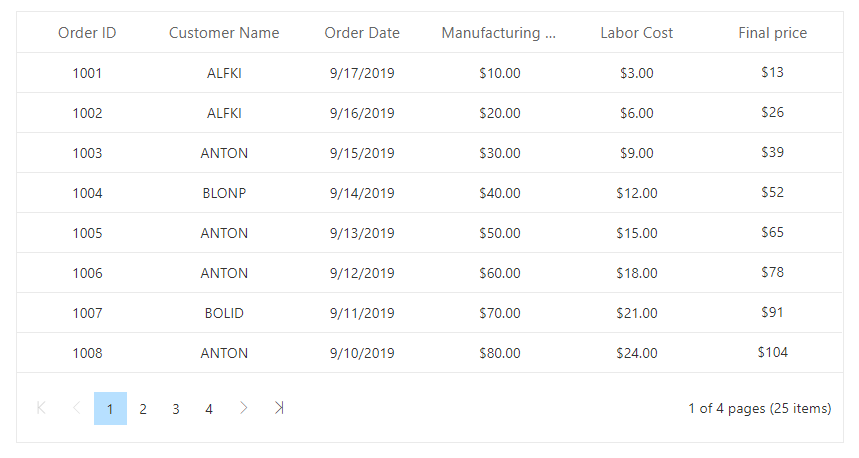

# Calculate column value based on other columns in Blazor DataGrid

You can calculate the values for a datagrid column based on other column values by using the **context** parameter in the [`Template`](https://help.syncfusion.com/cr/blazor/Syncfusion.Blazor.Grids.GridColumn.html#Syncfusion_Blazor_Grids_GridColumn_Template) property of the [`GridColumn`](https://help.syncfusion.com/cr/aspnetcore-blazor/Syncfusion.Blazor.Grids.GridColumn.html) component. Inside the [`Template`](https://help.syncfusion.com/cr/blazor/Syncfusion.Blazor.Grids.GridColumn.html#Syncfusion_Blazor_Grids_GridColumn_Template), you can access the column values using the implicit named parameter **context** and then calculate the values for the new column as required.

This is demonstrated in the below sample code where the value for **FinalCost** column is calculated based on the values of **ManfCost** and **LabCost** columns,

```cshtml
@using Syncfusion.Blazor.Grids

<SfGrid DataSource="@Orders" AllowPaging="true">
    <GridPageSettings PageSize="8"></GridPageSettings>
    <GridColumns>
        <GridColumn Field=@nameof(Order.OrderID) HeaderText="Order ID" TextAlign="TextAlign.Center" Width="120"></GridColumn>
        <GridColumn Field=@nameof(Order.CustomerID) HeaderText="Customer Name" TextAlign="TextAlign.Center" Width="120"></GridColumn>
        <GridColumn Field=@nameof(Order.OrderDate) HeaderText=" Order Date" Format="d" Type=ColumnType.Date TextAlign="TextAlign.Center" Width="120"></GridColumn>
        <GridColumn Field=@nameof(Order.ManfCost) HeaderText="Manufacturing Cost" Format="C2" TextAlign="TextAlign.Center" Width="120"></GridColumn>
        <GridColumn Field=@nameof(Order.LabCost) HeaderText="Labor Cost" Format="C2" TextAlign="TextAlign.Center" Width="120"></GridColumn>
        <GridColumn Field=@nameof(Order.FinalCost) HeaderText="Final price" Format="C2" TextAlign="TextAlign.Center" Width="120">
            <Template>
                @{
                    var value = (context as Order);
                    var finalAmount = value.ManfCost + value.LabCost;
                    <div>$@finalAmount</div>
                }
            </Template>
        </GridColumn>
    </GridColumns>
</SfGrid>

@code{

    public List<Order> Orders { get; set; }

    protected override void OnInitialized()
    {
        Orders = Enumerable.Range(1, 25).Select(x => new Order()
        {
            OrderID = 1000 + x,
            CustomerID = (new string[] { "ALFKI", "ANANTR", "ANTON", "BLONP", "BOLID" })[new Random().Next(5)],
            ManfCost = 10 * x,
            LabCost = 3 * x,
            OrderDate = DateTime.Now.AddDays(-x),
        }).ToList();
    }
    public class Order
    {
        public int? OrderID { get; set; }
        public string CustomerID { get; set; }
        public DateTime? OrderDate { get; set; }
        public int? ManfCost { get; set; }
        public int? LabCost { get; set; }
        public double? FinalCost { get; set; }
    }
}
```

The following image represents the output of the above sample code,
