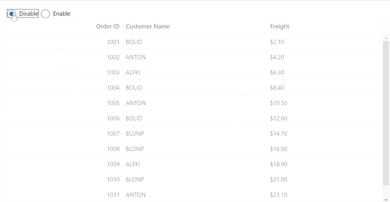

# Enable or Disable the Grid Component

You can enable or disable the Grid component by adding the attributes for the Grid and applying the style accordingly.

In the following sample, the `SfRadioButton` is rendered: Using the [ValueChange](https://help.syncfusion.com/cr/blazor/Syncfusion.Blazor.Buttons.SfRadioButton-1.html#Syncfusion_Blazor_Buttons_SfRadioButton_1_ValueChange) event of the `SfRadioButton`, you can enable or disable the Grid component.

```cshtml
@using Syncfusion.Blazor.Grids
@using Syncfusion.Blazor.Buttons

<SfRadioButton Label="Disable" TChecked="string" Name="options" @bind-Checked="stringChecked" Value="Yes" ValueChange="@((args)=>OnChange(args,"Yes"))"></SfRadioButton>
<SfRadioButton Label="Enable" TChecked="string" Name="options" @bind-Checked="stringChecked" Value="No" ValueChange="@((args)=>OnChange(args,"No"))"></SfRadioButton>

<SfGrid DataSource="@Orders" @attributes="@GridAttributes" AllowPaging="true" Width="900" Height="400">
    <GridColumns>
        <GridColumn Field=@nameof(Order.OrderID) HeaderText="Order ID" TextAlign="TextAlign.Right" Width="80"></GridColumn>
        <GridColumn Field=@nameof(Order.CustomerID) HeaderText="Customer Name" Width="100"></GridColumn>
        <GridColumn Field=@nameof(Order.Freight) HeaderText="Freight" Format="C2" Width="80"></GridColumn>
    </GridColumns>
</SfGrid>
<style>
    .e-grid[disable="yes"] {
        opacity: .5;
        pointer-events: none;
        -ms-touch-action: none;
        touch-action: none;
        cursor: no-drop;
    }
</style>

@code{
    private string stringChecked = "No";
    public void OnChange(ChangeArgs<string> Args, string val)
    {
        if (val == "Yes")
        {
            GridAttributes["disable"] = "yes";
        }
        else if (val == "No")
        {
            GridAttributes["disable"] = "no";
        }
    }

    private Dictionary<string, object> GridAttributes { get; set; } = new Dictionary<string, object>();
    public List<Order> Orders { get; set; }

    protected override void OnInitialized()
    {
        GridAttributes.Add("disable", "no");
        Orders = Enumerable.Range(1, 1000).Select(x => new Order()
        {
            OrderID = 1000 + x,
            CustomerID = (new string[] { "ALFKI", "ANANTR", "ANTON", "BLONP", "BOLID" })[new Random().Next(5)],
            Freight = 2.1 * x,
            OrderDate = DateTime.Now.AddDays(-x),
        }).ToList();
    }

    public class Order
    {
        public int? OrderID { get; set; }
        public string CustomerID { get; set; }
        public DateTime? OrderDate { get; set; }
        public double? Freight { get; set; }
    }
}

```

