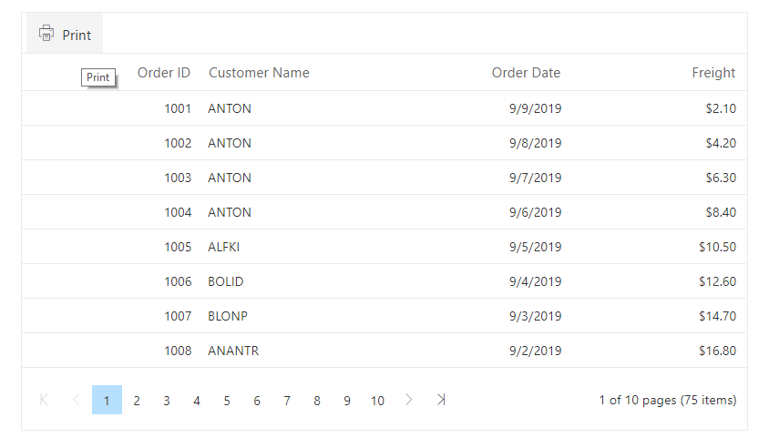
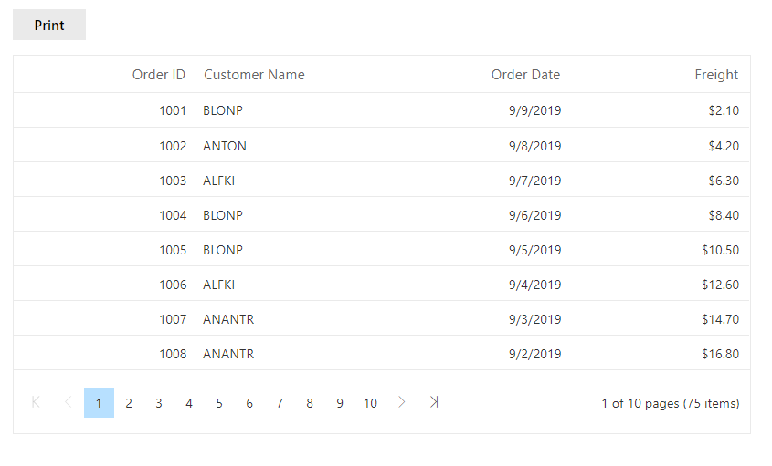

<!-- markdownlint-disable MD033 -->

# Print in Blazor DataGrid Component

To print the DataGrid, call the [Print](https://help.syncfusion.com/cr/blazor/Syncfusion.Blazor.Grids.SfGrid-1.html#Syncfusion_Blazor_Grids_SfGrid_1_Print) method using datagrid reference. The print option can also be displayed on the toolbar by adding the `Print` toolbar item.

The below sample code demonstrates DataGrid with print option added in the toolbar,

```cshtml
@using Syncfusion.Blazor.Grids

<SfGrid DataSource="@Orders" Toolbar="@(new List<object>() { "Print" })" AllowPaging="true">
    <GridPageSettings PageSize="8"></GridPageSettings>
    <GridColumns>
        <GridColumn Field=@nameof(Order.OrderID) HeaderText="Order ID" TextAlign="TextAlign.Right" Width="120"></GridColumn>
        <GridColumn Field=@nameof(Order.CustomerID) HeaderText="Customer Name" Width="120"></GridColumn>
        <GridColumn Field=@nameof(Order.OrderDate) HeaderText=" Order Date" Format="d" TextAlign="TextAlign.Right" Width="130" Type="ColumnType.Date"></GridColumn>
        <GridColumn Field=@nameof(Order.Freight) HeaderText="Freight" Format="C2" TextAlign="TextAlign.Right" Width="120"></GridColumn>
    </GridColumns>
</SfGrid>

@code{

    public List<Order> Orders { get; set; }

    protected override void OnInitialized()
    {
        Orders = Enumerable.Range(1, 75).Select(x => new Order()
        {
            OrderID = 1000 + x,
            CustomerID = (new string[] { "ALFKI", "ANANTR", "ANTON", "BLONP", "BOLID" })[new Random().Next(5)],
            Freight = 2.1 * x,
            OrderDate = DateTime.Now.AddDays(-x),
        }).ToList();
    }

    public class Order
    {
        public int? OrderID { get; set; }
        public string CustomerID { get; set; }
        public DateTime? OrderDate { get; set; }
        public double? Freight { get; set; }
    }
}
```

The following image represents DataGrid with print toolbar item,



## Page setup

Some of the print options cannot be configured through code. So, you have to customize the layout, paper size, and margin options using the browser page setup dialog. Refer to the following links to know more about this,

* [Chrome](https://support.google.com/chrome/answer/1069693?hl=en&visit_id=1-636335333734668335-3165046395&rd=1)
* [Firefox](https://support.mozilla.org/en-US/kb/how-print-web-pages-firefox)
* [Safari](https://www.mintprintables.com/print-tips/adjust-margins-osx/)
* [IE](http://www.helpteaching.com/help/print/index.htm)

## Print using an external button

To print the datagrid from an external button, invoke the print method using the datagrid reference.

The below sample code demonstrates invoking print using an external button,

```cshtml
@using Syncfusion.Blazor.Buttons
@using Syncfusion.Blazor.Grids

<SfButton Content="Print" OnClick="PrintContent"></SfButton>
<SfGrid @ref="DefaultGrid" DataSource="@Orders" AllowPaging="true">
    <GridPageSettings PageSize="8"></GridPageSettings>
    <GridColumns>
        <GridColumn Field=@nameof(Order.OrderID) HeaderText="Order ID" TextAlign="TextAlign.Right" Width="120"></GridColumn>
        <GridColumn Field=@nameof(Order.CustomerID) HeaderText="Customer Name" Width="120"></GridColumn>
        <GridColumn Field=@nameof(Order.OrderDate) HeaderText=" Order Date" Format="d" TextAlign="TextAlign.Right" Width="130" Type="ColumnType.Date"></GridColumn>
        <GridColumn Field=@nameof(Order.Freight) HeaderText="Freight" Format="C2" TextAlign="TextAlign.Right" Width="120"></GridColumn>
    </GridColumns>
</SfGrid>

@code{

    public List<Order> Orders { get; set; }

    private SfGrid<Order> DefaultGrid;

    protected override void OnInitialized()
    {
        Orders = Enumerable.Range(1, 75).Select(x => new Order()
        {
            OrderID = 1000 + x,
            CustomerID = (new string[] { "ALFKI", "ANANTR", "ANTON", "BLONP", "BOLID" })[new Random().Next(5)],
            Freight = 2.1 * x,
            OrderDate = DateTime.Now.AddDays(-x),
        }).ToList();
    }

    public class Order
    {
        public int? OrderID { get; set; }
        public string CustomerID { get; set; }
        public DateTime? OrderDate { get; set; }
        public double? Freight { get; set; }
    }
    public void PrintContent()
    {
        this.DefaultGrid.Print();
    }
}
```

The following image represents DataGrid with external button for invoking print operation,



## Print the visible page

By default, the datagrid prints all the pages. To print the current page alone, set the [PrintMode](https://help.syncfusion.com/cr/blazor/Syncfusion.Blazor.Charts.ChartSeries.html#Syncfusion_Blazor_Charts_ChartSeries_DashArray) value as **CurrentPage**.

The below sample code demonstrates this,

```cshtml
@using Syncfusion.Blazor.Grids

<SfGrid DataSource="@Orders" Toolbar="@(new List<object>() { "Print" })" PrintMode=PrintMode.CurrentPage AllowPaging="true">
    <GridPageSettings PageSize="8"></GridPageSettings>
    <GridColumns>
        <GridColumn Field=@nameof(Order.OrderID) HeaderText="Order ID" TextAlign="TextAlign.Right" Width="120"></GridColumn>
        <GridColumn Field=@nameof(Order.CustomerID) HeaderText="Customer Name" Width="120"></GridColumn>
        <GridColumn Field=@nameof(Order.OrderDate) HeaderText=" Order Date" Format="d" TextAlign="TextAlign.Right" Width="130" Type="ColumnType.Date"></GridColumn>
        <GridColumn Field=@nameof(Order.Freight) HeaderText="Freight" Format="C2" TextAlign="TextAlign.Right" Width="120"></GridColumn>
    </GridColumns>
</SfGrid>

@code{

    public List<Order> Orders { get; set; }

    protected override void OnInitialized()
    {
        Orders = Enumerable.Range(1, 75).Select(x => new Order()
        {
            OrderID = 1000 + x,
            CustomerID = (new string[] { "ALFKI", "ANANTR", "ANTON", "BLONP", "BOLID" })[new Random().Next(5)],
            Freight = 2.1 * x,
            OrderDate = DateTime.Now.AddDays(-x),
        }).ToList();
    }

    public class Order
    {
        public int? OrderID { get; set; }
        public string CustomerID { get; set; }
        public DateTime? OrderDate { get; set; }
        public double? Freight { get; set; }
    }
}
```

<!-- Print the hierarchy datagrid

By default, the datagrid will print the master and expanded child grids alone. You can change the print option by using the [`HierarchyPrintMode`](https://help.syncfusion.com/cr/blazor/Syncfusion.Blazor.Charts.ChartSeries.html#Syncfusion_Blazor_Charts_ChartSeries_Type) property of the Grid component. The available options are,

Mode |Behavior
-----|-----
Expanded |Prints the master datagrid with expanded child grids.
All |Prints the master datagrid with all the child grids.
None |Prints the master datagrid alone.

This is demonstrated in the below sample code,

```cshtml
@using Syncfusion.Blazor.Grids

@{
    GridModel<object> ChildGridData = new GridModel<object>()
    {
        DataSource = Orders,
        QueryString = "EmployeeID",
        Columns = new List<GridColumn> {
            new GridColumn() { Field="OrderID", HeaderText="OrderID", Width="110" },
            new GridColumn() { Field="CustomerName", HeaderText="CustomerName", Width="110"},
            new GridColumn() { Field="ShipCountry", HeaderText="ShipCountry", Width="110" }
        }
    };
}
<SfGrid DataSource="@Employees" Toolbar="@(new List<object>() { "Print" })" HierarchyPrintMode=HierarchyGridPrintMode.Expanded ChildGrid="ChildGridData" Height="315px">
    <GridColumns>
        <GridColumn Field=@nameof(EmployeeData.EmployeeID) HeaderText="EmployeeID" Width="110"> </GridColumn>
        <GridColumn Field=@nameof(EmployeeData.FirstName) HeaderText="First Name" Width="110"> </GridColumn>
        <GridColumn Field=@nameof(EmployeeData.City) HeaderText="Last Name" Width="110"></GridColumn>
        <GridColumn Field=@nameof(EmployeeData.Country) HeaderText="Country" Width="110"></GridColumn>
    </GridColumns>
</SfGrid>

@code{
    public List<EmployeeData> Employees { get; set; }

    public List<Order> Orders { get; set; }

    protected override void OnInitialized()
    {
        Employees = Enumerable.Range(1, 9).Select(x => new EmployeeData()
        {
            EmployeeID = x,
            FirstName = (new string[] { "Nancy", "Andrew", "Janet", "Margaret", "Steven" })[new Random().Next(5)],
            City = (new string[] { "Seattle", "Tacoma", "Redmond", "Kirkland", "London" })[new Random().Next(5)],
            Country = (new string[] { "USA", "UK" })[new Random().Next(2)],
        }).ToList();

        Orders = Enumerable.Range(1, 9).Select(x => new Order()
        {
            EmployeeID = x,
            OrderID = 1000 + x,
            CustomerName = (new string[] { "Nancy", "Andrew" })[new Random().Next(2)],
            ShipCountry = (new string[] { "USA", "UK" })[new Random().Next(2)],
        }).ToList();
    }

    public class EmployeeData
    {
        public int? EmployeeID { get; set; }
        public string FirstName { get; set; }
        public string LastName { get; set; }
        public string Title { get; set; }
        public DateTime? HireDate { get; set; }
        public string City { get; set; }
        public string Country { get; set; }
    }

    public class Order
    {
        public int? EmployeeID { get; set; }
        public int? OrderID { get; set; }
        public string CustomerName { get; set; }
        public string ShipCountry { get; set; }
    }
}
```

The following image represents Hierarchial Grid with print toolbar item,
 -->

## Print large number of columns

By default, the browser uses A4 as page size option to print pages and in order to adapt to the size of the page, the browser print preview will auto-hide the overflowed contents. Hence datagrid with large number of columns will be cut off for adapting to the size of the print page.

To print large number of columns, adjust the scale option from print option panel based on your content size.


<!-- Show or hide columns while Printing

You can show a hidden column or hide a visible column while printing the datagrid using ToolbarClick and PrintComplete events.

In the ToolbarClick event, we can show or hide columns by modifying the Visible property value of the GridColumn component.

Then in the PrintComplete event, we can reverse the state back to the previous state.

In the below example, we have **CustomerID** as a hidden column in the datagrid. While printing, we have changed **CustomerID** to visible column and **Freight** as hidden column.

```cshtml
@using Syncfusion.Blazor.Grids
@using Syncfusion.Blazor.Navigations

<SfGrid DataSource="@Orders" Toolbar="@(new List<object>() { "Print" })" PrintMode=PrintMode.CurrentPage AllowPaging="true">
    <GridEvents PrintComplete="OnPrintComplete" OnToolbarClick="ToolbarClicked" TValue="Order"></GridEvents>
    <GridPageSettings PageSize="8"></GridPageSettings>
    <GridColumns>
        <GridColumn Field=@nameof(Order.OrderID) HeaderText="Order ID" TextAlign="TextAlign.Right" Width="120"></GridColumn>
        <GridColumn Field=@nameof(Order.CustomerID) HeaderText="Customer Name" Visible="@CustomerIDVisibility" Width="120"></GridColumn>
        <GridColumn Field=@nameof(Order.OrderDate) HeaderText=" Order Date" Format="d" TextAlign="TextAlign.Right" Width="130" Type="ColumnType.Date"></GridColumn>
        <GridColumn Field=@nameof(Order.Freight) HeaderText="Freight" Format="C2" TextAlign="TextAlign.Right" Visible="@FreightVisibility" Width="120"></GridColumn>
    </GridColumns>
</SfGrid>

@code{

    public List<Order> Orders { get; set; }

    public bool CustomerIDVisibility = false;

    public bool FreightVisibility = true;

    protected override void OnInitialized()
    {
        Orders = Enumerable.Range(1, 75).Select(x => new Order()
        {
            OrderID = 1000 + x,
            CustomerID = (new string[] { "ALFKI", "ANANTR", "ANTON", "BLONP", "BOLID" })[new Random().Next(5)],
            Freight = 2.1 * x,
            OrderDate = DateTime.Now.AddDays(-x),
        }).ToList();
    }

    public class Order
    {
        public int? OrderID { get; set; }
        public string CustomerID { get; set; }
        public DateTime? OrderDate { get; set; }
        public double? Freight { get; set; }
    }

    public void ToolbarClicked(ClickEventArgs args)
    {
        this.CustomerIDVisibility = true;
        this.FreightVisibility = false;
    }

    public void OnPrintComplete(args)
    {
        this.CustomerIDVisibility = false;
        this.FreightVisibility = true;
    }
}
``` -->

## Limitations of printing large data

When datagrid contains large number of data, printing all the data at once is not the best option considering browser performance. Because rendering all the DOM elements in a single page will produce performance issues in the browser. This leads to slow down or non-responsiveness of the browser. DataGrid has option to handle large number of data by **Virtualization**. However while printing, it is not possible to use virtualization for rows and columns.

If printing of all the data is still needed, we suggest you to export the datagrid to Excel or CSV or Pdf file and then print it from another non-web based application.

N> You can refer to our [Blazor DataGrid](https://www.syncfusion.com/blazor-components/blazor-datagrid) feature tour page for its groundbreaking feature representations. You can also explore our [Blazor DataGrid example](https://blazor.syncfusion.com/demos/datagrid/overview?theme=bootstrap4) to understand how to present and manipulate data.