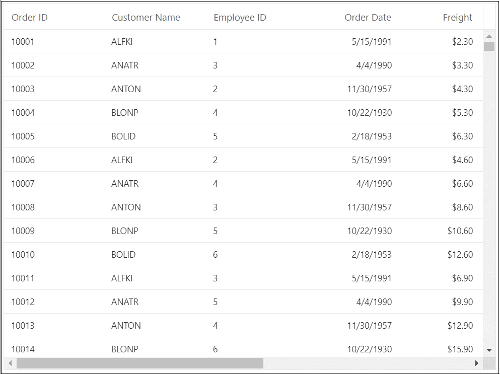
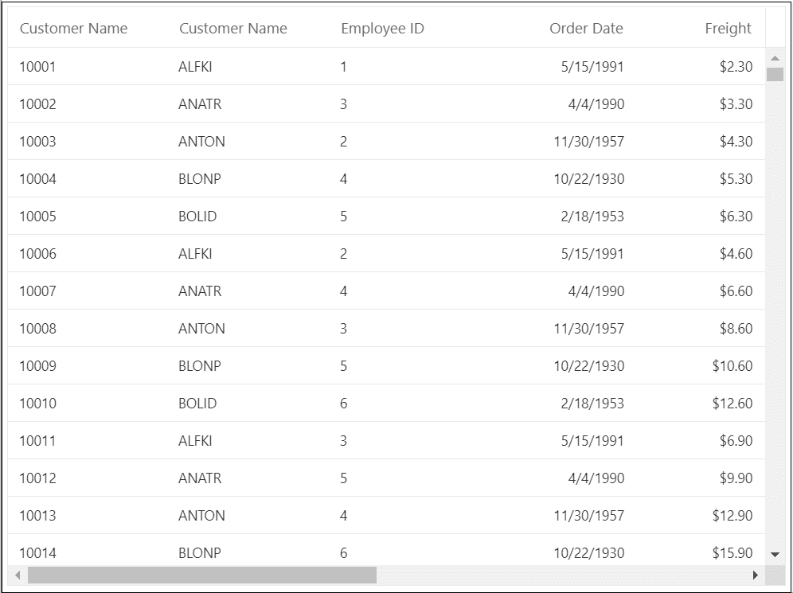

# Virtualization

DataGrid allows you to load large amount of data without [performance](https://www.syncfusion.com/blazor-components/blazor-datagrid/performance) degradation.

## Row Virtualization

Row virtualization allows you to load and render rows only in the content viewport. It is an alternative way of paging in which the data will be loaded while scrolling vertically. To setup the row virtualization, you need to define
[`EnableVirtualization`](https://help.syncfusion.com/cr/blazor/Syncfusion.Blazor.Grids.SfGrid-1.html#Syncfusion_Blazor_Grids_SfGrid_1_EnableVirtualization) as true and content height by [`Height`](https://help.syncfusion.com/cr/blazor/Syncfusion.Blazor.Grids.SfGrid-1.html#Syncfusion_Blazor_Grids_SfGrid_1_Height) property.

The number of records displayed in the DataGrid is determined implicitly by height of the content area. Also, you have an option to define a visible number of records by
the [`PageSize`](https://help.syncfusion.com/cr/blazor/Syncfusion.Blazor.Grids.SfGrid-1.html#Syncfusion_Blazor_Grids_SfGrid_1_Height) property of [`GridPageSettings`](https://help.syncfusion.com/cr/blazor/Syncfusion.Blazor.Grids.SfGrid-1.html#Syncfusion_Blazor_Grids_SfGrid_1_PageSettings) component. The loaded data will be cached and reused when it is needed for next time.





@using Syncfusion.Blazor.Grids

<SfGrid DataSource="@GridData" Height="600" EnableVirtualization="true">
    <GridColumns>
        <GridColumn Field=@nameof(Order.OrderID) HeaderText="Order ID" IsPrimaryKey="true" Width="150"></GridColumn>
        <GridColumn Field=@nameof(Order.CustomerID) HeaderText="Customer Name" Width="150"></GridColumn>
        <GridColumn Field=@nameof(Order.EmployeeID) HeaderText="Employee ID" Width="150"></GridColumn>
        <GridColumn Field=@nameof(Order.OrderDate) HeaderText=" Order Date" Format="d" Type="ColumnType.Date" TextAlign="TextAlign.Right" Width="130"></GridColumn>
        <GridColumn Field=@nameof(Order.Freight) HeaderText="Freight" Format="C2" TextAlign="TextAlign.Right" Width="120"></GridColumn>
        <GridColumn Field=@nameof(Order.ShipCountry) HeaderText="Ship Country" Width="150"></GridColumn>
        <GridColumn Field=@nameof(Order.ShipCity) HeaderText="Ship City" Width="150"></GridColumn>
        <GridColumn Field=@nameof(Order.ShipAddress) HeaderText="Ship Address" Width="150"></GridColumn>
        <GridColumn Field=@nameof(Order.ShippedDate) HeaderText="Shipped Date" Width="150"></GridColumn>
    </GridColumns>
</SfGrid>

@code{
    public List<Order> GridData { get; set; }
    protected override void OnInitialized()
    {
        List<Order> Order = new List<Order>();
        int Code = 10000;
        for (int i = 1; i < 10000; i++)
        {
            Order.Add(new Order(Code + 1, "ALFKI", i + 0, 2.3 * i, false, new DateTime(1991, 05, 15), "Berlin", "Denmark", new DateTime(1996, 7, 16), "Kirchgasse 6"));
            Order.Add(new Order(Code + 2, "ANATR", i + 2, 3.3 * i, true, new DateTime(1990, 04, 04), "Madrid", "Brazil", new DateTime(1996, 9, 11), "Avda. Azteca 123"));
            Order.Add(new Order(Code + 3, "ANTON", i + 1, 4.3 * i, true, new DateTime(1957, 11, 30), "Cholchester", "Germany", new DateTime(1996, 10, 7), "Carrera 52 con Ave. Bolívar #65-98 Llano Largo"));
            Order.Add(new Order(Code + 4, "BLONP", i + 3, 5.3 * i, false, new DateTime(1930, 10, 22), "Marseille", "Austria", new DateTime(1996, 12, 30), "Magazinweg 7"));
            Order.Add(new Order(Code + 5, "BOLID", i + 4, 6.3 * i, true, new DateTime(1953, 02, 18), "Tsawassen", "Switzerland", new DateTime(1997, 12, 3), "1029 - 12th Ave. S."));
            Code += 5;
        }
        GridData = Order;
    }

    public class Order
    {
        public Order(int OrderID, string CustomerID, int EmployeeID, double Freight, bool Verified, DateTime OrderDate, string ShipCity, string ShipCountry, DateTime ShippedDate, string ShipAddress)
        {
            this.OrderID = OrderID;
            this.CustomerID = CustomerID;
            this.EmployeeID = EmployeeID;
            this.Freight = Freight;
            this.Verified = Verified;
            this.OrderDate = OrderDate;
            this.ShipCity = ShipCity;
            this.ShipCountry = ShipCountry;
            this.ShippedDate = ShippedDate;
            this.ShipAddress = ShipAddress;
        }
        public int? OrderID { get; set; }
        public string CustomerID { get; set; }
        public int? EmployeeID { get; set; }
        public double? Freight { get; set; }
        public DateTime? OrderDate { get; set; }
        public bool Verified { get; set; }
        public DateTime? ShippedDate { get; set; }
        public string ShipCountry { get; set; }
        public string ShipCity { get; set; }
        public string ShipAddress { get; set; }
    }
}





The following GIF represent a datagrid with Row virtualization.

## Column Virtualization

Column virtualization allows you to virtualize columns. It will render columns which are in the viewport. You can scroll horizontally to view more columns.

To setup the column virtualization, set the
[`EnableVirtualization`](https://help.syncfusion.com/cr/blazor/Syncfusion.Blazor.Grids.SfGrid-1.html#Syncfusion_Blazor_Grids_SfGrid_1_EnableVirtualization) and
[`EnableColumnVirtualization`](https://help.syncfusion.com/cr/blazor/Syncfusion.Blazor.Grids.SfGrid-1.html#Syncfusion_Blazor_Grids_SfGrid_1_EnableColumnVirtualization) properties as **true**.





@using Syncfusion.Blazor.Grids

<SfGrid DataSource="@GridData" Height="600" Width="300" EnableVirtualization="true" EnableColumnVirtualization="true">
    <GridColumns>
        <GridColumn Field=@nameof(Order.OrderID) HeaderText="Order ID" IsPrimaryKey="true" Width="150"></GridColumn>
        <GridColumn Field=@nameof(Order.CustomerID) HeaderText="Customer Name" Width="150"></GridColumn>
        <GridColumn Field=@nameof(Order.EmployeeID) HeaderText="Employee ID" Width="150"></GridColumn>
        <GridColumn Field=@nameof(Order.OrderDate) HeaderText=" Order Date" Format="d" Type="ColumnType.Date" TextAlign="TextAlign.Right" Width="130"></GridColumn>
        <GridColumn Field=@nameof(Order.Freight) HeaderText="Freight" Format="C2" TextAlign="TextAlign.Right" Width="120"></GridColumn>
        <GridColumn Field=@nameof(Order.ShipCountry) HeaderText="Ship Country" Width="150"></GridColumn>
        <GridColumn Field=@nameof(Order.ShipCity) HeaderText="Ship City" Width="150"></GridColumn>
        <GridColumn Field=@nameof(Order.ShipAddress) HeaderText="Ship Address" Width="150"></GridColumn>
        <GridColumn Field=@nameof(Order.ShippedDate) HeaderText="Shipped Date" Width="150"></GridColumn>
        <GridColumn Field=@nameof(Order.Verified) HeaderText="Ship Name" Type="ColumnType.Boolean"  Width="150"></GridColumn>
    </GridColumns>
</SfGrid>

@code{
    public List<Order> GridData { get; set; }
    protected override void OnInitialized()
    {
        List<Order> Order = new List<Order>();
        int Code = 10000;
        for (int i = 1; i < 10000; i++)
        {
            Order.Add(new Order(Code + 1, "ALFKI", i + 0, 2.3 * i, false, new DateTime(1991, 05, 15), "Berlin", "Denmark", new DateTime(1996, 7, 16), "Kirchgasse 6"));
            Order.Add(new Order(Code + 2, "ANATR", i + 2, 3.3 * i, true, new DateTime(1990, 04, 04), "Madrid", "Brazil", new DateTime(1996, 9, 11), "Avda. Azteca 123"));
            Order.Add(new Order(Code + 3, "ANTON", i + 1, 4.3 * i, true, new DateTime(1957, 11, 30), "Cholchester", "Germany", new DateTime(1996, 10, 7), "Carrera 52 con Ave. Bolívar #65-98 Llano Largo"));
            Order.Add(new Order(Code + 4, "BLONP", i + 3, 5.3 * i, false, new DateTime(1930, 10, 22), "Marseille", "Austria", new DateTime(1996, 12, 30), "Magazinweg 7"));
            Order.Add(new Order(Code + 5, "BOLID", i + 4, 6.3 * i, true, new DateTime(1953, 02, 18), "Tsawassen", "Switzerland", new DateTime(1997, 12, 3), "1029 - 12th Ave. S."));
            Code += 5;
        }
        GridData = Order;
    }

    public class Order
    {
    public Order(int OrderID, string CustomerID, int EmployeeID, double Freight, bool Verified, DateTime OrderDate, string ShipCity, string ShipCountry, DateTime ShippedDate, string ShipAddress)
        {
            this.OrderID = OrderID;
            this.CustomerID = CustomerID;
            this.EmployeeID = EmployeeID;
            this.Freight = Freight;
            this.Verified = Verified;
            this.OrderDate = OrderDate;
            this.ShipCity = ShipCity;
            this.ShipCountry = ShipCountry;
            this.ShippedDate = ShippedDate;
            this.ShipAddress = ShipAddress;
        }
        public int? OrderID { get; set; }
        public string CustomerID { get; set; }
        public int? EmployeeID { get; set; }
        public double? Freight { get; set; }
        public DateTime? OrderDate { get; set; }
        public bool Verified { get; set; }
        public DateTime? ShippedDate { get; set; }
        public string ShipCountry { get; set; }
        public string ShipCity { get; set; }
        public string ShipAddress { get; set; }
    }
}





> Column's [`Width`](https://help.syncfusion.com/cr/blazor/Syncfusion.Blazor.Grids.SfGrid-1.html#Syncfusion_Blazor_Grids_SfGrid_1_Width) is required for column virtualization. If column's width is not defined then DataGrid will consider its value as **200px**.

The following GIF represent a datagrid with Column virtualization.

> The collapsed/expanded state will persist only for local dataSource while scrolling.

## Enable Cell placeholder during Virtualization

This enable cell placeholder during virtualization feature much of a muchness of row virtualization and column virtualization feature and the difference is loading placeholder indicator was shown on the cells while loading the new data. Also same set of DOM elements is reused to improve performance.

To setup the enable cell placeholder during virtualization, you need to define [`EnableVirtualMaskRow`](https://help.syncfusion.com/cr/blazor/Syncfusion.Blazor.Grids.SfGrid-1.html#Syncfusion_Blazor_Grids_SfGrid_1_EnableVirtualMaskRow) as true along with [`EnableVirtualization`](https://help.syncfusion.com/cr/blazor/Syncfusion.Blazor.Grids.SfGrid-1.html#Syncfusion_Blazor_Grids_SfGrid_1_EnableVirtualization)/[`EnableColumnVirtualization`](https://help.syncfusion.com/cr/blazor/Syncfusion.Blazor.Grids.SfGrid-1.html#Syncfusion_Blazor_Grids_SfGrid_1_EnableColumnVirtualization)  property.





@using Syncfusion.Blazor.Grids

<SfGrid DataSource="@GridData" Height="600" Width="300" RowHeight="38" EnableVirtualMaskRow="true" EnableVirtualization="true" EnableColumnVirtualization="true">
    <GridPageSettings PageSize="32"></GridPageSettings>
    <GridColumns>
        <GridColumn Field=@nameof(Order.OrderID) HeaderText="Order ID" IsPrimaryKey="true" Width="150"></GridColumn>
        <GridColumn Field=@nameof(Order.CustomerID) HeaderText="Customer Name" Width="150"></GridColumn>
        <GridColumn Field=@nameof(Order.EmployeeID) HeaderText="Employee ID" Width="150"></GridColumn>
        <GridColumn Field=@nameof(Order.OrderDate) HeaderText=" Order Date" Format="d" Type="ColumnType.Date" TextAlign="TextAlign.Right" Width="130"></GridColumn>
        <GridColumn Field=@nameof(Order.Freight) HeaderText="Freight" Format="C2" TextAlign="TextAlign.Right" Width="120"></GridColumn>
        <GridColumn Field=@nameof(Order.ShipCountry) HeaderText="Ship Country" Width="150"></GridColumn>
        <GridColumn Field=@nameof(Order.ShipCity) HeaderText="Ship City" Width="150"></GridColumn>
        <GridColumn Field=@nameof(Order.ShipAddress) HeaderText="Ship Address" Width="150"></GridColumn>
        <GridColumn Field=@nameof(Order.ShippedDate) HeaderText="Shipped Date" Width="150"></GridColumn>
        <GridColumn Field=@nameof(Order.Verified) HeaderText="Ship Name" Type="ColumnType.Boolean"  Width="150"></GridColumn>
    </GridColumns>
</SfGrid>

@code{
    public List<Order> GridData { get; set; }
    protected override void OnInitialized()
    {
        List<Order> Order = new List<Order>();
        int Code = 10000;
        for (int i = 1; i < 10000; i++)
        {
            Order.Add(new Order(Code + 1, "ALFKI", i + 0, 2.3 * i, false, new DateTime(1991, 05, 15), "Berlin", "Denmark", new DateTime(1996, 7, 16), "Kirchgasse 6"));
            Order.Add(new Order(Code + 2, "ANATR", i + 2, 3.3 * i, true, new DateTime(1990, 04, 04), "Madrid", "Brazil", new DateTime(1996, 9, 11), "Avda. Azteca 123"));
            Order.Add(new Order(Code + 3, "ANTON", i + 1, 4.3 * i, true, new DateTime(1957, 11, 30), "Cholchester", "Germany", new DateTime(1996, 10, 7), "Carrera 52 con Ave. Bolívar #65-98 Llano Largo"));
            Order.Add(new Order(Code + 4, "BLONP", i + 3, 5.3 * i, false, new DateTime(1930, 10, 22), "Marseille", "Austria", new DateTime(1996, 12, 30), "Magazinweg 7"));
            Order.Add(new Order(Code + 5, "BOLID", i + 4, 6.3 * i, true, new DateTime(1953, 02, 18), "Tsawassen", "Switzerland", new DateTime(1997, 12, 3), "1029 - 12th Ave. S."));
            Code += 5;
        }
        GridData = Order;
    }

    public class Order
    {
    public Order(int OrderID, string CustomerID, int EmployeeID, double Freight, bool Verified, DateTime OrderDate, string ShipCity, string ShipCountry, DateTime ShippedDate, string ShipAddress)
        {
            this.OrderID = OrderID;
            this.CustomerID = CustomerID;
            this.EmployeeID = EmployeeID;
            this.Freight = Freight;
            this.Verified = Verified;
            this.OrderDate = OrderDate;
            this.ShipCity = ShipCity;
            this.ShipCountry = ShipCountry;
            this.ShippedDate = ShippedDate;
            this.ShipAddress = ShipAddress;
        }
        public int? OrderID { get; set; }
        public string CustomerID { get; set; }
        public int? EmployeeID { get; set; }
        public double? Freight { get; set; }
        public DateTime? OrderDate { get; set; }
        public bool Verified { get; set; }
        public DateTime? ShippedDate { get; set; }
        public string ShipCountry { get; set; }
        public string ShipCity { get; set; }
        public string ShipAddress { get; set; }
    }
}





The following GIF represent a datagrid with Mask row virtualization.

## Limitations for Virtualization

* While using column virtualization, column width should be in the pixel. Percentage values are not accepted.
* Due to the element height limitation in browsers, the maximum number of records loaded by the datagrid is limited by the browser capability.
* Cell selection will not be persisted in both row and column virtualization.
* Virtual scrolling is not compatible with detail template, frozen rows, frozen columns and hierarchy features
* Group expand and collapse state will not be persisted.
* Since data is virtualized in datagrid, the aggregated information and total group items are displayed based on the current view items.
* The page size provided must be two times larger than the number of visible rows in the datagrid. If the page size is failed to meet this condition then the size will be determined by datagrid.
* The height of the datagrid content is calculated using the row height and total number of records in the data source and hence features which changes row height such as text wrapping are not supported. If you want to increase the row height to accommodate the content then you can specify the row height using **RowHeight** property to ensure all the table rows are in same height.
* Programmatic selection using the **SelectRows** method is not supported in virtual scrolling.

> You can refer to our [Blazor DataGrid](https://www.syncfusion.com/blazor-components/blazor-datagrid) feature tour page for its groundbreaking feature representations. You can also explore our [Blazor DataGrid example](https://blazor.syncfusion.com/demos/datagrid/overview?theme=bootstrap4) to understand how to present and manipulate data.