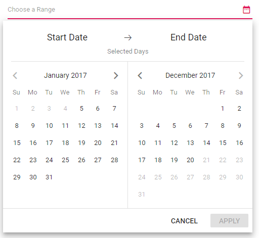

# Getting Started with Blazor DateRangePicker Component

This section briefly explains about how to include a [Blazor DateRangePicker](https://www.syncfusion.com/blazor-components/blazor-daterangepicker) Component in your Blazor Server-Side and Client-Side application. You can refer to our Getting Started with [Blazor Server-Side DateRangePicker](../getting-started/blazor-server-side-visual-studio-2019/) and [Blazor WebAssembly DateRangePicker](../getting-started/blazor-webassembly-visual-studio-2019/) documentation pages for configuration specifications.

To get start quickly with Blazor DateRangePicker component, you can check on this video.



## Importing Syncfusion Blazor component in the application

* Install `Syncfusion.Blazor.Calendars` NuGet package to the application by using the `NuGet Package Manager`.

* You can add the client-side resources through [CDN](https://blazor.syncfusion.com/documentation/appearance/themes#cdn-reference) or from [NuGet](https://blazor.syncfusion.com/documentation/appearance/themes#static-web-assets) package in the  **HEAD** element of the **~/wwwroot/index.html** page.

 ```html
<head>
    <link href="_content/Syncfusion.Blazor.Themes/bootstrap4.css" rel="stylesheet" />
    <!-- <link href="https://cdn.syncfusion.com/blazor/{{version}}/styles/{{theme}}.css" rel="stylesheet" /> -->
</head>
```

> For Internet Explorer 11 kindly refer the polyfills. Refer the [documentation](https://blazor.syncfusion.com/documentation/common/how-to/render-blazor-server-app-in-ie/) for more information.

 ```html
<head>
    <link href="_content/Syncfusion.Blazor.Themes/bootstrap4.css" rel="stylesheet" />
    <script src="https://github.com/Daddoon/Blazor.Polyfill/releases/download/3.0.1/blazor.polyfill.min.js"></script>
</head>
```

## Adding component package to the application

Open `~/_Imports.razor` file and import the `Syncfusion.Blazor.Calendars` package.

```cshtml
@using Syncfusion.Blazor.Calendars
```

## Add SyncfusionBlazor service in Program.cs

Open the **Program.cs** file and add services required by Syncfusion components using  **services.AddSyncfusionBlazor()** method.

```csharp
using Syncfusion.Blazor;

namespace BlazorApplication
{
    public class Program
    {
        public static async Task Main(string[] args)
        {
            ....
            ....
            builder.Services.AddSyncfusionBlazor();
            await builder.Build().RunAsync();
        }
    }
}
```

> To enable custom client side resource loading from CRG or CDN. You need to disable resource loading by `AddSyncfusionBlazor(true)` and load the scripts in the **HEAD** element of the **~/wwwroot/index.html** page.

 ```html
<head>
    <script src="https://cdn.syncfusion.com/blazor/{{ site.blazorversion }}/syncfusion-blazor.min.js"></script>
</head>
```

## Adding DateRangePicker component to the application

To initialize the DateRangePicker component add the below code to your `Index.razor` view page which is present under `~/Pages` folder.

The following code shows a basic DateRangePicker component.

```cshtml
<SfDateRangePicker TValue="DateTime?" Placeholder="Choose a Range"></SfDateRangePicker>
```

## Run the application

After successful compilation of your application, press `F5` to run the application.

The output will be as follows.


## Setting the Min and Max

The minimum and maximum date range can be defined with the help of [Min](https://help.syncfusion.com/cr/blazor/Syncfusion.Blazor.Calendars.DateRangePickerModel-1.html#Syncfusion_Blazor_Calendars_DateRangePickerModel_1_Min) and [Max](https://help.syncfusion.com/cr/blazor/Syncfusion.Blazor.Calendars.DateRangePickerModel-1.html#Syncfusion_Blazor_Calendars_DateRangePickerModel_1_Max) properties.

The following code demonstrates how to set the `Min` and `Max` on initializing the DateRangePicker.

```cshtml
<SfDateRangePicker TValue="DateTime?" Placeholder="Choose a Range" Min="@MinDate" Max="@MaxDate"></SfDateRangePicker>

@code {
    public DateTime MinDate {get;set;} = new DateTime(2017, 01, 05);
    public DateTime MaxDate {get;set;} = new DateTime(2017, 12, 20);
}
```

The output will be as follows.



> You can refer to our [Blazor Date Range Picker](https://www.syncfusion.com/blazor-components/blazor-daterangepicker) feature tour page for its groundbreaking feature representations. You can also explore our [Blazor Date Range Picker example](https://blazor.syncfusion.com/demos/daterangepicker/default-functionalities?theme=bootstrap4) to understand how to present and manipulate data.

## See Also

* [Getting Started with Syncfusion Blazor for Client-Side in .NET Core CLI](../getting-started/blazor-webassembly-dotnet-cli/)
* [Getting Started with Syncfusion Blazor for Server-side in Visual Studio 2019](../getting-started/blazor-server-side-visual-studio-2019/)
* [Getting Started with Syncfusion Blazor for Server-Side in .NET Core CLI](../getting-started/blazor-server-side-dotnet-cli/)