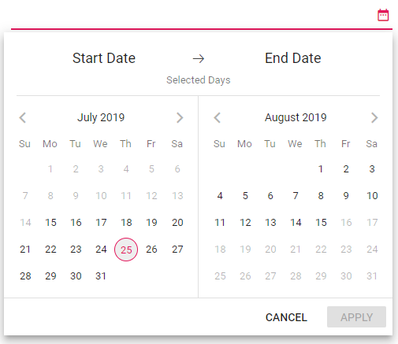
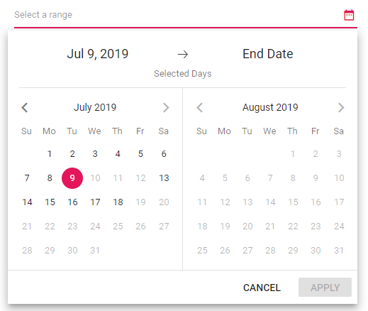
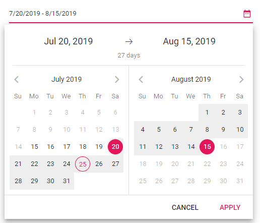
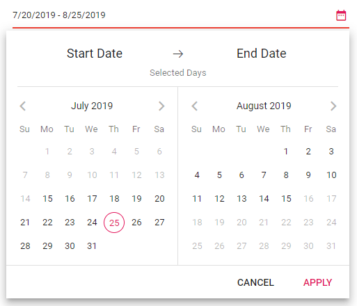

# Range Restriction

Range selection in a DateRangePicker can be made-to-order with desired restrictions based on the application needs.

## Restrict the range within a range

You can restrict the minimum and maximum date that can be allowed as Start and End date in a range selection with the help of [Min](https://help.syncfusion.com/cr/blazor/Syncfusion.Blazor.Calendars.SfDateRangePicker.html#Syncfusion_Blazor_Calendars_SfDateRangePicker_Min) and [Max](https://help.syncfusion.com/cr/blazor/Syncfusion.Blazor.Calendars.SfDateRangePicker.html#Syncfusion_Blazor_Calendars_SfDateRangePicker_Max) properties.

* `Min`: Sets the minimum date that can be selected as StartDate.
* `Max`: Sets the maximum date that can be selected as EndDate.

In the following sample, you can select a range from 15th day of this month to 15th day of next month.

```cshtml
@using Syncfusion.Blazor.Calendars

<SfDateRangePicker TValue="DateTime?" Min='@MinDate' Max='@MaxDate'></SfDateRangePicker>

@code {
    public DateTime MinDate {get;set;} = new DateTime(DateTime.Now.Year,DateTime.Now.Month,15);
    public DateTime MaxDate {get;set;} = new DateTime(DateTime.Now.Year, DateTime.Now.Month+1, 15);
}
```

The output will be as follows.



## Range span

Span between ranges can be limited to avoid excess or less days selection towards the required days in a range.
In this, minimum and maximum span allowed within the date range can be customized by the [MinDays](https://help.syncfusion.com/cr/blazor/Syncfusion.Blazor.Calendars.SfDateRangePicker.html#Syncfusion_Blazor_Calendars_SfDateRangePicker_MinDays) and [MaxDays](https://help.syncfusion.com/cr/blazor/Syncfusion.Blazor.Calendars.SfDateRangePicker.html#Syncfusion_Blazor_Calendars_SfDateRangePicker_MaxDays) properties.

* `MinDays`: Sets the minimum number of days between Start and EndDate.
* `MaxDays`: Sets the maximum number of days between Start and EndDate.

In the following sample, the range selection should be greater than 5 days and less than 10 days, else it will not set.

```cshtml
@using Syncfusion.Blazor.Calendars

<SfDateRangePicker TValue="DateTime?" MinDays=5 MaxDays=10 Placeholder='Select a range'>
</SfDateRangePicker>
```

The output will be as follows.



## Strict mode

DateRangePicker provides an option to limit the user towards entering the valid date. With `StrictMode`, you can set only the valid date. If any invalid range is specified, the date range value resets to previous value. This restriction can be availed by setting the [StrictMode](https://help.syncfusion.com/cr/blazor/Syncfusion.Blazor.Calendars.SfDateRangePicker.html#Syncfusion_Blazor_Calendars_SfDateRangePicker_StartDate) property to true.

```cshtml
@using Syncfusion.Blazor.Calendars

<SfDateRangePicker TValue="DateTime?" StartDate='@Start' EndDate='@End' StrictMode=true Min='@MinDate' Max='@MaxDate'></SfDateRangePicker>

@code {
    public DateTime MinDate {get;set;} = new DateTime(DateTime.Now.Year,DateTime.Now.Month,15);
    public DateTime MaxDate {get;set;} = new DateTime(DateTime.Now.Year, DateTime.Now.Month+1, 15);
    public DateTime? Start {get;set;} = new DateTime(DateTime.Now.Year,DateTime.Now.Month,20);
    public DateTime? End {get;set;} = new DateTime(DateTime.Now.Year, DateTime.Now.Month+1, 25);
}
```

If the value of `Min` or `Max` property
is changed through code behind, update the `StartDate` and `EndDate` properties to set within the range.

If the Start and End date is out of specified date range, a validation error class will be appended to the input element. If `StrictMode` is enabled and both the Start and End date is lesser than the Min date, then the Start and End date will be updated with Min date.

If both the Start and End date is higher than the Max date, then Start and End date will be updated with Max date.

If StartDate is less than Min date, it will be updated with Min date or if EndDate is greater than Max date,  will be updated with the Max date.

The output will be as follows.



By default, the DatePicker acts in `StrictMode` false state that allows you to enter the invalid or out-of-range date in text box.

If the Start and End date is out of specified date range or invalid, then the model value will be set to `out of range`
value or `null` respectively with highlighted  `error` class to indicate the value is out of range or invalid.

The following code demonstrates the `StrictMode` as false. Here, it allows you to enter the
valid or invalid value in text box.

```cshtml
@using Syncfusion.Blazor.Calendars

<SfDateRangePicker TValue="DateTime?" StartDate='@Start' EndDate='@End' StrictMode=false Min='@MinDate' Max='@MaxDate'></SfDateRangePicker>

@code {
    public DateTime MinDate {get;set;} = new DateTime(DateTime.Now.Year,DateTime.Now.Month,15);
    public DateTime MaxDate {get;set;} = new DateTime(DateTime.Now.Year, DateTime.Now.Month+1, 15);
    public DateTime? Start {get;set;} = new DateTime(DateTime.Now.Year,DateTime.Now.Month,20);
    public DateTime? End {get;set;} = new DateTime(DateTime.Now.Year, DateTime.Now.Month+1, 25);
}
```

The output will be as follows.



> You can refer to our [Blazor Date Range Picker](https://www.syncfusion.com/blazor-components/blazor-daterangepicker) feature tour page for its groundbreaking feature representations. You can also explore our [Blazor Date Range Picker example](https://blazor.syncfusion.com/demos/daterangepicker/default-functionalities?theme=bootstrap4) to understand how to present and manipulate data.