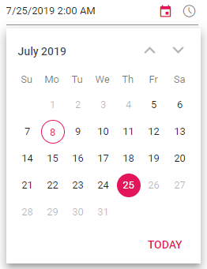

# Strict Mode in Blazor Datetime Picker Component

The [StrictMode](https://help.syncfusion.com/cr/blazor/Syncfusion.Blazor.Calendars.SfDateTimePicker-1.html#Syncfusion_Blazor_Calendars_SfDateTimePicker_1_StrictMode) is an act, that allows the users to enter only the valid date and time within the specified `Min/Max` range in text box.
If the input entered is invalid, then the component will stay with the previous value.
Else, if the datetime is
out of range, then the component will set the datetime to the Min/Max value.

The following example demonstrates the DateTimePicker in `StrictMode` with Min/Max range of `5/5/2019 2:00 AM` to
`5/25/2019 2:00 AM`. Here, it allows to enter
only the valid date and time within the specified range.

If you are trying to enter the out-of-range value
like `5/28/2019`,
then the value will set to the `Max` value as `5/25/2019 2:00 AM` since the value 28 is greater than the `Max` value
of 25.

If you are trying
to enter the invalid date, then the Value will stay with the previous value.

The following code demonstrates the DateTimePicker with StrictMode `true`.

```cshtml
@using Syncfusion.Blazor.Calendars

<SfDateTimePicker TValue="DateTime?" Min='@MinDate' Max='@MaxDate' StrictMode=true Value='@DateValue'></SfDateTimePicker>

@code {
    public DateTime MinDate {get;set;} = new DateTime(DateTime.Now.Year,DateTime.Now.Month, 05, 02, 00, 00);
    public DateTime MaxDate {get;set;} = new DateTime(DateTime.Now.Year, DateTime.Now.Month, 25, 02, 00, 00);
    public DateTime? DateValue {get;set;} = new DateTime(DateTime.Now.Year, DateTime.Now.Month, 28, 02, 00, 00);
}
```

The output will be as follows.



By default, the DateTimePicker act in `StrictMode` as `false` state, that allows you to enter the invalid or out-of-range datetime in text box.

If the datetime is out-of-range or invalid, then the model value will be set to `out of range`
datetime value or `null` respectively with highlighted `error` class to indicates the datetime is out of range or invalid.

The following code demonstrates the `StrictMode` as `false`. Here, it allows to enter the
valid or invalid value in textbox.

If you are entering the out-of-range or invalid datetime value, then the model value will be
set to `out of range` datetime value or `null` respectively with highlighted `error` class to
indicates the datetime is out of range or invalid.

```cshtml
@using Syncfusion.Blazor.Calendars

<SfDateTimePicker TValue="DateTime?" Min='@MinDate' Max='@MaxDate' StrictMode=false Value='@DateValue'></SfDateTimePicker>

@code {
    public DateTime MinDate {get;set;} = new DateTime(DateTime.Now.Year,DateTime.Now.Month, 05, 02, 00, 00);
    public DateTime MaxDate {get;set;} = new DateTime(DateTime.Now.Year, DateTime.Now.Month, 25, 02, 00, 00);
    public DateTime? DateValue {get;set;} = new DateTime(DateTime.Now.Year, DateTime.Now.Month, 28, 02, 00, 00);
}
```

The output will be as follows.


> If the value of `Min` or `Max` properties changed through code behind,
you have to update the `Value` property to set within the range.