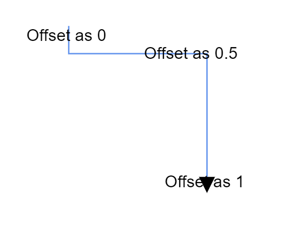
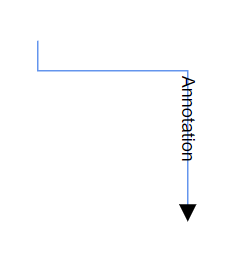

# How to position connector’s annotation

Annotations of a connector can be positioned using the following properties of AnnotationEditorViewModel class.

* Offset
* Alignment
* Displacement
* SegmentAngle

## Offset

The `Offset` property of annotation is used to align the annotations based on fractions. 0 represents Top-Left corner, 1 represents Bottom-Right corner, and 0.5 represents half of Width/Height.

```csharp
@using Syncfusion.Blazor.Diagram

<SfDiagramComponent Height="600px" Connectors="@connectors">
</SfDiagramComponent>

@code
{
//Defines diagram's connector collection
DiagramObjectCollection<Connector> connectors = new DiagramObjectCollection<Connector>();

protected override void OnInitialized()
{

    connectors = new DiagramObjectCollection<Connector>();
        Connector connector = new Connector()
    {
      SourcePoint = new Point() { X = 300, Y = 40 },
        TargetPoint = new Point() { X = 400, Y = 160 },
        Type = Segments.Orthogonal,
        Style = new TextShapeStyle() { StrokeColor = "#6495ED" },
      Annotations = new DiagramObjectCollection<PathAnnotation>()
        {
            new PathAnnotation { Content = "Offset as 0",Offset=0 },
            new PathAnnotation { Content = "Offset as 0.5",Offset=0.5 },
            new PathAnnotation { Content = "Offset as 1",Offset=1 },
        }
    };

    connectors.Add(connector);
}
}
```

The following image shows the relationship between the annotation position and offset (fraction values).



>**Note:** By default, offset value of the connector annotation is 0.5.

## Alignment

The connector’s annotation can be aligned over its segment path using the `Alignment` property of annotation.

```csharp
@using Syncfusion.Blazor.Diagram

<SfDiagramComponent Height="600px" Connectors="@connectors">
</SfDiagramComponent>

@code
{
//Defines diagram's connector collection
DiagramObjectCollection<Connector> connectors = new DiagramObjectCollection<Connector>();

protected override void OnInitialized()
{

    connectors = new DiagramObjectCollection<Connector>();
        Connector connector = new Connector()
    {
      SourcePoint = new Point() { X = 300, Y = 40 },
        TargetPoint = new Point() { X = 400, Y = 160 },
        Type = Segments.Orthogonal,
        Style = new TextShapeStyle() { StrokeColor = "#6495ED" },
      Annotations = new DiagramObjectCollection<PathAnnotation>()
        {
           new PathAnnotation { Content = "Before",Alignment=AnnotationAlignment.Before },
           new PathAnnotation { Content = "After",Alignment=AnnotationAlignment.After },
        }
    };

    connectors.Add(connector);
}
}
```

The following screenshot shows how the annotation of the connector aligned over its path.


>**Note:** By default, Alignment value of the connector annotation is `Center`.

## Segment angle

The `SegmentAngle` property is used to rotate the annotation based on the connectors segment direction. By default, annotation will be in rotated in the connector path. When you assign value to the SegmentPath property, annotation will be rotated from its position based on the annotation direction.

The following code example shows how the connector annotation rotated in its path direction.

```csharp
@using Syncfusion.Blazor.Diagram

<SfDiagramComponent Height="600px" Connectors="@connectors">
</SfDiagramComponent>

@code
{
//Defines diagram's connector collection
DiagramObjectCollection<Connector> connectors = new DiagramObjectCollection<Connector>();

protected override void OnInitialized()
{

    connectors = new DiagramObjectCollection<Connector>();
        Connector connector = new Connector()
    {
      SourcePoint = new Point() { X = 300, Y = 40 },
        TargetPoint = new Point() { X = 400, Y = 160 },
        Type = Segments.Orthogonal,
        Style = new TextShapeStyle() { StrokeColor = "#6495ED" },
      Annotations = new DiagramObjectCollection<PathAnnotation>()
        {
          new PathAnnotation { Content = "Annotation", SegmentAngle=true,Offset=0.7 },
        }
    };

    connectors.Add(connector);
}
}
```

| Segment Angle | Output |
|---|---|
| True |  |
| False |  |

>**Note:** By default, the SegmentAngle will be disabled.

## See also

* [`How to add annotation for Node`](./node-annotation)

* [`How to add or remove annotation constraints`](../constraints/#annotation-constraints)

* [`How to customize the annotation`](./appearance)
