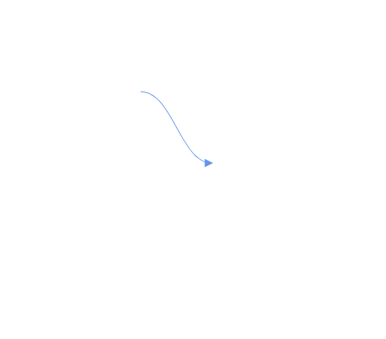
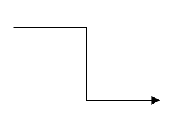
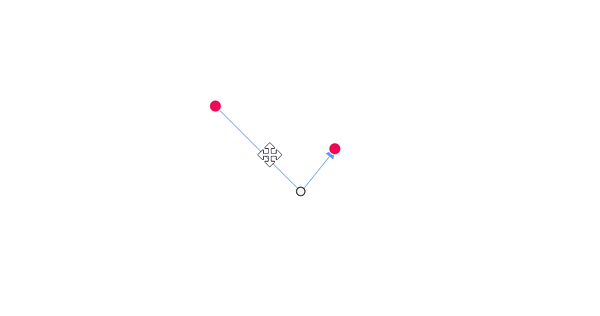
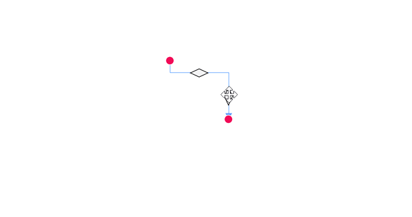

# Segments in Blazor Diagram Component

The path of the connector is defined with a collection of segments. There are three types of segments.

## Straight

To create a straight line, specify the `Type` of the segment as **Straight** and add a straight segment to `Segments` collection and need to specify `Type` for the connector. The following code example illustrates how to create a default straight segment.

```cshtml
@using Syncfusion.Blazor.Diagram
<SfDiagramComponent Width="1000px" Height="500px" Connectors="@connectors">
</SfDiagramComponent>
@code{
    //Defines diagram's connector collection
    DiagramObjectCollection<Connector> connectors = new DiagramObjectCollection<Connector>();
    protected override void OnInitialized()
    {

        Connector Connector = new Connector()
        {
            ID = "connector1",
            SourcePoint = new Point()
            {
                X = 100,
                Y = 100
            },
            Style = new ShapeStyle() { StrokeColor = "#6f409f", StrokeWidth = 1 },
            TargetPoint = new Point() { X = 200, Y = 200 },
             //Specify the segments typs as straight.
            Type = Segments.Straight,
            TargetDecorator = new Decorator()
            {
                Shape = DecoratorShapes.Arrow,
                Style = new ShapeStyle()
                {
                    Fill = "#6f409f",
                    StrokeColor = "#6f409f",
                    StrokeWidth = 1
                }
            }

        };
        connectors.Add(Connector);
    }
}
```


## Orthogonal

Orthogonal segments are used to create segments that are perpendicular to each other. Set the segment `Type` as orthogonal to create a default orthogonal segment and need to specify `Type`. The following code example illustrates how to create a default orthogonal segment.

```cshtml
@using Syncfusion.Blazor.Diagram
<SfDiagramComponent Width="1000px" Height="500px" Connectors="@connectors">
</SfDiagramComponent>
@code{
    //Defines diagram's connector collection
    DiagramObjectCollection<Connector> connectors = new DiagramObjectCollection<Connector>();
    protected override void OnInitialized()
    {

        Connector Connector = new Connector()
        {
            ID = "connector1",
            SourcePoint = new Point()
            {
                X = 100,
                Y = 100
            },
            Style = new ShapeStyle() { StrokeColor = "#6f409f", StrokeWidth = 1 },
            TargetPoint = new Point() { X = 200, Y = 200 },
             //Specify the segments type as Orthogonal.
            Type = Segments.Orthogonal,
            TargetDecorator = new Decorator()
            {
                Shape = DecoratorShapes.Arrow,
                Style = new ShapeStyle()
                {
                    Fill = "#6f409f",
                    StrokeColor = "#6f409f",
                    StrokeWidth = 1
                }
            }

        };
        connectors.Add(Connector);
    }
}
```

The `Length` and `Direction` properties allow to define the flow and length of segment. The following code example illustrates how to create customized orthogonal segments.

```cshtml
@using Syncfusion.Blazor.Diagram
<SfDiagramComponent Width="1000px" Height="500px" Connectors="@connectors">
</SfDiagramComponent>
@code{
    //Defines diagram's connector collection
    DiagramObjectCollection<Connector> connectors = new DiagramObjectCollection<Connector>();
    protected override void OnInitialized()
    {

        Connector Connector = new Connector()
        {
            ID = "connector1",
            SourcePoint = new Point()
            {
                X = 100,
                Y = 100
            },
            Style = new ShapeStyle() { StrokeColor = "#6f409f", StrokeWidth = 1 },
            TargetPoint = new Point() { X = 200, Y = 200 },
            Type = Segments.Orthogonal,
            //Create a new segment with length and direction
            Segments = new DiagramObjectCollection<ConnectorSegment>(){
                    new OrthogonalSegment {
                    Length = 100,
                    Type = Segments.Orthogonal,
                    Direction = Direction.Right, },
                new OrthogonalSegment {
                    Length = 100,
                    Type = Segments.Orthogonal,
                    Direction = Direction.Bottom, } },

            TargetDecorator = new Decorator()
            {
                Shape = DecoratorShapes.Arrow,
                Style = new ShapeStyle()
                {
                    Fill = "#6f409f",
                    StrokeColor = "#6f409f",
                    StrokeWidth = 1
                }
            }

        };
        connectors.Add(Connector);
    }
}

```


> You need to mention the segment type as same as what you mentioned in connector type. There should be no contradiction between connector type and segment type.

## Bezier

Bezier segments are used to create curve segments and the curves are configurable either with the control points or with vectors. To create a bezier segment, the `Type` of the segment is set as bezier and need to specify type for the connector. The following code example illustrates how to create a default bezier segment.

```cshtml
@using Syncfusion.Blazor.Diagram
<SfDiagramComponent Width="1000px" Height="500px" Connectors="@connectors">
</SfDiagramComponent>
@code{
     //Defines diagram's connector collection
    DiagramObjectCollection<Connector> connectors = new DiagramObjectCollection<Connector>();
    protected override void OnInitialized()
    {

        Connector Connector = new Connector()
        {
            ID = "connector1",
            SourcePoint = new Point()
            {
                X = 100,
                Y = 100
            },
            Style = new ShapeStyle() { StrokeColor = "#6f409f", StrokeWidth = 1 },
            TargetPoint = new Point() { X = 200, Y = 200 },
            Type = Segments.Bezier,

            TargetDecorator = new Decorator()
            {
                Shape = DecoratorShapes.Arrow,
                Style = new ShapeStyle()
                {
                    Fill = "#6f409f",
                    StrokeColor = "#6f409f",
                    StrokeWidth = 1
                }
            }

        };
        //Add the connector into connectors's collection.
        connectors.Add(Connector);
    }
}
```



We have properties called `Point1` and `Point2` which is used to control the points of the bezier connector . And also we have properties called `vector1` and `vector2` which is used to defines the length and angle between the source point and target point respectively .The following code example illustrates how to use these properties in our control  .

```cshtml
Connector Connector1 = new Connector()
        {
            ID = "Connector1",
            Type = Segments.Bezier,
            SourcePoint = new Point { X = 500, Y = 200 },
            TargetPoint = new Point { X = 600, Y = 300 },
            Segments = new DiagramObjectCollection<ConnectorSegment> {
                new BezierSegment() { Type = Segments.Bezier,
                //Defines the point1 and point2 for the bezier connector
                Point1 = new Point { X = 500, Y = 100 },
                Point2 = new Point { X = 600, Y = 200 } } }
        };

         Connector Connector2 = new Connector()
        {
            ID = "Connector2",
            Type = Segments.Bezier,
            SourcePoint = new Point { X = 200, Y = 100 },
            TargetPoint = new Point { X = 300, Y = 200 },
            Segments = new DiagramObjectCollection<ConnectorSegment> {
                new BezierSegment() {
                    Type = Segments.Bezier,
                    //Defines the Vector1 and Vector2 for the bezier connector
                    Vector1 = new Vector(){Distance = 100 ,Angle = 90 },
                    Vector2 = new Vector(){Distance = 45 ,Angle = 45 } } }
        };
```

## How to create multiple segments

Multiple segments can be defined one after another. To create a connector with multiple segments, define and add the segments to `connector.Segments` collection. The following code example illustrates how to create a connector with multiple segments.

```cshtml
@using Syncfusion.Blazor.Diagram

<SfDiagramComponent Width="1000px" Height="500px" Connectors="@connectors">
    <SnapSettings Constraints="SnapConstraints.None"></SnapSettings>
</SfDiagramComponent>

@code
{
    //Defines diagram's connector collection
    DiagramObjectCollection<Connector> connectors = new DiagramObjectCollection<Connector>();
    protected override void OnInitialized()
    {

        Connector connector = new Connector()
        {
            ID = "connector1",
            SourcePoint = new Point()
            {
                X = 100,
                Y = 100
            },
            Style = new ShapeStyle() { StrokeColor = "#6f409f", StrokeWidth = 1 },
            TargetPoint = new Point() { X = 200, Y = 200 },
            Type = Segments.Bezier,

            TargetDecorator = new Decorator()
            {
                Shape = DecoratorShapes.Arrow,
                Style = new ShapeStyle()
                {
                    Fill = "#6f409f",
                    StrokeColor = "#6f409f",
                    StrokeWidth = 1
                }
            }

        };
        //Add the connector into connectors's collection.
        connectors.Add(connector);

        Connector connector1 = new Connector()
        {
            ID = "Connector1",
            Type = Segments.Orthogonal,
            SourcePoint = new Point()
            {
                X = 100,
                Y = 100
            },
            TargetPoint = new Point() { X = 300, Y = 200 },
            Segments = new DiagramObjectCollection<ConnectorSegment>(){
                    new OrthogonalSegment {
                    Length = 100,
                    Type = Segments.Orthogonal,
                    Direction = Direction.Right, },
                new OrthogonalSegment {
                    Length = 100,
                    Type = Segments.Orthogonal,
                    Direction = Direction.Bottom, } },
        };

        //Add the connector into connectors's collection.
        connectors.Add(connector1);
    }
}

```



* Similarly, you can create multiple segments for all the connector type.

## Segment Editing

### Straight segment editing

* End point of each straight segment is represented by a thumb that enables to edit the segment.
* Any number of new segments can be inserted into a straight line by clicking, when Shift and Ctrl keys are pressed (Ctrl+Shift+Click).
* Straight segments can be removed by clicking the segment end point, when Ctrl and Shift keys are pressed (Ctrl+Shift+Click).

```cshtml
@using Syncfusion.Blazor.Diagram
<SfDiagramComponent @ref="Diagram" Width="1000px"  Height="500px" Connectors="@connectors">
</SfDiagramComponent>
@code{
    SfDiagramComponent Diagram;
    DiagramObjectCollection<Connector> connectors = new DiagramObjectCollection<Connector>();
    protected override void OnInitialized()
    {
        Connector Connector = new Connector()
        // Enable the segment editing
        { ID = "Connector1", Constraints = ConnectorConstraints.Default | ConnectorConstraints.DragSegmentThumb, SourcePoint = new Point { X = 200, Y = 100 }, TargetPoint = new Point { X = 340, Y = 150 }, Segments = new DiagramObjectCollection<ConnectorSegment> { new StraightSegment() { Type = Segments.Straight, Point = new Point { X = 300, Y = 200 } } } };
        connectors.Add(Connector);
    }

}
```



### Orthogonal Segment Editing

* Orthogonal thumbs allow you to adjust the length of adjacent segments by clicking and dragging it.
* When necessary, some segments are added or removed automatically, when dragging the segment. This is to maintain proper routing of orthogonality between segments.

```cshtml
@using Syncfusion.Blazor.Diagram
<SfDiagramComponent @ref="Diagram" Width="1000px"  Height="500px" Connectors="@connectors">
</SfDiagramComponent>
@code{
    SfDiagramComponent Diagram;
    DiagramObjectCollection<Connector> connectors = new DiagramObjectCollection<Connector>();
    protected override void OnInitialized()
    {
        Connector Connector = new Connector()
        // Enable the segment editing
        { ID = "Connector2", Constraints = ConnectorConstraints.Default | ConnectorConstraints.DragSegmentThumb, Type = Segments.Orthogonal, SourcePoint = new Point { X = 400, Y = 100 }, TargetPoint = new Point { X = 500, Y = 200 } };
        connectors.Add(Connector);
    }
}
```



### Bezier Segment Editing

* A segment control point of the Bezier connector is used to change the bezier vectors, points of the connector.


## See also

* [`How to customize the connector properties`](./customization)

* [`How to interact the connector`](./interactions)

* [`How to get the connector events`](./events)