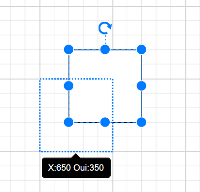

# Localization in Blazor Diagram Component

## Blazor server side

Add `UseRequestLocalization` middle-ware in Configure method in **Startup.cs** file to get browser Culture Info.

Refer the following code to add configuration in Startup.cs file

```csharp
using Microsoft.AspNetCore.Builder;
using Microsoft.AspNetCore.Localization;

namespace BlazorApplication
{
    public class Startup
    {
        ....
        ....

      #region Localization
            app.UseRequestLocalization(app.ApplicationServices. GetService<IOptions<RequestLocalizationOptions>>().Value);
            #endregion
    }
}
```

The following example demonstrates how to enable **Localization** for Diagram in server side Blazor samples. Here, we have used Resource file to translate the static text.

The Resource file is an XML file which contains the strings(key and value pairs) that you want to translate into different language. You can also refer Localization [link](https://blazor.syncfusion.com/documentation/common/localization/) to know more about how to configure and use localization in the ASP.NET Core application framework.

* Open the **Startup.cs** file and add the below configuration in the **ConfigureServices** function as follows.

    ```csharp
    using Syncfusion.Blazor;
    using System.Globalization;
    using Microsoft.AspNetCore.Localization;

    namespace BlazorApplication
    {
        public class Startup
        {
            ....
            ....
            public void ConfigureServices(IServiceCollection services)
            {
                ....
                ....
               #region Localization
            // Set the resx file folder path to access
            services.AddLocalization(options => options.ResourcesPath = "Resources")    ;
            services.AddSyncfusionBlazor();
            // Register the Syncfusion locale service to customize the  SyncfusionBlazor component locale culture
            services.AddSingleton(typeof(ISyncfusionStringLocalizer), typeof    (SyncfusionLocalizer));
            services.Configure<RequestLocalizationOptions>(options =>
            {
                // Define the list of cultures your app will support
                var supportedCultures = new List<CultureInfo>()
                {
                    new CultureInfo("en-US"),
                    new CultureInfo("de")
                };
                // Set the default culture
                options.DefaultRequestCulture = new RequestCulture("en-US");
                options.SupportedCultures = supportedCultures;
                options.SupportedUICultures = supportedCultures;
            });
            #endregion
            }
        }
    }
    ```

* Then, write a **class** by inheriting **ISyncfusionStringLocalizer** interface and override the Manager property to get the resource file details from the application end.

    ```csharp
    using Syncfusion.Blazor;

     public class SyncfusionLocalizer : ISyncfusionStringLocalizer
    {
        // To get the locale key from mapped resources file
        public string GetText(string key)
        {
            return this.ResourceManager.GetString(key);
        }

        // To access the resource file and get the exact value for locale key

        public System.Resources.ResourceManager ResourceManager {
            get
            {
                // Replace the ApplicationNamespace with your application name.
                return ApplicationNamespace.Resources.SfResources.ResourceManager;
            }
        }
    }
    ```

* Diagram has support to localize the Tooltip of Nodes/Connector.The following code illustrates how to provide localization support for Tooltip..

    | **Name** | **Value (in French culture)** |
    | --- | --- |
    | DiagramComponent_X | X |
    | DiagramComponent_Y | Oui |

    * Add **.resx** file to Resource folder and enter the key value (Locale Keywords) in the **Name** column and the translated string in the Value column as follows.


    ```cshtml
   @using Syncfusion.Blazor.Diagram

    <SfDiagramComponent @ref="diagram" Width="100%" Height="700px" Nodes="Nodes" Connectors="ConnectorCollection"/>

   @code
       { 
            public SfDiagramComponent diagram;
            DiagramObjectCollection<Connector> ConnectorCollection = new DiagramObjectCollection<Connector>();
            DiagramObjectCollection<Node> Nodes = new DiagramObjectCollection<Node>();
            protected override void OnInitialized()
            {
                Node node = new Node()
                {
                    ID = "node3",
                    Width = 100,
                    Height = 100,
                    OffsetX = 700,
                    OffsetY = 400,
                    Annotations = new DiagramObjectCollection<ShapeAnnotation>()
                {
                new ShapeAnnotation()
                {
                    Content="Process"
                }
            }
                };
                Nodes.Add(node);

                Connector Connecto4 = new Connector()
                {
                    ID = "Connector4",
                    Constraints = ConnectorConstraints.Default | ConnectorConstraints.DragSegmentThumb,
                    Type = ConnectorSegmentType.Orthogonal,
                    SourcePoint = new DiagramPoint { X = 400, Y = 100 },
                    TargetPoint = new DiagramPoint { X = 500, Y = 200 }
                };
                ConnectorCollection.Add(Connecto4);
            }
     }

    ```

## Blazor WebAssembly

The following steps explain how to render the Diagram in French culture (fr) in Blazor Web Assembly application.

* Open the **program.cs** file and add the below configuration in the **Builder ConfigureServices** function as follows.

    ```csharp
    using Syncfusion.Blazor;
    using Microsoft.AspNetCore.Builder;

    namespace WebAssemblyLocale
    {
        public class Program
        {
           public static async Task Main(string[] args)
        {
            var builder = WebAssemblyHostBuilder.CreateDefault(args);
            .....
            .....

            builder.Services.AddSyncfusionBlazor();

            #region Localization
            // Register the Syncfusion locale service to customize the  SyncfusionBlazor component locale culture
            builder.Services.AddSingleton(typeof(ISyncfusionStringLocalizer), typeof(SyncfusionLocalizer));

            // Set the default culture of the application
            CultureInfo.DefaultThreadCurrentCulture = new CultureInfo("en-US");
            CultureInfo.DefaultThreadCurrentUICulture = new CultureInfo("en-US");

            // Get the modified culture from culture switcher
            var host = builder.Build();
            var jsInterop = host.Services.GetRequiredService<IJSRuntime>();
            var result = await jsInterop.InvokeAsync<string>("cultureInfo.get");
            if (result != null)
            {
                // Set the culture from culture switcher
                var culture = new CultureInfo(result);
                CultureInfo.DefaultThreadCurrentCulture = culture;
                CultureInfo.DefaultThreadCurrentUICulture = culture;
            }
            #endregion

            await builder.Build().RunAsync();
        }
    }
    ```


```cshtml
 @using Syncfusion.Blazor.Diagram

    <SfDiagramComponent @ref="diagram" Width="100%" Height="700px" Nodes="Nodes" Connectors="ConnectorCollection"/>

   @code
       { 
            public SfDiagramComponent diagram;
            DiagramObjectCollection<Connector> ConnectorCollection = new DiagramObjectCollection<Connector>();
            DiagramObjectCollection<Node> Nodes = new DiagramObjectCollection<Node>();
            protected override void OnInitialized()
            {
                Node node = new Node()
                {
                    ID = "node3",
                    Width = 100,
                    Height = 100,
                    OffsetX = 700,
                    OffsetY = 400,
                    Annotations = new DiagramObjectCollection<ShapeAnnotation>()
                {
                new ShapeAnnotation()
                {
                    Content="Process"
                }
            }
                };
                Nodes.Add(node);

                Connector Connecto4 = new Connector()
                {
                    ID = "Connector4",
                    Constraints = ConnectorConstraints.Default | ConnectorConstraints.DragSegmentThumb,
                    Type = ConnectorSegmentType.Orthogonal,
                    SourcePoint = new DiagramPoint { X = 400, Y = 100 },
                    TargetPoint = new DiagramPoint { X = 500, Y = 200 }
                };
                ConnectorCollection.Add(Connecto4);
            }
     }
```

The output will be as follows.

