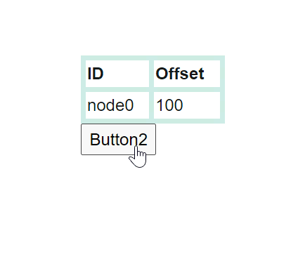
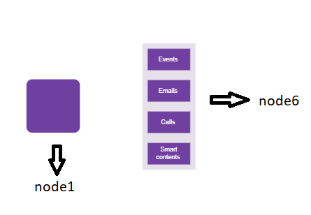
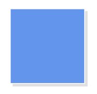
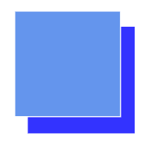
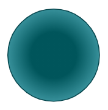

# Appearance of a Node in Blazor Diagram Component

The appearance of a node can be customized by changing its [Fill](https://help.syncfusion.com/cr/blazor/Syncfusion.Blazor.Diagram.ShapeStyle.html#Syncfusion_Blazor_Diagram_ShapeStyle_Fill), [StrokeDashArray](https://help.syncfusion.com/cr/blazor/Syncfusion.Blazor.Diagram.ShapeStyle.html#Syncfusion_Blazor_Diagram_ShapeStyle_StrokeDashArray), [StrokeColor](https://help.syncfusion.com/cr/blazor/Syncfusion.Blazor.Diagram.ShapeStyle.html#Syncfusion_Blazor_Diagram_ShapeStyle_StrokeColor), [StrokeWidth](https://help.syncfusion.com/cr/blazor/Syncfusion.Blazor.Diagram.ShapeStyle.html#Syncfusion_Blazor_Diagram_ShapeStyle_StrokeWidth), and [Shadow](https://help.syncfusion.com/cr/blazor/Syncfusion.Blazor.Diagram.Shadow.html) properties. The [IsVisible](https://help.syncfusion.com/cr/blazor/Syncfusion.Blazor.Diagram.NodeBase.html#Syncfusion_Blazor_Diagram_NodeBase_IsVisible) property of the node indicates whether the node is visible or not.

The following code shows how to customize the appearance of the shape.

```cshtml
@using Syncfusion.Blazor.Diagram

<SfDiagramComponent Height="600px" Nodes="@nodes" />

@code
{
    DiagramObjectCollection<Node> nodes;

    protected override void OnInitialized()
    {
        nodes = new DiagramObjectCollection<Node>();
        // A node is created and stored in nodes array.
        Node node = new Node()
        {
            // Position of the node.
            OffsetX = 250,
            OffsetY = 250,
            // Size of the node.
            Width = 100,
            Height = 100,
            // Add node.
            Style = new ShapeStyle() 
            { 
                Fill = "Green", 
                StrokeDashArray = "5,5", 
                StrokeColor = "red", 
                StrokeWidth = 2 
            },
        };
        nodes.Add(node);
    }
}
```


> [ID](https://help.syncfusion.com/cr/blazor/Syncfusion.Blazor.Diagram.NodeBase.html#Syncfusion_Blazor_Diagram_NodeBase_ID) for each node should be unique and so it is further used to find the node at runtime and do any customization.

## How to update values in common to all nodes

Default values for all the Nodes can be set using the [NodeCreating](https://help.syncfusion.com/cr/blazor/Syncfusion.Blazor.Diagram.SfDiagramComponent.html#Syncfusion_Blazor_Diagram_SfDiagramComponent_NodeCreating) method. For example, if all nodes have the same type or property then such properties can be moved into NodeCreating method.

The following code shows how to customize the appearance of the shape.

```cshtml
@using Syncfusion.Blazor.Diagram

<SfDiagramComponent Height="600px" Nodes="@nodes" NodeCreating="@NodeCreating" />

@code
{
    SfDiagramComponent diagram;
    DiagramObjectCollection<Node> nodes;

    protected override void OnInitialized()
    {
        nodes = new DiagramObjectCollection<Node>();
        // A node is created and stored in nodes array.
        Node node1 = new Node()
        {
            // Position of the node.
            OffsetX = 250,
            OffsetY = 250,
            // Shape of the Node.
            Shape = new BasicShape() 
            { 
                Type = NodeShapes.Basic, 
                Shape = NodeBasicShapes.Rectangle 
            }
        };
        Node node2 = new Node()
        {
            // Position of the node.
            OffsetX = 100,
            OffsetY = 100,
            // Shape of the Node.
            Shape = new BasicShape() 
            { 
                Type = Shapes.Basic, 
                Shape = BasicShapeType.Ellipse 
            }
        };
        nodes.Add(node1);
        nodes.Add(node2);
    }

    private void NodeCreating(IDiagramObject obj)
    {
        Node node = obj as Node;
        node.Style = new ShapeStyle() { Fill = "#6495ED" };
        // Size of the node.
        node.Width = 100;
        node.Height = 100;
    }
}
```

## How to update template for the nodes

You can define node style using template in [NodeTemplate](https://help.syncfusion.com/cr/blazor/Syncfusion.Blazor.Diagram.DiagramTemplates.html#Syncfusion_Blazor_Diagram_DiagramTemplates_NodeTemplate) at tag level. If you want to define separate template for each node, differentiate the nodes by the ID property. The following code explains how to define template for a node.

```cshtml
@using Syncfusion.Blazor.Diagram

<SfDiagramComponent @ref="diagram" Width="1200px" Height="1000px" Nodes="@nodes">
    <DiagramTemplates>
        <NodeTemplate>
            @{
                <style>
                    th {
                        border: 5px solid #c1dad7
                    }

                    td {
                        border: 5px solid #c1dad7
                    }

                    .c1 {
                        background: transparent
                    }

                    .c2 {
                        background: transparent
                    }

                    .c3 {
                        background: transparent
                    }

                    .c4 {
                        background: transparent
                    }
                </style>
                <div id="node0_content_html_element" class="foreign-object" style="height: 164px; width: 137px; left: 0px; top: 0px; position: absolute; transform: scale(1, 1) rotate(0deg); pointer-events: all; visibility: visible; opacity: 1;">
                    <div style="height: 100%; width: 100%;">
                        <table style="width:100%;">
                            <tbody>
                                <tr><th class="c1">ID</th><th class="c2">Offset</th></tr>
                                <tr><td class="c1">node0</td><td class="c2">100</td></tr>
                            </tbody>
                        </table>
                        <input type="button" value="Button2" @onclick="@OnClick" />
                    </div>
                </div>
            }
        </NodeTemplate>
    </DiagramTemplates>
</SfDiagramComponent>

@code
{
    SfDiagramComponent diagram;
    DiagramObjectCollection<Node> nodes;

    protected override void OnInitialized()
    {
        nodes = new DiagramObjectCollection<Node>();
        Node node = new Node()
        {
            Width = 137,
            Height = 64,
            OffsetX = 300,
            OffsetY = 100,
            ID = "html1",
            Shape = new Shape() { Type = Shapes.HTML },
        };
        nodes.Add(node);
    }

    public void OnClick()
    {
        nodes[0].BackgroundColor = "cornflowerblue";
        StateHasChanged();
    }
}
```

> In the above example, node's background color is updated using the click event of the button defined in the template.



## How to update style for nodes in common

The [SetNodeTemplate](https://help.syncfusion.com/cr/blazor/Syncfusion.Blazor.Diagram.SfDiagramComponent.html#Syncfusion_Blazor_Diagram_SfDiagramComponent_SetNodeTemplate) method of diagram allows you to define the style for the Node. The following code demonstrates how to set different styles for different nodes through the SetNodeTemplate method.

```cshtml
@using Syncfusion.Blazor.Diagram
@using System.Collections.ObjectModel

@* Initialize Diagram *@
<SfDiagramComponent Height="600px" Nodes="@nodes" SetNodeTemplate="@SetNodeTemplate" />

@code
{
    // Initialize node collection with node.
    DiagramObjectCollection<Node> nodes;

    protected override void OnInitialized()
    {
        nodes = new DiagramObjectCollection<Node>();
        Node node1 = new Node()
        {
            ID = "node1",
            // Size of the node.
            Height = 100,
            Width = 100,
            // Position of the node.
            OffsetX = 100,
            OffsetY = 100,
        };
        Node node2 = new Node()
        {
            ID = "node6",
            // Size of the node.
            Height = 510,
            Width = 202,
            // Position of the node.
            OffsetX = 300,
            OffsetY = 100,
        };
        nodes.Add(node1);
        nodes.Add(node2);
    }

    private ICommonElement SetNodeTemplate(IDiagramObject node)
    {
        if ((node as Node).ID == "node6")
        {
            StackPanel table = new StackPanel();
            table.Style = new ShapeStyle() { Fill = "#e6e0eb", StrokeColor = "#e6e0eb" };
            table.Orientation = Orientation.Horizontal;
            StackPanel column1 = new StackPanel();
            column1.Style = new ShapeStyle() { Fill = "#6F409F", StrokeColor = "#6F409F" };
            column1.Margin = new Margin() { Bottom = 10, Left = 10, Right = 10, Top = 10 };
            column1.Padding = new Thickness() { Bottom = 10, Left = 10, Right = 10, Top = 10 };
            column1.Children = new ObservableCollection<ICommonElement>();
            column1.Children.Add(getTextElement("Events"));

            StackPanel column2 = new StackPanel();
            column2.Margin = new Margin() { Bottom = 10, Left = 10, Right = 10, Top = 10 };
            column2.Padding = new Thickness() { Bottom = 10, Left = 10, Right = 10, Top = 10 };
            column2.Children = new ObservableCollection<ICommonElement>();
            column2.Children.Add(getTextElement("Emails"));
            column2.Style = new ShapeStyle() { Fill = "#6F409F", StrokeColor = "#6F409F" };

            StackPanel column3 = new StackPanel();
            column3.Margin = new Margin() { Bottom = 10, Left = 10, Right = 10, Top = 10 };
            column3.Padding = new Thickness() { Bottom = 10, Left = 10, Right = 10, Top = 10 };
            column3.Children = new ObservableCollection<ICommonElement>();
            column3.Children.Add(getTextElement("Calls"));
            column3.Style = new ShapeStyle() { Fill = "#6F409F", StrokeColor = "#6F409F" };

            StackPanel column4 = new StackPanel();
            column4.Margin = new Margin() { Bottom = 10, Left = 10, Right = 10, Top = 10 };
            column4.Padding = new Thickness() { Bottom = 10, Left = 10, Right = 10, Top = 10 };
            column4.Children = new ObservableCollection<ICommonElement>();
            column4.Children.Add(getTextElement("Smart contents"));
            column4.Style = new ShapeStyle() { Fill = "#6F409F", StrokeColor = "#6F409F" };

            table.Orientation = Orientation.Vertical;
            table.Children = new ObservableCollection<ICommonElement>() { column1, column2, column3, column4 };
            return table;
        }
        else
        {
            (node as Node).Style = new ShapeStyle() 
            { 
                Fill = "#6F409F", 
                StrokeColor = "#6F409F", 
                StrokeWidth = 2 
            };
            (node as Node).Shape = new BasicShape() 
            { 
                Type = Shapes.Basic, 
                Shape = BasicShapeType.Rectangle, 
                CornerRadius = 10 
            };
        }
        return null;
    }

    private TextElement getTextElement(string text)
    {
        TextElement textElement = new TextElement();
        textElement.Width = 60;
        textElement.Height = 20;
        textElement.Content = text;
        textElement.Style = new TextStyle() { Color = "white" };
        return textElement;
    }
}
```



## How to update shadow to a node

Diagram provides support to add [Shadow](https://help.syncfusion.com/cr/blazor/Syncfusion.Blazor.Diagram.Shadow.html) effect to a node that is disabled, by default. It can be enabled with the constraints property of the node. The following code shows how to draw shadow.

```cshtml
@using Syncfusion.Blazor.Diagram

<SfDiagramComponent Height="600px" Nodes="@nodes" />

@code
{
    DiagramObjectCollection<Node> nodes;

    protected override void OnInitialized()
    {
        nodes = new DiagramObjectCollection<Node>();
        // A node is created and stored in nodes array.
        Node node = new Node()
        {
            // Position of the node.
            OffsetX = 250,
            OffsetY = 250,
            // Size of the node.
            Width = 100,
            Height = 100,
            Style = new ShapeStyle() 
            { 
                Fill = "#6495ED", 
                StrokeColor = "white" 
            },
            Constraints = NodeConstraints.Default | NodeConstraints.Shadow
        };
        nodes.Add(node);
    }
}
```



### How to customize shadow to a node

The [Angle](https://help.syncfusion.com/cr/blazor/Syncfusion.Blazor.Diagram.Shadow.html#Syncfusion_Blazor_Diagram_Shadow_Angle), [Distance](https://help.syncfusion.com/cr/blazor/Syncfusion.Blazor.Diagram.Shadow.html#Syncfusion_Blazor_Diagram_Shadow_Distance), and [Opacity](https://help.syncfusion.com/cr/blazor/Syncfusion.Blazor.Diagram.Shadow.html#Syncfusion_Blazor_Diagram_Shadow_Opacity) of the shadow can be customized with the shadow property of the node. The following code example illustrates how to customize shadow.

```cshtml
@using Syncfusion.Blazor.Diagram

<SfDiagramComponent Height="600px" Nodes="@nodes" />

@code
{
    DiagramObjectCollection<Node> nodes;

    protected override void OnInitialized()
    {
        nodes = new DiagramObjectCollection<Node>();
        // A node is created and stored in nodes array.
        Node node = new Node()
        {
            // Position of the node.
            OffsetX = 250,
            OffsetY = 250,
            // Size of the node.
            Width = 100,
            Height = 100,
            Style = new ShapeStyle() 
            { 
                Fill = "#6495ED", 
                StrokeColor = "white" 
            },
            Constraints = NodeConstraints.Default | NodeConstraints.Shadow,
            // Custom Shadow of the node.
            Shadow = new Shadow()
            {
                Angle = 50,
                Color = "Blue",
                Opacity = 0.8,
                Distance = 20
            }
        };
        nodes.Add(node);
    }
}
```



## How to apply gradient style

The [Gradient](https://help.syncfusion.com/cr/blazor/Syncfusion.Blazor.Diagram.ShapeStyle.html#Syncfusion_Blazor_Diagram_ShapeStyle_Gradient) property of the node allows you to define and apply the gradient effect to the node. The gradient stops property defines the color and a position, where the previous color transition ends and a new color transition starts. The gradient stop’s opacity property defines the transparency level of the region.

There are two types of gradients as follows:

* LinearGradientBrush

* RadialGradientBrush

### How to apply linear gradient brush

[LinearGradientBrush](https://help.syncfusion.com/cr/blazor/Syncfusion.Blazor.Diagram.LinearGradientBrush.html) defines a smooth transition between a set of colors (so-called stops) in a line. A linear gradient’s X1, Y1, X2, Y2 properties are used to define the position (relative to the node) of the rectangular region that needs to be painted.

```cshtml
@using Syncfusion.Blazor.Diagram

<SfDiagramComponent Height="600px" Nodes="@nodes" />

@code
{
    DiagramObjectCollection<Node> nodes;

    protected override void OnInitialized()
    {
        nodes = new DiagramObjectCollection<Node>();
        // A node is created and stored in nodes array.
        Node node = new Node()
        {
            // Position of the node.
            OffsetX = 250,
            OffsetY = 250,
            // Size of the node.
            Width = 100,
            Height = 100,
            Style = new ShapeStyle()
            {
                Gradient = new LinearGradientBrush()
                {
                    // Start point of linear gradient.
                    X1 = 0,
                    Y1 = 0,
                    // End point of linear gradient.
                    X2 = 50,
                    Y2 = 50,
                    //Sets an array of stop objects
                    GradientStops = new DiagramObjectCollection<GradientStop>()
                    {
                        new GradientStop(){ Color = "white", Offset = 0},
                        new GradientStop(){ Color = "#6495ED", Offset = 100}
                    },                    
                }
            },
        };
        nodes.Add(node);
    }
}
```


### How to apply radial gradient brush

[RadialGradientBrush](https://help.syncfusion.com/cr/blazor/Syncfusion.Blazor.Diagram.RadialGradientBrush.html) defines a smooth transition between stops on a circle. The radial gradient brush properties are used to define the position (relative to the node) of the outermost or the innermost circle of the radial gradient.

```cshtml
@using Syncfusion.Blazor.Diagram

<SfDiagramComponent Height="600px" Nodes="@nodes" />

@code
{
    DiagramObjectCollection<Node> nodes;

    protected override void OnInitialized()
    {
        nodes = new DiagramObjectCollection<Node>();
        Node node = new Node()
        {
            // Position of the node.
            OffsetX = 250,
            OffsetY = 250,
            // Size of the node.
            Width = 100,
            Height = 100,
            Shape = new BasicShape() 
            { 
                Type = Shapes.Basic, 
                Shape = BasicShapeType.Ellipse 
            },
            Style = new ShapeStyle()
            {
                Fill = "37909A#",
                StrokeColor = "#024249",
                Gradient = new RadialGradientBrush()
                {
                    // Center point of outer circle.
                    CX = 50,
                    CY = 50,
                    // Center point of inner circle.
                    FX = 50,
                    FY = 50,
                    GradientStops = new DiagramObjectCollection<GradientStop>()
                    {
                        new GradientStop() { Color = "#00555b", Offset = 45 },
                        new GradientStop() { Color= "#37909A", Offset= 90 }
                    },                    
                }
            },
        };
        // Add node.
        nodes.Add(node);
    }
}
```



## Custom properties

The [AdditionalInfo](https://help.syncfusion.com/cr/blazor/Syncfusion.Blazor.Diagram.NodeBase.html#Syncfusion_Blazor_Diagram_NodeBase_AdditionalInfo) property of the node allows you to maintain additional information to the node.

The following code shows how to set the AdditionalInfo value.

```cshtml
@using Syncfusion.Blazor.Diagram

<SfDiagramComponent Height="600px" Nodes="@nodes" />

@code
{
    DiagramObjectCollection<Node> nodes;

    protected override void OnInitialized()
    {
        nodes = new DiagramObjectCollection<Node>();
        Dictionary<string, object> NodeInfo = new Dictionary<string, object>();
        NodeInfo.Add("nodeInfo", "Central Node");
        // A node is created and stored in nodes collection.
        Node node = new Node()
        {
            // Position of the node.
            OffsetX = 250,
            OffsetY = 250,
            // Size of the node.
            Width = 100,
            Height = 100,
            Style = new ShapeStyle() 
            { 
                Fill = "#6BA5D7", 
                StrokeColor = "white"
            },
            AdditionalInfo = NodeInfo
        };
        // Add node.
        nodes.Add(node);
    }
}
```

**Note:** You can set any type of value for the AdditionalInfo property.

## See also

* [How to get events when they interact with the node](./events)
