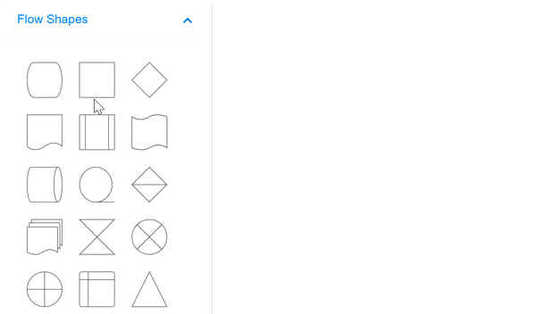

# Action of Nodes in Blazor Diagram Component

Nodes are graphical objects that are used to visually represent the geometrical information, process flow, internal business procedure, entity, or any other kind of data and it represents the functions of a complete system in regards to how it interacts with external entities.


## Create node

A node can be created and added to the diagram, either programmatically or interactively. Nodes are stacked in the diagram area from bottom-to-top in the order they are added.

## Add node through nodes collection

To create a node, define the `Node` object and add that to the nodes collection of the diagram. The following code example shows how to add a node to the diagram.

```cshtml
@using Syncfusion.Blazor.Diagram

<SfDiagramComponent Height="600px" Nodes="@NodeCollection">
</SfDiagramComponent>

@code{
    DiagramObjectCollection<Node> NodeCollection = new DiagramObjectCollection<Node>();
    protected override void OnInitialized()
    {
        // A node is created and stored in the nodes collection.
        Node node = new Node()
        {
            ID = "node1",
            // Position of the node
            OffsetX = 250,
            OffsetY = 250,
            // Size of the node
            Width = 100,
            Height = 100,
            Style = new ShapeStyle() { Fill = "#6495ED", StrokeColor = "white" }

        };
        // Add node
        NodeCollection.Add(node);
    }
}
```


## Add nodes at runtime

You can add a Node at runtime by adding node to the nodes collection in the Diagram component.  The following code explains how to add nodes at runtime.

```cshtml
@using Syncfusion.Blazor.Diagram

<input type="button" value="Add Node" @onclick="@AddNode">
<SfDiagramComponent Width="1000px" Height="500px" Nodes="@nodes"></SfDiagramComponent>

@code{

    DiagramObjectCollection<Node> nodes = new DiagramObjectCollection<Node>();
    protected override void OnInitialized()
    {
        Node node = new Node()
        {
            ID = "node1",
            // Position of the node
            OffsetX = 250,
            OffsetY = 250,
            // Size of the node
            Width = 100,
            Height = 100,
            Style = new ShapeStyle() { Fill = "#6495ED" }
        };
        nodes.Add(node);
    }
    public void AddNode()
    {
        Node NewNode = new Node()
        {
            ID = "node2",
            // Position of the node
            OffsetX = 450,
            OffsetY = 450,
            // Size of the node
            Width = 100,
            Height = 100,
            Style = new ShapeStyle() { Fill = "#6495ED" }
        };
        nodes.Add(NewNode);
    }
}
```

## Add node from palette

Nodes can be predefined and added to the palette, and can be dropped into the diagram when needed. For more information
about adding nodes from symbol palette, refer to the `Symbol Palette`.

* Once you drag a node/connector from the palette to the diagram, the following events can be used to do the customization.
* When a symbol is dragged into a diagram from symbol palette, the `DragEnter` event gets triggered.
* When a symbol is dragged over a diagram, the `DragOver` event gets triggered.
* When a symbol is dragged and dropped from symbol palette to diagram area, the `Drop` event gets triggered.
* When a symbol is dragged outside of the diagram, the `DragLeave` event gets triggered.



## Draw Node using drawing object

Nodes can be interactively drawn by clicking and dragging on the diagram surface by using the `DrawingObject`.

For more information about drawing Node, refer to the `Draw Nodes`.


## Create node through data source

Nodes can be generated automatically with the information provided through data source. The default properties for
these nodes are fetched from default settings. For more information about datasource, refer to the `DataSource`.

## Remove nodes at runtime

* A node can be removed from the diagram at runtime by using the `Remove` method.

The following code shows how to remove a node at runtime.

```cshtml
@using Syncfusion.Blazor.Diagram

<input type="button" value="Remove Node" @onclick="@RemoveNodes">

<SfDiagramComponent Width="1000px" Height="500px" Nodes="@nodes">
</SfDiagramComponent>

@code{
    //Defines diagram's connector collection
    DiagramObjectCollection<Node> nodes = new DiagramObjectCollection<Node>();
    protected override void OnInitialized()
    {
        Node node = new Node()
        {
            ID = "node1",
            // Position of the node
            OffsetX = 250,
            OffsetY = 250,
            // Size of the node
            Width = 100,
            Height = 100,
            Style = new ShapeStyle() { Fill = "#6495ED", StrokeColor = "white" }

        };
        // Add node
        nodes.Add(node);
    }
    public void RemoveNodes()
    {
        // Remove Node at runtime
        nodes.Remove(nodes[0]);
    }
}
```

A node can be removed from the diagram by using the native `RemoveAt` method. Refer to the following example that shows how to remove the node at runtime.

```csharp
public void RemoveNodes()
{
    nodes.RemoveAt(0);
}
```

## Update nodes at runtime

You can change any node's properties at runtime.

The following code example explains how to change the node properties.

```cshtml
@using Syncfusion.Blazor.Diagram

<input type="button" value="Update Node" @onclick="@UpdateNodes">

<SfDiagramComponent @ref="Diagram" Width="1000px" Height="500px" Nodes="@nodes">
</SfDiagramComponent>

@code{
    SfDiagramComponent Diagram;
    //Defines diagram's node collection
    DiagramObjectCollection<Node> nodes = new DiagramObjectCollection<Node>();
    protected override void OnInitialized()
    {
        Node node = new Node()
        {
            ID = "node1",
            // Position of the node
            OffsetX = 250,
            OffsetY = 250,
            // Size of the node
            Width = 100,
            Height = 100,
            Style = new ShapeStyle() { Fill = "#6495ED", StrokeColor = "white" }

        };
        nodes.Add(node);
    }
    public async void UpdateNodes()
    {
        Diagram.BeginUpdate();
        Diagram.Nodes[0].Width = 50;
        Diagram.Nodes[0].Height = 50;
        await Diagram.EndUpdate();
    }
}
```

>**Note:**
>* BeginUpdate and EndUpdate method which allows you to stop the continuous update of control and resume it finally.

## See Also

* [How to add annotations to the node](../annotations/labels)

* [How to add ports to the node](../ports/ports)

* [How to enable/disable the behavior of the node](../constraints)