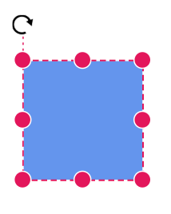

# Position in Blazor Diagram Component

## Arrange the nodes

* Position of a node is controlled by using the `OffsetX` and `OffsetY` properties. By default, these offset properties represent the distance between the origin of the diagram’s page and node’s center point.

* You may expect this offset values to represent the distance between page origin and node’s top-left corner instead of center. The Pivot property helps to solve this problem. Default value of node’s `Pivot` point is (0.5, 0.5) that means center of the node.

* The size of the node can be controlled by using the `Width` and `Height` properties.

The following table shows how pivot relates offset values with node boundaries.

| Pivot | Offset |
|-------- | -------- |
| (0.5,0.5)| OffsetX and OffsetY values are considered as the node’s center point. |
| (0,0) | OffsetX and OffsetY values are considered as the top-left corner of the node. |
| (1,1) | OffsetX and OffsetY values are considered as the bottom-right corner of the node. |

The following code shows how to change the `Pivot` value.

```cshtml
@using Syncfusion.Blazor.Diagram
@using System.Collections.ObjectModel

<SfDiagramComponent Height="600px" @ref="@diagram" Nodes="@nodes">
</SfDiagramComponent>

@code {
    SfDiagramComponent diagram;
    DiagramObjectCollection<Node> nodes = new DiagramObjectCollection<Node>();
    protected override void OnInitialized()
    {
        // A node is created and stored in nodes array.
        Node node = new Node()
        {
            // Position of the node
            OffsetX = 250,
            OffsetY = 250,
            // Size of the node
            Width = 100,
            Height = 100,
            Style = new ShapeStyle() { Fill = "#6495ED", StrokeColor = "white" },
            // Pivot of the node
            Pivot = new Point() { X = 0, Y = 0 }
        };
        nodes.Add(node);
    }
    protected override async Task OnAfterRenderAsync(bool firstRender)
    {
        if (firstRender)
        {
            //OnAfterRenderAsync will be triggered after the component rendered.
            await Task.Delay(200);
            diagram.Select(new ObservableCollection<IDiagramObject>() { diagram.Nodes[0] });
        }
    }
}
```



Rotation of a node is controlled by using the `RotateAngle` property. The following code shows how to change the `RotateAngle` value.

```cshtml
@using Syncfusion.Blazor.Diagram

<SfDiagramComponent Height="600px" @ref="@diagram" Nodes="@nodes">
</SfDiagramComponent>

@code
{
    SfDiagramComponent diagram;
    DiagramObjectCollection<Node> nodes = new DiagramObjectCollection<Node>();
    protected override void OnInitialized()
    {
        // A node is created and stored in nodes array.
        Node node = new Node()
        {
            ID = "node",
            // Position of the node
            OffsetX = 250,
            OffsetY = 250,
            // Size of the node
            Width = 100,
            Height = 100,
            Style = new ShapeStyle() { Fill = "#6495ED", StrokeColor = "white" },
            // RotateAngle of the node
            RotateAngle = 90
        };
        nodes.Add(node);
    }
}
```


## Minimum Size and Maximum Size

The `MinWidth` and `MinHeight` properties of node allows you to control the minimum size of the node while resizing. Similarly, the `MaxWidth` and `MaxHeight` properties of node allows you to control the minimum size of the node while resizing. The below gif explains how minimum and maximum size is controlled.

```cshtml
@using Syncfusion.Blazor.Diagram

<SfDiagramComponent Height="600px" @ref="@diagram" Nodes="@nodes">
</SfDiagramComponent>

@code {
    SfDiagramComponent diagram;
    DiagramObjectCollection<Node> nodes = new DiagramObjectCollection<Node>();
    protected override void OnInitialized()
    {
        // A node is created and stored in nodes array.
        Node node = new Node()
        {
            ID = "node",
            // Position of the node
            OffsetX = 250,
            OffsetY = 250,
            // Size of the node
            Width = 100,
            Height = 100,
            //Minimum Size of the node
            MinHeight = 50,
            MinWidth = 50,
            //Maximum Size of the node
            MaxHeight = 200,
            MaxWidth = 200,
            Style = new ShapeStyle() { Fill = "#6495ED", StrokeColor = "white" },
        };
        nodes.Add(node);
    }
}
```


## See also

* [`How to customize the node`](./appearance)

* [`How to get events when they interact the node`](./events)