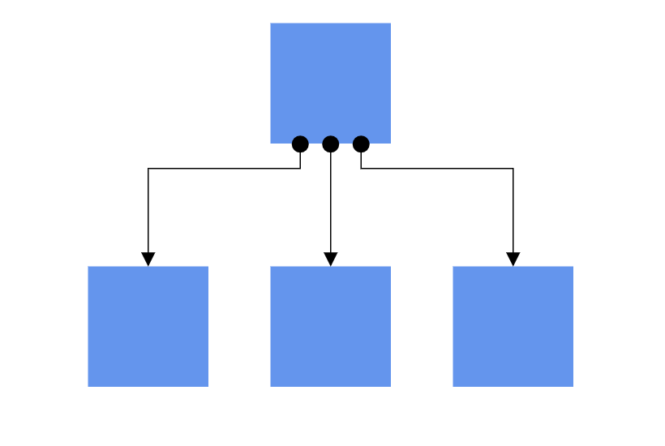
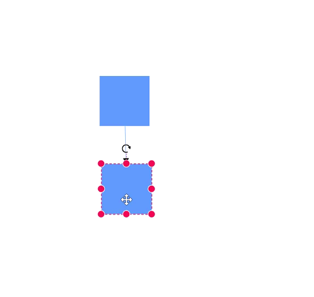
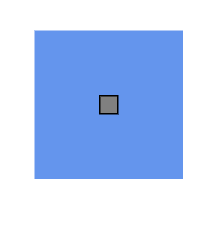

# Ports in Blazor Diagram Component

Port is a special connection point in a Node that you can glue the connectors. When you glue a connector to a node or port, they stay connected, even if one of the node is moved.



## Connections

There are two main types of connections, dynamic and port. The difference between these two connections is whether or not a connector remains glued to a specific connection point when you move the attached node or connector.

A dynamic connection is one where the connector will move around the node as you move the node. Diagram will always ensure the connector is the shortest, most direct line possible. You can create a dynamic connection by selecting the entire node (rather than the port) and connect it to another shape (rather than to a port).



Ports act as the connection points of the node and allows creating connections with only those specific points as shown in the following image.


## Create Ports

To add a connection port, define the port object and add it to node’s ports collection. The `Offset` property of the port accepts an object of fractions and used to determine the position of ports. The following code explains how to add ports when initializing the node.

```csharp
@using Syncfusion.Blazor.Diagram

<SfDiagramComponent Height="600px" Nodes="@nodes">
</SfDiagramComponent>

@code{

    DiagramObjectCollection<Node> nodes = new DiagramObjectCollection<Node>();
    protected override void OnInitialized()
    {
        // A node is created and stored in nodes collection.
        nodes = new DiagramObjectCollection<Node>();
        Node node = new Node()
        {
            // Position of the node
            OffsetX = 250,
            OffsetY = 250,
            // Size of the node
            Width = 100,
            Height = 100,
            Style = new ShapeStyle() { Fill = "#6495ED", StrokeColor = "white" },
            // Initialize port collection
            Ports = new DiagramObjectCollection<PointPort>()
            {
                // Sets the position for the port
               new PointPort(){Style=new ShapeStyle(){ Fill="gray" }, Offset= new Point(){X=0.5,Y=0.5}, Visibility = PortVisibility.Visible}
            }
        };
        nodes.Add(node);
    }
}
```



## Add Ports at runtime

You can add Ports at runtime to the nodes collection in the Diagram component by using the `Add` method.

The following code explains how to add ports to node at runtime by using `Add` method. The port’s `ID` property is used to define the unique ID for the port and it is further used to find the port at runtime.
If **ID** is not set, then default **ID** is automatically set.

```csharp
@using Syncfusion.Blazor.Diagram

<input type="button" value="AddPorts" @onclick="@AddPorts" />
<SfDiagramComponent Height="600px" Nodes="@nodes">
</SfDiagramComponent>

@code{

    DiagramObjectCollection<Node> nodes = new DiagramObjectCollection<Node>();
    protected override void OnInitialized()
    {
        //A node is created and stored in nodes array
        nodes = new DiagramObjectCollection<Node>();
        Node node = new Node()
        {
            //Position of the node
            OffsetX = 250,
            OffsetY = 250,
            //Size of the node
            Width = 100,
            Height = 100,
            Style = new ShapeStyle() { Fill = "#6495ED", StrokeColor = "white" },
        };
        nodes.Add(node);
    }
    public void AddPorts()
    {
        // Initialize port collection
        nodes[0].Ports.Add(new PointPort() { ID = "port1", Offset = new Point() { X = 0, Y = 0.5 }, Visibility = PortVisibility.Visible });
    }
}

```

Also, the Port can be added at runtime by using the `AddAsync` method. The `await` operator suspends evaluation of the enclosing async method until the asynchronous operation represented by its operand completes.

The following code explains how to add ports to node at runtime by using `AddAsync` method.

```csharp
    //Method to add Port at runtime
    public async void AddPorts()
    {
        PointPort port = new PointPort()
            {
               Style=new ShapeStyle(){ Fill="gray" }, Offset= new Point(){X=0.5,Y=0.5}, Visibility = PortVisibility.Visible
            };
        await ((nodes[0].Ports) as DiagramObjectCollection<PointPort>).AddAsync(port);
    }
```


## Add Multiple Ports at runtime

Add Multiple ports at runtime by using the server-side method `Add` in the port collection. The following code explains how to add two or more ports to node at runtime.

The port’s `ID` property is used to define the unique ID for the port and it is further used to find the port at runtime. If **ID** is not set, then default **ID** is automatically set.

```csharp
@using Syncfusion.Blazor.Diagram

<input type="button" value="AddPorts" @onclick="@AddPorts" />
<SfDiagramComponent Height="600px" Nodes="@nodes">
</SfDiagramComponent>

@code{

    DiagramObjectCollection<Node> nodes = new DiagramObjectCollection<Node>();
    protected override void OnInitialized()
    {
        //A node is created and stored in nodes array
        nodes = new DiagramObjectCollection<Node>();
        Node node = new Node()
        {
            //Position of the node
            OffsetX = 250,
            OffsetY = 250,
            //Size of the node
            Width = 100,
            Height = 100,
            Style = new ShapeStyle() { Fill = "#6495ED", StrokeColor = "white" },
        };
        nodes.Add(node);
    }
    public void AddPorts()
    {
        // Initialize port collection
        nodes[0].Ports.Add(new PointPort() { ID = "port1", Offset = new Point() { X = 0, Y = 0.5 }, Visibility = PortVisibility.Visible });
        nodes[0].Ports.Add(new PointPort() { ID = "port2", Offset = new Point() { X = 1, Y = 0.5 }, Visibility = PortVisibility.Visible });
        nodes[0].Ports.Add(new PointPort() { ID = "port3", Offset = new Point() { X = 0.5, Y = 0 }, Visibility = PortVisibility.Visible });
        nodes[0].Ports.Add(new PointPort() { ID = "port4", Offset = new Point() { X = 0.5, Y = 1 }, Visibility = PortVisibility.Visible });
    }
}
```


## Remove ports at runtime

A collection of ports can be removed from the node by using the native`RemoveAt` method. Refer to the following example that shows how to remove ports at runtime.

```csharp
@using Syncfusion.Blazor.Diagram

<input type="button" value="RemovePorts" @onclick="@RemovePorts" />
<SfDiagramComponent Height="600px" Nodes="@nodes">
</SfDiagramComponent>
@code{

    DiagramObjectCollection<Node> nodes = new DiagramObjectCollection<Node>();
    protected override void OnInitialized()
    {
        // A node is created and stored in nodes array.
        nodes = new DiagramObjectCollection<Node>();
        Node node = new Node()
        {
            // Position of the node
            OffsetX = 250,
            OffsetY = 250,
            // Size of the node
            Width = 100,
            Height = 100,
            Style = new ShapeStyle() { Fill = "#6495ED", StrokeColor = "white" },
            // Initialize port collection
            Ports = new DiagramObjectCollection<PointPort>() {
            new PointPort() {
                ID = "port1",
                Offset = new Point() { X = 0, Y = 0.5 },
                Visibility = PortVisibility.Visible,
                //Set the style for the port
                Style= new ShapeStyle(){ Fill="red", StrokeColor="black", StrokeWidth=2},
                // Sets the shape of the port as Circle
                Width= 12, Height=12, Shape= PortShapes.Circle
            }},
        };
        nodes.Add(node);
    }
    public void RemovePorts()
    {
        (nodes[0].Ports as DiagramObjectCollection<PointPort>).RemoveAt(0);
    }
}
```

## Update Ports at runtime

You can change any port properties at runtime.

The following code example explains how to change the port properties at runtime.

```csharp
@using Syncfusion.Blazor.Diagram

<input type="button" value="Update Port" @onclick="@UpdatePort" />
<SfDiagramComponent @ref="diagram" Height="600px" Nodes="@nodes">
</SfDiagramComponent>

@code{
    SfDiagramComponent diagram;
    DiagramObjectCollection<Node> nodes = new DiagramObjectCollection<Node>();
    protected override void OnInitialized()
    {
        // Initialize port collection
        DiagramObjectCollection<PointPort> Ports1 = new DiagramObjectCollection<PointPort>() { };
        Ports1.Add(new PointPort() { ID = "port1", Offset = new Point() { X = 0, Y = 0.5 }, Visibility = PortVisibility.Visible });
        // A node is created and stored in nodes array
        nodes = new DiagramObjectCollection<Node>();
        Node node = new Node()
        {
            // Position of the node
            OffsetX = 250,
            OffsetY = 250,
            // Size of the node
            Width = 100,
            Height = 100,
            Style = new ShapeStyle() { Fill = "#6495ED", StrokeColor = "white" },
            Ports = Ports1
        };
        nodes.Add(node);
    }
    public void UpdatePort()
    {
        //update ports at run time
        diagram.BeginUpdate();
        nodes[0].Ports[0].Offset.X = 1;
        nodes[0].Ports[0].Offset.Y = 1;
        diagram.EndUpdate();
    }
}
```

## See also

* [`How to create a node`](../nodes/nodes)

* [`How to customize the ports`](./appearance)

* [`How to interact the ports`](./interaction)

* [`How to set the position of the port`](./positioning)
