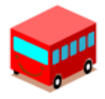
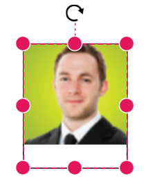
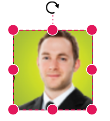
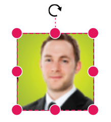
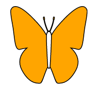

# Node Shapes in Blazor Diagram Component

Diagram provides support to add different kind of nodes. They are as follows:

* Text shape
* Image shape
* Path shape
* Basic shape
* Flow shape
* SVG shape
* HTML template 

## Text node

The Diagram allows you to add texts as **TextShape**. The **Content** property defines the text that is to be added. [Style](https://help.syncfusion.com/cr/blazor/Syncfusion.Blazor.Diagram.ShapeStyle.html) of the node is used as [TextStyle](https://help.syncfusion.com/cr/blazor/Syncfusion.Blazor.Diagram.TextStyle.html) to customize the appearance of the text.

The following code illustrates how to create a text node.
```cshtml
@using Syncfusion.Blazor.Diagram

@* Initialize Diagram *@
<SfDiagramComponent Height="600px" Nodes="@nodes" />

@code
{
    SfDiagramComponent diagram;
    DiagramObjectCollection<Node> nodes = new DiagramObjectCollection<Node>();

    protected override void OnInitialized()
    {
        Node node = new Node()
        {
            ID = "node1",
            //Size of the node.
            Height = 100,
            Width = 100,
            //Position of the node.
            OffsetX = 100,
            OffsetY = 100,
            Shape = new TextShape()
            {
                //Set the Content of the text shape.
                Content = "Text Node"
            },
            Style = new TextStyle()
            {
                Fill = "Yellow",
                TextAlign= TextAlign.Left
            }
        };
        nodes.Add(node);
    }
}
```
## Image node

Diagram allows to add images as [ImageShape](https://help.syncfusion.com/cr/blazor/Syncfusion.Blazor.Diagram.ImageShape.html). The [Shape](https://help.syncfusion.com/cr/blazor/Syncfusion.Blazor.Diagram.Shape.html) property of node allows you to set the type of node and for image nodes, it should be set as **Image**. In addition, the [Source](https://help.syncfusion.com/cr/blazor/Syncfusion.Blazor.Diagram.ImageShape.html#Syncfusion_Blazor_Diagram_ImageShape_Source) property of shape enables you to set the image.

The following code illustrates how an image node is created.

```cshtml
@using Syncfusion.Blazor.Diagram

@* Initialize Diagram *@
<SfDiagramComponent Height="600px" Nodes="@nodes" />

@code
{
    SfDiagramComponent diagram;
    DiagramObjectCollection<Node> nodes = new DiagramObjectCollection<Node>();

    protected override void OnInitialized()
    {
        Node node = new Node()
        {
            ID = "node1",
            //Size of the node
            Height = 100,
            Width = 100,
            //Position of the node
            OffsetX = 100,
            OffsetY = 100,
            Shape = new ImageShape()
            {
                Type = Shapes.Image,
                //Sets the source to the image shape
                Source = "/diagram/images/syncfusion.png"
            }
        };
        nodes.Add(node);
    }
}
```


### Base64 encoded image into the image node

The following code illustrates how to add Base64 image into the image node.

```cshtml
@using Syncfusion.Blazor.Diagram

@* Initialize Diagram *@
<SfDiagramComponent Height="600px" Nodes="@nodes"></SfDiagramComponent>

@code
{
    //Initialize node collection with node.
    DiagramObjectCollection<Node> nodes = new DiagramObjectCollection<Node>();

    protected override void OnInitialized()
    {
        Node node = new Node()
        {
            ID = "node1",
            //Size of the node.
            Height = 100,
            Width = 100,
            //Position of the node.
            OffsetX = 100,
            OffsetY = 100,
            //Sets type of the shape as image.
            Shape = new ImageShape()
            {
                Type = Shapes.Image,
                //Sets the Base64 image to the image shape 
                Source = ""
            },
            Style = new ShapeStyle() { StrokeColor = "White" }
        };
        nodes.Add(node);
    }
}
```



> Deploy your HTML file in the web application and export the diagram (image node) or else the image node will not be exported in the Chrome and Firefox due to security issues.

### Stretch and align the image

Stretch and align the image content anywhere but within the node boundary. The [Scale](https://help.syncfusion.com/cr/blazor/Syncfusion.Blazor.Diagram.ImageShape.html#Syncfusion_Blazor_Diagram_ImageShape_Scale) property of the node allows you to stretch the image as you desire. (either to maintain proportion or to stretch). By default, the Scale property of the node is set as [Meet](https://help.syncfusion.com/cr/blazor/Syncfusion.Blazor.Diagram.Scale.html#Syncfusion_Blazor_Diagram_Scale_Meet). The following code illustrates how to scale or stretch the content of the image node.

```cshtml
@using Syncfusion.Blazor.Diagram

@* Initialize Diagram *@
<SfDiagramComponent Height="600px" Nodes="@nodes" />

@code
{
    SfDiagramComponent diagram;
    DiagramObjectCollection<Node> nodes = new DiagramObjectCollection<Node>();

    protected override void OnInitialized()
    {
        Node node = new Node()
        {
            ID = "node1",
            //Size of the node.
            Height = 100,
            Width = 100,
            //Position of the node.
            OffsetX = 100,
            OffsetY = 100,
            Shape = new ImageShape()
            {
                Type = Shapes.Image,
                Source = "/diagram/images/productmanager.png",
                //To stretch the image.
                Scale = Scale.Meet,
                //To align the image.
                ImageAlign = ImageAlignment.XMinYMax
            }
        };
        nodes.Add(node);
    }
}
```

* [ImageAlign](https://help.syncfusion.com/cr/blazor/Syncfusion.Blazor.Diagram.ImageShape.html#Syncfusion_Blazor_Diagram_ImageShape_ImageAlign) property of the shape helps to align the image based on the x and y values in the node boundary. The following table illustrates the various image alignments in the node boundary.

|Scale |ImageAlign |Result|
|---|---|---|
|   Meet  |     XMinYMax  ||
|Meet|XMinYMin||
|Meet|XMaxYMax||
|None|XMinYMax||
|None|XMinYMin||
|Slice|XMinYMax||
|Slice|XMinYMin||

## HTML template shape

Html elements can be embedded in the diagram through [HTML](https://help.syncfusion.com/cr/blazor/Syncfusion.Blazor.Diagram.Shapes.html#Syncfusion_Blazor_Diagram_Shapes_HTML) type node. The Shape property of Node allows you to set the type of node and to create a HTML node it should be set as **HTML**. The following code illustrates how an HTML node is created.

```cshtml
@using Syncfusion.Blazor.Diagram

@* Add a Namespace for a syncfusion control used in Diagrm HTML node *@
@using Syncfusion.Blazor.CircularGauge

@* Initialize Diagram with node template *@
<SfDiagramComponent Height="600px" Nodes="@nodes">
    <DiagramTemplates>
        <NodeTemplate>
            @{
                <SfCircularGauge Width="300px" Height="300px">
                    <CircularGaugeAxes>
                        <CircularGaugeAxis StartAngle="210" EndAngle="150" Minimum="0" Maximum="120" Radius="80%">
                            <CircularGaugeAxisLineStyle Width="10" Color="transparent">
                            </CircularGaugeAxisLineStyle>
                            <CircularGaugeAxisLabelStyle UseRangeColor="false">
                                <CircularGaugeAxisLabelFont Size="12px" FontFamily="Roboto" FontStyle="Regular">
                                </CircularGaugeAxisLabelFont>
                            </CircularGaugeAxisLabelStyle>
                            <CircularGaugeAxisMajorTicks Height="10" Offset="5" UseRangeColor="false">
                            </CircularGaugeAxisMajorTicks>
                            <CircularGaugeAxisMinorTicks Height="0" Width="0" UseRangeColor="false">
                            </CircularGaugeAxisMinorTicks>
                            <CircularGaugeAnnotations>
                                <CircularGaugeAnnotation Radius="30%" Angle="0" ZIndex="1" Content="Speedometer">
                                    <ContentTemplate>
                                        <div><span style="font-size:14px; color:#9E9E9E; font-family:Regular; margin-left: -33px">Speedometer</span></div>
                                    </ContentTemplate>
                                </CircularGaugeAnnotation>
                                <CircularGaugeAnnotation Radius="40%" Angle="180" ZIndex="1" Content="65 MPH">
                                    <ContentTemplate>
                                        <div><span style="font-size:20px; color:#424242; font-family:Regular; margin-left: -33px">65 MPH</span></div>
                                    </ContentTemplate>
                                </CircularGaugeAnnotation>
                            </CircularGaugeAnnotations>
                            <CircularGaugeRanges>
                                <CircularGaugeRange Start="0" End="40" Color="#30B32D" StartWidth="10" EndWidth="10" RoundedCornerRadius="0">
                                </CircularGaugeRange>
                                <CircularGaugeRange Start="40" End="80" Color="#FFDD00" StartWidth="10" EndWidth="10" RoundedCornerRadius="0">
                                </CircularGaugeRange>
                                <CircularGaugeRange Start="80" End="120" Color="#F03E3E" StartWidth="10" EndWidth="10" RoundedCornerRadius="0">
                                </CircularGaugeRange>
                            </CircularGaugeRanges>
                            <CircularGaugePointers>
                                <CircularGaugePointer Value="65" Radius="60%" PointerWidth="8">
                                    <CircularGaugePointerAnimation Enable="true"></CircularGaugePointerAnimation>
                                    <CircularGaugeCap Radius="7">
                                    </CircularGaugeCap>
                                    <CircularGaugeNeedleTail Length="18%">
                                    </CircularGaugeNeedleTail>
                                </CircularGaugePointer>
                            </CircularGaugePointers>
                        </CircularGaugeAxis>
                    </CircularGaugeAxes>
                </SfCircularGauge>
            }
        </NodeTemplate>
    </DiagramTemplates>
</SfDiagramComponent>

@code
{
    //Initialize node collection with node.
    DiagramObjectCollection<Node> nodes = new DiagramObjectCollection<Node>();

    protected override void OnInitialized()
    {
        Node node = new Node()
        {
            ID = "node1",
            //Size of the node.
            Width = 300,
            Height = 300,
            //Position of the node.
            OffsetX = 400,
            OffsetY = 300,
            //Sets the type of the shape as HTML.
            Shape = new Shape()
            {
                Type = Shapes.HTML,
            }
        };
        nodes.Add(node);
    }
}
```


> HTML node cannot be exported to image format, like JPEG, PNG and BMP. It is by design, while exporting the diagram is drawn in a canvas. Further, this canvas is exported into image formats. Currently, drawing in a canvas equivalent from all possible HTML is not feasible. Hence, this limitation. Also , HTML node always appears as topmost layer ( whose index is the higher index, even though it is defined at the last).

## Node with basic shapes

The [BasicShapes](https://help.syncfusion.com/cr/blazor/Syncfusion.Blazor.Diagram.BasicShape.html) are common shapes that are used to represent the geometrical information visually. To create basic shapes, the **Type** of the shape should be set as [Basic](https://help.syncfusion.com/cr/blazor/Syncfusion.Blazor.Diagram.Shapes.html#Syncfusion_Blazor_Diagram_Shapes_Basic). Its Shape property can be set with any one of the built-in shapes. To render a rounded rectangle, you need to set the type as **Basic** and shape as **Rectangle**. Set the [CornerRadius](https://help.syncfusion.com/cr/blazor/Syncfusion.Blazor.Diagram.BasicShape.html#Syncfusion_Blazor_Diagram_BasicShape_CornerRadius) property to specify the radius of rounded rectangle.

The following code example illustrates how to create a basic shape.

```cshtml
@using Syncfusion.Blazor.Diagram

@* Initialize Diagram *@
<SfDiagramComponent Height="600px" Nodes="@nodes" />

@code
{
    //Initialize node collection with node.
    DiagramObjectCollection<Node> nodes = new DiagramObjectCollection<Node>();

    protected override void OnInitialized()
    {
        Node node = new Node()
        {
            ID = "node1",
            //Size of the node.
            Height = 100,
            Width = 100,
            //Position of the node.
            OffsetX = 100,
            OffsetY = 100,
            //Sets the type of the shape as basic.
            Shape = new BasicShape()
            {
                Type = Shapes.Basic,
                Shape = BasicShapeType.Rectangle,
                //Sets the corner radius to the node shape.
                CornerRadius = 10
            },
            Style = new ShapeStyle() { Fill = "#6495ED" }
        };
        nodes.Add(node);
    }
}
```

> By default, the [Shape](https://help.syncfusion.com/cr/blazor/Syncfusion.Blazor.Diagram.Shape.html) property of the node is set as **Basic**. Default property for Shape is Rectangle.
> When the `Shape` is not set for a basic shape, it is considered as a **Rectangle**.
> The `CornerRadius` property is applicable only for basic shape.

The list of basic shapes are as follows.


## Path shape node

The [PathShape](https://help.syncfusion.com/cr/blazor/Syncfusion.Blazor.Diagram.PathShape.html) is a commonly used basic shape that allows visually to represent the geometrical information. As node path data, any geometrical data can be provided. You can create your own Geometry and assign it to data if you want anything different from the standard figures. A geometry does not require any dimension specifications, such as width or height, because it specifies its own size. If the node's size is set, the geometry is extended to fit the node's dimensions.

To create a path node, specify the shape as **Path**. The [Data](https://help.syncfusion.com/cr/blazor/Syncfusion.Blazor.Diagram.PathShape.html#Syncfusion_Blazor_Diagram_PathShape_Data) property of node allows you to define the path to be drawn. The following code illustrates how a path node is created.

```cshtml
@using Syncfusion.Blazor.Diagram

@* Initialize Diagram *@
<SfDiagramComponent Height="600px" Nodes="@nodes" />
@code
{
       //Initialize node collection with node.
       DiagramObjectCollection<Node> nodes = new DiagramObjectCollection<Node>()
       {
         // Creates a path node
         new Node()
         {
             ID = "node1",
             //Size of the node.
             Height = 100,
             Width = 100,
             //Position of the node.
             OffsetX = 100,
             OffsetY = 100,
             //Sets the type of the shape as path.
             Shape = new PathShape()
             {
                 Type=Shapes.Path,
                 Data="M 355.31 12.07 C 352.11 5.95 345.35 -1.14 331.41 0.15 C 290.33 3.93 209.61 81.48 190.42 111.69 C 189.66 107.76 187.9 101.49 184.12 98.05 C 189.5 87.75 198.01 69.64 201.57 52.48 C 202.4 52.26 203.12 51.68 203.34 50.44 C 203.72 48.34 204 46.22 204.39 44.13 C 205.01 40.62 199.99 39.43 199.42 42.91 C 199.06 45.06 198.69 47.15 198.35 49.31 C 198.16 50.6 198.69 51.62 199.54 52.14 C 196.08 68.87 187.75 86.63 182.43 96.81 C 181.52 96.29 180.53 95.87 179.41 95.7 C 179.09 95.65 178.8 95.72 178.5 95.71 C 178.19 95.72 177.91 95.65 177.59 95.7 C 176.46 95.87 175.48 96.29 174.56 96.81 C 169.24 86.63 160.92 68.87 157.46 52.14 C 158.3 51.62 158.83 50.6 158.65 49.31 C 158.3 47.15 157.93 45.06 157.58 42.91 C 157.01 39.43 151.99 40.62 152.61 44.13 C 152.99 46.22 153.28 48.34 153.66 50.44 C 153.87 51.68 154.6 52.27 155.42 52.48 C 158.98 69.63 167.49 87.75 172.87 98.05 C 169.09 101.49 167.33 107.76 166.57 111.69 C 147.39 81.48 66.67 3.93 25.59 0.15 C 11.65 -1.14 4.89 5.95 1.69 12.07 C -2.05 19.07 0.84 33.48 6.24 58.46 C 8.66 69.55 11.16 80.96 12.94 92.2 C 13.89 98.36 14.79 104.49 15.64 110.36 C 19.39 136.89 22.52 158.97 32.64 166.04 C 35.41 167.98 38.65 168.78 42.61 168.24 C 52.26 165.95 63.79 164.03 75.99 162.67 C 64.03 171.47 49.08 185.81 44.17 204.84 C 40.38 219.72 43.37 234.86 53.01 250.05 C 64.37 267.81 76.02 279.48 86.91 287.09 C 108.68 302.31 127.52 301.24 135.48 300.78 C 136.3 300.77 136.94 300.71 137.56 300.69 C 143.62 300.61 147.76 291.39 156.6 270.51 C 160.94 260.34 167.39 245.19 172.83 237.47 C 173.97 240.31 177.22 242.31 178.92 242.87 C 178.78 242.94 178.62 243.07 178.49 243.12 C 178.65 243.08 178.83 242.97 179 242.91 C 179.1 242.94 179.25 243.02 179.34 243.04 C 179.26 243.01 179.13 242.93 179.04 242.89 C 180.83 242.24 183.05 240.25 184.16 237.48 C 189.6 245.19 196.05 260.34 200.39 270.52 C 209.23 291.4 213.38 300.61 219.43 300.7 C 220.05 300.72 220.69 300.77 221.51 300.78 C 229.47 301.25 248.31 302.31 270.08 287.1 C 280.97 279.49 292.62 267.81 303.98 250.05 C 313.62 234.86 316.6 219.72 312.82 204.84 C 307.91 185.82 292.96 171.48 281 162.67 C 293.2 164.03 304.73 165.95 314.38 168.24 C 318.34 168.78 321.58 167.98 324.35 166.04 C 334.47 158.97 337.6 136.89 341.35 110.37 C 342.19 104.49 343.1 98.37 344.05 92.2 C 345.83 80.96 348.33 69.55 350.75 58.46 C 356.16 33.48 359.05 19.07 355.31 12.07 z M 183.92 237.56 C 182.35 240.3 180.35 242.13 178.97 242.86 C 177.49 242.19 174.7 240.38 173.08 237.56 C 173.08 237.56 166.19 138.22 166.91 113.58 C 166.91 113.58 169.24 97.92 178.5 97.81 C 187.76 97.92 190.09 113.58 190.09 113.58 C 190.81 138.22 183.92 237.56 183.92 237.56 z"
             },
             Style=new ShapeStyle()
             {
                 Fill="Orange"
             }
        }
    };
}
```



## Flow shape node

The [Flow](https://help.syncfusion.com/cr/blazor/Syncfusion.Blazor.Diagram.FlowShape.html) shapes are used to represent the process flow. It is used for analyzing, designing and managing the documentation process. To create a flow shape, specify the shape type as **Flow**. By default, it is considered as a **Process**. The following code example illustrates how to create a flow shape.

```cshtml
@using Syncfusion.Blazor.Diagram

@* Initialize Diagram *@
<SfDiagramComponent Height="600px" Nodes="@nodes" />

@code
{
    //Initialize node collection with node.
    DiagramObjectCollection<Node> nodes = new DiagramObjectCollection<Node>();

    protected override void OnInitialized()
    {
        Node node = new Node()
        {
            ID = "node1",
            //Size of the node.
            Height = 100,
            Width = 100,
            //Position of the node.
            OffsetX = 100,
            OffsetY = 100,
            //Sets the type of the shape as flow.
            Shape = new FlowShape()
            {
                Type = Shapes.Flow,
                Shape = FlowShapeType.DirectData
            }
        };
        nodes.Add(node);
    }
}
```

The list of flow shapes are as follows.


## SVG template shape

Diagram provides support to embed SVG element into a node. The Shape property of the node allows to set the type of node. To create a SVG node, it should be set as [SVG](https://help.syncfusion.com/cr/blazor/Syncfusion.Blazor.Diagram.Shapes.html#Syncfusion_Blazor_Diagram_Shapes_SVG). The following code illustrates how a SVG node is created.

```cshtml
@using Syncfusion.Blazor.Diagram

@* Initialize Diagram *@
<SfDiagramComponent Height="600px" Nodes="@nodes">
    <SnapSettings Constraints="SnapConstraints.None"></SnapSettings>
    <DiagramTemplates>
        <NodeTemplate>
            @{
                if ((context as Node).Shape.Type == Shapes.SVG)
                {
                    <svg viewBox="0 0 100 100" xmlns="http://www.w3.org/2000/svg">
                        <!-- Using g to inherit presentation attributes -->
                        <g fill="white" stroke="green" stroke-width="5">
                            <circle cx="40" cy="40" r="25" />
                            <circle cx="60" cy="60" r="25" />
                        </g>
                    </svg>
                }
            }
        </NodeTemplate>
    </DiagramTemplates>
</SfDiagramComponent>

@code
{
    //Initialize node collection with node.
    DiagramObjectCollection<Node> nodes = new DiagramObjectCollection<Node>();

    protected override void OnInitialized()
    {
        Node node = new Node()
        {
            ID = "node1",
            // Size of the node.
            Height = 100,
            Width = 100,
            // Position of the node.
            OffsetX = 100,
            OffsetY = 100,
            //Sets type of the shape as SVG.
            Shape = new Shape() { Type = Shapes.SVG },
        };
        nodes.Add(node);
    }
}
```


> Like HTML node, the SVG node also cannot be exported to image format. Fill color of SVG node can be overridden by the inline style or fill of the SVG element specified in the template.