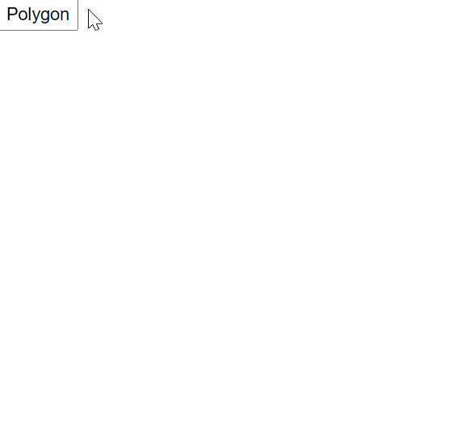

# Tools in Blazor Diagram Component

## Drawing tools

Drawing tool allows you to draw any kind of node/connector during runtime by clicking and dragging on the diagram page.

## Shapes

To draw a shape, set the JSON of that shape to the drawType property of the diagram and activate the drawing tool by using the `Tool` property. The following code example illustrates how to draw a rectangle at runtime.

```csharp
@using Syncfusion.Blazor.Diagram

<input Type="button" value="addNode" @onclick="AddNode" />
<SfDiagramComponent @ref="diagram" Nodes="@nodes" Height="600px" />

@code
{
    //Reference to diagram
    SfDiagramComponent diagram;

    //Defines diagram's nodes collection
    public DiagramObjectCollection<Node> nodes;

    protected override void OnInitialized()
    {
        nodes = new DiagramObjectCollection<Node>();
        Node node = new Node()
        {
            ID = "group",
            OffsetX = 200,
            OffsetY = 200,
            Width = 100,
            Height = 100,
            Annotations = new DiagramObjectCollection<ShapeAnnotation>()
            {
                new ShapeAnnotation()
                {
                    Content = "Node",
                    Style = new TextShapeStyle()
                    {
                        Color = "white",
                    }
                }
            },
            Style = new ShapeStyle() { Fill = "#6495ED", StrokeColor = "white" }
        };
        nodes.Add(node);
    }

    private void AddNode()
    {
        //To draw an object once, activate draw once
        diagram.Tool = DiagramTools.DrawOnce;
        //Initialize the drawing object to draw the shape
        diagram.DrawingObject = new Node()
        {
            Shape = new BasicShape() { Type = Shapes.Basic, Shape = BasicShapes.Rectangle },
            Style = new ShapeStyle() { Fill = "#6495ED", StrokeColor = "#6495ED" }
        };
    }
}
```


## Connectors

To draw connectors, set the JSON of the connector to the drawType property. The drawing `Tool` can be activated by using the tool property. The following code example illustrates how to draw a straight line connector.

```csharp
@using Syncfusion.Blazor.Diagram

<input Type="button" value="AddConnector" @onclick="AddConnector" />
<SfDiagramComponent @ref="diagram" Nodes="@nodes" Height="600px" />

@code
{
    //Reference to diagram
    SfDiagramComponent diagram;

    //Defines diagram's nodes collection
    public DiagramObjectCollection<Node> nodes;

    protected override void OnInitialized()
    {
        nodes = new DiagramObjectCollection<Node>();
        Node node = new Node()
        {
            ID = "group",
            OffsetX = 200,
            OffsetY = 200,
            Width = 100,
            Height = 100,
            Annotations = new DiagramObjectCollection<ShapeAnnotation>()
            {
                new ShapeAnnotation()
                {
                    Content = "Node",
                    Style = new TextShapeStyle()
                    {
                        Color = "white",
                    }
                }
            },
            Style = new ShapeStyle() { Fill = "#6495ED", StrokeColor = "white" }
        };
        nodes.Add(node);
    }

    private void AddConnector()
    {
        //To draw an object once, activate draw once
        diagram.Tool = DiagramTools.DrawOnce;
        //Initialize the drawing object to draw the connectors
        diagram.DrawingObject = new Connector()
        {
            ID = "connector1",
            Type = Segments.Straight,
            Segments = new DiagramObjectCollection<ConnectorSegment>()
            {
                new ConnectorSegment()
                {
                    Type = Segments.Polyline,
                }
            },
        };
    }
}
```


## Polygon shape

Diagram allows to create the polygon shape by clicking and moving the mouse at runtime on the diagram page.

The following code illustrates how to draw a polygon shape.

```csharp
@using System.Collections.ObjectModel
@using Syncfusion.Blazor.Diagrams
<input Type="button" value="Polygon" @onclick="Polygon" />
<SfDiagram @ref="diagram" Nodes="@NodeCollection" Height="600px">
</SfDiagram>

@code
{
    //Reference to diagram
    SfDiagram diagram;

    //Defines diagram's nodes collection
    public ObservableCollection<DiagramNode> NodeCollection = new ObservableCollection<DiagramNode>();

    protected override void OnInitialized()
    {
        DiagramNode node = new DiagramNode()
        {
            Id = "group",
            OffsetX = 200,
            OffsetY = 200,
            Width = 100,
            Height = 100,
            Annotations = new ObservableCollection<DiagramNodeAnnotation>()
        {
                new DiagramNodeAnnotation()
                {
                    Content = "Node1",
                    Style = new AnnotationStyle()
                    {
                        Color = "white",
                    }
                }
            },
            Style = new NodeShapeStyle() { Fill = "cornflowerblue", StrokeColor = "white" }
        };
        NodeCollection.Add(node);
    }

    private void Polygon()
    {
        //To draw an object once, activate draw once
        diagram.Tool = DiagramTools.DrawOnce;
        //Initialize the drawing object to draw the polygon shape
        diagram.DrawingObject = new DiagramNode()
        {
            Id = "polygon",
            Shape = new DiagramShape()
            {
                Type = Shapes.Basic,
                BasicShape = BasicShapes.Polygon,
            },
        };
    }
}
```



## Tool selection

There are some functionalities that can be achieved by clicking and dragging on the diagram surface. They are as follows,

* Draw selection rectangle: MultipleSelect tool
* Pan the diagram: Zoom pan
* Draw nodes/connectors: DrawOnce/DrawOnce

As all the three behaviors are completely different, you can achieve only one behavior at a time based on the tool that you choose.
When more than one of those tools are applied, a tool is activated based on the precedence given in the following table.

|Precedence|Tools|Description|
|----------|-----|-----------|
|1st|ContinuesDraw|Allows you to draw the nodes or connectors continuously. Once it is activated, you cannot perform any other interaction in the diagram.|
|2nd|DrawOnce|Allows you to draw a single node or connector. Once you complete the DrawOnce action, SingleSelect, and MultipleSelect tools are automatically enabled.|
|3rd|ZoomPan|Allows you to pan the diagram. When you enable both the SingleSelect and ZoomPan tools, you can perform the basic interaction as the cursor hovers node/connector. Panning is enabled when cursor hovers the diagram.|
|4th|MultipleSelect|Allows you to select multiple nodes and connectors. When you enable both the MultipleSelect and ZoomPan tools, cursor hovers the diagram. When panning is enabled, you cannot select multiple nodes.|
|5th|SingleSelect|Allows you to select individual nodes or connectors.|
|6th|None|Disables all tools.|

Set the desired `Tool` to the tool property of the diagram model.

The following code illustrates how to enable single tools,

```csharp
@using Syncfusion.Blazor.Diagram

<SfDiagramComponent Connectors="@connectors" Height="600px" Tool="@tool">
</SfDiagramComponent>

@code
{
    //Enable the single tool
    public DiagramTools tool = DiagramTools.DrawOnce;

    //Defines diagram's connectors collection
    public DiagramObjectCollection<Connector> connectors = new DiagramObjectCollection<Connector>();
}
```

The following code illustrates how to enable multiple tools,

```csharp
@using Syncfusion.Blazor.Diagram

<SfDiagramComponent Connectors="@connectors" @ref="diagram" Height="600px" Tool="@tool">
</SfDiagramComponent>

@code
{
    //Reference to diagram
    SfDiagram diagram;

    //Enable the multiple tools
    public DiagramTools tool = DiagramTools.DrawOnce | DiagramTools.ZoomPan;

    //Defines diagram's connectors collection
    public DiagramObjectCollection<Connector> ConnectorCollection = new ObservableCollection<Connector>();
}
```