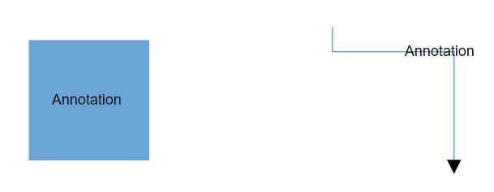
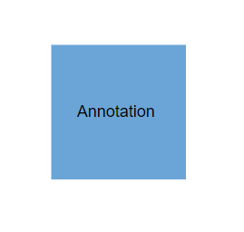

# Actions of annotation in Blazor Diagram Component

The [Annotation](https://help.syncfusion.com/cr/blazor/Syncfusion.Blazor.Diagrams.DiagramNodeAnnotation.html) is a block of text that can be displayed over a node or connector and it is used to textually represent an object with a string that can be edited at run time. Multiple annotations can be added to a node or connector.

> A new blazor diagram component which provides better performance than the existing diagram control in Blazor WebAssembly App. It is available in preview mode. Refer the [Link](https://blazor.syncfusion.com/documentation/diagram-component/annotations/labels)


<!-- markdownlint-disable MD033 -->

## Create annotations

An annotation can be added to a node or connector by defining the annotation object and adding that to the annotation collection of the node or connector. The [Content](https://help.syncfusion.com/cr/blazor/Syncfusion.Blazor.Diagrams.DiagramNodeAnnotation.html#Syncfusion_Blazor_Diagrams_DiagramNodeAnnotation_Content) property of annotation defines the text to be displayed. The following code explains how to create an annotation.

```cshtml
@using Syncfusion.Blazor.Diagrams
@using System.Collections.ObjectModel

<SfDiagram Height="600px" Nodes="@NodeCollection" Connectors="@ConnectorCollection">
</SfDiagram>

@code
{
    //Defines diagram's connector collection
    public ObservableCollection<DiagramConnector> ConnectorCollection { get; set; }
    //Defines diagram's node collection
    public ObservableCollection<DiagramNode> NodeCollection { get; set; }

    protected override void OnInitialized()
    {
        NodeCollection = new ObservableCollection<DiagramNode>();
        DiagramNode node = new DiagramNode()
        {
            Width = 100,
            Height = 100,
            OffsetX = 100,
            OffsetY = 100,
            Style = new NodeShapeStyle()
            {
                Fill = "#6BA5D7",
                StrokeColor = "white"
            },
            Annotations = new ObservableCollection<DiagramNodeAnnotation>()
            {
                // A annotation is created and stored in Annotations collection of Node.
                new DiagramNodeAnnotation() { Content = "Node" }
            }
        };
        NodeCollection.Add(node);
        ConnectorCollection = new ObservableCollection<DiagramConnector>();
        DiagramConnector connector = new DiagramConnector()
        {
            SourcePoint = new ConnectorSourcePoint() { X = 300, Y = 40 },
            TargetPoint = new ConnectorTargetPoint() { X = 400, Y = 160 },
            Type = Segments.Orthogonal,
            Style = new ConnectorShapeStyle()
            {
                StrokeColor = "#6BA5D7"
            },
            Annotations = new ObservableCollection<DiagramConnectorAnnotation>()
            {
                //A annotation is created and stored in Annotations collection of Connector.
                new DiagramConnectorAnnotation() { Content = "Connector" }
            }
        };
        ConnectorCollection.Add(connector);
    }
}
```




>* [Id](https://help.syncfusion.com/cr/blazor/Syncfusion.Blazor.Diagrams.DiagramNodeAnnotation.html#Syncfusion_Blazor_Diagrams_DiagramNodeAnnotation_Id) for each annotation should be unique and so it is further used to find the annotation at runtime and do any customization.
>* By default, node’s annotation positioned in center point of the shape.
>* By default, connector’s path annotation positioned center point of its path.

## Add annotations at runtime

Annotations can be added at runtime by using the [AddLabels](https://help.syncfusion.com/cr/blazor/Syncfusion.Blazor.Diagrams.SfDiagram.html#Syncfusion_Blazor_Diagrams_SfDiagram_AddLabels_System_Object_System_Object_) method. The following code explains how to add an annotation to a node.

```cshtml
@using Syncfusion.Blazor.Diagrams
@using System.Collections.ObjectModel

<input value="Addlabel" type="button" @onclick="@AddLabel" name="Addlabel" />
<SfDiagram Height="600px" @ref="@diagram" Nodes="@NodeCollection">
</SfDiagram>

@code
{
    // Reference to diagram
    SfDiagram diagram;
    //Defines diagram's node collection
    public ObservableCollection<DiagramNode> NodeCollection { get; set; }

    protected override void OnInitialized()
    {
        NodeCollection = new ObservableCollection<DiagramNode>();
        DiagramNode node = new DiagramNode()
        {
            Width = 100,
            Height = 100,
            OffsetX = 100,
            OffsetY = 100,
            Style = new NodeShapeStyle()
            {
                Fill = "#6BA5D7",
                StrokeColor = "white"
            },
        };
        NodeCollection.Add(node);
    }

    //Method to add labels at runtime
    public void AddLabel()
    {
        ObservableCollection<DiagramNodeAnnotation> annotations = new ObservableCollection<DiagramNodeAnnotation>()
        {
            new DiagramNodeAnnotation() { Content = "Annotation" },
        };
        // AddLabels method is used to add annotations at run time
        diagram.AddLabels(diagram.Nodes[0], annotations);
    }
}
```

Also, the annotations can be added at runtime by using the `Add` method.

```csharp
//Method to add labels at runtime
public void AddLabel()
{
    diagram.Nodes[0].Annotations = new ObservableCollection<DiagramNodeAnnotation>();
    DiagramNodeAnnotation annotation = new DiagramNodeAnnotation() { Content = "Annotation" };
    (diagram.Nodes[0].Annotations as ObservableCollection<DiagramNodeAnnotation>).Add(annotation);
}
```



> You cannot reset the annotation collection directly to add or update the annotation collection.

## Remove annotations

A collection of annotations can be removed from the node by using the [RemoveLabels](https://help.syncfusion.com/cr/blazor/Syncfusion.Blazor.Diagrams.SfDiagram.html#Syncfusion_Blazor_Diagrams_SfDiagram_RemoveLabels_System_Object_System_Object_) method. The following code explains how to remove an annotation to a node.

```cshtml
@using Syncfusion.Blazor.Diagrams
@using System.Collections.ObjectModel

<input value="Removelabel" type="button" @onclick="@RemoveLabel" name="Removelabel" />
<SfDiagram Height="600px" @ref="@diagram" Nodes="@NodeCollection">
</SfDiagram>

@code
{
    //Reference to diagram
    SfDiagram diagram;
    //Defines diagram's node collection
    public ObservableCollection<DiagramNode> NodeCollection { get; set; }

    protected override void OnInitialized()
    {
        NodeCollection = new ObservableCollection<DiagramNode>();
        DiagramNode node = new DiagramNode()
        {
            Width = 100,
            Height = 100,
            OffsetX = 100,
            OffsetY = 100,
            Style = new NodeShapeStyle()
            {
                Fill = "#6BA5D7",
                StrokeColor = "white"
            },
        };
        node.Annotations = new ObservableCollection<DiagramNodeAnnotation>()
        {
            new DiagramNodeAnnotation() {Id="label", Content = "Annotation" },
        };
        NodeCollection.Add(node);
    }

    //Method to remove labels at runtime
    public void RemoveLabel()
    {
        ObservableCollection<DiagramNodeAnnotation> annotations = new ObservableCollection<DiagramNodeAnnotation>()
        {
            new DiagramNodeAnnotation() {Id="label", Content = "Annotation" }
        };
        // RemoveLabels method is used to remove label at run time.
        diagram.RemoveLabels(diagram.Nodes[0], annotations);
    }
}
```

Also, A collection of annotations can be removed from the node by using the `Remove` and `RemoveAt` method.

```csharp
//Method to remove labels at runtime using RemoveAt method.
public void RemoveLabel()
{
    (diagram.Nodes[0].Annotations as ObservableCollection<DiagramNodeAnnotation>).RemoveAt(0);
}

//Method to remove labels at runtime using Remove method.
public void RemoveLabel()
{
    DiagramNodeAnnotation annotation = diagram.Nodes[0].Annotations[0] as DiagramNodeAnnotation;
    (diagram.Nodes[0].Annotations as ObservableCollection<DiagramNodeAnnotation>).Remove(annotation);
}
```

>* You can delete multiple annotations from node to pass the collection of annotation objects as argument.
>* Both the AddLabels and RemoveLabels API’s are applicable to nodes and connectors.
>* The `Add`, `Remove`, and `RemoveAt` methods are applicable for connectors too.

## Update annotations at runtime

You can get the annotation directly from the node’s annotations collection property and you can change any annotation properties at runtime.

The following code sample shows how the annotation of the node changed at runtime.

```cshtml
@using Syncfusion.Blazor.Diagrams
@using System.Collections.ObjectModel

<input value="Updatelabel" type="button" @onclick="@UpdateLabel" name="Updatelabel" />
<SfDiagram Height="600px" @ref="@diagram" Nodes="@NodeCollection">
</SfDiagram>

@code
{
    //Reference to diagram
    SfDiagram diagram;

    //Defines diagram's node collection
    public ObservableCollection<DiagramNode> NodeCollection { get; set; }

    protected override void OnInitialized()
    {
        NodeCollection = new ObservableCollection<DiagramNode>();
        DiagramNode node = new DiagramNode()
        {
            Width = 100,
            Height = 100,
            OffsetX = 100,
            Annotations = new ObservableCollection<DiagramNodeAnnotation>()
            {
                new DiagramNodeAnnotation() { Content = "Node" }
            },
            OffsetY = 100,
            Style = new NodeShapeStyle()
            {
                Fill = "#6BA5D7",
                StrokeColor = "white"
            },
        };
        NodeCollection.Add(node);
    }
    
    public void UpdateLabel()
    {
        diagram.Nodes[0].Annotations[0].Content = "Updated Annotation";
    }
}
```

## See also

* [How to add or remove annotation constraints](../constraints/#annotation-constraints)

* [How to customize the annotation](./appearance)

* [How to interact the annotation at runtime](./interaction)

* [How to localize the annotation Text](../../common/localization)

* [Accessibility](../accessibility)
