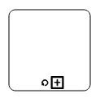
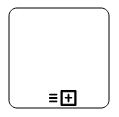
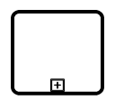

# BPMN Activity in Blazor Diagram Component

The [`Activity`](https://help.syncfusion.com/cr/blazor/Syncfusion.Blazor.Diagrams.DiagramBpmnActivity.html) is the task that is performed in a business process. It is represented by a rounded rectangle.

There are two types of activities. They are listed as follows:

* Task: Occurs within a process and it is not broken down to a finer level of detail.
* Subprocess: Occurs within a process and it is broken down to a finer level of detail.

```csharp

@using Syncfusion.Blazor.Diagrams
@using System.Collections.ObjectModel

@* Initialize Diagram *@
<SfDiagram Height="600px" Nodes="@NodeCollection">
</SfDiagram>

@code{

    //Initialize the node collection with node
    ObservableCollection<DiagramNode> NodeCollection = new ObservableCollection<DiagramNode>()
    {
        new DiagramNode()
        {
            //Position of the node
            OffsetX = 100, OffsetY = 100,
            //Size of the node
            Width = 100, Height = 100,
            //Unique Id of the node
            Id = "node1",
            //sets the type of shape to Bpmn and shape to activity
            Shape = new DiagramShape()
            {
                Type = Shapes.Bpmn,
                BpmnShape = BpmnShapes.Activity,
                //Sets the activity type to task
                Activity = new DiagramBpmnActivity(){ Activity = BpmnActivities.Task },
            }
        }
    };
}

```

## BPMN activity task

The [`Task`](https://help.syncfusion.com/cr/blazor/Syncfusion.Blazor.Diagrams.DiagramBpmnTask.html) property of the node allows you to define the type of task such as sending, receiving, user-based task, etc. By default, the `Type` property of task is set to **None**. The following code explains how to create different types of BPMN tasks.
The events property of tasks allows you to represent these results as an event attached to the task.

```cshtml
@using Syncfusion.Blazor.Diagrams
@using System.Collections.ObjectModel

@* Initialize Diagram *@
<SfDiagram Height="600px" Nodes="@NodeCollection">
</SfDiagram>

@code{

    //Initialize the node collection with node
    ObservableCollection<DiagramNode> NodeCollection = new ObservableCollection<DiagramNode>()
    {
        new DiagramNode()
        {
            //Position of the node
            OffsetX = 100, OffsetY = 100,
            //Size of the node
            Width = 100, Height = 100,
            //Unique Id of the node
            Id = "node1",
            //Sets the type to bpmn and shape to activity
            Shape = new DiagramShape()
            {
                Type = Shapes.Bpmn,
                BpmnShape = BpmnShapes.Activity,
                //Sets activity to Task
                Activity = new DiagramBpmnActivity()
                {
                    Activity = BpmnActivities.Task,
                    //Sets the type of the task to Send
                    Task = new DiagramBpmnTask(){ Type = BpmnTasks.Send }
                }
            }
        }
    };
}
```

The various types of BPMN tasks are tabulated as follows.

| Shape | Image |
| -------- | -------- |
| Service |  |
| Send |  |
| Receive |  |
| Instantiating Receive |  |
| Manual | |
| Business Rule |  |
| User |  |
| Script |  |

## BPMN activity sub process

A [`Sub-process`](https://help.syncfusion.com/cr/blazor/Syncfusion.Blazor.Diagrams.DiagramBpmnSubProcess.html) is a group of tasks that is used to hide or reveal details of additional levels using the `Collapsed` property.

```cshtml
@using Syncfusion.Blazor.Diagrams
@using System.Collections.ObjectModel

@* Initialize Diagram *@
<SfDiagram Height="600px" Nodes="@NodeCollection">
</SfDiagram>

@code{

    //Initialize the node collection with node
    ObservableCollection<DiagramNode> NodeCollection = new ObservableCollection<DiagramNode>()
    {
        new DiagramNode()
        {
            //Position of the node
            OffsetX = 100, OffsetY = 100,
            //Size of the node
            Width = 100, Height = 100,
            //Unique id of the node
            Id = "node1",
            Shape = new DiagramShape()
            {
                //Sets type to Bpmn and shape to Activity
                Type = Shapes.Bpmn, BpmnShape=BpmnShapes.Activity,
                Activity=new DiagramBpmnActivity()
                {
                    //Sets activity to subprocess
                    Activity=BpmnActivities.SubProcess,
                    // Set collapsed of subprocess to true
                    SubProcess=new DiagramBpmnSubProcess(){ Collapsed = true }
                },
            }
        }
    };
}
```

The different types of subprocess are as follows:

    * Event subprocess
    * Transaction

### Event sub Process

A [`SubProcess`](https://help.syncfusion.com/cr/blazor/Syncfusion.Blazor.Diagrams.DiagramBpmnSubProcess.html) is defined as an event SubProcess when it is triggered by an event. An event SubProcess is placed within another subprocess that part of the normal flow of its parent process is not. You can set event to a subprocess with the `Event` and `Trigger` properties of the subprocess. The `Type` property of subprocess allows you to define the type of subprocess whether it should be event subprocess or transaction subprocess.

```cshtml
@using Syncfusion.Blazor.Diagrams
@using System.Collections.ObjectModel

@* Initialize Diagram *@
<SfDiagram Height="600px" Nodes="@NodeCollection">
</SfDiagram>

@code{

    //Initialize the node collection with node
    ObservableCollection<DiagramNode> NodeCollection = new ObservableCollection<DiagramNode>()
    {
        new DiagramNode()
        {
            // Position of the node
            OffsetX = 100, OffsetY = 100,
            // Size of the node
            Width = 100, Height = 100,
            // Unique id of the node
            Id = "node1",
            // Sets the type to Bpmn and shape to Activity
            Shape = new DiagramShape()
            {
                Type = Shapes.Bpmn, BpmnShape = BpmnShapes.Activity,
                //Sets activity to SubProcess
                Activity=new DiagramBpmnActivity()
                {
                    Activity = BpmnActivities.SubProcess,
                    //Sets the collapsed to true and type to Event
                    SubProcess=new DiagramBpmnSubProcess()
                    {
                        Collapsed = true, Type = BpmnSubProcessTypes.Event,
                        //Sets event to Start and trigger to Message
                        Events = new ObservableCollection<DiagramBpmnSubEvent>()
                        {
                            new DiagramBpmnSubEvent()
                            {
                                Event = BpmnEvents.Start, Trigger = BpmnTriggers.Message
                            }
                        }
                    }
                }
            }
        }
    };
}
```

### Transaction sub process

* The [`Transaction`](https://help.syncfusion.com/cr/blazor/Syncfusion.Blazor.Diagrams.DiagramBpmnSubProcess.html#Syncfusion_Blazor_Diagrams_DiagramBpmnSubProcess_Transaction) is a set of activities that logically belong together that all contained activities must complete their parts of the transaction, otherwise the process is fail.

The execution result of a transaction is one of
* Successful Completion
* Unsuccessful Completion (Cancel)
* Hazard (Exception)

The `Events` property of subprocess allows you to represent these results as an event attached to the subprocess.

* The event object allows you to define the type of event by which the subprocess will be triggered. The name of the event can be defined to identify the event at runtime.

* The event’s offset property is used to set the fraction or ratio (relative to parent) that defines the position of the event shape.

* The trigger property defines the type of the event trigger.

* You can also use define ports and labels to subprocess events by using the event’s ports and labels properties.

```cshtml
@using Syncfusion.Blazor.Diagrams
@using System.Collections.ObjectModel

@* Initialize Diagram *@
<SfDiagram Height="600px" Nodes="@NodeCollection">
</SfDiagram>

@code {

    //Initialize the node collection with node
    ObservableCollection<DiagramNode> NodeCollection = new ObservableCollection<DiagramNode>()
    {
        new DiagramNode()
        {
            // Position of the node
            OffsetX = 100, OffsetY = 100,
            // Size of the node
            Width = 100, Height = 100,
            // Unique id of the node
            Id = "node1",
            //Defines the type to BPMN and shape to activity
            Shape = new DiagramShape()
            {
                Type = Shapes.Bpmn,
                BpmnShape = BpmnShapes.Activity,
                //Sets the activity to subprocess
                Activity = new DiagramBpmnActivity()
                {
                    Activity = BpmnActivities.SubProcess,
                    //Sets collapsed to true and type to Transaction
                    SubProcess = new DiagramBpmnSubProcess()
                    {
                        Collapsed = true,
                        Type = BpmnSubProcessTypes.Transaction,
                        //Sets offset and visible for cancel and offset for failure
                        Transaction = new DiagramBpmnTransactionSubProcess()
                        {
                            Cancel = new CancelSubEvent(){ Visible = true, Offset = new BpmnSubEventOffset(){ X = 0.25, Y = 1}},
                            Failure = new FailureSubEvent(){ Offset = new BpmnSubEventOffset(){ X = 0.75, Y = 1}}
                        }
                    },
                }
            }
        }
    };
}
```

### Process

[`Processes`](https://help.syncfusion.com/cr/blazor/Syncfusion.Blazor.Diagrams.DiagramBpmnSubProcess.html#Syncfusion_Blazor_Diagrams_DiagramBpmnSubProcess_Processes) is an array collection that defines the children values for BPMN subprocess.

```cshtml
@using Syncfusion.Blazor.Diagrams
@using System.Collections.ObjectModel

@* Initialize Diagram *@
<SfDiagram Height="600px" Nodes="@NodeCollection" Connectors="@ConnectorCollection">
</SfDiagram>

@code{

    //Initialize the node collection with node
    ObservableCollection<DiagramNode> NodeCollection = new ObservableCollection<DiagramNode>()
    {
        new DiagramNode()
        {
            Id = "Start", Width = 50, Height = 50,
            Margin = new NodeMargin() { Left = 10, Top = 50 },
            Shape = new DiagramShape() { Type = Shapes.Bpmn, BpmnShape = BpmnShapes.Event,
            Event = new DiagramBpmnEvent() { Event = BpmnEvents.Start } }
        },
        new DiagramNode()
        {
            Id = "End", Width = 50, Height = 50,
            Margin = new NodeMargin() { Left = 200, Top = 50 },
            Shape = new DiagramShape() { Type = Shapes.Bpmn, BpmnShape = BpmnShapes.Event,
            Event = new DiagramBpmnEvent() { Event = BpmnEvents.End } }
        },
        new DiagramNode() {
            Id = "Node1", Width = 50, Height = 50,
            Margin = new NodeMargin() { Left = 100, Top = 200 },
            Shape = new DiagramShape() {
                Type = Shapes.Bpmn, BpmnShape = BpmnShapes.Activity,
                Activity = new DiagramBpmnActivity()
                {
                    Activity = BpmnActivities.SubProcess,
                    SubProcess = new DiagramBpmnSubProcess() { Collapsed = false }
                }
            },
            Constraints = NodeConstraints.Default | NodeConstraints.AllowDrop
        },
        new DiagramNode()
        {
            Id = "ActivityProcessNode", Width = 300, Height = 300,
            MaxHeight = 400, MaxWidth = 400, MinWidth = 200, MinHeight = 200,
            OffsetX = 200, OffsetY = 200,
            Shape = new DiagramShape() {
                Type = Shapes.Bpmn, BpmnShape = BpmnShapes.Activity,
                Activity = new DiagramBpmnActivity()
                {
                    Activity = BpmnActivities.SubProcess,
                    SubProcess = new DiagramBpmnSubProcess() {
                        Collapsed = false,
                        Type = BpmnSubProcessTypes.Event,
                        Processes = new string[] { "Start", "End", "Node1" }
                    }
                }
            },
            Constraints = NodeConstraints.Default | NodeConstraints.AllowDrop
        }
    };

    ObservableCollection<DiagramConnector> ConnectorCollection = new ObservableCollection<DiagramConnector>()
    {
        new DiagramConnector()
        {
            Id = "Connector1", SourceID = "Start", TargetID = "Node1"
        },
        new DiagramConnector()
        {
            Id = "Connector2", SourceID = "Node1", TargetID = "End"
        }
    };

}
```

### Loop

[`Loop`](https://help.syncfusion.com/cr/blazor/Syncfusion.Blazor.Diagrams.DiagramBpmnSubProcess.html#Syncfusion_Blazor_Diagrams_DiagramBpmnSubProcess_Loop) is a task that is internally being looped. The loop property of task allows you to define the type of loop. The default value for [`Loop`](https://help.syncfusion.com/cr/blazor/Syncfusion.Blazor.Diagrams.DiagramBpmnSubProcess.html#Syncfusion_Blazor_Diagrams_DiagramBpmnSubProcess_Loop) is **None**.
You can define the loop property in subprocess BPMN shape as shown in the following code.

```cshtml
@using Syncfusion.Blazor.Diagrams
@using System.Collections.ObjectModel

@* Initialize Diagram *@
<SfDiagram Height="600px" Nodes="@NodeCollection">
</SfDiagram>

@code{

    //Initialize the node collection with node
    ObservableCollection<DiagramNode> NodeCollection = new ObservableCollection<DiagramNode>()
    {
        new DiagramNode()
        {
            //Position of the node
            OffsetX = 100,
            OffsetY = 100,
            //Size of the node
            Width = 100,
            Height = 100,
            //Unique id of the node
            Id = "node1",
            //Defines the type to BPMN and shape to activity
            Shape = new DiagramShape()
            {
                Type = Shapes.Bpmn,
                BpmnShape = BpmnShapes.Activity,
                //Set the activity to subprocess
                Activity = new DiagramBpmnActivity()
                {
                    Activity = BpmnActivities.SubProcess,
                    //Sets collapsed to true and loop to standard
                    SubProcess=new DiagramBpmnSubProcess()
                    {
                        Collapsed = true,
                        Loop = BpmnLoops.Standard,
                    },
                }
            }
        }
    };
}
```

The following table contains various types of BPMN loops.

| Loops | Task | Subprocess |
| -------- | -------- | --------|
| Standard |   |  |
| SequenceMultiInstance |  |  |
| ParallelMultiInstance |  |  |

### Compensation

[`Compensation`](https://help.syncfusion.com/cr/blazor/Syncfusion.Blazor.Diagrams.DiagramBpmnSubProcess.html#Syncfusion_Blazor_Diagrams_DiagramBpmnSubProcess_Compensation) is triggered when the operation is partially failed and enabled it with the compensation property of the task and the subprocess.

```cshtml
@using Syncfusion.Blazor.Diagrams
@using System.Collections.ObjectModel

@* Initialize Diagram *@
<SfDiagram Height="600px" Nodes="@NodeCollection">
</SfDiagram>

@code{

    //Initialize the node collection with node
    ObservableCollection<DiagramNode> NodeCollection = new ObservableCollection<DiagramNode>()
    {
        new DiagramNode()
        {
            //Position of the node
            OffsetX = 100,
            OffsetY = 100,
            //Size of the node
            Width = 100,
            Height = 100,
            //Unique id of the node
            Id = "node1",
            //Defines the type to BPMN and shape to activity
            Shape = new DiagramShape()
            {
                Type = Shapes.Bpmn, BpmnShape=BpmnShapes.Activity,
                //Set the activity to task
                Activity = new DiagramBpmnActivity()
                {
                    Activity = BpmnActivities.Task,
                    //set compensation to true
                    Task=new DiagramBpmnTask()
                    {
                        Compensation=true,
                    },
                }
            }
        },

        new DiagramNode()
        {
            //Position of the node
            OffsetX = 300, OffsetY = 100,
            //Size of the node
            Width = 100, Height = 100,
            //Unique id of the node
            Id = "node2",
           //Defines the type to BPMN and shape to activity
            Shape = new DiagramShape()
            {
                Type = Shapes.Bpmn, BpmnShape=BpmnShapes.Activity,
                //Set the activity to SubProcess
                Activity = new DiagramBpmnActivity()
                {
                    Activity = BpmnActivities.SubProcess,
                    //Sets collapsed and compensation to true
                    SubProcess = new DiagramBpmnSubProcess()
                    {
                        Collapsed = true, Compensation = true,
                    },
                }
            }
        }
    };
}
```

### Call

A [`Call`](https://help.syncfusion.com/cr/blazor/Syncfusion.Blazor.Diagrams.DiagramBpmnTask.html#Syncfusion_Blazor_Diagrams_DiagramBpmnTask_Call) activity is a global subprocess that is reused at various points of the business flow and set it with the call property of the task.

```cshtml
@using Syncfusion.Blazor.Diagrams
@using System.Collections.ObjectModel

@* Initialize Diagram *@
<SfDiagram Height="600px" Nodes="@NodeCollection">
</SfDiagram>

@code{

    //Initialize the node collection with node
    ObservableCollection<DiagramNode> NodeCollection = new ObservableCollection<DiagramNode>()
    {
        new DiagramNode()
        {
            //Position of the node
            OffsetX = 100, OffsetY = 100,
            //Size of the node
            Width = 100, Height = 100,
            //Unique id of the node
            Id = "node1",
            //Defines the type to BPMN and shape to activity
            Shape = new DiagramShape()
            {
                Type = Shapes.Bpmn,
                BpmnShape = BpmnShapes.Activity,
                //sets the activity to task
                Activity=new DiagramBpmnActivity()
                {
                    Activity = BpmnActivities.Task,
                    //Sets call to true
                    Task = new DiagramBpmnTask()
                    {
                        Call = true,
                    },
                }
            }
        },
    };
}

```

### Ad-Hoc

An ad-hoc subprocess is a group of tasks that are executed in any order or skipped in order to fulfill the end condition and set it with the [`Ad-hoc`](https://help.syncfusion.com/cr/blazor/Syncfusion.Blazor.Diagrams.DiagramBpmnSubProcess.html#Syncfusion_Blazor_Diagrams_DiagramBpmnSubProcess_Adhoc) property of subprocess.

```cshtml
@using Syncfusion.Blazor.Diagrams
@using System.Collections.ObjectModel

@* Initialize Diagram *@
<SfDiagram Height="600px" Nodes="@NodeCollection">
</SfDiagram>

@code
{
    //Initialize the node collection with node
    ObservableCollection<DiagramNode> NodeCollection = new ObservableCollection<DiagramNode>()
    {
        new DiagramNode()
        {
            //Position of the node
            OffsetX = 100, OffsetY = 100,
            //Size of the node
            Width = 100, Height = 100,
            //unique id of the node
            Id = "node1",
           //Defines the type to BPMN and shape to activity
            Shape = new DiagramShape()
            {
                Type = Shapes.Bpmn, BpmnShape = BpmnShapes.Activity,
                //Sets the activity to subprocess
                Activity=new DiagramBpmnActivity()
                {
                    Activity = BpmnActivities.SubProcess,
                    //sets collapsed and ad hoc to true
                    SubProcess = new DiagramBpmnSubProcess()
                    {
                        Collapsed = true,
                        Adhoc = true
                    },
                }
            }
        },
    };
}
```

### Boundary

Boundary represents the type of task that is being processed. The [`Boundary`](https://help.syncfusion.com/cr/blazor/Syncfusion.Blazor.Diagrams.DiagramBpmnSubProcess.html#Syncfusion_Blazor_Diagrams_DiagramBpmnSubProcess_Boundary) property of subprocess allows you to define the type of boundary. By default, it is set to **Default**.

```cshtml
@using Syncfusion.Blazor.Diagrams
@using System.Collections.ObjectModel

@* Initialize Diagram *@
<SfDiagram Height="600px" Nodes="@NodeCollection">
</SfDiagram>

@code{
    //Initialize the node collection with node
    ObservableCollection<DiagramNode> NodeCollection = new ObservableCollection<DiagramNode>()
    {
        new DiagramNode()
        {
            //Position of the node
            OffsetX = 100, OffsetY = 100,
            //Size of the node
            Width = 100, Height = 100,
            //Unique Id of the node
            Id = "node1",
            //Sets type to Bpmn and shape to Activity
            Shape = new DiagramShape()
            {
                Type = Shapes.Bpmn, BpmnShape = BpmnShapes.Activity,
                //Sets activity to SubProcess
                Activity = new DiagramBpmnActivity()
                {
                    Activity = BpmnActivities.SubProcess,
                    //Sets collapsed to true and boundary to Call
                    SubProcess = new DiagramBpmnSubProcess()
                    {
                        Collapsed = true,
                        Boundary = BpmnBoundary.Call
                    },
                }
            }
        },
    };
}
```

The following table contains various types of BPMN boundaries.

| Boundary | Image |
| -------- | -------- |
| Call |  |
| Event |  |
| Default |  |