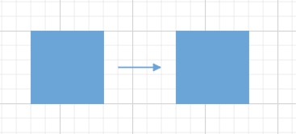
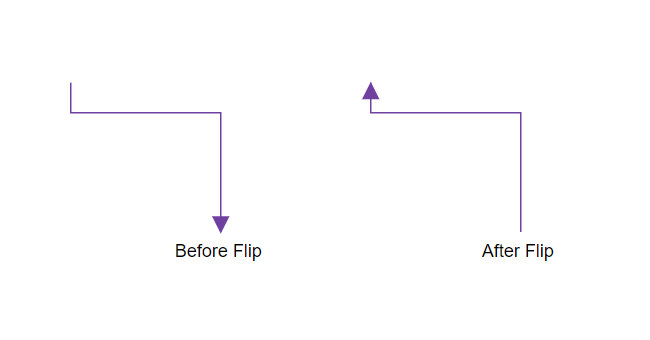
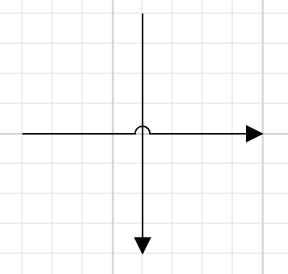
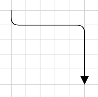
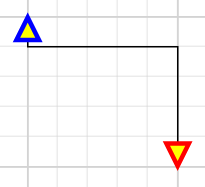

# Customization in Blazor Diagram Component

## Decorator

Diagram allows you to customize the connector appearances . The following topics shows how the customize several properties of the connectors.

* Starting and ending points of a connector can be decorated with some customizable shapes like arrows, circles, diamond, or path. The connection end points can be decorated with the [`SourceDecorator`](https://help.syncfusion.com/cr/blazor/Syncfusion.Blazor.Diagrams.DiagramConnector.html#Syncfusion_Blazor_Diagrams_DiagramConnector_SourceDecorator) and [`TargetDecorator`](https://help.syncfusion.com/cr/blazor/Syncfusion.Blazor.Diagrams.DiagramConnector.html#Syncfusion_Blazor_Diagrams_DiagramConnector_TargetDecorator) properties of the connector.

* The [`Shape`](https://help.syncfusion.com/cr/blazor/Syncfusion.Blazor.Diagrams.DiagramConnector.html#Syncfusion_Blazor_Diagrams_DiagramConnector_Shape) property of `SourceDecorator` allows to define the shape of the decorators. Similarly, the [`Shape`](https://help.syncfusion.com/cr/blazor/Syncfusion.Blazor.Diagrams.DiagramConnector.html#Syncfusion_Blazor_Diagrams_DiagramConnector_Shape) property of `TargetDecorator` allows to define the shape of the decorators.

* To create custom shape for source decorator, use [`PathData`](https://help.syncfusion.com/cr/blazor/Syncfusion.Blazor.Diagrams.DiagramPort.html#Syncfusion_Blazor_Diagrams_DiagramPort_PathData) property. Similarly, to create custom shape for target decorator, use [`PathData`](https://help.syncfusion.com/cr/blazor/Syncfusion.Blazor.Diagrams.DiagramPort.html#Syncfusion_Blazor_Diagrams_DiagramPort_PathData) property.

* The following code example illustrates how to create decorators of various shapes.

```csharp

@using Syncfusion.Blazor.Diagrams
@using System.Collections.ObjectModel

<SfDiagram Height="600px" Connectors="@ConnectorCollection">
</SfDiagram>

@code
{
    //Defines diagram's connector collection
    public ObservableCollection<DiagramConnector> ConnectorCollection = new ObservableCollection<DiagramConnector>();

    protected override void OnInitialized()
    {
        DiagramConnector diagramConnector = new DiagramConnector()
        {
            SourcePoint = new ConnectorSourcePoint() { X = 100, Y = 100 },
            TargetPoint = new ConnectorTargetPoint() { X = 200, Y = 100 },
            SourceDecorator = new ConnectorSourceDecorator()
            {
                Shape = DecoratorShapes.Circle,
                Style = new DecoratorShapeStyle() { StrokeColor = "#37909A", Fill = "#37909A" , StrokeWidth = 1 },
            },
            TargetDecorator = new ConnectorTargetDecorator()
            {
                Shape = DecoratorShapes.Custom,
                Style = new DecoratorShapeStyle() { StrokeColor = "#37909A", Fill = "#37909A" , StrokeWidth = 1 },
                PathData="M80.5,12.5 C80.5,19.127417 62.59139,24.5 40.5,24.5 C18.40861,24.5 0.5,19.127417 0.5,12.5 C0.5,5.872583 18.40861,0.5 40.5,0.5 C62.59139,0.5 80.5,5.872583 80.5,12.5 z"
            },
            Style = new ConnectorShapeStyle() { StrokeColor = "#37909A", StrokeWidth = 1 },
            Type = Segments.Orthogonal,
        };
        ConnectorCollection.Add(diagramConnector);
    }
}
```

## Padding

Padding is used to leave the space between the Connector's end point and the object to where it is connected.

* The [`SourcePadding`](https://help.syncfusion.com/cr/blazor/Syncfusion.Blazor.Diagrams.DiagramConnector.html#Syncfusion_Blazor_Diagrams_DiagramConnector_SourcePadding) property of connector defines space between the source point and the source node of the connector.

* The [`TargetPadding`](https://help.syncfusion.com/cr/blazor/Syncfusion.Blazor.Diagrams.DiagramConnector.html#Syncfusion_Blazor_Diagrams_DiagramConnector_TargetPadding) property of connector defines space between the end point and the target node of the connector.

* The following code example illustrates how to leave space between the connection end points and source, target nodes.

```csharp

@using Syncfusion.Blazor.Diagrams
@using System.Collections.ObjectModel

<SfDiagram Height="600px" Nodes="@NodeCollection" Connectors="@ConnectorCollection">
</SfDiagram>
@code
{
    //Defines diagram's nodes collection
    public ObservableCollection<DiagramNode> NodeCollection = new ObservableCollection<DiagramNode>();

    //Defines diagram's connector collection
    public ObservableCollection<DiagramConnector> ConnectorCollection = new ObservableCollection<DiagramConnector>();

    protected override void OnInitialized()
    {
        //Create a node
        DiagramNode node1 = new DiagramNode()
        {
            OffsetX = 100,
            OffsetY = 100,
            Height = 50,
            Width = 100,
            Id = "node1",
            Shape = new DiagramShape() { Type = Syncfusion.Blazor.Diagrams.Shapes.Basic, BasicShape = BasicShapes.Rectangle },
            Style = new NodeShapeStyle()
            {
                Fill = "#6BA5D7",
                StrokeColor = "#6BA5D7",
            },
        };
        //Add node into node's collection
        NodeCollection.Add(node1);

        //Create a node
        DiagramNode node2 = new DiagramNode()
        {
            OffsetX = 300,
            OffsetY = 300,
            Height = 50,
            Width = 100,
            Id = "node2",
            Shape = new DiagramShape() { Type = Syncfusion.Blazor.Diagrams.Shapes.Basic, BasicShape = BasicShapes.Rectangle },
            Style = new NodeShapeStyle()
            {
                Fill = "#6BA5D7",
                StrokeColor = "#6BA5D7",
            },
        };
        //Add node into node's collection
        NodeCollection.Add(node2);

        DiagramConnector diagramConnector = new DiagramConnector()
        {
            SourceID = "node1",
            TargetID = "node2",
            //Specifies the source and target padding values.
            SourcePadding = 20,
            TargetPadding = 20,
            TargetDecorator = new ConnectorTargetDecorator()
            {
                Shape = DecoratorShapes.Arrow,
                Style = new DecoratorShapeStyle() { Fill = "#6BA5D7", StrokeColor = "#6BA5D7", StrokeWidth = 1 }
            },
            Style = new ConnectorShapeStyle() { StrokeColor = "#6BA5D7", StrokeWidth = 1 },
            Type = Segments.Orthogonal,
        };
        ConnectorCollection.Add(diagramConnector);
    }
}
```



## Flip

The diagram provides support to flip the connector. The [`Flip`](https://help.syncfusion.com/cr/blazor/Syncfusion.Blazor.Diagrams.DiagramConnector.html#Syncfusion_Blazor_Diagrams_DiagramConnector_Flip) is performed to give the mirrored image of the original element.

* The Flip is also applicable for nodes.

> The flip is not applicable when the connectors connect in nodes

The flip types are as follows:

* `HorizontalFlip` is used to interchange the connector source and target x points.

* `VerticalFlip` is used to interchange the connector source and target y points.

* `Both` is used to interchange the source point as target point and target point as source point

```csharp

@using Syncfusion.Blazor.Diagrams
@using System.Collections.ObjectModel

<SfDiagram Height="600px" Connectors="@ConnectorCollection">  
</SfDiagram>
@code
{
    //Defines diagram's connector collection
    public ObservableCollection<DiagramConnector> ConnectorCollection = new ObservableCollection<DiagramConnector>();

    protected override void OnInitialized()
    {
        DiagramConnector diagramConnector = new DiagramConnector()
        {
            SourcePoint = new ConnectorSourcePoint() { X = 100, Y = 100 },
            TargetPoint = new ConnectorTargetPoint() { X = 200, Y = 200 },
            //Specify the flip direction
            Flip = FlipDirection.Both,
            TargetDecorator = new ConnectorTargetDecorator()
            {
                Shape = DecoratorShapes.Arrow,
                Style = new DecoratorShapeStyle() { Fill = "#6f409f", StrokeColor = "#6f409f", StrokeWidth = 1 }
            },
            Style = new ConnectorShapeStyle() { StrokeColor = "#6f409f", StrokeWidth = 1 },
            Type = Segments.Orthogonal,
        };

        ConnectorCollection.Add(diagramConnector);
    }
}
```



## Bridging

Line bridging creates a bridge for lines to smartly cross over the other lines, at points of intersection. By default, [`BridgeDirection`](https://help.syncfusion.com/cr/blazor/Syncfusion.Blazor.Diagrams.SfDiagram.html#Syncfusion_Blazor_Diagrams_SfDiagram_BridgeDirection) is set to `Top`. Depending upon the direction given bridging direction appears.
Bridging can be enabled/disabled either with the `Connector.Constraints` or `Diagram.Constraints`. The following code example illustrates how to enable line bridging.

```csharp

@using Syncfusion.Blazor.Diagrams
@using System.Collections.ObjectModel

<SfDiagram Height="600px" Connectors="@ConnectorCollection" Constraints="@diagramConstraints">
</SfDiagram>

@code
{
    //Defines diagram's connector collection
    public ObservableCollection<DiagramConnector> ConnectorCollection = new ObservableCollection<DiagramConnector>();

    //Enable the bridging constraint for diagram.
    public DiagramConstraints diagramConstraints = DiagramConstraints.Default | DiagramConstraints.Bridging;

    protected override void OnInitialized()
    {
        DiagramConnector diagramConnector1 = new DiagramConnector()
        {
            SourcePoint = new ConnectorSourcePoint() { X = 200, Y = 200 },
            TargetPoint = new ConnectorTargetPoint() { X = 400, Y = 200 },
            TargetDecorator = new ConnectorTargetDecorator()
            {
                Shape = DecoratorShapes.Arrow,
                Style = new DecoratorShapeStyle() { Fill = "#6f409f", StrokeColor = "#6f409f", StrokeWidth = 1 }
            },
            Style = new ConnectorShapeStyle() { StrokeColor = "#6f409f", StrokeWidth = 1 },
            Type = Segments.Orthogonal,
        };

        ConnectorCollection.Add(diagramConnector1);

        DiagramConnector diagramConnector2 = new DiagramConnector()
        {
            SourcePoint = new ConnectorSourcePoint() { X = 300, Y = 100 },
            TargetPoint = new ConnectorTargetPoint() { X = 300, Y = 300 },
            TargetDecorator = new ConnectorTargetDecorator()
            {
                 Shape = DecoratorShapes.Arrow,
                 Style = new DecoratorShapeStyle() { StrokeColor = "#6BA5D7", Fill = "#6BA5D7", StrokeWidth = 1 },
            },
            Style = new ConnectorShapeStyle() { StrokeColor = "#6BA5D7", StrokeWidth = 1 },
            Type = Segments.Orthogonal,
        };
        ConnectorCollection.Add(diagramConnector2);
    }
}
```

The [`BridgeSpace`](https://help.syncfusion.com/cr/blazor/Syncfusion.Blazor.Diagrams.DiagramConnector.html#Syncfusion_Blazor_Diagrams_DiagramConnector_BridgeSpace) property of connectors can be used to define the width for line bridging.

Limitation: `Bezier` segments do not support bridging.



## Corner radius

Corner radius allows to create connectors with rounded corners. The radius of the rounded corner is set with the [`CornerRadius`](https://help.syncfusion.com/cr/blazor/Syncfusion.Blazor.Diagrams.DiagramConnector.html#Syncfusion_Blazor_Diagrams_DiagramConnector_CornerRadius) property.

```csharp

@using Syncfusion.Blazor.Diagrams
@using System.Collections.ObjectModel

<SfDiagram  Height="600px" Connectors="@ConnectorCollection" >
</SfDiagram>

@code
{
    //Defines diagram's connector collection
    public ObservableCollection<DiagramConnector> ConnectorCollection = new ObservableCollection<DiagramConnector>();

    protected override void OnInitialized()
    {
        DiagramConnector diagramConnector = new DiagramConnector()
        {
            SourcePoint = new ConnectorSourcePoint() { X = 100, Y = 100 },
            TargetPoint = new ConnectorTargetPoint() { X = 200, Y = 200 },
            //specify the corner radius value.
            CornerRadius = 10,
            TargetDecorator = new ConnectorTargetDecorator()
            {
                Shape = DecoratorShapes.Arrow,
                Style = new DecoratorShapeStyle() { Fill = "#6f409f", StrokeColor = "#6f409f", StrokeWidth = 1 }
            },
            Style = new ConnectorShapeStyle() { StrokeColor = "#6f409f", StrokeWidth = 1 },
            Type = Segments.Orthogonal,
        };
        ConnectorCollection.Add(diagramConnector);
    }
}
```



## Appearance

* The connector’s [`StrokeWidth`](https://help.syncfusion.com/cr/blazor/Syncfusion.Blazor.Diagrams.ConnectorShapeStyle.html#Syncfusion_Blazor_Diagrams_ConnectorShapeStyle_StrokeWidth), [`StrokeColor`](https://help.syncfusion.com/cr/blazor/Syncfusion.Blazor.Diagrams.ConnectorShapeStyle.html#Syncfusion_Blazor_Diagrams_ConnectorShapeStyle_StrokeColor), [`StrokeDashArray`](https://help.syncfusion.com/cr/blazor/Syncfusion.Blazor.Diagrams.ConnectorShapeStyle.html#Syncfusion_Blazor_Diagrams_ConnectorShapeStyle_StrokeDashArray), and [`Opacity`](https://help.syncfusion.com/cr/blazor/Syncfusion.Blazor.Diagrams.ConnectorShapeStyle.html#Syncfusion_Blazor_Diagrams_ConnectorShapeStyle_Opacity) properties are used to customize the appearance of the connector segments.

* The [`Visible`](https://help.syncfusion.com/cr/blazor/Syncfusion.Blazor.Diagrams.DiagramConnector.html#Syncfusion_Blazor_Diagrams_DiagramConnector_Visible) property of the connector enables or disables the visibility of connector.

* Default values for all the `Connectors` can be set using the [`ConnectorDefaults`](https://help.syncfusion.com/cr/blazor/Syncfusion.Blazor.Diagrams.SfDiagram.html#Syncfusion_Blazor_Diagrams_SfDiagram_ConnectorDefaults) properties. For example, if all connectors have the same type or having the same property then such properties can be moved into `ConnectorDefaults`.

### Segment appearance

The following code example illustrates how to customize the segment appearance.

```csharp

@using Syncfusion.Blazor.Diagrams
@using System.Collections.ObjectModel

<SfDiagram Height="600px" Connectors="@ConnectorCollection" >  
</SfDiagram>

@code
{
    //Defines diagram's connector collection
    public ObservableCollection<DiagramConnector> ConnectorCollection = new ObservableCollection<DiagramConnector>();

    protected override void OnInitialized()
    {
        DiagramConnector diagramConnector = new DiagramConnector()
        {
            SourcePoint = new ConnectorSourcePoint() { X = 100, Y = 100 },
            TargetPoint = new ConnectorTargetPoint() { X = 200, Y = 200 },
            TargetDecorator = new ConnectorTargetDecorator()
            {
                Shape = DecoratorShapes.Arrow,
                Style = new DecoratorShapeStyle() { Fill = "#6f409f", StrokeColor = "#6f409f", StrokeWidth = 1 }
            },
            //To customize appearance of the connector segments
            Style = new ConnectorShapeStyle() { StrokeColor = "red", StrokeWidth = 2, StrokeDashArray = "2,2" },
            Type = Segments.Orthogonal,
        };

        ConnectorCollection.Add(diagramConnector);
    }
}
```

### Decorator appearance

* The source decorator’s [`StrokeColor`](https://help.syncfusion.com/cr/blazor/Syncfusion.Blazor.Diagrams.DecoratorShapeStyle.html#Syncfusion_Blazor_Diagrams_DecoratorShapeStyle_StrokeColor), [`StrokeWidth`](https://help.syncfusion.com/cr/blazor/Syncfusion.Blazor.Diagrams.DecoratorShapeStyle.html#Syncfusion_Blazor_Diagrams_DecoratorShapeStyle_StrokeWidth), and [`StrokeDashArray`](https://help.syncfusion.com/cr/blazor/Syncfusion.Blazor.Diagrams.DecoratorShapeStyle.html#Syncfusion_Blazor_Diagrams_DecoratorShapeStyle_StrokeDashArray) properties are used to customize the color, width, and appearance of the decorator.

* To set the border stroke color, stroke width, and stroke dash array for the target decorator, use `StrokeColor`, `StrokeWidth`, and `StrokeDashArray`.

* To set the size for source and target decorator, use width and height property.

The following code example illustrates how to customize the appearance of the decorator.

```csharp

@using Syncfusion.Blazor.Diagrams
@using System.Collections.ObjectModel

<SfDiagram Height="600px" Connectors="@ConnectorCollection" >
</SfDiagram>

@code
{
    //Defines diagram's connector collection
    public ObservableCollection<DiagramConnector> ConnectorCollection = new ObservableCollection<DiagramConnector>();

    protected override void OnInitialized()
    {
        DiagramConnector diagramConnector = new DiagramConnector()
        {
            SourcePoint = new ConnectorSourcePoint() { X = 100, Y = 100 },
            TargetPoint = new ConnectorTargetPoint() { X = 200, Y = 200 },
            SourceDecorator = new ConnectorSourceDecorator()
            {
                Shape = DecoratorShapes.Arrow,
                Height = 15,
                Width = 15,
                Style = new DecoratorShapeStyle() { StrokeColor = "blue", Fill = "yellow", StrokeWidth = 3 },
            },
            TargetDecorator = new ConnectorTargetDecorator()
            {
                Shape = DecoratorShapes.Arrow,
                Height = 15,
                Width = 15,
                Style = new DecoratorShapeStyle() { StrokeColor = "red", Fill = "yellow", StrokeWidth = 3 },
            },
            Style = new ConnectorShapeStyle() { StrokeColor = "black", StrokeWidth = 1 },
            Type = Segments.Orthogonal,
        };

        ConnectorCollection.Add(diagramConnector);
    }
}
```



## Constraints

* The [`Constraints`](https://help.syncfusion.com/cr/blazor/Syncfusion.Blazor.Diagrams.DiagramConnector.html#Syncfusion_Blazor_Diagrams_DiagramConnector_Constraints) property of connector allows to enable/disable certain features of connectors.

* To enable or disable the constraints, refer [`Constraints`](https://help.syncfusion.com/cr/blazor/Syncfusion.Blazor.Diagrams.DiagramConnector.html#Syncfusion_Blazor_Diagrams_DiagramConnector_Constraints).

The following code illustrates how to disable selection.

```csharp

@using Syncfusion.Blazor.Diagrams
@using System.Collections.ObjectModel

<SfDiagram Height="600px" Connectors="@ConnectorCollection" >
</SfDiagram>

@code
{
    //Defines diagram's connector collection
    public ObservableCollection<DiagramConnector> ConnectorCollection = new ObservableCollection<DiagramConnector>();

    protected override void OnInitialized()
    {
        DiagramConnector diagramConnector = new DiagramConnector()
        {
            SourcePoint = new ConnectorSourcePoint() { X = 100, Y = 100 },
            TargetPoint = new ConnectorTargetPoint() { X = 200, Y = 200 },
            TargetDecorator = new ConnectorTargetDecorator()
            {
                Shape = DecoratorShapes.Arrow,
                Style = new DecoratorShapeStyle() { Fill = "black", StrokeColor = "black", StrokeWidth = 1 }
            },
            Style = new ConnectorShapeStyle() { StrokeColor = "black", StrokeWidth = 1 },
            Type = Segments.Orthogonal,
            //Disable the select constraint
            Constraints = ConnectorConstraints.Default & ~ConnectorConstraints.Select,
        };

        ConnectorCollection.Add(diagramConnector);
    }
}
```

## Custom properties

* The [`AddInfo`](https://help.syncfusion.com/cr/blazor/Syncfusion.Blazor.Diagrams.DiagramConnector.html#Syncfusion_Blazor_Diagrams_DiagramConnector_AddInfo) property of connectors allow you to maintain additional information to the connectors.

```csharp

@using Syncfusion.Blazor.Diagrams
@using System.Collections.ObjectModel

<SfDiagram Height="600px" Connectors="@ConnectorCollection" >
</SfDiagram>

@code
{
    //Defines diagram's connector collection
    public ObservableCollection<DiagramConnector> ConnectorCollection = new ObservableCollection<DiagramConnector>();

    protected override void OnInitialized()
    {
        DiagramConnector diagramConnector = new DiagramConnector()
        {
            SourcePoint = new ConnectorSourcePoint() { X = 100, Y = 100 },
            TargetPoint = new ConnectorTargetPoint() { X = 200, Y = 200 },
            TargetDecorator = new ConnectorTargetDecorator()
            {
                Shape = DecoratorShapes.Arrow,
                Style = new DecoratorShapeStyle() { Fill = "black", StrokeColor = "black", StrokeWidth = 1 }
            },
            Style = new ConnectorShapeStyle() { StrokeColor = "black", StrokeWidth = 1 },
            Type = Segments.Orthogonal,
            //Define the add info value.
            AddInfo = "Central Connector",
        };
        ConnectorCollection.Add(diagramConnector);
    }
}
```

## Stack order

The connectors [`ZIndex`](https://help.syncfusion.com/cr/blazor/Syncfusion.Blazor.Diagrams.DiagramConnector.html#Syncfusion_Blazor_Diagrams_DiagramConnector_ZIndex) property specifies the stack order of the connector. A connector with greater stack order is always in front of a connector with a lower stack order.

The following code illustrates how to render connector based on the stack order.

```csharp

@using Syncfusion.Blazor.Diagrams
@using System.Collections.ObjectModel

<SfDiagram Height="600px" Connectors="@ConnectorCollection">
</SfDiagram>

@code
{
    //Defines diagram's connector collection
    public ObservableCollection<DiagramConnector> ConnectorCollection = new ObservableCollection<DiagramConnector>();

    protected override void OnInitialized()
    {
        DiagramConnector diagramConnector1 = new DiagramConnector()
        {
            SourcePoint = new ConnectorSourcePoint() { X = 100, Y = 100 },
            TargetPoint = new ConnectorTargetPoint() { X = 200, Y = 100 },
            //Specify the z-index value
            ZIndex = 2,
            TargetDecorator = new ConnectorTargetDecorator()
            {
                Shape = DecoratorShapes.Arrow,
                Style = new DecoratorShapeStyle() { StrokeColor = "black", Fill = "black" , StrokeWidth = 1 },
            },
            Style = new ConnectorShapeStyle() { StrokeColor = "black", StrokeWidth = 1 },
            Type = Segments.Orthogonal,
        };

        ConnectorCollection.Add(diagramConnector1);

        DiagramConnector diagramConnector2 = new DiagramConnector()
        {
            SourcePoint = new ConnectorSourcePoint() { X = 100, Y = 200 },
            TargetPoint = new ConnectorTargetPoint() { X = 200, Y = 200 },
            //Specify the z-index value
            ZIndex = 1,
            TargetDecorator = new ConnectorTargetDecorator()
            {
                Shape = DecoratorShapes.Arrow,
                Style = new DecoratorShapeStyle() { StrokeColor = "black", Fill = "black" , StrokeWidth = 1 },
            },
            Style = new ConnectorShapeStyle() { StrokeColor = "black", StrokeWidth = 1 },
            Type = Segments.Orthogonal,
        };
        ConnectorCollection.Add(diagramConnector2);
    }
}
```

## See also

* [`How to interact the connector`](./interactions)

* [`How to change the segments`](./segments)

* [`How to get the connector events`](./events)