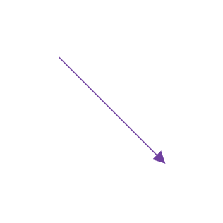
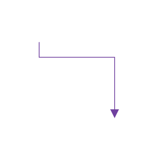
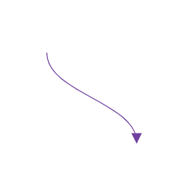

# Segments in Blazor Diagram Component

The path of the connector is defined with a collection of segments. There are three types of segments.

## Straight

To create a straight line, specify the [Type](https://help.syncfusion.com/cr/blazor/Syncfusion.Blazor.Diagrams.DiagramConnector.html#Syncfusion_Blazor_Diagrams_DiagramConnector_Type) of the segment as **straight** and add a straight segment to [Segments](https://help.syncfusion.com/cr/blazor/Syncfusion.Blazor.Diagrams.DiagramConnector.html#Syncfusion_Blazor_Diagrams_DiagramConnector_Segments) collection and need to specify [Type](https://help.syncfusion.com/cr/blazor/Syncfusion.Blazor.Diagrams.DiagramConnector.html#Syncfusion_Blazor_Diagrams_DiagramConnector_Type) for the connector. The following code example illustrates how to create a default straight segment.

> A new blazor diagram component which provides better performance than this diagram control in Blazor WebAssembly App. It is available in preview mode. Refer the [Link](https://blazor.syncfusion.com/documentation/diagram/getting-started)


```cshtml
@using Syncfusion.Blazor.Diagrams
@using System.Collections.ObjectModel

<SfDiagram Height="600px" Connectors="@ConnectorCollection">
</SfDiagram>

@code
{
    //Defines diagram's connector collection
    public ObservableCollection<DiagramConnector> ConnectorCollection = new ObservableCollection<DiagramConnector>();
    //Defines the diagram constraints.
    public DiagramConstraints diagramConstraints = DiagramConstraints.Default;

    protected override void OnInitialized()
    {
        DiagramConnector diagramConnector = new DiagramConnector()
        {
            SourcePoint = new ConnectorSourcePoint() { X = 100, Y = 100 },
            TargetPoint = new ConnectorTargetPoint() { X = 200, Y = 200 },
            TargetDecorator = new ConnectorTargetDecorator()
            {
                Shape = DecoratorShapes.Arrow,
                Style = new DecoratorShapeStyle()
                {
                    Fill = "#6f409f",
                    StrokeColor = "#6f409f",
                    StrokeWidth = 1
                }
            },
            Style = new ConnectorShapeStyle()
            {
                StrokeColor = "#6f409f",
                StrokeWidth = 1
            },

            //Specify the segment type as straight.
            Type = Segments.Straight,
        };
        ConnectorCollection.Add(diagramConnector);
    }
}
```



## Orthogonal

Orthogonal segments are used to create segments that are perpendicular to each other. Set the segment [Type](https://help.syncfusion.com/cr/blazor/Syncfusion.Blazor.Diagrams.DiagramConnector.html#Syncfusion_Blazor_Diagrams_DiagramConnector_Type) as orthogonal to create a default orthogonal segment and need to specify `Type`. The following code example illustrates how to create a default orthogonal segment.

Multiple segments can be defined one after another. To create a connector with multiple segments, define and add the segments to [connector.Segments](https://help.syncfusion.com/cr/blazor/Syncfusion.Blazor.Diagrams.DiagramConnector.html#Syncfusion_Blazor_Diagrams_DiagramConnector_Segments) collection. The following code example illustrates how to create a connector with multiple segments.

```cshtml

@using Syncfusion.Blazor.Diagrams
@using System.Collections.ObjectModel

<SfDiagram Height="600px" Connectors="@ConnectorCollection">
</SfDiagram>

@code
{
    //Defines diagram's connector collection
    public ObservableCollection<DiagramConnector> ConnectorCollection = new ObservableCollection<DiagramConnector>();
    public DiagramConstraints diagramConstraints = DiagramConstraints.Default;

    protected override void OnInitialized()
    {
        DiagramConnector diagramConnector = new DiagramConnector()
        {
            SourcePoint = new ConnectorSourcePoint() { X = 100, Y = 100 },
            TargetPoint = new ConnectorTargetPoint() { X = 200, Y = 200 },
            TargetDecorator = new ConnectorTargetDecorator()
            {
                Shape = DecoratorShapes.Arrow,
                Style = new DecoratorShapeStyle()
                {
                    Fill = "#6f409f",
                    StrokeColor = "#6f409f",
                    StrokeWidth = 1
                }
            },
            Style = new ConnectorShapeStyle()
            {
                StrokeColor = "#6f409f",
                StrokeWidth = 1
            },

            //Specify the segments type as Orthogonal.
            Type = Segments.Orthogonal,
        };
        ConnectorCollection.Add(diagramConnector);
    }
}
```

The [Length](https://help.syncfusion.com/cr/blazor/Syncfusion.Blazor.Diagrams.OrthogonalSegmentModel.html#Syncfusion_Blazor_Diagrams_OrthogonalSegmentModel_Length) and [Direction](https://help.syncfusion.com/cr/blazor/Syncfusion.Blazor.Diagrams.OrthogonalSegmentModel.html#Syncfusion_Blazor_Diagrams_OrthogonalSegmentModel_Direction) properties allow to define the flow and length of segment. The following code example illustrates how to create customized orthogonal segments.

```cshtml
@using Syncfusion.Blazor.Diagrams
@using System.Collections.ObjectModel

<SfDiagram Height="600px" Connectors="@ConnectorCollection">
</SfDiagram>

@code
{
    //Defines diagram's connector collection
    public ObservableCollection<DiagramConnector> ConnectorCollection = new ObservableCollection<DiagramConnector>();

    public DiagramConstraints diagramConstraints = DiagramConstraints.Default;

    protected override void OnInitialized()
    {
        DiagramConnector diagramConnector = new DiagramConnector()
        {
            SourcePoint = new ConnectorSourcePoint() { X = 100, Y = 100 },
            TargetPoint = new ConnectorTargetPoint() { X = 200, Y = 200 },
            TargetDecorator = new ConnectorTargetDecorator()
            {
                Shape = DecoratorShapes.Arrow,
                Style = new DecoratorShapeStyle()
                {
                    Fill = "#6f409f",
                    StrokeColor = "#6f409f",
                    StrokeWidth = 1
                }
            },
            Style = new ConnectorShapeStyle()
            {
                StrokeColor = "#6f409f",
                StrokeWidth = 1
            },
            //Specify the connector type as orthogonal.
            Type = Segments.Orthogonal,
            //Initialize the segments collection
            Segments = new ObservableCollection<DiagramConnectorSegment>()
            {
                //Create a new segment with length and direction
                new DiagramConnectorSegment()
                {
                    Length = 100,
                    Type = Segments.Orthogonal,
                    Direction = Direction.Right,
                },
                //Create another new segment with length and direction
                new DiagramConnectorSegment()
                {
                    Length = 100,
                    Type = Segments.Orthogonal,
                    Direction = Direction.Bottom,
                }
            },
        };
        ConnectorCollection.Add(diagramConnector);
    }
}
```



> You need to mention the segment type as same as what you mentioned in connector type. There should be no contradiction between connector type and segment type.

## Avoid overlapping

Orthogonal segments are automatically re-routed, in order to avoid overlapping with the source and target nodes. The following preview illustrates how orthogonal segments are re-routed.

```cshtml
@using Syncfusion.Blazor.Diagrams
@using System.Collections.ObjectModel

<SfDiagram Height="600px" Nodes="@NodeCollection" Connectors="@ConnectorCollection">
</SfDiagram>
@code
{
    public ObservableCollection<DiagramNode> NodeCollection = new ObservableCollection<DiagramNode>();

    public ObservableCollection<DiagramConnector> ConnectorCollection = new ObservableCollection<DiagramConnector>();

    public DiagramConstraints diagramConstraints = DiagramConstraints.Default;

    protected override void OnInitialized()
    {
        //Create source node
        DiagramNode node1 = new DiagramNode()
        {
            OffsetX = 100,
            OffsetY = 100,
            Height = 50,
            Width = 100,
            Id = "node1",
            Shape = new DiagramShape()
            {
                Type = Syncfusion.Blazor.Diagrams.Shapes.Basic,
                BasicShape = BasicShapes.Ellipse
            },
            Style = new NodeShapeStyle()
            {
                Fill = "#37909A",
                StrokeColor = "#37909A",
            },
            Ports = new ObservableCollection<DiagramPort>()
            {
                new DiagramPort()
                {
                    Id = "port1",
                    Offset = new Syncfusion.Blazor.Diagrams.NodePortOffset() { X = 1, Y = 0.5 },
                    Height = 10,
                    Width = 10,
                    Visibility = PortVisibility.Visible,
                    Style = new PortShapeStyle()
                    {
                        Fill = "yellow",
                        StrokeColor = "yellow"
                    }
                },
            },
        };
        //Add node into node's collection
        NodeCollection.Add(node1);

        //Create target node
        DiagramNode node2 = new DiagramNode()
        {
            OffsetX = 300,
            OffsetY = 300,
            Height = 50,
            Width = 100,
            Id = "node2",
            Shape = new DiagramShape()
            {
                Type = Syncfusion.Blazor.Diagrams.Shapes.Basic,
                BasicShape = BasicShapes.Ellipse
            },
            Style = new NodeShapeStyle()
            {
                Fill = "#37909A",
                StrokeColor = "#37909A",
            },
            Ports = new ObservableCollection<DiagramPort>()
            {
                new DiagramPort()
                {
                    Id = "port2",
                    Offset = new Syncfusion.Blazor.Diagrams.NodePortOffset() { X = 0, Y = 0.5 },
                    Height = 10,
                    Width = 10,
                    Visibility = PortVisibility.Visible,
                    Style = new PortShapeStyle()
                    {
                        Fill = "yellow",
                        StrokeColor = "yellow"
                    }
                },
            },
        };
        //Add node into node's collection
        NodeCollection.Add(node2);
        //Create a connector.
        DiagramConnector diagramConnector = new DiagramConnector()
        {
            SourceID = "node1",
            TargetID = "node2",
            SourcePortID = "port1",
            TargetPortID = "port2",
            TargetDecorator = new ConnectorTargetDecorator()
            {
                Shape = DecoratorShapes.Arrow,
                Style = new DecoratorShapeStyle()
                {
                    Fill = "#37909A",
                    StrokeColor = "#37909A",
                    StrokeWidth = 1
                }
            },
            Style = new ConnectorShapeStyle()
            {
                StrokeColor = "#37909A",
                StrokeWidth = 1
            },
            Type = Segments.Orthogonal,
        };
        ConnectorCollection.Add(diagramConnector);
    }
}
```

## Bezier

Bezier segments are used to create curve segments and the curves are configurable either with the control points or with vectors.

To create a bezier segment, the [Type](https://help.syncfusion.com/cr/blazor/Syncfusion.Blazor.Charts.ChartSeries.html#Syncfusion_Blazor_Charts_ChartSeries_DashArray) of the segment is set as bezier and need to specify type for the connector. The following code example illustrates how to create a default bezier segment.

```cshtml

@using Syncfusion.Blazor.Diagrams
@using System.Collections.ObjectModel

<SfDiagram Height="600px" Connectors="@ConnectorCollection">
</SfDiagram>

@code
{
    //Defines diagram's connector collection
    public ObservableCollection<DiagramConnector> ConnectorCollection = new ObservableCollection<DiagramConnector>();

    protected override void OnInitialized()
    {
        DiagramConnector diagramConnector = new DiagramConnector()
        {
            SourcePoint = new ConnectorSourcePoint() { X = 100, Y = 100 },
            TargetPoint = new ConnectorTargetPoint() { X = 200, Y = 200 },
            TargetDecorator = new ConnectorTargetDecorator()
            {
                Shape = DecoratorShapes.Arrow,
                Style = new DecoratorShapeStyle()
                {
                    Fill = "#6f409f",
                    StrokeColor = "#6f409f",
                    StrokeWidth = 1
                }
            },
            Style = new ConnectorShapeStyle()
            {
                StrokeColor = "#6f409f",
                StrokeWidth = 1
            },
            Type = Segments.Bezier,
        };
        //Add the connector into connectors's collection.
        ConnectorCollection.Add(diagramConnector);
    }
}

```



## See also

* [How to customize the connector properties](./customization)

* [How to interact the connector](./interactions)

* [How to get the connector events](./events)
