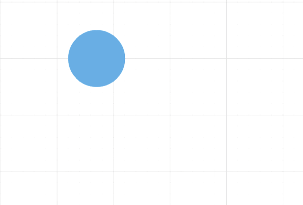
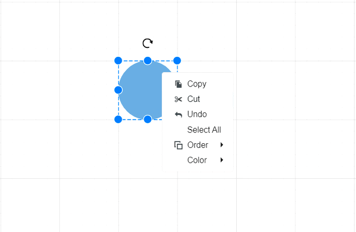
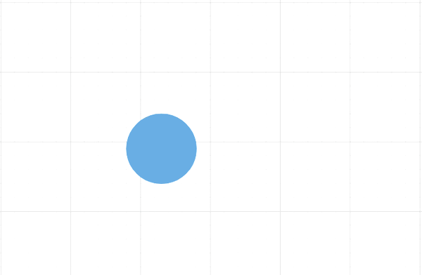
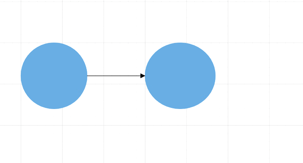

# Context Menu

<!-- markdownlint-disable MD010 -->

In graphical user interface (GUI), a context menu is a type of menu that appears when you perform right-click operation. You can create a nested level of context menu items.
Diagram provides some in-built context menu items and allows to define custom menu items through the [`ContextMenuSettings`](https://help.syncfusion.com/cr/aspnetcore-blazor/Syncfusion.Blazor.Diagrams.DiagramContextMenuSettings.html) property.

## Default context menu

The [`Show`](https://help.syncfusion.com/cr/blazor/Syncfusion.Blazor.Diagrams.DiagramContextMenuSettings.html#Syncfusion_Blazor_Diagrams_DiagramContextMenuSettings_Show) property helps you to enable or disable the context menu. Diagram provides some default context menu items such as copy, cut, select all, order,cut undo, redo, and group options. The following code shows how to enable the default context menu items.

```csharp
<SfDiagram id="diagram" Height="600px">
    // Define context menu
    <DiagramContextMenuSettings Show="true">
    </DiagramContextMenuSettings>
</SfDiagram>
```



The following code shows how to disable the default context menu items.

```csharp
<SfDiagram id="diagram" Height="600px">
// Define context menu
    <DiagramContextMenuSettings Show="false">
    </DiagramContextMenuSettings>
</SfDiagram>
```

## Custom context menu

Custom context menu provides an option to add the new custom items to the context menu.

* Apart from the default context menu items, define some additional context menu items. Those additional items have to be defined and added to the [`Items`](https://help.syncfusion.com/cr/blazor/Syncfusion.Blazor.Diagrams.DiagramContextMenuSettings.html#Syncfusion_Blazor_Diagrams_DiagramContextMenuSettings_Items) property of the context menu.

* You can set the text and ID for the context menu item using the context menu `Text` and `Id` properties respectively.

* You can set an image for the context menu item using the context menu url property.

* The `IconCss` property defines the class or multiple classes separated by a space for the menu item that is used to include an icon. Menu item can include the font icon and sprite image.

* The `Target` property used to set the target to show the menu item.

* The `Separator` property defines the horizontal lines that are used to separate the menu items. You cannot select the separators. You can enable separators to group the menu items using the separator property.

### Custom context menu along with default context menu

The following code example shows how to add custom context menu items along with the default context menu. set  the [`ShowCustomMenuOnly`](https://help.syncfusion.com/cr/blazor/Syncfusion.Blazor.Diagrams.DiagramContextMenuSettings.html#Syncfusion_Blazor_Diagrams_DiagramContextMenuSettings_ShowCustomMenuOnly) property to false to render both custom context menu and default context menu.

```csharp
@using Syncfusion.Blazor.Diagrams
@using System.Collections.ObjectModel
<SfDiagram Height="600px"
           Nodes="@NodeCollection"
           Connectors="@ConnectorCollection"
           Constraints="@diagramConstraints">
    // Defines context menu and set the ShowCustomMenuOnly to false to render the custom context menu along with the default context menu
    <DiagramContextMenuSettings Show="true" Items="@contextMenuItemModels" ShowCustomMenuOnly="false">
    </DiagramContextMenuSettings>
</SfDiagram>

@code
{

    //Defines diagram's nodes collection
    public ObservableCollection<DiagramNode> NodeCollection = new ObservableCollection<DiagramNode>();

    //Defines diagram's connector collection
    public ObservableCollection<DiagramConnector> ConnectorCollection = new ObservableCollection<DiagramConnector>();

    public DiagramConstraints diagramConstraints = DiagramConstraints.Default;

    protected override void OnInitialized()
    {
        //Create a node
        DiagramNode node1 = new DiagramNode()
        {
            OffsetX = 100,
            OffsetY = 100,
            Height = 100,
            Width = 100,
            Id = "node1",
            Shape = new DiagramShape() { Type = Syncfusion.Blazor.Diagrams.Shapes.Basic, BasicShape = BasicShapes.Ellipse },
            Style = new NodeShapeStyle()
            {
                Fill = "#6BA5D7",
                StrokeColor = "#6BA5D7",
            },
        };
        //Add node into node's collection
        NodeCollection.Add(node1);

        //Create a node
        DiagramNode node2 = new DiagramNode()
        {
            OffsetX = 300,
            OffsetY = 100,
            Height = 100,
            Width = 100,
            Id = "node2",
            Shape = new DiagramShape() { Type = Syncfusion.Blazor.Diagrams.Shapes.Basic, BasicShape = BasicShapes.Ellipse },
            Style = new NodeShapeStyle()
            {
                Fill = "#6BA5D7",
                StrokeColor = "#6BA5D7",
            },
        };
        //Add node into node's collection
        NodeCollection.Add(node2);

        DiagramConnector diagramConnector1 = new DiagramConnector()
        {
            SourceID = "node1",
            TargetID = "node2",
            TargetDecorator = new ConnectorTargetDecorator()
            {
                Shape = DecoratorShapes.Arrow,
                Style = new DecoratorShapeStyle() { StrokeColor = "black", Fill = "black", StrokeWidth = 1 },
            },
            Style = new ConnectorShapeStyle() { StrokeColor = "black", StrokeWidth = 1 },
            Type = Segments.Orthogonal,
        };

        ConnectorCollection.Add(diagramConnector1);
    }

    // Add the custom context menu items
    List<ContextMenuItemModel> contextMenuItemModels = new List<ContextMenuItemModel>()
{
        new ContextMenuItemModel()
        {
            Text ="color",
            Id="Save",
            Target =".e-elementcontent",
            // Add the nested custom context menu items
            Items = new List<ContextMenuItemModel>()
    {
                new ContextMenuItemModel(){  Text ="Red", Id="Red", },
                new ContextMenuItemModel(){  Text ="Yellow", Id="Yellow", },
                new ContextMenuItemModel(){  Text ="Green", Id="Green", }
            }
        },

    };
}
```



### Custom context menu alone

To display the custom context menu items alone, set  the [`ShowCustomMenuOnly`](https://help.syncfusion.com/cr/blazor/Syncfusion.Blazor.Diagrams.DiagramContextMenuSettings.html#Syncfusion_Blazor_Diagrams_DiagramContextMenuSettings_ShowCustomMenuOnly) property to true.
The following code example shows how to add custom context menu items alone.

```csharp
@using Syncfusion.Blazor.Diagrams
    <SfDiagram Height="600px">
        // Defines context menu and set the ShowCustomMenuOnly to true to render the custom context menu alone
        <DiagramContextMenuSettings Show="true" ShowCustomMenuOnly="true">
        </DiagramContextMenuSettings>
    </SfDiagram>
```



## Events

The Diagram control provides event support for context menu that triggers when rendering the context menu and triggers when clicking the items of the context menu.

### OnContextMenuOpen

The Diagram control triggers the event [`OnContextMenuOpen`](https://help.syncfusion.com/cr/blazor/Syncfusion.Blazor.Diagrams.DiagramEvents.html#Syncfusion_Blazor_Diagrams_DiagramEvents_OnContextMenuOpen) when performing right click on the diagram or the diagram object.

```csharp
@using Syncfusion.Blazor.Diagrams
<SfDiagram Height="600px">
    // Defines OnContextMenuOpen event
    <DiagramEvents OnContextMenuOpen="@OnContextMenuOpen"></DiagramEvents>
    // Defines context menu
    <DiagramContextMenuSettings Show="true" ShowCustomMenuOnly="false">
    </DiagramContextMenuSettings>
</SfDiagram>
@code
{
    public void OnContextMenuOpen(DiagramBeforeMenuOpenEventArgs arg)
    {
        //Action to be performed
    }
}
```

### ContextMenuItemClicked

The Diagram control triggers the event [`ContextMenuItemClicked`](https://help.syncfusion.com/cr/blazor/Syncfusion.Blazor.Diagrams.DiagramEvents.html#Syncfusion_Blazor_Diagrams_DiagramEvents_ContextMenuItemClicked) when clicking the context menu item.

```csharp
@using Syncfusion.Blazor.Diagrams

<SfDiagram Height="600px">
    // Defines the ContextMenuItemClicked event
    <DiagramEvents ContextMenuItemClicked="@ContextMenuItemClicked"></DiagramEvents>
    // Defines the context menu
    <DiagramContextMenuSettings Show="true" ShowCustomMenuOnly="false">
    </DiagramContextMenuSettings>
</SfDiagram>
@code
{
    public void ContextMenuItemClicked(DiagramMenuEventArgs arg)
    {
        //Action to be performed
    }
}
```

The following code example shows how to add separate custom context menu items for node and connector. In the following code, the node color context menu item only render for node and the connector color context menu item only render for connector.

```csharp
<SfDiagram @ref="@diagram" Height="600px"
            Nodes="@NodeCollection"
            Connectors="@ConnectorCollection"
            Constraints="@diagramConstraints">
    // Defines the ContextMenuItemClicked event
    <DiagramEvents OnContextMenuOpen="@OnContextMenuOpen"  ></DiagramEvents>
    // Defines the context menu
    <DiagramContextMenuSettings Show="true" Items="@contextMenuItemModels" ShowCustomMenuOnly="true">
    </DiagramContextMenuSettings>
</SfDiagram>

@code
{
    //Reference to diagram
    SfDiagram diagram;

    //Defines diagram's nodes collection
    public ObservableCollection<DiagramNode> NodeCollection = new ObservableCollection<DiagramNode>();

    //Defines diagram's connector collection
    public ObservableCollection<DiagramConnector> ConnectorCollection = new ObservableCollection<DiagramConnector>();

    public DiagramConstraints diagramConstraints = DiagramConstraints.Default;

    protected override void OnInitialized()
    {
        //Create a node
        DiagramNode node1 = new DiagramNode()
        {
            OffsetX = 100,
            OffsetY = 100,
            Height = 100,
            Width = 100,
            Id = "node1",
            Shape = new DiagramShape() { Type = Syncfusion.Blazor.Diagrams.Shapes.Basic, BasicShape = BasicShapes.Ellipse },
            Style = new NodeShapeStyle()
            {
                Fill = "#6BA5D7",
                StrokeColor = "#6BA5D7",
            },
        };
        //Add node into node's collection
        NodeCollection.Add(node1);

        //Create a node
        DiagramNode node2 = new DiagramNode()
        {
            OffsetX = 200,
            OffsetY = 100,
            Height = 100,
            Width = 100,
            Id = "node2",
            Shape = new DiagramShape() { Type = Syncfusion.Blazor.Diagrams.Shapes.Basic, BasicShape = BasicShapes.Ellipse },
            Style = new NodeShapeStyle()
            {
                Fill = "#6BA5D7",
                StrokeColor = "#6BA5D7",
            },
        };
        //Add node into node's collection
        NodeCollection.Add(node2);

        DiagramConnector diagramConnector1 = new DiagramConnector()
        {
            SourceID = "node1",
            TargetID = "node2",
            TargetDecorator = new ConnectorTargetDecorator()
            {
                Shape = DecoratorShapes.Arrow,
                Style = new DecoratorShapeStyle() { StrokeColor = "black", Fill = "black", StrokeWidth = 1 },
            },
            Style = new ConnectorShapeStyle() { StrokeColor = "black", StrokeWidth = 1 },
            Type = Segments.Orthogonal,
        };

        ConnectorCollection.Add(diagramConnector1);
    }


    List<ContextMenuItemModel> contextMenuItemModels = new List<ContextMenuItemModel>()
    {
        new ContextMenuItemModel()
        {
            Text ="Node Color",
            Id="Node",
            Target =".e-elementcontent",
            Items = new List<ContextMenuItemModel>()
            {
                new ContextMenuItemModel(){  Text ="Red", Id="Red", },
                new ContextMenuItemModel(){  Text ="Yellow", Id="Yellow", },
                new ContextMenuItemModel(){  Text ="Green", Id="Green", }
            }
        }, new ContextMenuItemModel()
        {
            Text ="Connector Color",
            Id="Connector",
            Target =".e-elementcontent",

            Items = new List<ContextMenuItemModel>()
            {
                new ContextMenuItemModel(){  Text ="Red", Id="black", },
                new ContextMenuItemModel(){  Text ="Yellow", Id="blue", },
                new ContextMenuItemModel(){  Text ="Green", Id="brown", }
            }
        },

    };

    public void OnContextMenuOpen(DiagramBeforeMenuOpenEventArgs arg)
    {
        if (diagram.SelectedItems.Nodes.Count > 0)
        {
            arg.HiddenItems.Add("Connector");
        }
        if (diagram.SelectedItems.Connectors.Count > 0)
        {
            arg.HiddenItems.Add("Node");
        }
    }

}
```

