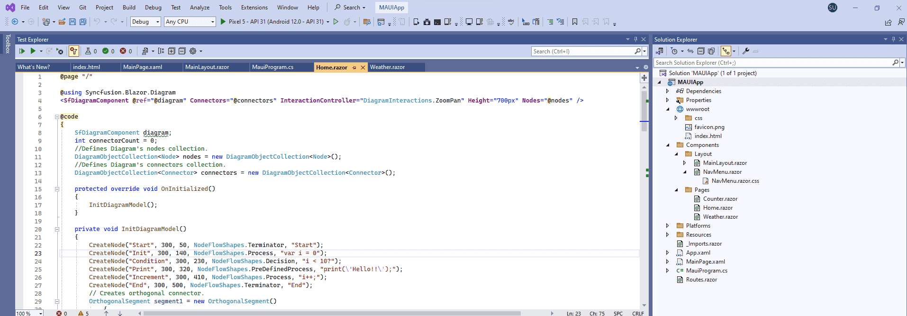

# Getting started with the Blazor Diagram Component in the Blazor MAUI app.

In this section, we'll guide you through the process of adding Syncfusion's Blazor Diagram Component to your Blazor Maui app. We'll break it down into simple steps to make it easy to follow.

## Prerequisites

To use the MAUI project templates, install the Mobile development with the .NET extension for Visual Studio. For more details, refer to [here](https://learn.microsoft.com/en-us/dotnet/MAUI/get-started/installation?tabs=vswin).

## Create a new Blazor MAUI App in Visual Studio

Create a new Blazor MAUI app and name it **DiagramComponentGettingStarted**.


## Install Diagram NuGet package in Blazor Maui App

Add the following NuGet packages into the Blazor Maui app.

* [Syncfusion.Blazor.Diagram](https://www.nuget.org/packages/Syncfusion.Blazor.Diagram) 
* [Syncfusion.Blazor.Themes](https://www.nuget.org/packages/Syncfusion.Blazor.Themes)

## Register Syncfusion Blazor Service

* In the **~/_Imports.razor** file, add the following namespaces:




@using Syncfusion.Blazor 
@using Syncfusion.Blazor.Diagram




* Register the Syncfusion Blazor Service in the **~/MauiProgram.cs** file.




using Microsoft.Extensions.Logging;
using MauiBlazorWindow.Data;
using Syncfusion.Blazor;

namespace MauiBlazorWindow;

public static class MauiProgram
{
    public static MauiApp CreateMauiApp()
    {
        var builder = MauiApp.CreateBuilder();
        builder
            .UseMauiApp<App>()
            .ConfigureFonts(fonts =>
            {
                fonts.AddFont("OpenSans-Regular.ttf", "OpenSansRegular");
            });

        builder.Services.AddMauiBlazorWebView();
        builder.Services.AddMemoryCache();

#if DEBUG
        builder.Services.AddBlazorWebViewDeveloperTools();
        builder.Logging.AddDebug();
#endif

        builder.Services.AddSingleton<WeatherForecastService>();
        builder.Services.AddSyncfusionBlazor();
        return builder.Build();
    }
}




## Adding stylesheet and script

Add the following stylesheet and script to the head section of the **~/wwwroot/index.html** file.

If you are using Syncfusion.Blazor && Syncfusion.Blazor.Themes nuget package in your application you can refer below script.
```html
<head>
    ....
    <link href="_content/Syncfusion.Blazor.Themes/bootstrap5.css" rel="stylesheet" />
    <script src="_content/Syncfusion.Blazor/scripts/syncfusion-blazor.min.js" type="text/javascript"></script>
</head>
```
If you are using Syncfusion.Blazor.Diagram && Syncfusion.Blazor.Themes nuget package in your application you can refer below script.
```html
<head>
    ....
    <link href="_content/Syncfusion.Blazor.Themes/bootstrap5.css" rel="stylesheet" />
    <script src="_content/Syncfusion.Blazor.Core/scripts/syncfusion-blazor.min.js" type="text/javascript"></script>
</head>
```

## Add Diagram component

Add the Syncfusion PDF Viewer (Next Gen) component in the **~/Pages/Index.razor** file.




@page "/"

@using Syncfusion.Blazor.Diagram

<SfDiagramComponent Width="100%" Height="600px"/>

@code {
    public string DocumentPath { get; set; } = "https://cdn.syncfusion.com/content/pdf/pdf-succinctly.pdf";
}




## Run on Windows

Run the sample in Windows Machine mode, and it will run Blazor MAUI in Windows.


When the application is successfully launched, the Diagram component will seamlessly render the specified diagram page.


## Run on Android

To run the PDF Viewer (Next Gen) in a Blazor Android MAUI application using the Android emulator, follow these steps:



Refer [here](https://learn.microsoft.com/en-us/dotnet/maui/android/emulator/device-manager#android-device-manager-on-windows) to install and launch Android emulator.

N> If you encounter any errors while using the Android Emulator, refer to the following link for troubleshooting guidance[Troubleshooting Android Emulator](https://learn.microsoft.com/en-us/dotnet/maui/android/emulator/troubleshooting).

.