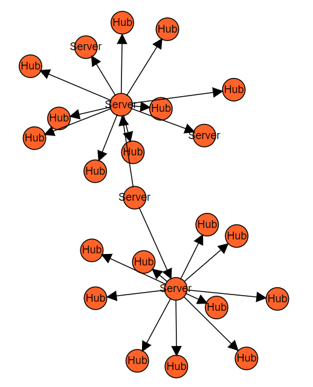

# Symmetric layout in Blazor Diagram Component

The symmetric layout has been formed using nodes position by closer together or pushing them further apart. This is repeated iteratively until the system comes to an equilibrium state.

The layout’s [`SpringLength`](https://help.syncfusion.com/cr/blazor/Syncfusion.Blazor.Diagrams.DiagramLayout.html#Syncfusion_Blazor_Diagrams_DiagramLayout_SpringLength)defined as how long edges should be, ideally. This will be the resting length for the springs. Edge attraction and vertex repulsion forces to be defined by using layout’s [`SpringFactor`](https://help.syncfusion.com/cr/blazor/Syncfusion.Blazor.Diagrams.DiagramLayout.html#Syncfusion_Blazor_Diagrams_DiagramLayout_SpringFactor), the more sibling nodes repel each other. The relative positions do not change any more from one iteration to the next. The number of iterations can be specified by using layout’s [`MaxIteration`](https://help.syncfusion.com/cr/blazor/Syncfusion.Blazor.Diagrams.DiagramLayout.html#Syncfusion_Blazor_Diagrams_DiagramLayout_MaxIteration).

The following code illustrates how to arrange the nodes in a radial tree structure.

```cshtml
@using Syncfusion.Blazor.Diagrams
@using System.Collections.ObjectModel

<SfDiagram ID="diagram" Height="600px" NodeDefaults="@NodeDefaults" ConnectorDefaults="@ConnectorDefaults" Layout="@LayoutValue">
    <DiagramDataSource Id="Id" ParentId="Source" DataSource="@DataSource" DataMapSettings="@DataMap"></DiagramDataSource>
</SfDiagram>

@code {
    //Initializing SymmetricalLayout layout
    DiagramLayout LayoutValue = new DiagramLayout()
    {
        //Sets layout type as SymmetricalLayout...
        Type = LayoutType.SymmetricalLayout,
        SpringFactor = 0.8,
        SpringLength = 80,
        MaxIteration = 500,
        Margin = new LayoutMargin() { Top = 20, Left = 20 }
    };
    //Initializing DataMapSetting
    List<DiagramDataMapSetting> DataMap = new List<DiagramDataMapSetting>()
    {
            new DiagramDataMapSetting() { Property = "Annotations[0].Content",
        Field = "Type" },
    };
    DiagramNode NodeDefaults = new DiagramNode()
    {
        Width = 25,
        Height = 25,
        Annotations = new ObservableCollection<DiagramNodeAnnotation>() { new DiagramNodeAnnotation() { Id = "label1", Style = new AnnotationStyle() { Color = "black" } }, },
        Style = new NodeShapeStyle { Fill = "#ff6329", StrokeColor = "black", },
        Shape = new DiagramShape() { Type = Syncfusion.Blazor.Diagrams.Shapes.Basic, BasicShape = BasicShapes.Ellipse }
    };
    TreeInfo treeLayoutInfo = new TreeInfo()
    {
        Orientation = SubTreeOrientation.Vertical,
        Offset = -20,
        GetAssistantDetails  = new AssistantsDetails()
        {
            Root = "General Manager",
            Assistants = new string[] {"Assistant Manager"}
        }
    };
    DiagramConnector ConnectorDefaults = new DiagramConnector
    {
        Type = Syncfusion.Blazor.Diagrams.Segments.Straight,
    };

    public class SymmetricalDetails
    {
        public string Id { get; set; }
        public string Source { get; set; }
        public string Type { get; set; }
    }

    public object DataSource = new List<object>()
    {
        new SymmetricalDetails() { Id= "1",Source="", Type = "Server" },
        new SymmetricalDetails() { Id= "2",  Source="1", Type= "Server" },
        new SymmetricalDetails() { Id= "3",  Source="1", Type= "Server" },
        new SymmetricalDetails() { Id= "4",  Source="2", Type= "Server" },
        new SymmetricalDetails() { Id= "5",  Source="2", Type= "Server" },
        new SymmetricalDetails() { Id= "6", Source= "2", Type= "Hub" },
        new SymmetricalDetails() { Id= "7", Source= "2", Type= "Hub" },
        new SymmetricalDetails() { Id= "8", Source= "2", Type= "Hub" },
        new SymmetricalDetails() { Id= "9", Source= "2", Type= "Hub" },
        new SymmetricalDetails() { Id= "10", Source= "2", Type= "Hub" },
        new SymmetricalDetails() { Id= "11", Source= "2", Type= "Hub" },
        new SymmetricalDetails() { Id= "12", Source= "2", Type= "Hub" },
        new SymmetricalDetails() { Id= "13", Source= "2", Type= "Hub" },
        new SymmetricalDetails() { Id= "14",Source=  "2", Type= "Hub" },
        new SymmetricalDetails() { Id= "15", Source= "3", Type= "Hub" },
        new SymmetricalDetails() { Id= "16", Source= "3", Type= "Hub" },
        new SymmetricalDetails() { Id= "17", Source= "3", Type= "Hub" },
        new SymmetricalDetails() { Id= "18", Source= "3", Type= "Hub" },
        new SymmetricalDetails() { Id= "19", Source= "3", Type= "Hub" },
        new SymmetricalDetails() { Id= "20", Source= "3", Type= "Hub" },
        new SymmetricalDetails() { Id= "21", Source= "3", Type= "Hub" },
        new SymmetricalDetails() { Id= "22", Source= "3", Type= "Hub" },
        new SymmetricalDetails() { Id= "23",Source=  "3", Type= "Hub" },
        new SymmetricalDetails() { Id= "24",  Source="3", Type= "Hub" },
    };
}
```



## Customize the layout

You can change the following properties of the symmetric layout.

* Spring length
* Spring factor
* Max iteration

To explore layout properties, refer to the [`Layout Properties`](https://help.syncfusion.com/cr/blazor/Syncfusion.Blazor.Diagrams.DiagramLayout.html).

The following code is used to change the properties at runtime.

```csharp
public void UpdateProperties() {
    Diagram.Layout.SpringLength += 10;
    Diagram.Layout.SpringFactor += 10;
    Diagram.Layout.MaxIteration += 20;
}
```

## See also

* [`How to create a node`](../nodes/nodes)

* [`How to create a connector`](../connectors/connectors)

* [`How to generate the organization chart`](./organizational-chart)