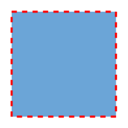
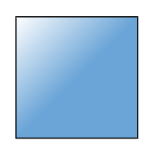
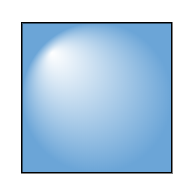
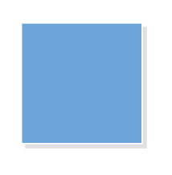
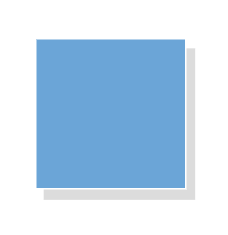
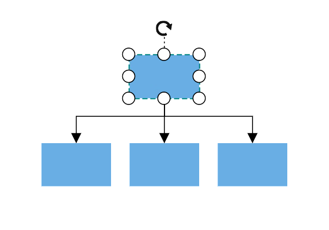

# Appearance

* The appearance of a node can be customized by changing its [`Fill`](https://help.syncfusion.com/cr/blazor/Syncfusion.Blazor.Diagrams.DiagramNode.html) color, [`BorderColor`](https://help.syncfusion.com/cr/blazor/Syncfusion.Blazor.Diagrams.DiagramNode.html), [`BorderWidth`](https://help.syncfusion.com/cr/blazor/Syncfusion.Blazor.Diagrams.DiagramNode.html), and [`Shadow`](https://help.syncfusion.com/cr/blazor/Syncfusion.Blazor.Diagrams.DiagramNode.html#Syncfusion_Blazor_Diagrams_DiagramNode_Shadow).

* The [`Visible`](https://help.syncfusion.com/cr/blazor/Syncfusion.Blazor.Diagrams.DiagramNode.html#Syncfusion_Blazor_Diagrams_DiagramNode_Visible) property of the node enables or disables the visibility of the node.

The following code shows how to customize the appearance of the shape.

```csharp
@using Syncfusion.Blazor.Diagrams
@using System.Collections.ObjectModel

<SfDiagram Height="600px" Nodes="@NodeCollection">
</SfDiagram>

@code{
    public ObservableCollection<DiagramNode> NodeCollection = new ObservableCollection<DiagramNode>() { };
    protected override void OnInitialized()
    {
        // A node is created and stored in nodes array.
        DiagramNode node1 = new DiagramNode()
        {
            // Position of the node
            OffsetX = 250,
            OffsetY = 250,
            // Size of the node
            Width = 100,
            Height = 100,
            // Add node
            Style = new NodeShapeStyle() { Fill = "#6BA5D7", StrokeDashArray = "5,5", StrokeColor = "red", StrokeWidth = 2 },
        };
        NodeCollection.Add(node1);
    }
}
```



## Gradient

The [`Gradient`](https://help.syncfusion.com/cr/blazor) property of the node allows you to define and apply the gradient effect to the node.

The gradient stop property defines the color and a position, where the previous color transition ends and a new color transition starts.

The gradient stop’s opacity property defines the transparency level of the region.

There are two types of gradients as follows:

* Linear Gradient

* Radial Gradient

### Linear gradient

* [`LinearGradient`](https://help.syncfusion.com/cr/blazor) defines a smooth transition between a set of colors (so-called stops) in a line.

* A linear gradient’s X1, Y1, X2, Y2 properties are used to define the position (relative to the node) of the rectangular region that needs to be painted.

```csharp
@using Syncfusion.Blazor.Diagrams
@using System.Collections.ObjectModel

<SfDiagram Height="600px" Nodes="@NodeCollection">
</SfDiagram>

@code{
    public ObservableCollection<DiagramNode> NodeCollection = new ObservableCollection<DiagramNode>() { };
    protected override void OnInitialized()
    {
        // A node is created and stored in nodes array.
        DiagramNode node1 = new DiagramNode()
        {
            // Position of the node
            OffsetX = 250,
            OffsetY = 250,
            // Size of the node
            Width = 100,
            Height = 100,
            Style = new NodeShapeStyle() {
                Gradient = new DiagramGradient() {
                    //Start point of linear gradient
                    X1 = 0, Y1 = 0,
                    //End point of linear gradient
                    X2 = 50, Y2 = 50,
                    //Sets an array of stop objects
                    Stops = new ObservableCollection<DiagramsGradientStop>()
                    {
                        new DiagramsGradientStop(){ Color = "white", Offset = 0},
                        new DiagramsGradientStop(){ Color = "#6BA5D7", Offset = 100}
                    },
                    Type = GradientType.Linear
                }
            },
        };
        NodeCollection.Add(node1);
    }
}
```



### Radial gradient

* [`RadialGradient`](https://help.syncfusion.com/cr/blazor) defines a smooth transition between stops on a circle.

* A radial gradient properties are used to define the position (relative to the node) of the outermost or the innermost circle of the radial gradient.

```csharp
@using Syncfusion.Blazor.Diagrams
@using System.Collections.ObjectModel

<SfDiagram Height="600px" Nodes="@NodeCollection">
</SfDiagram>

@code{
    public ObservableCollection<DiagramNode> NodeCollection = new ObservableCollection<DiagramNode>() { };
    protected override void OnInitialized()
    {
        DiagramNode node1 = new DiagramNode()
        {
            // Position of the node
            OffsetX = 250,
            OffsetY = 250,
            // Size of the node
            Width = 100,
            Height = 100,
            Style = new NodeShapeStyle()
            {
                Gradient = new DiagramGradient()
                {
                    //Center point of inner circle
                    Fx = 20,
                    Fy = 20,
                    //Center point of outer circle
                    Cx = 50,
                    Cy = 50,
                    //Radius of a radial gradient
                    R = 50,
                    //Sets an array of stop objects
                    Stops = new ObservableCollection<DiagramsGradientStop>()
                {
                        new DiagramsGradientStop(){ Color = "white", Offset = 0},
                        new DiagramsGradientStop(){ Color = "#6BA5D7", Offset = 100}
                    },
                    Type = GradientType.Radial
                }
            },
        };
        // Add node
        NodeCollection.Add(node1);
    }
}
```



## Shadow

Diagram provides support to add [`Shadow`](https://help.syncfusion.com/cr/blazor/Syncfusion.Blazor.Diagrams.DiagramNode.html#Syncfusion_Blazor_Diagrams_DiagramNode_Shadow) effect to a node that is disabled, by default. It can be enabled with the
constraints property of the node. The following code shows how to draw shadow.

```csharp
@using Syncfusion.Blazor.Diagrams
@using System.Collections.ObjectModel

<SfDiagram Height="600px" Nodes="@NodeCollection">
</SfDiagram>

@code{

    public ObservableCollection<DiagramNode> NodeCollection = new ObservableCollection<DiagramNode>() { };
    protected override void OnInitialized()
    {
        // A node is created and stored in nodes array.
        DiagramNode node1 = new DiagramNode()
        {
            // Position of the node
            OffsetX = 250,
            OffsetY = 250,
            // Size of the node
            Width = 100,
            Height = 100,
            Style = new NodeShapeStyle() { Fill = "#6BA5D7", StrokeColor = "white" },
            Constraints = NodeConstraints.Default | NodeConstraints.Shadow
        };
        NodeCollection.Add(node1);
    }
}

```



### Customizing shadow

The [`Angle`](https://help.syncfusion.com/cr/blazor/Syncfusion.Blazor.Diagrams.DiagramShadow.html#Syncfusion_Blazor_Diagrams_DiagramShadow_Angle), [`Distance`](https://help.syncfusion.com/cr/blazor/Syncfusion.Blazor.Diagrams.DiagramShadow.html#Syncfusion_Blazor_Diagrams_DiagramShadow_Distance), and [`Opacity`](https://help.syncfusion.com/cr/blazor/Syncfusion.Blazor.Diagrams.DiagramShadow.html#Syncfusion_Blazor_Diagrams_DiagramShadow_Opacity) of the shadow can be customized with the shadow property of the node. The following code
example illustrates how to customize shadow.

```csharp
@using Syncfusion.Blazor.Diagrams
@using System.Collections.ObjectModel

<SfDiagram Height="600px" Nodes="@NodeCollection">
</SfDiagram>

@code{

    public ObservableCollection<DiagramNode> NodeCollection = new ObservableCollection<DiagramNode>() { };
    protected override void OnInitialized()
    {
        // A node is created and stored in nodes array.
        DiagramNode node1 = new DiagramNode()
        {
            // Position of the node
            OffsetX = 250,
            OffsetY = 250,
            // Size of the node
            Width = 100,
            Height = 100,
            Style = new NodeShapeStyle() { Fill = "#6BA5D7", StrokeColor = "white" },
            Constraints = NodeConstraints.Default | NodeConstraints.Shadow,
            // Custom Shadow of the node
            Shadow =  new DiagramShadow()
            {
                Angle = 50,
                Opacity = 0.8,
                Distance = 9
            }
        };
        NodeCollection.Add(node1);
    }
}
```



## Icon

Diagram provides support to describe the state of the node. i.e., the node is expanded or collapsed state.

>Note: Icon can be created only when the node has outEdges.

* To explore the properties of expand and collapse icon, refer to [`ExpandIcon`](https://help.syncfusion.com/cr/blazor/Syncfusion.Blazor.Diagrams.DiagramNode.html#Syncfusion_Blazor_Diagrams_DiagramNode_ExpandIcon) and [`CollapseIcon`](https://help.syncfusion.com/cr/blazor/Syncfusion.Blazor.Diagrams.DiagramNode.html#Syncfusion_Blazor_Diagrams_DiagramNode_CollapseIcon).

* The ExpandIcon’s and CollapseIcon’s shape properties allow you to define the shape of the icon.

The following code example shows how to create an icon of various shapes.

```csharp
@using Syncfusion.Blazor.Diagrams
@using System.Collections.ObjectModel

    <SfDiagram Height="600px" Nodes="@NodeCollection" NodeDefaults="@NodeDefault" Connectors="@ConnectorCollection">
    </SfDiagram>

@code{
    public ObservableCollection<DiagramNode> NodeCollection = new ObservableCollection<DiagramNode>() { };
    public ObservableCollection<DiagramConnector> ConnectorCollection = new ObservableCollection<DiagramConnector>() { };
    DiagramNode NodeDefault = new DiagramNode()
    {
        Width = 140,
        Height = 50,
        Style = new NodeShapeStyle() { Fill = "#6BA5D7", StrokeColor = "white" },
    };
    protected override void OnInitialized()
    {
        DiagramNode node1 = new DiagramNode()
        {
            Id = "Start",
            OffsetX = 300,
            OffsetY = 50,
            Annotations = new ObservableCollection<DiagramNodeAnnotation>()
        {
                new DiagramNodeAnnotation(){ Content = "Node1" }
            },
            ExpandIcon = new NodeExpandIcon() { Shape = IconShapes.ArrowDown, Width = 10, Height = 10 },
            CollapseIcon = new NodeCollapseIcon() { Shape = IconShapes.ArrowUp, Width = 10, Height = 10 }
        };
        NodeCollection.Add(node1);

        DiagramNode node2 = new DiagramNode()
        {
            Id = "Init",
            OffsetX = 300,
            OffsetY = 140,
            Annotations = new ObservableCollection<DiagramNodeAnnotation>()
        {
                new DiagramNodeAnnotation(){ Content = "Node2" }
            },
        };
        NodeCollection.Add(node2);

        DiagramConnector connector1 = new DiagramConnector()
        {
            // Unique name for the connector
            Id = "connector1",
            // Source and Target node's name to which connector needs to be connected.
            SourceID = "Start",
            TargetID = "Init",
            Type = Segments.Orthogonal
        };
        ConnectorCollection.Add(connector1);
    }
}
```


### Customizing expand icon

* Set the BorderColor, BorderWidth, and background color for an ExpandIcon using the BorderColor, BorderWidth, and Fill properties.

* Set a size for an expandIcon by using the Width and Height properties.

* The expand icon can be aligned relative to the node boundaries. It has Margin, Offset, HorizontalAlignment, and VerticalAlignment settings. It is quite tricky when all four alignments are used together but gives you more control over alignment.

### Customizing collapse icon

* Set the borderColor, borderWidth, background color for an collapseIcon using the [`BorderColor`](https://help.syncfusion.com/cr/blazor/Syncfusion.Blazor.Diagrams.NodeCollapseIcon.html#Syncfusion_Blazor_Diagrams_NodeCollapseIcon_BorderColor), [`BorderWidth`](https://help.syncfusion.com/cr/blazor/Syncfusion.Blazor.Diagrams.NodeCollapseIcon.html#Syncfusion_Blazor_Diagrams_NodeCollapseIcon_BorderWidth), and [`Fill`](https://help.syncfusion.com/cr/blazor/Syncfusion.Blazor.Diagrams.NodeCollapseIcon.html#Syncfusion_Blazor_Diagrams_NodeCollapseIcon_Fill) properties.

* Set a size for collapseIcon by using the [`Width`](https://help.syncfusion.com/cr/blazor/Syncfusion.Blazor.Diagrams.NodeCollapseIcon.html#Syncfusion_Blazor_Diagrams_NodeCollapseIcon_Width) and
[`Height`](https://help.syncfusion.com/cr/blazor/Syncfusion.Blazor.Diagrams.NodeCollapseIcon.html#Syncfusion_Blazor_Diagrams_NodeCollapseIcon_Height) properties.

* Like expand icon, collapse icon also can be aligned relative to the node boundaries. It has Margin, Offset, HorizontalAlignment, and VerticalAlignment settings. It is quite tricky when all four alignments are used together but gives you more control over alignment.

## Constraints

The constraints property of the node allows you to enable/disable certain features. For more information about node constraints, refer to [`Node Constraints`](../constraints).

## Custom properties

The [`AddInfo`](https://help.syncfusion.com/cr/blazor/Syncfusion.Blazor.Diagrams.DiagramNode.html#Syncfusion_Blazor_Diagrams_DiagramNode_AddInfo) property of the node allows you to maintain additional information to the node.

The following code shows how to set the `AddInfo` value.

```csharp
@using Syncfusion.Blazor.Diagrams
@using System.Collections.ObjectModel

<SfDiagram Height="600px" Nodes="@NodeCollection">
</SfDiagram>

@code{

    public ObservableCollection<DiagramNode> NodeCollection = new ObservableCollection<DiagramNode>();
    public List<NodeAddInfo> AddInfo = new List<NodeAddInfo>()
    {
        new NodeAddInfo(){ Content = "NodeContent", ParentID = "diagram" }
    };
    protected override void OnInitialized()
    {
        // A node is created and stored in nodes collection.

        DiagramNode node1 = new DiagramNode()
        {
            // Position of the node
            OffsetX = 250,
            OffsetY = 250,
            // Size of the node
            Width = 100,
            Height = 100,
            Style = new NodeShapeStyle() { Fill = "#6BA5D7", StrokeColor = "white" },
            AddInfo = AddInfo
        };
        // Add node
        NodeCollection.Add(node1);
    }

    public class NodeAddInfo {
        public string ParentID;
        public string Content;
    }
}
```

**Note:** We can set any type of value for the AddInfo property.

## Stack order

The node's `z-order` property specifies the stack order of the node. A node with greater stack order is always in front of a node with a lower stack order.

The following code illustrates how to render a node based on the stack order.

```csharp

@using Syncfusion.Blazor.Diagrams
@using System.Collections.ObjectModel

<SfDiagram Height="600px" Nodes="@NodeCollection">
</SfDiagram>

@code
{
    //Defines diagram's connector collection
    public ObservableCollection<DiagramNode> NodeCollection;

    protected override void OnInitialized()
    {
        NodeCollection = new ObservableCollection<DiagramNode>()
        {
            new DiagramNode(){
                // Unique id of the node
                Id = "Node1",
                // Position of the node
                OffsetX = 100, OffsetY = 100,
                // Size of the node
                Width = 100, Height = 100,
                // Sets style of the node
                Style = new NodeShapeStyle() { Fill = "#6BA5D7", StrokeColor = "white" },
                //Specify the z-index value
                ZIndex = 2,
            },
            new DiagramNode(){
                // Unique id of the node
                Id = "Node2",
                // Position of the node
                OffsetX = 150, OffsetY = 150,
                // Size of the node
                Width = 100, Height = 100,
                // Sets style of the node
                Style = new NodeShapeStyle() { Fill = "#6BA5D7", StrokeColor = "white" },
                //Specify the z-index value
                ZIndex = 1,
            }
        };
    }
}
```


## Data flow

You can find the flow in the diagram by using the [`GetEdges`](https://help.syncfusion.com/cr/blazor/Syncfusion.Blazor.Diagrams.SfDiagram.html#Syncfusion_Blazor_Diagrams_SfDiagram_GetEdges_System_String_System_Boolean_) method. In this method, you can find what are all the connectors that are connected to the node.

```csharp
@using Syncfusion.Blazor.Diagrams
@using System.Collections.ObjectModel
<input type="button" value="UpdateEdges" @onclick="@UpdateEdges" />
<SfDiagram Height="600px" @ref="@Diagram" Nodes="@NodeCollection" Connectors="@ConnectorCollection" NodeDefaults="@NodeDefaults">
</SfDiagram>

@code{
    // Reference of the diagram
    SfDiagram Diagram;
    // Define node and connector collection
    public ObservableCollection<DiagramNode> NodeCollection;
    public ObservableCollection<DiagramConnector> ConnectorCollection;
    // Set the default value of the node
    DiagramNode NodeDefaults = new DiagramNode()
    {
        // Size of the node
        Width = 80, Height = 50,
        // Style of the node
        Style = new NodeShapeStyle() { Fill = "#6BA5D7", StrokeColor = "white" },
    };
    protected override void OnInitialized()
    {
        NodeCollection = new ObservableCollection<DiagramNode>() {
            new DiagramNode()
            {
                Id = "node1",
                // Position of the node
                OffsetX = 450, OffsetY = 100
            },
            new DiagramNode()
            {
                Id = "node2",
                // Position of the node
                OffsetX = 350, OffsetY = 200
            },
            new DiagramNode()
            {
                Id = "node3",
                // Position of the node
                OffsetX = 450, OffsetY = 200
            },
            new DiagramNode()
            {
                Id = "node4",
                // Position of the node
                OffsetX = 550, OffsetY = 200
            }
        };
        ConnectorCollection = new ObservableCollection<DiagramConnector>() {
            new DiagramConnector()
            {
                // Sets the unique id, source node, taget node
                Id = "connector1", SourceID = "node1", TargetID = "node2",
                // Sets the type of the connector
                Type = Segments.Orthogonal
            },
            new DiagramConnector()
            {
                // Sets the unique id, source node, taget node
                Id = "connector2", SourceID = "node1", TargetID = "node3",
                // Sets the type of the connector
                Type = Segments.Orthogonal
            },
            new DiagramConnector()
            {
                // Sets the unique id, source node, taget node
                Id = "connector3", SourceID = "node1", TargetID = "node4",
                // Sets the type of the connector
                Type = Segments.Orthogonal
            }
        };
    }
    protected override async Task OnAfterRenderAsync(bool firstRender)
    {
        if (firstRender)
        {
            //OnAfterRenderAsync will be triggered after the component rendered.
            await Task.Delay(1500);
            // Select the node
            Diagram.Select(new ObservableCollection<DiagramNode>() { Diagram.Nodes[0] }, null);
        }
    }

    public async Task UpdateEdges()
    {
        string NodeId = Diagram.SelectedItems.Nodes[0].Id;
        // GetEdges method is used to get the connectors that connected to nodes.
        string[] edges = await Diagram.GetEdges(NodeId, true);
        for (int i = 0; i < edges.Length; i++)
        {
            // Get the connector from id
            DiagramConnector connector = Diagram.GetConnector(edges[i]);
            // Change the style of the connector
            connector.Style.StrokeColor = "#1413F8";
            connector.TargetDecorator.Style.StrokeColor = "#1413F8";
            connector.TargetDecorator.Style.Fill = "#1413F8";
        }
    }
}
```



## See also

* [`How to get events when they interact the node`](./events)
