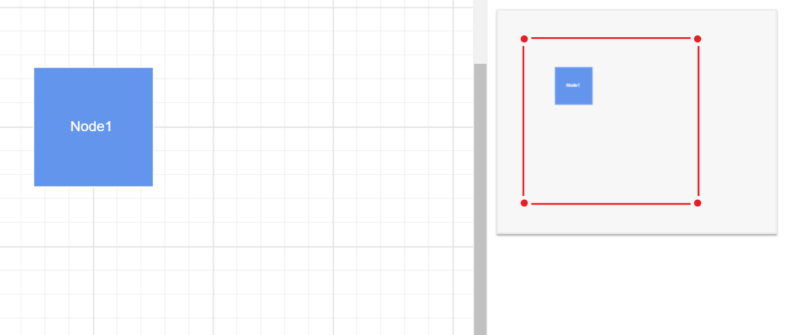

# Overview Control in Blazor Diagram Component

Overview control allows you to see a preview or an overall view of the entire content of a diagram. This helps you to look at the overall picture of a large diagram and to navigate, pan, or zoom, on a particular position of the page.

When you work on a very large diagram, you may not know the part you are working on, or navigation from one part to another might be difficult. One solution for navigation is to zoom out the entire diagram and find where you are. Then, you can zoom in an area you want to. This solution is not suitable when you need some frequent navigation.

Overview control solves these problems by showing a preview, that is, an overall view of the entire diagram. A rectangle indicates viewport of the diagram. Navigation becomes easy by dragging this rectangle.

## Create overview

The [`SourceID`](https://help.syncfusion.com/cr/blazor/Syncfusion.Blazor.Diagrams.SfOverview.html#Syncfusion_Blazor_Diagrams_SfOverview_SourceID) property of overview should be set with the corresponding diagram ID for the overall view.

The [`Width`](https://help.syncfusion.com/cr/blazor/Syncfusion.Blazor.Diagrams.SfOverview.html#Syncfusion_Blazor_Diagrams_SfOverview_Width) and [`Height`](https://help.syncfusion.com/cr/blazor/Syncfusion.Blazor.Diagrams.SfOverview.html#Syncfusion_Blazor_Diagrams_SfOverview_Height) properties of the overview allow you to define the size of the overview.

The following code illustrates how to create overview.

```cshtml
@using Syncfusion.Blazor.Diagrams
@using System.Collections.ObjectModel
    <SfDiagram id="diagram" Height="600px" Layout="@LayoutValue" ConnectorDefaults="@ConnectorDefault" NodeDefaults="@NodeDefaults">
        <DiagramDataSource Id="Name" ParentId="Category" DataSource="@DataSource" DataMapSettings="@datamap">
            <DiagramDataMapSettings>
                <DiagramDataMapSetting Property="Annotations[0].Content" Field="Name"></DiagramDataMapSetting>
            </DiagramDataMapSettings>
        </DiagramDataSource>
    </SfDiagram>
<SfOverview  Height="150px" SourceID="diagram" />

@code
{

    //Defines diagram's nodes collection
    public ObservableCollection<DiagramNode> NodeCollection = new ObservableCollection<DiagramNode>();
    //Defines diagram's connector collection
    public ObservableCollection<DiagramConnector> ConnectorCollection = new ObservableCollection<DiagramConnector>();
    //Defines the node default values.
    DiagramNode NodeDefaults = new DiagramNode()
    {
        Width = 95,
        Height = 30,
        BackgroundColor = "#6BA5D7",
        Shape = new DiagramShape() { Type = Shapes.Basic, BasicShape = BasicShapes.Rectangle },
        Style = new NodeShapeStyle { Fill = "#ffeec7", StrokeColor = "#ffeec7", StrokeWidth = 1, },
        Annotations = new ObservableCollection<DiagramNodeAnnotation>()
{
            new DiagramNodeAnnotation()
            {
                Id = "label1",
                Style = new AnnotationStyle()
                {
                    Color = "black"
                }
            }
        }
    };
    //Defines the connector's default values.
    DiagramConnector ConnectorDefault = new DiagramConnector
    {
        Type = Segments.Orthogonal,
        Style = new ConnectorShapeStyle() { StrokeColor = "#4d4d4d", StrokeWidth = 2 },
        TargetDecorator = new ConnectorTargetDecorator()
        {
            Shape = DecoratorShapes.None,
        }
    };
    //Create the layout info
    TreeInfo LayoutInfo = new TreeInfo()
    {
        //Create the layout info
        CanEnableSubTree = true,
        //Specify the sub-tree orientation
        Orientation = SubTreeOrientation.Horizontal
    };

    List<DiagramDataMapSetting> datamap { get; set; } = new List<DiagramDataMapSetting>()
{
        new DiagramDataMapSetting() { Property = "Shape.TextContent", Field = "Name" }
    };

    DiagramLayout LayoutValue = new DiagramLayout() { };

    protected override void OnInitialized()
    {
        LayoutValue = new DiagramLayout()
        {
            Type = LayoutType.HierarchicalTree,
            VerticalSpacing = 30,
            HorizontalSpacing = 30,
            EnableAnimation = true,
            LayoutInfo = this.LayoutInfo

        };
    }
    //Create the hierarchical details with needed properties.
    public class HierarchicalDetails
    {
        public string Name { get; set; }
        public string FillColor { get; set; }
        public string Category { get; set; }
    }
    //Create the data source with node name and fill color values.
    public List<object> DataSource = new List<object>()
{
        new HierarchicalDetails(){ Name ="Diagram", Category="",FillColor="#916DAF"},
        new HierarchicalDetails(){ Name ="Layout", Category="Diagram",FillColor=""},
        new HierarchicalDetails(){ Name ="Tree Layout", Category="Layout",FillColor=""},
        new HierarchicalDetails(){ Name ="Organizational Chart", Category="Layout",FillColor=""},
        new HierarchicalDetails(){ Name ="Hierarchical Tree", Category="Tree Layout",FillColor=""},
        new HierarchicalDetails(){ Name ="Radial Tree", Category="Tree Layout",FillColor=""},
        new HierarchicalDetails(){ Name ="Mind Map", Category="Hierarchical Tree",FillColor=""},
        new HierarchicalDetails(){ Name ="Family Tree", Category="Hierarchical Tree",FillColor=""},
        new HierarchicalDetails(){ Name ="Management", Category="Organizational Chart",FillColor=""},
        new HierarchicalDetails(){ Name ="Human Resources", Category="Management",FillColor=""},
        new HierarchicalDetails(){ Name ="University", Category="Management",FillColor=""},
        new HierarchicalDetails(){ Name ="Business", Category="#Management",FillColor=""}
    };
}
```

## Zoom and Pan

In overview, the view port of the diagram is highlighted with a red color rectangle. Diagram can be zoomed/panned by interacting with that. You can interact with overview as follows:

* Resize the rectangle: Zooms in/out the diagram.
* Drag the rectangle: Pans the diagram.
* Click at a position: Navigates to the clicked region.
* Choose a particular region by clicking and dragging: Navigates to the specified region.

The following image shows how the diagram is zoomed/panned with overview.

```cshtml
@using Syncfusion.Blazor.Diagrams
@using System.Collections.ObjectModel

<SfDiagram Nodes="@NodeCollection" id="diagram" Height="600px">
    <DiagramScrollSettings ScrollLimit="@ScrollLimit.Infinity" />
</SfDiagram>
<SfOverview  Height="150px" SourceID="diagram" />

@code
{
    //Defines diagram's nodes collection
    public ObservableCollection<DiagramNode> NodeCollection = new ObservableCollection<DiagramNode>();
    protected override void OnInitialized()
    {
        DiagramNode node = new DiagramNode()
        {
            Id = "group",
            OffsetX = 200,
            OffsetY = 200,
            Width = 100,
            Height = 100,
            Annotations = new ObservableCollection<DiagramNodeAnnotation>()
        {
                new DiagramNodeAnnotation()
                {
                    Content = "Node1",
                    Style = new AnnotationStyle()
                    {
                        Color = "white",
                    }
                }
            },
            Style = new NodeShapeStyle() { Fill = "cornflowerblue", StrokeColor = "white" }
        };
        NodeCollection.Add(node);
    }
}
```

