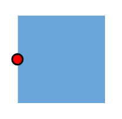
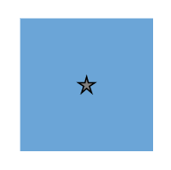

# Port appearance and positioning

## Appearance

* The shape of a port can be changed by using the [`Shape`](https://help.syncfusion.com/cr/blazor/Syncfusion.Blazor.Diagrams.PortShapes.html) property. To explore the different types of port shapes, refer to Port Shapes. If you need to render a custom shape, then you can set shape to path and define path using the path data property.

* The appearance of the ports can be customized by using the [`StrokeColor`](https://help.syncfusion.com/cr/blazor/Syncfusion.Blazor.Diagrams.PortShapeStyle.html#Syncfusion_Blazor_Diagrams_PortShapeStyle_StrokeColor), [`StrokeWidth`](https://help.syncfusion.com/cr/blazor/Syncfusion.Blazor.Diagrams.PortShapeStyle.html#Syncfusion_Blazor_Diagrams_PortShapeStyle_StrokeWidth), and [`Fill`](https://help.syncfusion.com/cr/blazor/Syncfusion.Blazor.Diagrams.PortShapeStyle.html#Syncfusion_Blazor_Diagrams_PortShapeStyle_Fill) properties.

* Customize the port size by using the [`Width`](https://help.syncfusion.com/cr/blazor/Syncfusion.Blazor.Diagrams.DiagramPort.html#Syncfusion_Blazor_Diagrams_DiagramPort_Width) and [`Height`](https://help.syncfusion.com/cr/blazor/Syncfusion.Blazor.Diagrams.DiagramPort.html#Syncfusion_Blazor_Diagrams_DiagramPort_Height) properties of port.

* The ports [`Visibility`](https://help.syncfusion.com/cr/blazor/Syncfusion.Blazor.Diagrams.DiagramPort.html#Syncfusion_Blazor_Diagrams_DiagramPort_Visibility) property allows you to define when the port should be visible.

The following code explains how to change the appearance of the port.

```csharp
@using Syncfusion.Blazor.Diagrams
@using System.Collections.ObjectModel

 <SfDiagram Height="600px" Nodes="@NodeCollection">
 </SfDiagram>
@code{

    public ObservableCollection<DiagramNode> NodeCollection = new ObservableCollection<DiagramNode>() { };
    protected override void OnInitialized()
    {
        // A node is created and stored in nodes array.
        DiagramNode node1 = new DiagramNode()
        {
            // Position of the node
            OffsetX = 250,
            OffsetY = 250,
            // Size of the node
            Width = 100,
            Height = 100,
            Style = new NodeShapeStyle() { Fill = "#6BA5D7", StrokeColor = "white" },
            // Initialize port collection
            Ports = new ObservableCollection<DiagramPort>() {
            new DiagramPort() {
                Id = "port1",
                Offset = new NodePortOffset() { X = 0, Y = 0.5 },
                Visibility = PortVisibility.Visible,
                //Set the style for the port
                Style= new PortShapeStyle(){ Fill="red", StrokeColor="black", StrokeWidth=2},
                // Sets the shape of the port as Circle
                Width= 12, Height=12, Shape= PortShapes.Circle
            }},
        };
        NodeCollection.Add(node1);
    }
}
```



## Visibility

The visibility of the ports depends upon the properties of `Connect`, `Hidden`, `Hover`, and `Visible`. By default, PortVisibility is set to Hidden.

| Property | Definition |
|---|---|
| Hover | Port is visible when mousehover the DiagramElement. |
| Hidden | Port is not visible for the DiagramElement. |
| Connect | Specifies to visible the port when mousehover the DiagramElement and enable the PortConstraints as InConnect and OutConnect. |
| Visible | Port is always visible for the DiagramElement. |
| Default | By default, PortVisibility is set to Hidden. So, the port is not visible for the DiagramElement. |

## Types of port shapes

We have provided some basic built-in [`PortShapes`](https://help.syncfusion.com/cr/blazor/Syncfusion.Blazor.Diagrams.PortShapes.html) for the port. Please find the shapes as follows.

* Circle
* Custom
* Square
* X

### Custom shape

 We have provided custom shape support for port. you can able to add the custom path data instead of build-in shapes. Please find the code example that explains how to change the custom shape for port.

 ```csharp
@using Syncfusion.Blazor.Diagrams
@using System.Collections.ObjectModel

<SfDiagram Height="600px" Nodes="@NodeCollection">
</SfDiagram>
@code{

    public ObservableCollection<DiagramNode> NodeCollection = new ObservableCollection<DiagramNode>() { };
    protected override void OnInitialized()
    {
        // A node is created and stored in nodes array.
        DiagramNode node1 = new DiagramNode()
        {
            // Position of the node
            OffsetX = 250,
            OffsetY = 250,
            // Size of the node
            Width = 100,
            Height = 100,
            Style = new NodeShapeStyle() { Fill = "#6BA5D7", StrokeColor = "white" },
            // Initialize port collection
            Ports = new ObservableCollection<DiagramPort>() {
           new DiagramPort() {
               Id = "port1",
               Offset = new NodePortOffset() { X = 0.5, Y = 0.5 },
               Visibility = PortVisibility.Visible,
               //Set the style for the port
               Style= new PortShapeStyle(){ Fill="gray", StrokeColor="black"},
               // Sets the shape of the port as Circle
               Width= 12, Height=12, Shape= PortShapes.Custom,
               PathData="M540.3643,137.9336L546.7973,159.7016L570.3633,159.7296L550.7723,171.9366L558.9053,194.9966L540.3643,179.4996L521.8223,194.9966L529.9553,171.9366L510.3633,159.7296L533.9313,159.7016L540.3643,137.9336z"
           }},
        };
        NodeCollection.Add(node1);
    }
}
```



## Constraints

The constraints property allows you to enable or disable certain behaviors of ports. For more information about port
constraints, refer to [`Port Constraints`](https://help.syncfusion.com/cr/blazor/Syncfusion.Blazor.Diagrams.DiagramPort.html#Syncfusion_Blazor_Diagrams_DiagramPort_Constraints). You can verify the [`Constraints`](https://help.syncfusion.com/cr/blazor/Syncfusion.Blazor.Diagrams.DiagramPort.html#Syncfusion_Blazor_Diagrams_DiagramPort_Constraints) to learn how to enable or disable the port constraints.

The PortConstraints may have multiple behaviors listed as follows:

| Constraints | Usages |
|---|---|
| None |Disables all behaviors of Port. |
| Drag |Defines whether port to be dragged at boundaries of node.  |
| Draw |Enables or disables to draw a connector. |
| InConnect |Enables or disables connecting to the incoming Connector.  |
| OutConnect | Enables or disables connecting the outgoing Connector. |

## Custom properties

The [`AddInfo`](https://help.syncfusion.com/cr/blazor/Syncfusion.Blazor.Diagrams.DiagramPort.html#Syncfusion_Blazor_Diagrams_DiagramPort_AddInfo) property of the port allows you to maintain additional information to the port.

## See also

* [`How to create a node`](../nodes/nodes)

* [`How to customize the ports`](./appearance)

* [`How to set the position of the port`](./positioning)

* [`How to interact the ports`](./interaction)