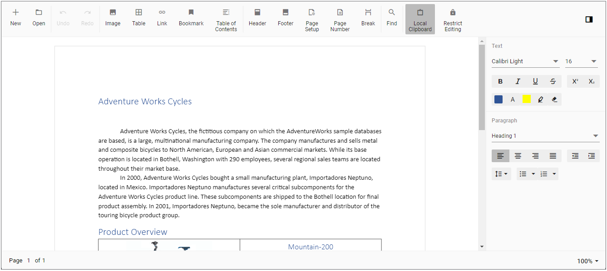

# Getting Started with Blazor DocumentEditor Component in Web App

This section briefly explains about how to include [Blazor DocumentEditor](https://www.syncfusion.com/blazor-components/blazor-word-processor) component in your Blazor Web App using [Visual Studio](https://visualstudio.microsoft.com/vs/).

## Prerequisites

* [System requirements for Blazor components](https://blazor.syncfusion.com/documentation/system-requirements)

## Create a new Blazor Web App

You can create a **Blazor Web App** using Visual Studio 2022 via [Microsoft Templates](https://learn.microsoft.com/en-us/aspnet/core/blazor/tooling?view=aspnetcore-8.0) or the [Syncfusion Blazor Extension](https://blazor.syncfusion.com/documentation/visual-studio-integration/template-studio).

You need to configure the corresponding [Interactive render mode](https://learn.microsoft.com/en-us/aspnet/core/blazor/components/render-modes?view=aspnetcore-8.0#render-modes) and [Interactivity location](https://learn.microsoft.com/en-us/aspnet/core/blazor/tooling?view=aspnetcore-8.0&pivots=windows) while creating a Blazor Web Application.

## Install Syncfusion Blazor WordProcessor and Themes NuGet in the Blazor Web App

To add **Blazor DocumentEditor** component in the app, open the NuGet package manager in Visual Studio (*Tools → NuGet Package Manager → Manage NuGet Packages for Solution*), search and install [Syncfusion.Blazor.WordProcessor](https://www.nuget.org/packages/Syncfusion.Blazor.WordProcessor/) and [Syncfusion.Blazor.Themes](https://www.nuget.org/packages/Syncfusion.Blazor.Themes/).

If you select an **Interactive render mode** as `WebAssembly` or `Auto`, you can install the NuGet package in the project any where to add component in Web App.

Alternatively, you can utilize the following package manager command to achieve the same.




Install-Package Syncfusion.Blazor.WordProcessor -Version {{ site.releaseversion }}
Install-Package Syncfusion.Blazor.Themes -Version {{ site.releaseversion }}




N> Syncfusion Blazor components are available in [nuget.org](https://www.nuget.org/packages?q=syncfusion.blazor). Refer to [NuGet packages](https://blazor.syncfusion.com/documentation/nuget-packages) topic for available NuGet packages list with component details.

## Register Syncfusion Blazor Service

Open **~/_Imports.razor** file and import the Blazor namespace.

```cshtml

@using Syncfusion.Blazor
@using Syncfusion.Blazor.WordProcessor
```

Now, register the Syncfusion Blazor Service in the **~/Program.cs** file of your Blazor Web App. For a app with `WebAssembly` or `Auto (Server and WebAssembly)` interactive render mode, register the Syncfusion Blazor service in both **~/Program.cs** files of your web app.
```cshtml

....
using Syncfusion.Blazor;
....
builder.Services.AddServerSideBlazor().AddHubOptions(o => { o.MaximumReceiveMessageSize = 102400000; });
....
builder.Services.AddSyncfusionBlazor();
....

```

## Add stylesheet and script resources

The theme stylesheet and script can be accessed from NuGet through [Static Web Assets](https://blazor.syncfusion.com/documentation/appearance/themes#static-web-assets). Include the stylesheet reference in the `<head>` section and the script reference at the end of the `<body>` in the **~/Components/App.razor** file as shown below:

```html
<head>
    ....
    <link href="_content/Syncfusion.Blazor.Themes/material.css" rel="stylesheet" />
</head>
....
<body>
    ....
    <script src="_content/Syncfusion.Blazor.Core/scripts/syncfusion-blazor.min.js" type="text/javascript"></script>
</body>
```

N> Check out the [Blazor Themes](https://blazor.syncfusion.com/documentation/appearance/themes) topic to discover various methods ([Static Web Assets](https://blazor.syncfusion.com/documentation/appearance/themes#static-web-assets), [CDN](https://blazor.syncfusion.com/documentation/appearance/themes#cdn-reference), and [CRG](https://blazor.syncfusion.com/documentation/common/custom-resource-generator)) for referencing themes in your Blazor application. Also, check out the [Adding Script Reference](https://blazor.syncfusion.com/documentation/common/adding-script-references) topic to learn different approaches for adding script references in your Blazor application.

## Add Syncfusion Blazor DocumentEditor component

Add the Syncfusion Blazor DocumentEditor component in `.razor` file inside the `Pages` folder. If an interactivity location as `Per page/component` in the web app, define a render mode at top of the component, as follows:




@* desired render mode define here *@
@rendermode InteractiveAuto







<SfDocumentEditorContainer EnableToolbar=true></SfDocumentEditorContainer>




Note: By default, the SfDocumentEditorContainer component initializes a SfDocumentEditor instance internally. If you like to use the [`events`](https://help.syncfusion.com/cr/blazor/Syncfusion.Blazor.DocumentEditor.DocumentEditorEvents.html) of SfDocumentEditor component, then you can set [`UseDefaultEditor`](https://help.syncfusion.com/cr/blazor/Syncfusion.Blazor.DocumentEditor.SfDocumentEditorContainer.html#Syncfusion_Blazor_DocumentEditor_SfDocumentEditorContainer_UseDefaultEditor) property as false and define your own SfDocumentEditor instance with event hooks in the application (Razor file).

* Press <kbd>Ctrl</kbd>+<kbd>F5</kbd> (Windows) or <kbd>⌘</kbd>+<kbd>F5</kbd> (macOS) to launch the application. This will render the Syncfusion Blazor DocumentEditor component in your default web browser.


## Load existing document

To load an existing document during control initialization, use the following code example, which opens a Word document. Convert it to SFDT and load in the editor.




@using System.IO;
@using Syncfusion.Blazor.DocumentEditor;

<SfDocumentEditorContainer @ref="container" EnableToolbar=true>
    <DocumentEditorContainerEvents Created="OnCreated"></DocumentEditorContainerEvents>
</SfDocumentEditorContainer>

@code {
    SfDocumentEditorContainer container;

    public void OnCreated(object args)
    {
        string filePath = "wwwroot/data/GettingStarted.docx";
        using (FileStream fileStream = new FileStream(filePath, System.IO.FileMode.Open, System.IO.FileAccess.Read))
        {
            WordDocument document = WordDocument.Load(fileStream, ImportFormatType.Docx);
            string json = JsonSerializer.Serialize(document);
            document.Dispose();
            //To observe the memory go down, null out the reference of document variable.
            document = null;
            SfDocumentEditor editor = container.DocumentEditor;
            editor.OpenAsync(json);
            //To observe the memory go down, null out the reference of json variable.
            json = null;
        }
    }
}




N> As per the discussion thread [#30064](https://github.com/dotnet/aspnetcore/issues/30064), null out the reference of streams and other instances when they are no longer required. Using this approach you'll observe the memory go down and become stable.



## See also

1. [Getting Started with Syncfusion Blazor for client-side in .NET Core CLI](https://blazor.syncfusion.com/documentation/getting-started/blazor-webassembly-dotnet-cli)
2. [Getting Started with Syncfusion Blazor for client-side in Visual Studio](https://blazor.syncfusion.com/documentation/getting-started/blazor-webassembly-visual-studio)
3. [Getting Started with Syncfusion Blazor for server-side in .NET Core CLI](https://blazor.syncfusion.com/documentation/getting-started/blazor-server-side-dotnet-cli)

