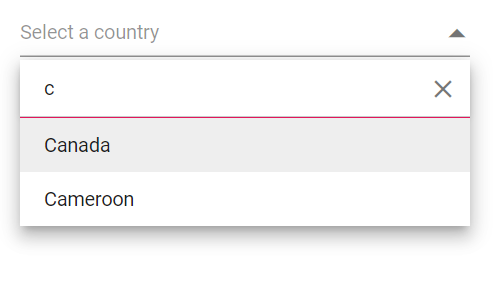
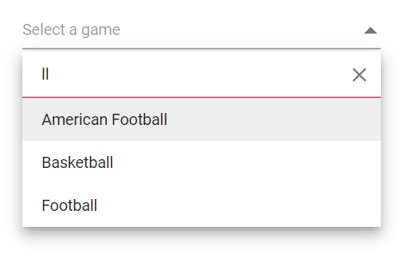
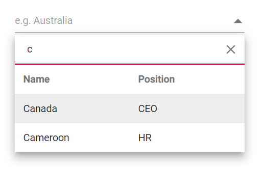
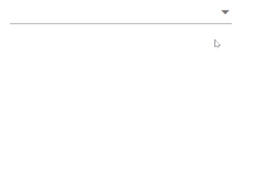

# Filtering in Dropdown List

The DropDownList has built-in support to filter data items when [AllowFiltering](https://help.syncfusion.com/cr/blazor/Syncfusion.Blazor.DropDowns.SfDropDownList-2.html#Syncfusion_Blazor_DropDowns_SfDropDownList_2_AllowFiltering) is enabled. The filter operation starts as soon as you start typing characters in the search box.

## Local data

The following code demonstrates the filtering functionality with local data in the DropDownList component.







## Remote data

For Remote data, each key press, filter action request is made at the server end.

The below code demonstrates the filtering functionality with [ODataAdaptor](https://blazor.syncfusion.com/documentation/data/adaptors#odata-adaptor) in the DropDownList component with help of [Query](https://help.syncfusion.com/cr/blazor/Syncfusion.Blazor.Data.Query.html) property.







## Filter type

You can use [FilterType](https://help.syncfusion.com/cr/blazor/Syncfusion.Blazor.DropDowns.SfDropDownBase-1.html#Syncfusion_Blazor_DropDowns_SfDropDownBase_1_FilterType) property to specify on which filter type needed to be considered on the search action of the component. The available `FilterType` and its supported data types are:

FilterType     | Description
------------ | -------------
  [StartsWith](https://help.syncfusion.com/cr/blazor/Syncfusion.Blazor.DropDowns.FilterType.html#Syncfusion_Blazor_DropDowns_FilterType_StartsWith)       | Checks whether a value begins with the specified value.
  [EndsWith](https://help.syncfusion.com/cr/blazor/Syncfusion.Blazor.DropDowns.FilterType.html#Syncfusion_Blazor_DropDowns_FilterType_EndsWith)     | Checks whether a value ends with specified value.
  [Contains](https://help.syncfusion.com/cr/blazor/Syncfusion.Blazor.DropDowns.FilterType.html#Syncfusion_Blazor_DropDowns_FilterType_Contains)      | Checks whether a value contained with specified value.

In the following example, `EndsWith` filter type has been mapped to the `FilterType` property.







## Case sensitive filtering

The Data items can be filtered with or without case sensitivity using the [DataManager](https://help.syncfusion.com/cr/blazor/Syncfusion.Blazor.Data.SfDataManager.html). This can be done by passing the fourth optional parameter [IgnoreCase](https://help.syncfusion.com/cr/blazor/Syncfusion.Blazor.Data.WhereFilter.html#Syncfusion_Blazor_Data_WhereFilter_IgnoreCase) of the [Where clause](https://help.syncfusion.com/cr/blazor/Syncfusion.Blazor.Data.Query.html#Syncfusion_Blazor_Data_Query_Where_Syncfusion_Blazor_Data_WhereFilter_).

The following example shows how to perform case-sensitive filter.







## Filter textbox placeholder 

You can use [FilterBarPlaceholder](https://help.syncfusion.com/cr/blazor/Syncfusion.Blazor.DropDowns.SfDropDownList-2.html#Syncfusion_Blazor_DropDowns_SfDropDownList_2_FilterBarPlaceholder) to accept the value to be displayed as a watermark text on the filter bar TextBox.







## Custom filtering

DropDownList component filter queries can be customized using [Filter](https://help.syncfusion.com/cr/blazor/Syncfusion.Blazor.DropDowns.DropDownListEvents-2.html#Syncfusion_Blazor_DropDowns_DropDownListEvents_2_Filtering) event. You can also filter the text in multiple columns in the data source.

In the below sample demonstration, filter the data using its `FirstName` or `LastName` field. Hence in the Filtering event, [Predicate](https://help.syncfusion.com/cr/blazor/Syncfusion.Blazor.Data.WhereFilter.html#Syncfusion_Blazor_Data_WhereFilter_Condition) is used with `or` condition for filtering both the fields. 

For instance , the data source item consists of `FirstName` as `Nancy` and `LastName` as `Davalio`. But you can filter the data by typing the `N` or `D` character and it will showcase the `Nancy`(FirstName field) in the popup.







## Multi column filtering 

In the built-in Syncfusion Blazor theme files, support for multi column can be enabled by adding `e-multi-column` class in the [CssClass](https://help.syncfusion.com/cr/blazor/Syncfusion.Blazor.DropDowns.DropDownListModel-2.html#Syncfusion_Blazor_DropDowns_DropDownListModel_2_CssClass) property.







You can achieve multiple column(field) filtering by passing the List of [predicates](https://help.syncfusion.com/cr/blazor/Syncfusion.Blazor.Data.WhereFilter.html#Syncfusion_Blazor_Data_WhereFilter_predicates) to the [And](https://help.syncfusion.com/cr/blazor/Syncfusion.Blazor.Data.WhereFilter.html#Syncfusion_Blazor_Data_WhereFilter_And_Syncfusion_Blazor_Data_WhereFilter_) or [Or](https://help.syncfusion.com/cr/blazor/Syncfusion.Blazor.Data.WhereFilter.html#Syncfusion_Blazor_Data_WhereFilter_Or_Syncfusion_Blazor_Data_WhereFilter_) methods of [WhereFilters](https://help.syncfusion.com/cr/blazor/Syncfusion.Blazor.Data.WhereFilter.html#Syncfusion_Blazor_Data_WhereFilter__ctor).







## Minimum filter length

When filtering the list items, you can set the limit for character count to raise a remote request and fetch filtered data on the DropDownList. This can be done by manual validation by using the [Filtering event arguments](https://help.syncfusion.com/cr/blazor/Syncfusion.Blazor.DropDowns.FilteringEventArgs.html#Syncfusion_Blazor_DropDowns_FilteringEventArgs_Text) within the [Filtering](https://help.syncfusion.com/cr/blazor/Syncfusion.Blazor.DropDowns.DropDownListEvents-2.html#Syncfusion_Blazor_DropDowns_DropDownListEvents_2_Filtering) event handler.

In the following example, the remote request does not fetch the search data until the search key contains three characters.







## Properties

### AllowFiltering   

When [AllowFiltering](https://help.syncfusion.com/cr/blazor/Syncfusion.Blazor.DropDowns.SfDropDownList-2.html#Syncfusion_Blazor_DropDowns_SfDropDownList_2_AllowFiltering) is set to `true`, show the filter bar (search box) of the component.

The filter action retrieves matched items through the `Filtering` event based on the characters typed in the search TextBox.

Default value of AllowFiltering is `false`.

[Click to refer the code for AllowFiltering](https://blazor.syncfusion.com/documentation/dropdown-list/filtering)

### FilterBarPlaceholder

Accepts the value to be displayed as a watermark text on the filter bar. [FilterBarPlaceholder](https://help.syncfusion.com/cr/blazor/Syncfusion.Blazor.DropDowns.SfDropDownList-2.html#Syncfusion_Blazor_DropDowns_SfDropDownList_2_FilterBarPlaceholder) is applicable when [AllowFiltering](https://help.syncfusion.com/cr/blazor/Syncfusion.Blazor.DropDowns.SfDropDownList-2.html#Syncfusion_Blazor_DropDowns_SfDropDownList_2_AllowFiltering) is used as true. `FilterBarPlaceholder` is depends on `AllowFiltering` property.





 

## Methods

### FilterAsync(IEnumerable<TItem>, Query, FieldSettingsModel)  --> filtering

To filter the data from given data source by using query.

#### Declarations

> protected Task FilteringAction(IEnumerable<TItem> dataSource, Query query, FieldSettingsModel fields)

#### Parameters

* [dataSource](https://help.syncfusion.com/cr/blazor/Syncfusion.Blazor.DropDowns.SfDropDownBase-1.html#Syncfusion_Blazor_DropDowns_SfDropDownBase_1_DataSource) - Specifies the data source.
* [query](https://help.syncfusion.com/cr/blazor/Syncfusion.Blazor.DropDowns.SfDropDownBase-1.html#Syncfusion_Blazor_DropDowns_SfDropDownBase_1_Query)	- Specifies the query.
* [fields](https://help.syncfusion.com/cr/blazor/Syncfusion.Blazor.DropDowns.FieldSettingsModel.html) - Specifies the fields.

[Click to refer the code for FilterAsync](https://blazor.syncfusion.com/documentation/dropdown-list/filtering)