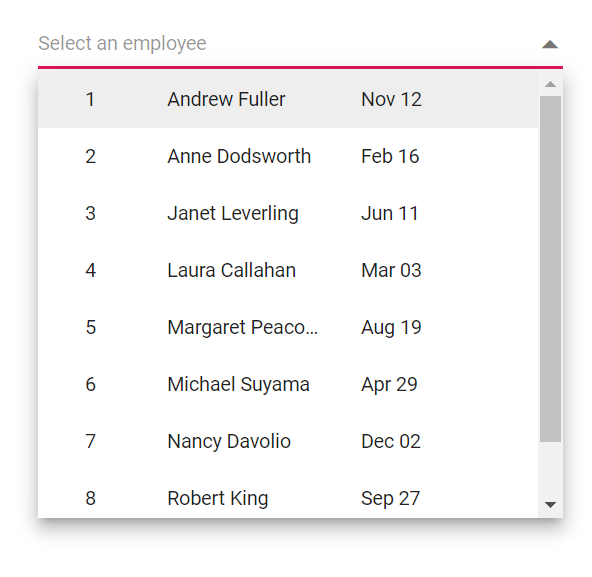

# Multicolumn in Dropdown List 

Provide two or more columns in the popup by using the class name `e-multi-column` to the [CssClass](https://help.syncfusion.com/cr/blazor/Syncfusion.Blazor.DropDowns.SfDropDownList-2.html#Syncfusion_Blazor_DropDowns_SfDropDownList_2_CssClass) property  and the column will be aligned like grid.

* [ItemTemplate](https://blazor.syncfusion.com/documentation/dropdown-list/templates#item-template) – Using `ItemTemplate`, add the columns in the popup.
* [ValueTemplate](https://blazor.syncfusion.com/documentation/dropdown-list/templates#value-template) – Using `ValueTemplate`, display the value of which columns to be updated.

Display the custom text alignment in each column using a built-in class like in the following code example:

* `e-text-center`: Displays the text in the center of the column.
* `e-text-right`: Displays the text in the right side of the column.
* `e-text-left`: Displays the text in the left side of the column.







## Limitation of multicolumn dropdownlist

The component will not support column filtering and sorting, and the column will be alligned as same as grid.
