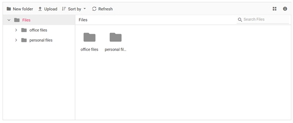
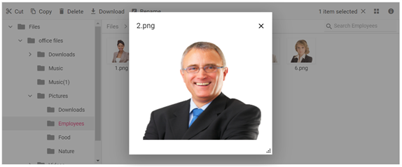

<!-- markdownlint-disable MD024 -->

# Getting Started

This section briefly explains how to include a `File Manager` in your Blazor Server-Side application. Refer to the [Getting Started with Syncfusion Blazor for Server-Side in Visual Studio 2019 page](https://blazor.syncfusion.com/documentation/getting-started/blazor-server-side-visual-studio-2019/) for the introduction and configuring the common specifications.

## Importing Syncfusion Blazor component in the application

### Using Syncfusion.Blazor NuGet Package [New standard]

1. Install **Syncfusion.Blazor.FileManager** NuGet package to the application by using the `NuGet Package Manager`.. Refer to the Individual NuGet Packages section for the available NuGet packages.

2. Search Syncfusion.Blazor.FileManager keyword in the Browse tab and install Syncfusion.Blazor.FileManager NuGet package in the application.

3. Once the installation process is completed, the Syncfusion Blazor FileManager package will be installed in the project.
W> `Syncfusion.Blazor` package should not be installed along with [individual NuGet packages](https://blazor.syncfusion.com/documentation/nuget-packages/). Hence, you have to add the below `Syncfusion.Blazor.Themes` static web assets (styles) in the application.

* You can add the client-side style resources using NuGet package to the `<head>` element of the `~/wwwroot/index.html` page in Blazor WebAssembly app or `~/Pages/_Host.cshtml` page in Blazor Server app.

```html
    <head>
        ....
        ....
       <link href="_content/Syncfusion.Blazor.Themes/bootstrap4.css" rel="stylesheet" />
    </head>
```

W> If you prefer the above new standard (individual NuGet packages), then skip this section. Using both old and new standards in the same application will throw ambiguous compilation errors.

### Using Syncfusion.Blazor NuGet Package [Old standard]

1. Install **Syncfusion.Blazor** NuGet package to the application by using the `NuGet Package Manager`.Right-click the project and then select Manage NuGet Packages.

2. Search Syncfusion.Blazor keyword in the Browse tab and install Syncfusion.Blazor NuGet package in the application.

3. Once the installation process is completed, the Syncfusion Blazor package will be installed in the project.

* You can add the client-side style resources using NuGet package to the `<head>` element of the `~/wwwroot/index.html` page in Blazor WebAssembly app or `~/Pages/_Host.cshtml` page in Blazor Server app.
>Note: You can also add the client-side style resources through CDN.

```html
    <head>
        ....
        ....
        <link href="_content/Syncfusion.Blazor/styles/bootstrap4.css" rel="stylesheet" />
    </head>
```

```html
    <head>
        <link href="https://cdn.syncfusion.com/blazor/{:version:}/styles/bootstrap4.css" rel="stylesheet" />
    </head>
```

* For `Internet Explorer 11` kindly refer the polyfills. Refer the [documentation](https://blazor.syncfusion.com/documentation/common/how-to/render-blazor-server-app-in-ie/) for more information.

```csharp
<head>
    <link href="_content/Syncfusion.Blazor/styles/bootstrap4.css" rel="stylesheet" />
    <script src="https://github.com/Daddoon/Blazor.Polyfill/releases/download/3.0.1/blazor.polyfill.min.js"></script>
</head>
```

## Add Syncfusion Blazor service in Startup.cs (Server-side application)

Open the **Startup.cs** file and add services required by Syncfusion components using `services.AddSyncfusionBlazor()` method. Add this method in the `ConfigureServices` function as follows.

```csharp
using Syncfusion.Blazor;

namespace BlazorApplication
{
    public class Startup
    {
        ....
        ....
        public void ConfigureServices(IServiceCollection services)
        {
            ....
            ....
            services.AddSyncfusionBlazor();
        }
    }
}
```

## Add Syncfusion Blazor service in Program.cs (Client-side application)

Open the **Program.cs** file and add services required by Syncfusion components using `builder.services.AddSyncfusionBlazor()` method. Add this method in the `Main` function as follows.

```csharp
using Syncfusion.Blazor;

namespace BlazorApplication
{
    public class Program
    {
        public static async Task Main(string[] args)
        {
            ....
            ....
            builder.Services.AddSyncfusionBlazor();
        }
    }
}
```

## Adding File Manager component namespace to the application

Open `~/_Imports.razor` file and import the `Syncfusion.Blazor.FileManager` Package.

```csharp
    @using Syncfusion.Blazor
    @using Syncfusion.Blazor.FileManager
```

## Initialize the File Manager component

The File Manager can be rendered with local service, which sends ajax request. The Ajax request will be sent to the server, which then processes the request and sends back the response.

To render the File Manager with local service, refer to the following code snippet.

```csharp
@using Syncfusion.Blazor.FileManager

    <SfFileManager TValue="FileManagerDirectoryContent">
        <FileManagerAjaxSettings Url="/api/SampleData/FileOperations">
        </FileManagerAjaxSettings>
    </SfFileManager>
```

## Initialize the service in controller

File Manager supports the basic file actions like Read, Delete, Copy, Move, Get Details, Search, Rename, and Create New Folder.

To initialize a local service, create a new folder name with `Controllers` inside the server part of the project. Then, create a new file `SampleDataController` with extension `.cs` inside the `Controllers` folder and add the following code in that file.

[Controllers/SampleDataController.cs]

```csharp
using Microsoft.AspNetCore.Mvc;
using System;
using System.Collections.Generic;
using Microsoft.AspNetCore.Hosting;
using Microsoft.AspNetCore.Http;
using Microsoft.AspNetCore.Http.Features;
//File Manager's base functions are available in the below namespace
using Syncfusion.EJ2.FileManager.Base;
//File Manager's operations are available in the below namespace
using Syncfusion.EJ2.FileManager.PhysicalFileProvider;
using Newtonsoft.Json;
using System.Linq;
using System.Threading.Tasks;

namespace filemanager.Server.Controllers
{
    [Route("api/[controller]")]
    public class SampleDataController : Controller
    {
        public PhysicalFileProvider operation;
        public string basePath;
        string root = "wwwroot\\Files";
        [Obsolete]
        public SampleDataController(IHostingEnvironment hostingEnvironment)
        {
            this.basePath = hostingEnvironment.ContentRootPath;
            this.operation = new PhysicalFileProvider();
            this.operation.RootFolder(this.basePath + "\\" + this.root); // It denotes in which files and folders are available.
        }

        // Processing the File Manager operations
        [Route("FileOperations")]
        public object FileOperations([FromBody] FileManagerDirectoryContent args)
        {
            switch (args.Action)
            {
                // Add your custom action here
                case "read":
                    // Path - Current path; ShowHiddenItems - Boolean value to show/hide hidden items
                    return this.operation.ToCamelCase(this.operation.GetFiles(args.Path, args.ShowHiddenItems));
                case "delete":
                    // Path - Current path where of the folder to be deleted; Names - Name of the files to be deleted
                    return this.operation.ToCamelCase(this.operation.Delete(args.Path, args.Names));
                case "copy":
                    //  Path - Path from where the file was copied; TargetPath - Path where the file/folder is to be copied; RenameFiles - Files with same name in the copied location that is confirmed for renaming; TargetData - Data of the copied file
                    return this.operation.ToCamelCase(this.operation.Copy(args.Path, args.TargetPath, args.Names, args.RenameFiles, args.TargetData));
                case "move":
                    // Path - Path from where the file was cut; TargetPath - Path where the file/folder is to be moved; RenameFiles - Files with same name in the moved location that is confirmed for renaming; TargetData - Data of the moved file
                    return this.operation.ToCamelCase(this.operation.Move(args.Path, args.TargetPath, args.Names, args.RenameFiles, args.TargetData));
                case "details":
                    // Path - Current path where details of file/folder is requested; Name - Names of the requested folders
                    return this.operation.ToCamelCase(this.operation.Details(args.Path, args.Names));
                case "create":
                    // Path - Current path where the folder is to be created; Name - Name of the new folder
                    return this.operation.ToCamelCase(this.operation.Create(args.Path, args.Name));
                case "search":
                    // Path - Current path where the search is performed; SearchString - String typed in the searchbox; CaseSensitive - Boolean value which specifies whether the search must be casesensitive
                    return this.operation.ToCamelCase(this.operation.Search(args.Path, args.SearchString, args.ShowHiddenItems, args.CaseSensitive));
                case "rename":
                    // Path - Current path of the renamed file; Name - Old file name; NewName - New file name
                    return this.operation.ToCamelCase(this.operation.Rename(args.Path, args.Name, args.NewName));
            }
            return null;
        }
    }
}
```

To access the above File Operations, you need some model class files that have file operations methods. So, create `Models` folder in `server` part of the application and download the `PhysicalFileProvider.cs` and `Base` folder from the [this](https://github.com/SyncfusionExamples/ej2-aspcore-file-provider/tree/master/Models) link in the Models folder.

Add your required files and folders under the `wwwroot\Files` directory.

>For Server-side application, Add the following code in your **Startup.cs** file.

```csharp
 app.UseEndpoints(endpoints =>
            {
               ....
               ....
                endpoints.MapControllers();
            });
```

### Run the application

After successful compilation of your application, simply press `F5` to run the application.

The FileManager will be in the default web browser with local service as shown in the following image.



## File download support

To perform the download operation, initialize the `DownloadUrl` property in a FileManagerAjaxSettings.

```csharp

@using Syncfusion.Blazor.FileManager

    <SfFileManager TValue="FileManagerDirectoryContent">
        <FileManagerAjaxSettings Url="/api/SampleData/FileOperations"
                                 DownloadUrl="/api/SampleData/Download">
        </FileManagerAjaxSettings>
    </SfFileManager>

```

Initialize the `Download` FileOperation in Controller part with the following code snippet.

[Controllers/SampleDataController.cs]

```csharp

namespace filemanager.Server.Controllers
{
    [Route("api/[controller]")]
    public class SampleDataController : Controller
    {
        // Processing the Download operation
        [Route("Download")]
        public IActionResult Download(string downloadInput)
        {
            //Invoking download operation with the required paramaters
            // path - Current path where the file is downloaded; Names - Files to be downloaded;
            FileManagerDirectoryContent args = JsonConvert.DeserializeObject<FileManagerDirectoryContent>(downloadInput);
            return operation.Download(args.Path, args.Names);
        }
    }
}

```

## File upload support

To perform the upload operation, initialize the `UploadUrl` property in a FileManagerAjaxSettings.

```csharp

@using Syncfusion.Blazor.FileManager

    <SfFileManager TValue="FileManagerDirectoryContent">
        <FileManagerAjaxSettings Url="/api/SampleData/FileOperations"
                                 UploadUrl="/api/SampleData/Upload">
        </FileManagerAjaxSettings>
    </SfFileManager>

```

Initialize the `Upload` File Operation in Controller part with the following code snippet.

[Controllers/SampleDataController.cs]

```csharp

namespace filemanager.Server.Controllers
{
    [Route("api/[controller]")]
    public class SampleDataController : Controller
    {
        // Processing the Upload operation
        [Route("Upload")]
        public IActionResult Upload(string path, IList<IFormFile> uploadFiles, string action)
        {
            //Invoking upload operation with the required paramaters
            // path - Current path where the file is to uploaded; uploadFiles - Files to be uploaded; action - name of the operation(upload)
            FileManagerResponse uploadResponse;
            uploadResponse = operation.Upload(path, uploadFiles, action, null);
            if (uploadResponse.Error != null)
            {
                Response.Clear();
                Response.ContentType = "application/json; charset=utf-8";
                Response.StatusCode = Convert.ToInt32(uploadResponse.Error.Code);
                Response.HttpContext.Features.Get<IHttpResponseFeature>().ReasonPhrase = uploadResponse.Error.Message;
            }
            return Content("");
        }
    }
}

```

## Image preview support

To perform image preview support in the File Manager component,  initialize the `GetImageUrl` property in a FileManagerAjaxSettings.

```csharp

@using Syncfusion.Blazor.FileManager

    <SfFileManager TValue="FileManagerDirectoryContent">
        <FileManagerAjaxSettings Url="/api/SampleData/FileOperations"
                                 GetImageUrl="/api/SampleData/GetImage">
        </FileManagerAjaxSettings>
    </SfFileManager>

```

Initialize the `GetImage` File Operation in Controller part with the following code snippet.

[Controllers/SampleDataController.cs]

```csharp

namespace filemanager.Server.Controllers
{
    [Route("api/[controller]")]
    public class SampleDataController : Controller
    {
        // Processing the GetImage operation
        [Route("GetImage")]
        public IActionResult GetImage(FileManagerDirectoryContent args)
        {
            //Invoking GetImage operation with the required paramaters
            // path - Current path of the image file; Id - Image file id;
            return this.operation.GetImage(args.Path, args.Id, false, null, null);
        }
    }
}

```

The following output will demonstrate the image preview of File Manager.



## Sample application

Refer to the following sample link, which is preconfigured with above steps.

[File Manager with local service](https://www.syncfusion.com/downloads/support/directtrac/general/ze/FileManager1055616812)

## See Also

[Getting Started with Syncfusion Blazor for Client-Side in .NET Core CLI](https://blazor.syncfusion.com/documentation/getting-started/blazor-webassembly-dotnet-cli/)

[Getting Started with Syncfusion Blazor for Client-Side in Visual Studio 2019](https://blazor.syncfusion.com/documentation/getting-started/blazor-webassembly-visual-studio-2019/)

[Getting Started with Syncfusion Blazor for Server-Side in .NET Core CLI](https://blazor.syncfusion.com/documentation/getting-started/blazor-server-side-dotnet-cli/)