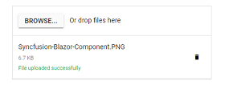
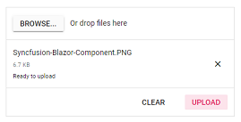
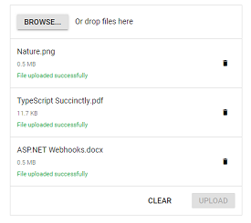

# Asynchronous Upload in Blazor File Upload Component

The uploader component allows you to upload the files asynchronously. The upload process requires save and remove action URL to manage the upload process in the server.
*  The save action is necessary to handle the upload operation.
*  The remove action is optional, one can handle the removed files from server.

N>The name attribute must match the name of a parameter in the POST method. For more information, refer [here](https://docs.microsoft.com/en-us/aspnet/core/mvc/models/file-uploads?view=aspnetcore-3.1#match-name-attribute-value-to-parameter-name-of-post-method). The name attribute is automatically generated from the control’s ID property. If the name attribute differs from the ID property, then you can use the htmlAttributes property to set the name attribute directly to the input element. For more information refer [here](./how-to/html-attributes).

The file can be uploaded automatically or manually. For more information, you can refer to the [Auto Upload](https://help.syncfusion.com/cr/blazor/Syncfusion.Blazor.Inputs.SfUploader.html#Syncfusion_Blazor_Inputs_SfUploader_AutoUpload) section from the documentation.

## Multiple file upload

By Default, the uploader component allows you to select and upload multiple files simultaneously. The selected files are organized in a list for every file selection until you clear it by clicking clear button that is shown in footer. You can add multiple attributes to the original input element of file by enabling the multiple file selection. The following example explains about [AllowMultiple](https://help.syncfusion.com/cr/blazor/Syncfusion.Blazor.Inputs.SfUploader.html#Syncfusion_Blazor_Inputs_SfUploader_AllowMultiple) file upload settings. The [Progressing](https://help.syncfusion.com/cr/blazor/Syncfusion.Blazor.Inputs.UploaderEvents.html#Syncfusion_Blazor_Inputs_UploaderEvents_Progressing) event is triggered during the file uploading process.

### With server-side API endpoint

`SaveUrl` and `RemoveUrl` actions are explained in this [link](./chunk-upload/#save-and-remove-action-for-blazor-aspnet-core-hosted-application).

```cshtml
@using Syncfusion.Blazor.Inputs

<SfUploader ID="UploadFiles">
<UploaderAsyncSettings SaveUrl="api/SampleData/Save" RemoveUrl="api/SampleData/Remove">
</UploaderAsyncSettings>
<UploaderEvents Progressing="@ProgressingHandler"></UploaderEvents>
</SfUploader>
@code {
    private void ProgressingHandler(Syncfusion.Blazor.Inputs.ProgressEventArgs args)
    {
        // Here, you can customize your code.
    }
}
```
### Without server-side API endpoint

```cshtml
@using Syncfusion.Blazor.Inputs
<SfUploader ID="UploadFiles">
      <UploaderEvents ValueChange="@OnChange" Progressing="@ProgressingHandler"></UploaderEvents>
</SfUploader>
@code {
    private async Task OnChange(UploadChangeEventArgs args)
    {
        try
        {
            foreach (var file in args.Files)
            {
                var path = @"D:\" + file.FileInfo.Name;
                FileStream filestream = new FileStream(path, FileMode.Create, FileAccess.Write);
                await file.File.OpenReadStream(long.MaxValue).CopyToAsync(filestream);
                filestream.Close();
            }
        }
        catch (Exception ex)
        {
            Console.WriteLine(ex.Message);
        }
    }
    private void ProgressingHandler(Syncfusion.Blazor.Inputs.ProgressEventArgs args)
    {
        // Here, you can customize your code.
    }
}
```

## Single file upload

You can select and upload a single file by disabling the [AllowMultiple](https://help.syncfusion.com/cr/blazor/Syncfusion.Blazor.Inputs.SfUploader.html#Syncfusion_Blazor_Inputs_SfUploader_AllowMultiple) file selection property. The file list item is removed for every selection and it always maintain a single file to upload. You can remove multiple attributes from the original input element of file by enabling the single file upload property.

The following example explains about single file upload settings.

### With server-side API endpoint

`SaveUrl` and `RemoveUrl` actions are explained in this [link](./chunk-upload/#save-and-remove-action-for-blazor-aspnet-core-hosted-application).

```cshtml
@using Syncfusion.Blazor.Inputs

<SfUploader ID="UploadFiles" AllowMultiple=false>
<UploaderAsyncSettings SaveUrl="api/SampleData/Save" RemoveUrl="api/SampleData/Remove">
</UploaderAsyncSettings>
</SfUploader>
```

### Without server-side API endpoint

```cshtml
@using Syncfusion.Blazor.Inputs
<SfUploader ID="UploadFiles" AllowMultiple=false>
      <UploaderEvents ValueChange="@OnChange"></UploaderEvents>
</SfUploader>
@code {
    private async Task OnChange(UploadChangeEventArgs args)
    {
        try
        {
            foreach (var file in args.Files)
            {
                var path = @"D:\" + file.FileInfo.Name;
                FileStream filestream = new FileStream(path, FileMode.Create, FileAccess.Write);
                await file.File.OpenReadStream(long.MaxValue).CopyToAsync(filestream);
                filestream.Close();
            }
        }
        catch (Exception ex)
        {
            Console.WriteLine(ex.Message);
        }
    }
}
```

## Auto upload

By default, the uploader processes the files to upload once the files are selected and added in upload queue. To upload manually, disable the [AutoUpload](https://help.syncfusion.com/cr/blazor/Syncfusion.Blazor.Inputs.SfUploader.html#Syncfusion_Blazor_Inputs_SfUploader_AutoUpload) property. When you disable this property, you can use the action buttons to call upload all or clear all actions manually. You can change those buttons text using the [Buttons](https://help.syncfusion.com/cr/blazor/Syncfusion.Blazor.Inputs.SfUploader.html#Syncfusion_Blazor_Inputs_SfUploader_Buttons) property in Uploader component. [OnClear](https://help.syncfusion.com/cr/blazor/Syncfusion.Blazor.Inputs.UploaderEvents.html#Syncfusion_Blazor_Inputs_UploaderEvents_OnClear) event triggers before clearing the items in file list when clicking “clear”.

### With server-side API endpoint

`SaveUrl` and `RemoveUrl` actions are explained in this [link](./chunk-upload/#save-and-remove-action-for-blazor-aspnet-core-hosted-application).

```cshtml
@using Syncfusion.Blazor.Inputs

<SfUploader ID="UploadFiles" AllowMultiple=false AutoUpload=false>
<UploaderAsyncSettings SaveUrl="api/SampleData/Save" RemoveUrl="api/SampleData/Remove">
</UploaderAsyncSettings>
<UploaderEvents OnClear="@OnClearHandler"></UploaderEvents>
</SfUploader>
@code {
    private void OnClearHandler(ClearingEventArgs args)
    {
        // Here, you can customize your code.
    }
}
```
### Without server-side API endpoint

```cshtml
@using Syncfusion.Blazor.Inputs
<SfUploader ID="UploadFiles" AllowMultiple=false AutoUpload=false>
      <UploaderEvents ValueChange="@OnChange" OnClear="@OnClearHandler"></UploaderEvents>
</SfUploader>
@code {
    private async Task OnChange(UploadChangeEventArgs args)
    {
        try
        {
            foreach (var file in args.Files)
            {
                var path = @"D:\" + file.FileInfo.Name;
                FileStream filestream = new FileStream(path, FileMode.Create, FileAccess.Write);
                await file.File.OpenReadStream(long.MaxValue).CopyToAsync(filestream);
                filestream.Close();
            }
        }
        catch (Exception ex)
        {
            Console.WriteLine(ex.Message);
        }
    }
    private void OnClearHandler(ClearingEventArgs args)
    {
        // Here, you can customize your code.
    }
}
```






## Sequential upload

By default, the uploader component process multiple files to upload simultaneously. When you enable the [SequentialUpload](https://help.syncfusion.com/cr/blazor/Syncfusion.Blazor.Inputs.SfUploader.html#Syncfusion_Blazor_Inputs_SfUploader_SequentialUpload) property, the selected files will process sequentially (one after the other) to the server. If the file uploaded successfully or failed, the next file will upload automatically in this sequential upload. This feature helps to reduce the upload traffic and reduce the failure of file upload.

### With server-side API endpoint

`SaveUrl` and `RemoveUrl` actions are explained in this [link](./chunk-upload/#save-and-remove-action-for-blazor-aspnet-core-hosted-application).

```cshtml
@using Syncfusion.Blazor.Inputs

<SfUploader ID="UploadFiles" SequentialUpload=true AutoUpload=false>
<UploaderAsyncSettings SaveUrl="api/SampleData/Save" RemoveUrl="api/SampleData/Remove">
</UploaderAsyncSettings>
</SfUploader>
```

### Without server-side API endpoint

```cshtml
@using Syncfusion.Blazor.Inputs
<SfUploader ID="UploadFiles" SequentialUpload=true AutoUpload=false>
      <UploaderEvents ValueChange="@OnChange"></UploaderEvents>
</SfUploader>
@code {
    private async Task OnChange(UploadChangeEventArgs args)
    {
        try
        {
            foreach (var file in args.Files)
            {
                var path = @"D:\" + file.FileInfo.Name;
                FileStream filestream = new FileStream(path, FileMode.Create, FileAccess.Write);
                await file.File.OpenReadStream(long.MaxValue).CopyToAsync(filestream);
                filestream.Close();
            }
        }
        catch (Exception ex)
        {
            Console.WriteLine(ex.Message);
        }
    }
}
```

## Preloaded files

The uploader component allows you to pre-load the list of files that are uploaded in the server. The preloaded files are useful to view and remove the files from server that can be achieved by the [Files](https://help.syncfusion.com/cr/blazor/Syncfusion.Blazor.Inputs.SfUploader.html#Syncfusion_Blazor_Inputs_SfUploader_Files) property. By default, the files are configured with uploaded successfully state on rendering file list. The following properties are mandatory to configure the preloaded files:

* Name
* Size
* Type

### With server-side API endpoint

`SaveUrl` and `RemoveUrl` actions are explained in this [link](./chunk-upload/#save-and-remove-action-for-blazor-aspnet-core-hosted-application).

```cshtml
@using Syncfusion.Blazor.Inputs

<SfUploader ID="UploadFiles" AutoUpload=false>
    <UploaderAsyncSettings SaveUrl="api/SampleData/Save" RemoveUrl="api/SampleData/Remove">
    </UploaderAsyncSettings>
    <UploaderFiles>
        <UploaderUploadedFiles Name="Nature" Size=500000 Type=".png"></UploaderUploadedFiles>
        <UploaderUploadedFiles Name="TypeScript Succinctly" Size=12000 Type=".pdf"></UploaderUploadedFiles>
        <UploaderUploadedFiles Name="ASP.NET Webhooks" Size=500000 Type=".docx"></UploaderUploadedFiles>
    </UploaderFiles>
</SfUploader>
```

### Without server-side API endpoint

```cshtml
@using Syncfusion.Blazor.Inputs
<SfUploader ID="UploadFiles" AutoUpload=false>
<UploaderFiles>
    <UploaderUploadedFiles Name="Nature" Size=500000 Type=".png"></UploaderUploadedFiles>
    <UploaderUploadedFiles Name="TypeScript Succinctly" Size=12000 Type=".pdf"></UploaderUploadedFiles>
    <UploaderUploadedFiles Name="ASP.NET Webhooks" Size=500000 Type=".docx"></UploaderUploadedFiles>
    </UploaderFiles>
    <UploaderEvents ValueChange="@OnChange"></UploaderEvents>
</SfUploader>
@code {
    private async Task OnChange(UploadChangeEventArgs args)
    {
        try
        {
            foreach (var file in args.Files)
            {
                var path = @"D:\" + file.FileInfo.Name;
                FileStream filestream = new FileStream(path, FileMode.Create, FileAccess.Write);
                await file.File.OpenReadStream(long.MaxValue).CopyToAsync(filestream);
                filestream.Close();
            }
        }
        catch (Exception ex)
        {
            Console.WriteLine(ex.Message);
        }
    }
}
```




## See Also

* [Upload files to Database in Blazor](https://github.com/SyncfusionExamples/how-to-upload-files-to-database-in-blazor)
