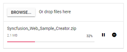
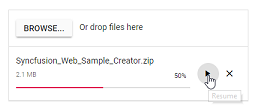
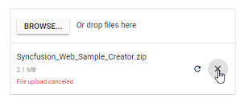

# Chunk Upload in Blazor File Upload Component

The Uploader sends the large file split into small chunks and transmits to the server using AJAX. You can also pause, resume, and retry the failed chunk file.

> The chunk upload works in asynchronous upload only.

To enable the chunk upload, set the size to [ChunkSize](https://help.syncfusion.com/cr/blazor/Syncfusion.Blazor.Inputs.SfUploader.html#Syncfusion_Blazor_Inputs_SfUploader_AsyncSettings) option of the upload and it receives the value in `bytes`.

## Save and remove action for Blazor (ASP.NET Core hosted) application

The Uploader sends the large file split into small chunks and transmits to the server using AJAX. You can also pause, resume, and retry the failed chunk file.

```csharp
[Route("api/[controller]")]

private IHostingEnvironment hostingEnv;

public SampleDataController(IHostingEnvironment env)
{
    this.hostingEnv = env;
}

[HttpPost("[action]")]
public void Save(IList<IFormFile> chunkFile, IList<IFormFile> UploadFiles)
{
    long size = 0;
    try
    {
        foreach (var file in chunkFile)
        {
            var filename = ContentDispositionHeaderValue
                                    .Parse(file.ContentDisposition)
                                    .FileName
                                    .Trim('"');
            filename = hostingEnv.ContentRootPath + $@"\{filename}";
            size += file.Length;
            if (!System.IO.File.Exists(filename))
            {
                using (FileStream fs = System.IO.File.Create(filename))
                {
                    file.CopyTo(fs);
                    fs.Flush();
                }
            }
            else
            {
                using (FileStream fs = System.IO.File.Open(filename, FileMode.Append))
                {
                    file.CopyTo(fs);
                    fs.Flush();
                }
            }
        }
    }
    catch (Exception e)
    {
        Response.Clear();
        Response.StatusCode = 204;
        Response.HttpContext.Features.Get<IHttpResponseFeature>().ReasonPhrase = "File failed to upload";
        Response.HttpContext.Features.Get<IHttpResponseFeature>().ReasonPhrase = e.Message;
    }
}
[HttpPost("[action]")]
public void Remove(IList<IFormFile> UploadFiles)
{
    try
    {
        var filename = hostingEnv.ContentRootPath + $@"\{UploadFiles[0].FileName}";
        if (System.IO.File.Exists(filename))
        {
            System.IO.File.Delete(filename);
        }
    }
    catch (Exception e)
    {
        Response.Clear();
        Response.StatusCode = 200;
        Response.HttpContext.Features.Get<IHttpResponseFeature>().ReasonPhrase = "File removed successfully";
        Response.HttpContext.Features.Get<IHttpResponseFeature>().ReasonPhrase = e.Message;
    }
}
```

```cshtml
@using Syncfusion.Blazor.Inputs

<SfUploader ID="UploadFiles">
    <UploaderAsyncSettings SaveUrl="api/SampleData/Save" RemoveUrl="api/SampleData/Remove" ChunkSize="500000"></UploaderAsyncSettings>
</SfUploader>
```




The chunk upload functionality separates the selected files into blobs of the data or chunks. These chunks are transmitted to the server using an AJAX request. The chunks are sent in **sequential** order, and the next chunk can be sent to the server according to the success of the previous chunk. If any one of the chunks failed, then the remaining chunk cannot be sent to the server. The [ChunkSuccess](https://help.syncfusion.com/cr/blazor/Syncfusion.Blazor.Inputs.UploaderModel.html#Syncfusion_Blazor_Inputs_UploaderModel_ChunkSuccess) or [ChunkFailure](https://help.syncfusion.com/cr/blazor/Syncfusion.Blazor.Inputs.UploaderModel.html#Syncfusion_Blazor_Inputs_UploaderModel_ChunkFailure) event will be triggered when the chunk is sent to the server successfully or failed. If all the chunks are sent to the server successfully, the uploader success event is triggered.

> Chunk upload will work when the selected file size is greater than the specified chunk size. otherwise, it upload the files normally.

## Save action configuration in server-side blazor

The uploader save action configuration in server-side blazor application, using MVC via `UseMvcWithDefaultRoute` in ASP.NET Core 3.0 and `services.AddMvc(option => option.EnableEndpointRouting = false).SetCompatibilityVersion(CompatibilityVersion.Version_3_0)` on IServiceCollection requires an explicit opt-in inside **Startup.cs** page. This is required because MVC must know whether it can rely on the authorization and CORS Middle ware during initialization.

```csharp
using Microsoft.AspNetCore.Mvc;

public void ConfigureServices(IServiceCollection services)
{
    services.AddMvc(option => option.EnableEndpointRouting = false).SetCompatibilityVersion(CompatibilityVersion.Version_3_0);
    services.AddRazorPages();
    services.AddServerSideBlazor();
    services.AddSingleton<WeatherForecastService>();
}

public void Configure(IApplicationBuilder app, IWebHostEnvironment env)
{
    if (env.IsDevelopment())
    {
        app.UseDeveloperExceptionPage();
    }
    else
    {
        app.UseExceptionHandler("/Error");
        app.UseHsts();
    }

    app.UseHttpsRedirection();
    app.UseStaticFiles();

    app.UseRouting();
    app.UseMvcWithDefaultRoute();

    app.UseEndpoints(endpoints =>
    {
        endpoints.MapBlazorHub<App>(selector: "app");
        endpoints.MapFallbackToPage("/_Host");
    });
}
```

## Additional configurations

To modify the chunk upload, the following options can be used.

* **RetryAfterDelay**: If error occurs while sending any chunk request from JavaScript, hold the operation for 500 milliseconds (by default), and retry the operation using chunk. This can be achieved by using the [AsyncSettings](https://help.syncfusion.com/cr/blazor/Syncfusion.Blazor.Inputs.SfUploader.html#Syncfusion_Blazor_Inputs_SfUploader_AsyncSettings) property. You can modify the holding time interval in milliseconds.

* **RetryCount**: Specifies the number of retry actions performed when the file fails to upload. By default, retry action is performed 3 times. If the file fails to upload continuously, the request is
aborted and the uploader [Failure](https://help.syncfusion.com/cr/blazor/Syncfusion.Blazor.Inputs.UploaderModel.html#Syncfusion_Blazor_Inputs_UploaderModel_Failure) event will trigger.

The following sample specifies the chunk upload delay with 3000 milliseconds and the retry count is 5. The failure event is triggered as the wrong saveUrl is used.

`SaveUrl` and `RemoveUrl` actions are explained in this [link](./chunk-upload/#save-and-remove-action-for-blazor-aspnet-core-hosted-application).

```cshtml
@using Syncfusion.Blazor.Inputs

<SfUploader ID="UploadFiles">
    <UploaderAsyncSettings SaveUrl="api/SampleData/Save" RemoveUrl="api/SampleData/Remove" ChunkSize=500000 RetryCount=5 RetryAfterDelay =3000>
</UploaderAsyncSettings>
</SfUploader>
```

## Resumable upload

Allows you to resume an upload operation after a network failure or manually interrupts (pause) the upload. You can perform pause and resume upload actions using public methods (pause and resume) and UI interaction. The pause icon is enabled after the upload begins. 

> The pause and resume features are available only when the chunk upload is enabled.

`SaveUrl` and `RemoveUrl` actions are explained in this [link](./chunk-upload/#save-and-remove-action-for-blazor-aspnet-core-hosted-application).

```cshtml
@using Syncfusion.Blazor.Inputs

<SfUploader ID="UploadFiles">
    <UploaderAsyncSettings SaveUrl="api/SampleData/Save" RemoveUrl="api/SampleData/Remove"  ChunkSize=500000>
</UploaderAsyncSettings>
</SfUploader>
```




## Cancel upload

The uploader component allows you to cancel the uploading file. This can be achieved by clicking the cancel icon or using the `Cancel` method. The [Canceling](https://help.syncfusion.com/cr/blazor/Syncfusion.Blazor.Inputs.UploaderModel.html#Syncfusion_Blazor_Inputs_UploaderModel_Canceling) event will be fired whenever the file upload request is canceled. While canceling the upload request, the partially uploaded file is removed from the server.

When the request fails, the pause icon is changed to retry icon. By clicking the retry icon, sends the failed chunk request again to the server and upload started from where it is failed. You can retry the canceled upload request again using retry UI or `Retry` methods. But, if you retry this, the file upload action again starts from initial.

The following example explains about chunk upload with cancel support.

`SaveUrl` and `RemoveUrl` actions are explained in this [link](./chunk-upload/#save-and-remove-action-for-blazor-aspnet-core-hosted-application).

```cshtml
@using Syncfusion.Blazor.Inputs

<SfUploader ID="UploadFiles">
<UploaderAsyncSettings SaveUrl="api/SampleData/Save" RemoveUrl="api/SampleData/Remove" ChunkSize=500000>
</UploaderAsyncSettings>
</SfUploader>
```




> The retry action has different working behavior for chunk upload and default upload.
> * Chunk upload: Retries to upload the failed request where it is failed previously.
> * Default upload: Retries to upload the failed file again from initial.