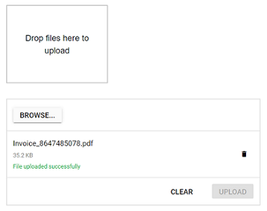

# File Source in Blazor File Upload Component

## Directory upload

The [Blazor File Upload](https://www.syncfusion.com/blazor-components/blazor-file-upload/) component allows you to upload all files in the folders to server by using the [DirectoryUpload](https://help.syncfusion.com/cr/blazor/Syncfusion.Blazor.Inputs.UploaderModel.html#Syncfusion_Blazor_Inputs_UploaderModel_DirectoryUpload) property. When this property is enabled, the uploader component processes the files by iterating through the files and sub-directories in a directory. It allows you to select only folders instead of files to upload.

```cshtml
@using Syncfusion.Blazor.Inputs

<SfUploader ID="UploadFiles" AutoUpload=false DirectoryUpload=true>
    <UploaderAsyncSettings SaveUrl="api/SampleData/Save" RemoveUrl="api/SampleData/Remove"></UploaderAsyncSettings>
</SfUploader>
```

### Save action configration in server-side blazor

The uploader save action configration in server-side blazor application, using MVC via `UseMvcWithDefaultRoute` in ASP.NET Core 3.0 and `services.AddMvc(option => option.EnableEndpointRouting = false).SetCompatibilityVersion(CompatibilityVersion.Version_3_0)` on IServiceCollection requires an explicit opt-in inside **Startup.cs** page. This is required because MVC must know whether it can rely on the authorization and CORS Middleware during initialization.

```csharp
using Microsoft.AspNetCore.Mvc;

    public void ConfigureServices(IServiceCollection services)
    {
        services.AddMvc(option => option.EnableEndpointRouting = false).SetCompatibilityVersion(CompatibilityVersion.Version_3_0);
        services.AddRazorPages();
        services.AddServerSideBlazor();
        services.AddSingleton<WeatherForecastService>();
    }

    public void Configure(IApplicationBuilder app, IWebHostEnvironment env)
    {
        if (env.IsDevelopment())
        {
            app.UseDeveloperExceptionPage();
        }
        else
        {
            app.UseExceptionHandler("/Error");
            app.UseHsts();
        }

        app.UseHttpsRedirection();
        app.UseStaticFiles();

        app.UseRouting();
        app.UseMvcWithDefaultRoute();

        app.UseEndpoints(endpoints =>
        {
            endpoints.MapBlazorHub<App>(selector: "app");
            endpoints.MapFallbackToPage("/_Host");
        });
    }
```

### Server-side configuration for save the files of folders

```csharp
private IHostingEnvironment hostingEnv;
public SampleDataController(IHostingEnvironment env)
{
    this.hostingEnv = env;
}

[HttpPost("[action]")]
public void Save(IList<IFormFile> chunkFile, IList<IFormFile> UploadFiles)
{
    long size = 0;
    try
    {
        foreach (var file in UploadFiles)
            {
                var filename = ContentDispositionHeaderValue
                        .Parse(file.ContentDisposition)
                        .FileName
                        .Trim('"');
                var folders = filename.Split('/');
                var uploaderFilePath = hostingEnv.ContentRootPath;
                    // for Directory upload
            if (folders.Length > 1)
            {
                for (var i = 0; i < folders.Length - 1; i++)
                {
                    var newFolder = uploaderFilePath + $@"\{folders[i]}";
                            Directory.CreateDirectory(newFolder);
                            uploaderFilePath = newFolder;
                            filename = folders[i + 1];
                }
            }
            filename = uploaderFilePath + $@"\{filename}";
            size += file.Length;
            if (!System.IO.File.Exists(filename))
            {
                using (FileStream fs = System.IO.File.Create(filename))
                {
                    file.CopyTo(fs);
                    fs.Flush();
                }

            }
        }
    }
    catch (Exception e)
    {
        Response.Clear();
        Response.StatusCode = 204;
        Response.HttpContext.Features.Get<IHttpResponseFeature>().ReasonPhrase = "File failed to upload";
        Response.HttpContext.Features.Get<IHttpResponseFeature>().ReasonPhrase = e.Message;
    }
}

[HttpPost("[action]")]
public void Remove(IList<IFormFile> UploadFiles)
{
    try
    {
        var filename = hostingEnv.ContentRootPath + $@"\{UploadFiles[0].FileName}";
        if (System.IO.File.Exists(filename))
        {
            System.IO.File.Delete(filename);
        }
    }
    catch (Exception e)
    {
        Response.Clear();
        Response.StatusCode = 200;
        Response.HttpContext.Features.Get<IHttpResponseFeature>().ReasonPhrase = "File removed successfully";
        Response.HttpContext.Features.Get<IHttpResponseFeature>().ReasonPhrase = e.Message;
    }
}
```

## Drag and drop

The uploader component allows you to drag and drop the files to upload. You can drag the files from file explorer and drop into the drop area. By default, the uploader component act as drop area element. The drop area gets highlighted when you drag the files over drop area.

### Custom drop area

The uploader component allows you to set external target element as drop area using the [DropArea](https://help.syncfusion.com/cr/blazor/Syncfusion.Blazor.Inputs.UploaderModel.html#Syncfusion_Blazor_Inputs_UploaderModel_DropArea) property. The element can be represented as HTML element or element’s ID.

`SaveUrl` and `RemoveUrl` action explained in this [link](./chunk-upload/#save-and-remove-action-for-blazor-aspnet-core-hosted-application).

```cshtml
@using Syncfusion.Blazor.Inputs

<div ID="DropArea">
    Drop files here to upload
</div>

<SfUploader ID="UploadFiles" AutoUpload=false DropArea="#DropArea">
    <UploaderAsyncSettings SaveUrl="api/SampleData/Save" RemoveUrl="api/SampleData/Remove"></UploaderAsyncSettings>
</SfUploader>

<style>
#DropArea {
    padding: 50px 25px;
    margin: 30px auto;
    border: 1px solid #c3c3c3;
    text-align: center;
    width: 20%;
    display: inline-flex;
}

.e-file-select,
.e-file-drop {
    display: none;
}

body .e-upload-drag-hover {
    outline: 2px dashed brown;
}

#uploadfile {
    width: 60%;
    display: inline-flex;
    margin-left: 5%;
}
</style>
```

The output will be as follows.



> You can also explore our [Blazor File Upload example](https://blazor.syncfusion.com/demos/file-upload/default-functionalities/) to understand how to browse the files which you want to upload to the server.