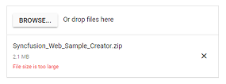

# Validation in Blazor File Upload Component

The uploader component validate the selected files size and extension using the [AllowedExtensions](https://help.syncfusion.com/cr/blazor/Syncfusion.Blazor.Inputs.SfUploader.html#Syncfusion_Blazor_Inputs_SfUploader_AllowedExtensions), [MinFileSize](https://help.syncfusion.com/cr/blazor/Syncfusion.Blazor.Inputs.SfUploader.html#Syncfusion_Blazor_Inputs_SfUploader_MinFileSize) and [MaxFileSize](https://help.syncfusion.com/cr/blazor/Syncfusion.Blazor.Inputs.SfUploader.html#Syncfusion_Blazor_Inputs_SfUploader_MaxFileSize) properties. The files can be validated before uploading to the server and can be ignored on uploading. Also, you can validate the files by setting the HTML attributes to the original input element. The validation process occurs on drag-and-drop the files also.

## File type

You can allow the specific files alone to upload using the [AllowedExtensions](https://help.syncfusion.com/cr/blazor/Syncfusion.Blazor.Inputs.SfUploader.html#Syncfusion_Blazor_Inputs_SfUploader_AllowedExtensions) property. The extension can be represented as collection by comma separators. The uploader component filters the selected or dropped files to match against the specified file types and processes the upload operation. The validation happens when you specify value to inline attribute to accept the original input element.

`SaveUrl` and `RemoveUrl` actions are explained in this [link](./chunk-upload/#save-and-remove-action-for-blazor-aspnet-core-hosted-application).

```cshtml
@using Syncfusion.Blazor.Inputs

<SfUploader ID="UploadFiles" AllowedExtensions=".doc, .docx, .xls, .xlsx">
 <UploaderAsyncSettings SaveUrl="api/SampleData/Save" RemoveUrl="api/SampleData/Remove">
 </UploaderAsyncSettings>
</SfUploader>
```


## File size

The uploader component allows you to validate the files based on its size. The validation helps to restrict uploading large files or empty files to the server. The size can be represented in `bytes`. By default, the uploader component allows you to upload **minimum file size** as 0 byte and **maximum file size** as 28.4 MB using the [MinFileSize](https://help.syncfusion.com/cr/blazor/Syncfusion.Blazor.Inputs.SfUploader.html#Syncfusion_Blazor_Inputs_SfUploader_MinFileSize) and [MaxFileSize](https://help.syncfusion.com/cr/blazor/Syncfusion.Blazor.Inputs.SfUploader.html#Syncfusion_Blazor_Inputs_SfUploader_MaxFileSize) properties.

`SaveUrl` and `RemoveUrl` actions are explained in this [link](./chunk-upload/#save-and-remove-action-for-blazor-aspnet-core-hosted-application).

```cshtml
@using Syncfusion.Blazor.Inputs

<SfUploader ID="UploadFiles" AllowedExtensions=".doc, .docx, .xls, .xlsx"  MinFileSize=10000 MaxFileSize=1000000>
    <UploaderAsyncSettings SaveUrl="api/SampleData/Save" RemoveUrl="api/SampleData/Remove">
    </UploaderAsyncSettings>
</SfUploader>
```


