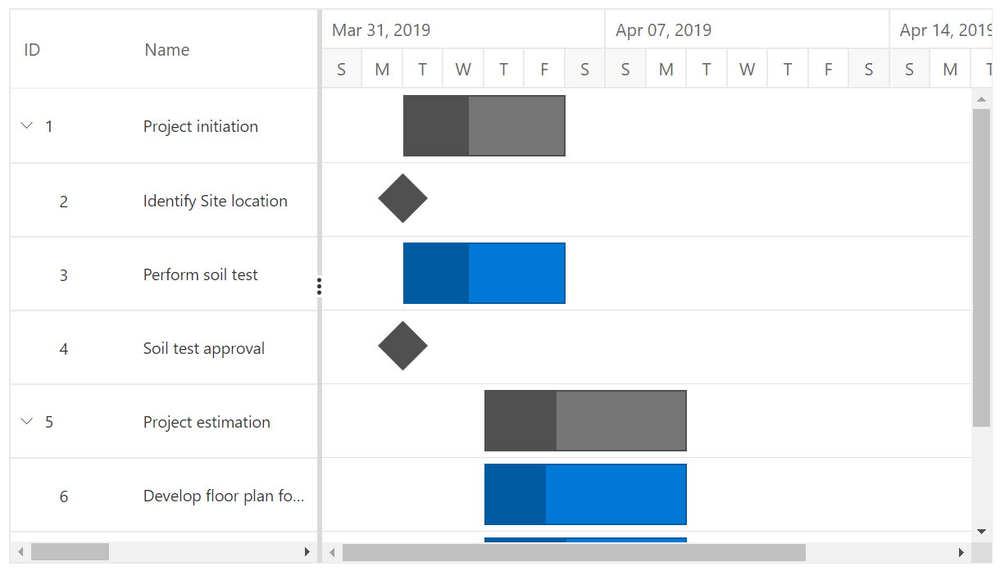
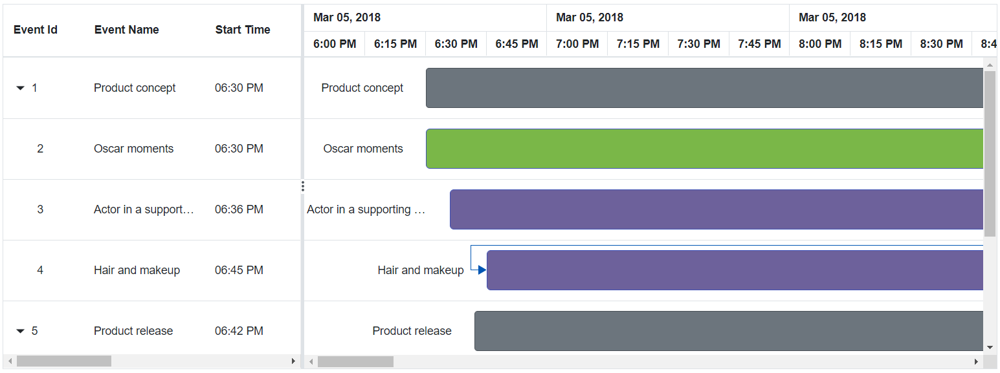
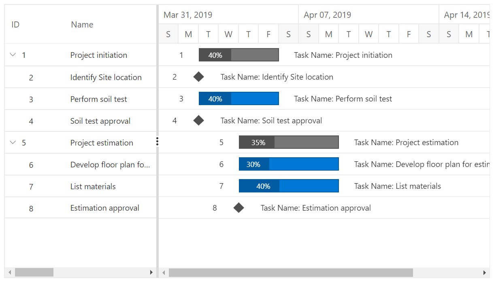
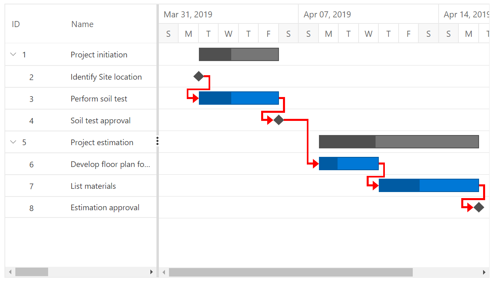
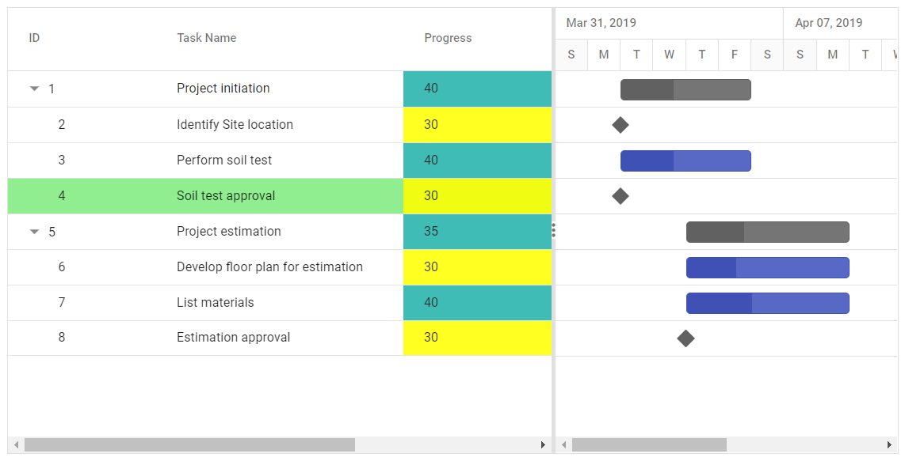
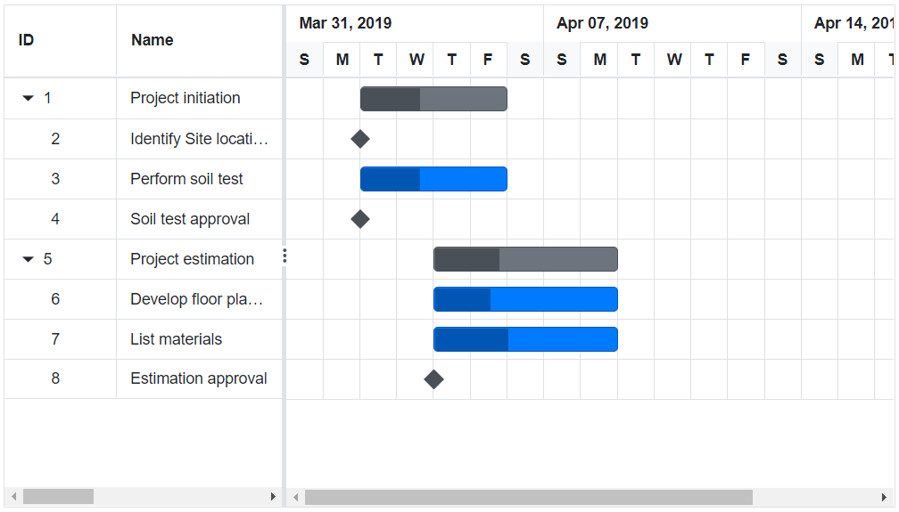
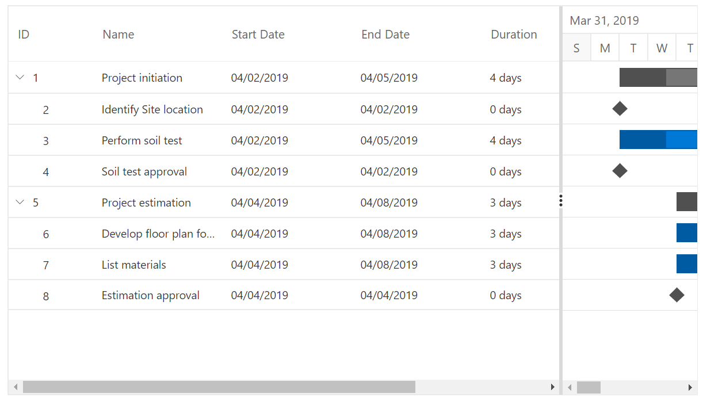
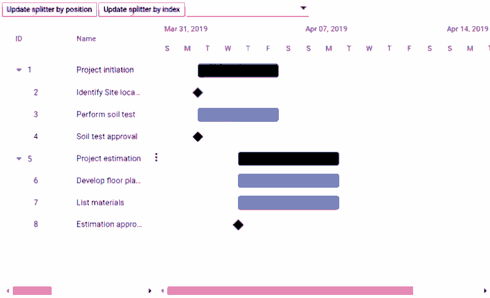

# Appearance And Customization in Blazor Gantt Chart Component

## Taskbar customization

### Taskbar Height

Height of child taskbars and parent taskbars can be customized by using `TaskbarHeight` property. The following code example shows how to use the property.

```cshtml
@using Syncfusion.Blazor.Gantt
<SfGantt DataSource="@TaskCollection" Height="450px" Width="900px" RowHeight=60 TaskbarHeight=50>
    <GanttTaskFields Id="TaskId" Name="TaskName" StartDate="StartDate" EndDate="EndDate"
           Duration="Duration" Progress="Progress" Child="SubTasks">
    </GanttTaskFields>
</SfGantt>
@code{
    public List<TaskData> TaskCollection { get; set; }
    protected override void OnInitialized()
    {
        this.TaskCollection = GetTaskCollection();
    }

    public class TaskData
    {
        public int TaskId { get; set; }
        public string TaskName { get; set; }
        public DateTime StartDate { get; set; }
        public DateTime EndDate { get; set; }
        public string Duration { get; set; }
        public int Progress { get; set; }
        public List<TaskData> SubTasks { get; set; }
    }

    public static List <TaskData> GetTaskCollection() {
    List <TaskData> Tasks = new List <TaskData> () {
        new TaskData() {
            TaskId = 1,
            TaskName = "Project initiation",
            StartDate = new DateTime(2019, 04, 02),
            EndDate = new DateTime(2019, 04, 21),
            SubTasks = (new List <TaskData> () {
                new TaskData() {
                    TaskId = 2,
                    TaskName = "Identify Site location",
                    StartDate = new DateTime(2019, 04, 02),
                    Duration = "0",
                    Progress = 30,
                },
                new TaskData() {
                    TaskId = 3,
                    TaskName = "Perform soil test",
                    StartDate = new DateTime(2019, 04, 02),
                    Duration = "4",
                    Progress = 40,
                },
                new TaskData() {
                    TaskId = 4,
                    TaskName = "Soil test approval",
                    StartDate = new DateTime(2019, 04, 02),
                    Duration = "0",
                    Progress = 30,
                },
            })
        },
        new TaskData() {
            TaskId = 5,
            TaskName = "Project estimation",
            StartDate = new DateTime(2019, 04, 02),
            EndDate = new DateTime(2019, 04, 21),
            SubTasks = (new List <TaskData> () {
                new TaskData() {
                    TaskId = 6,
                    TaskName = "Develop floor plan for estimation",
                    StartDate = new DateTime(2019, 04, 04),
                    Duration = "3",
                    Progress = 30,
                },
                new TaskData() {
                    TaskId = 7,
                    TaskName = "List materials",
                    StartDate = new DateTime(2019, 04, 04),
                    Duration = "3",
                    Progress = 40,
                },
                new TaskData() {
                    TaskId = 8,
                    TaskName = "Estimation approval",
                    StartDate = new DateTime(2019, 04, 04),
                    Duration = "0",
                    Progress = 30
                }
            })
        }
    };

    return Tasks;
}
}
```



> NOTE
The `TaskbarHeight` property accepts only pixel value.

### Taskbar Background

The default taskbar UI can be replaced with custom styles. The following code example shows customizing the taskbar UI in the Gantt Chart component.

```cshtml
@using Syncfusion.Blazor.Gantt
<SfGantt DataSource="@TaskCollection" Height="450px" Width="900px">
    <GanttTaskFields Id="TaskId" Name="TaskName" StartDate="StartDate" EndDate="EndDate"
           Duration="Duration" Progress="Progress" Child="SubTasks">
    </GanttTaskFields>
</SfGantt>
<style>
    .e-gantt-child-taskbar {
        background-color: red !important;
    }
    .e-gantt-parent-taskbar {
        background-color: green !important;
    }
</style>
@code{
    public List<TaskData> TaskCollection { get; set; }
    protected override void OnInitialized()
    {
        this.TaskCollection = GetTaskCollection();
    }

    public class TaskData
    {
        public int TaskId { get; set; }
        public string TaskName { get; set; }
        public DateTime StartDate { get; set; }
        public DateTime EndDate { get; set; }
        public string Duration { get; set; }
        public int Progress { get; set; }
        public List<TaskData> SubTasks { get; set; }
    }

    public static List <TaskData> GetTaskCollection() {
    List <TaskData> Tasks = new List <TaskData> () {
        new TaskData() {
            TaskId = 1,
            TaskName = "Project initiation",
            StartDate = new DateTime(2019, 04, 02),
            EndDate = new DateTime(2019, 04, 21),
            SubTasks = (new List <TaskData> () {
                new TaskData() {
                    TaskId = 2,
                    TaskName = "Identify Site location",
                    StartDate = new DateTime(2019, 04, 02),
                    Duration = "4",
                    Progress = 30,
                },
                new TaskData() {
                    TaskId = 3,
                    TaskName = "Perform soil test",
                    StartDate = new DateTime(2019, 04, 02),
                    Duration = "4",
                    Progress = 40,
                },
                new TaskData() {
                    TaskId = 4,
                    TaskName = "Soil test approval",
                    StartDate = new DateTime(2019, 04, 02),
                    Duration = "3",
                    Progress = 30,
                },
            })
        },
        new TaskData() {
            TaskId = 5,
            TaskName = "Project estimation",
            StartDate = new DateTime(2019, 04, 02),
            EndDate = new DateTime(2019, 04, 21),
            SubTasks = (new List <TaskData> () {
                new TaskData() {
                    TaskId = 6,
                    TaskName = "Develop floor plan for estimation",
                    StartDate = new DateTime(2019, 04, 04),
                    Duration = "3",
                    Progress = 30,
                },
                new TaskData() {
                    TaskId = 7,
                    TaskName = "List materials",
                    StartDate = new DateTime(2019, 04, 04),
                    Duration = "3",
                    Progress = 40,
                },
                new TaskData() {
                    TaskId = 8,
                    TaskName = "Estimation approval",
                    StartDate = new DateTime(2019, 04, 04),
                    Duration = "0",
                    Progress = 30
                }
            })
        }
    };

    return Tasks;
}
}
```


### Taskbar Template

You can design your own taskbars to view the tasks in Gantt Chart Chart by using `GanttTemplates.TaskbarTemplate` property. It is also possible to customize the parent taskbars and milestones with custom templates by using `GanttTemplates.ParentTaskbarTemplate` and `GanttTemplates.MilestoneTemplate` properties.

```cshtml
@using Syncfusion.Blazor.Gantt
<SfGantt RowHeight="75" TaskbarHeight="50"
            ProjectStartDate="@ProjectStart" ProjectEndDate="@ProjectEnd" DurationUnit="DurationUnit.Minute"
            DateFormat="hh:mm tt" DataSource="@TaskCollection" Height="450px" Width="100%">
    <GanttTaskFields Id="TaskId" Name="TaskName" StartDate="StartDate" EndDate="EndDate" Duration="Duration" Dependency="Predecessor" ParentID="ParentId"></GanttTaskFields>
    <GanttColumns>
        <GanttColumn Field="TaskId" HeaderText="Event Id"></GanttColumn>
        <GanttColumn Field="TaskName" HeaderText="Event Name" Width="150"></GanttColumn>
        <GanttColumn Field="StartDate" HeaderText="Start Time"></GanttColumn>
        <GanttColumn Field="EndDate" HeaderText="End Time"></GanttColumn>
        <GanttColumn Field="Winner" HeaderText="Winner"></GanttColumn>
        <GanttColumn Field="Movie" HeaderText="Movie"></GanttColumn>
        <GanttColumn Field="Performance" HeaderText=" Performance" Width="200"></GanttColumn>
    </GanttColumns>
    <GanttLabelSettings LeftLabel="TaskName" TValue="TaskbarTemplateData.TaskbarData">
    </GanttLabelSettings>
    <GanttSplitterSettings Position="30%"> </GanttSplitterSettings>
    <GanttTemplates TValue="TaskbarTemplateData.TaskbarData">
        <TaskbarTemplate>
            @if ((context as TaskbarTemplateData.TaskbarData).TaskName == "Oscar moments")
            {
                <div class="e-gantt-child-taskbar e-custom-moments" style="height:50px;border-radius:5px;">
                    @if (Convert.ToInt64((context as TaskbarTemplateData.TaskbarData).Duration) < 4)
                    {
                        
                    }
                </div>
            }
            else if ((context as TaskbarTemplateData.TaskbarData).TaskName == "Oscar performance")
            {
                <div class="e-gantt-child-taskbar e-custom-performance" style="height:50px;border-radius:5px;">
                    @if (Convert.ToInt64((context as TaskbarTemplateData.TaskbarData).Duration) <= 5)
                    {
                        
                    }
                </div>
            }
            else
            {
                <div class="e-gantt-parent-taskbar e-custom-parent" style="height:50px;border-radius:5px;text-overflow:ellipsis;">
                    @if (Convert.ToInt64((context as TaskbarTemplateData.TaskbarData).Duration) < 4)
                    {
                        
                    }
                    else
                    {
                        @if (!string.IsNullOrEmpty(((context as TaskbarTemplateData.TaskbarData).Winner)) && !string.IsNullOrEmpty(((context as TaskbarTemplateData.TaskbarData).Movie)))
                        {
                            
                            <span class="e-task-label" style="position:absolute; top:13px;font-size:14px;">@((context as TaskbarTemplateData.TaskbarData).Winner)</span>
                            <span class="e-task-label" style="position:absolute;top:33px;font-size:10px;text-overflow:ellipsis;">@((context as TaskbarTemplateData.TaskbarData).Movie)</span>
                        }
                        else if (!string.IsNullOrEmpty(((context as TaskbarTemplateData.TaskbarData).Movie)))
                        {
                            
                            <span class="e-task-label" style="position:absolute; top:18px;font-size:12px;text-overflow:ellipsis;">@((context as TaskbarTemplateData.TaskbarData).Movie)</span>
                        }
                        else
                        {
                            <span class="e-task-label"></span>
                        }
                    }
                </div>
            }
        </TaskbarTemplate>
        <MilestoneTemplate>
            <div style="margin-top:-7px;">
                <div class="e-gantt-milestone" style="position:absolute;">
                    
                    <div class="e-milestone-top" style="border-right-width:26px; margin-top: -24px;border-left-width:26px;border-bottom-width:26px;"></div>
                    <div class="e-milestone-bottom" style="top:26px;border-right-width:26px; border-left-width:26px; border-top-width:26px;"></div>
                </div>
            </div>
        </MilestoneTemplate>
    </GanttTemplates>
    <GanttTimelineSettings TimelineUnitSize="75">
        <GanttTopTierSettings Unit="TimelineViewMode.Hour" Format="MMM dd, yyyy"></GanttTopTierSettings>
        <GanttBottomTierSettings Unit="TimelineViewMode.Minutes" Count="15" Format="h:mm tt"></GanttBottomTierSettings>
    </GanttTimelineSettings>
    <GanttDayWorkingTimeCollection>
        <GanttDayWorkingTime From="0" To="24"></GanttDayWorkingTime>
    </GanttDayWorkingTimeCollection>
</SfGantt>

@code{
    public DateTime ProjectStart = new DateTime(2018, 3, 5, 18, 0, 0);
    public DateTime ProjectEnd = new DateTime(2018, 3, 6, 18, 0, 0);
    public List<TaskbarTemplateData.TaskbarData> TaskCollection { get; set; }
    protected override void OnInitialized()
    {
        this.TaskCollection = TaskbarTemplateData.TaskTemplateData();
    }
    public class TaskbarTemplateData
    {
        public class TaskData
        {
            public int TaskId { get; set; }
            public string TaskName { get; set; }
            public DateTime StartDate { get; set; }
            public DateTime EndDate { get; set; }
            public string Duration { get; set; }
            public int Progress { get; set; }
            public string Predecessor { get; set; }
            public int? ParentId { get; set; }
        }
        public class TaskProperties
        {
            public string TaskName { get; set; }
            public double Duration { get; set; }
        }
        public class TaskbarData : TaskData
        {
            public string Performance { get; set; }
            public string Winner { get; set; }
            public string Movie { get; set; }
            public TaskProperties GanttProperties { get; set; }
        }
        public static List<TaskbarData> TaskTemplateData()
        {
            List<TaskbarData> TaskDataCollection = new List<TaskbarData> {
             new TaskbarData()
            {
                TaskId = 1,
                TaskName = "Product concept",
                StartDate = new DateTime(2018, 03, 05, 18, 0, 0),
                EndDate = new DateTime(2018, 03, 05, 18, 15, 0),
            },
             new TaskbarData()
            {
                TaskId = 2,
                TaskName = "Oscar moments",
                StartDate = new DateTime(2018, 03, 05, 18, 30, 0),
                EndDate = new DateTime(2018, 03, 05, 18, 45, 0),
                Winner = "",
                Performance = "90th Academy awards kicks-off and Jimmy kimmel hosts the show",
                ParentId=1
            },
            new TaskbarData()
            {
                TaskId = 3,
                TaskName = "Actor in a supporting role",
                StartDate = new DateTime(2018, 03, 05, 18, 36, 0),
                EndDate = new DateTime(2018, 03, 05, 18, 42, 0),
                Predecessor = "1",
                Winner = "Sam Rockwell",
                Movie = "Three Billboards Outside Ebbing, Missouri.",
                ParentId=1
            },
             new TaskbarData()
            {
                TaskId = 4,
                TaskName = "Hair and makeup",
                StartDate = new DateTime(2018, 03, 05, 18, 33, 0),
                EndDate = new DateTime(2018, 03, 05, 18, 40, 0),
                Predecessor = "2",
                Movie = "Darkest Hour",
                ParentId=1
            },
            new TaskbarData()
            {
                 TaskId = 5,
                TaskName = "Product release",
                StartDate = new DateTime(2018, 03, 05, 18, 41, 0),
                EndDate = new DateTime(2018, 03, 05, 18, 52, 0),
            },
            new TaskbarData()
            {
                TaskId = 6,
                TaskName = "Costume design",
                StartDate = new DateTime(2018, 03, 05, 18, 59, 0),
                EndDate = new DateTime(2018, 03, 05, 19, 10, 0),
                Predecessor = "3",
                Winner = "Mark Bridges",
                Movie = "Phantom Thread",
                ParentId = 5
            },
            new TaskbarData()
            {
                TaskId = 7,
                TaskName = "Documentary feature",
                StartDate = new DateTime(2018, 03, 05, 19, 11, 0),
                EndDate = new DateTime(2018, 03, 05, 19, 15, 0),
                Predecessor = "4",
                Winner = "Bryan Fogel",
                Movie = "Icarus",
                ParentId = 5
            },
             new TaskbarData()
             {
                 TaskId = 8,
                 TaskName = "Best sound editing and sound mixing",
                  StartDate = new DateTime(2018, 03, 05, 19, 16, 0),
                EndDate = new DateTime(2018, 03, 05, 19, 23, 0),
                 Predecessor = "5",
                 Winner = "Richard King and Alex Gibson",
                 Movie = "Dunkirk",
                 ParentId = 5
             },
             };
            return TaskDataCollection;
        }
    }
}
<style>
    .e-custom-parent {
        background-color: #6d619b;
        border: 1px solid #3f51b5;
    }
    .e-custom-performance {
        background-color: #ad7a66;
        border: 1px solid #3f51b5;
    }
    .e-custom-moments {
        background-color: #7ab748;
        border: 1px solid #3f51b5;
    }
    .moments, .face-mask, .oscar {
        position: relative;
        top: 2px;
        bottom: 2px;
        left: 5px;
        padding-right: 4px;
    }
    .e-milestone-top {
        border-bottom-color: #7ab748 !important;
        border-bottom: 1px solid #3f51b5;
    }
    .e-milestone-bottom {
        border-top-color: #7ab748 !important;
        border-top: 1px solid #3f51b5;
    }
</style>
```



## Task Labels

The Gantt Chart component maps any data source fields to task labels using the `GanttLabelSettings.LeftLabel`, `GanttLabelSettings.RightLabel`, and `GanttLabelSettings.TaskLabel` properties. You can customize the task labels with templates using `GanttLabelSettings.LeftLabelTemplate`, `GanttLabelSettings.RightLabelTemplate` and `GanttLabelSettings.TaskLabelTemplate`

```cshtml
@using Syncfusion.Blazor.Gantt
<SfGantt DataSource="@TaskCollection" Height="450px" Width="900px">
    <GanttTaskFields Id="TaskId" Name="TaskName" StartDate="StartDate" EndDate="EndDate"
                     Duration="Duration" Progress="Progress" Child="SubTasks">
    </GanttTaskFields>
    <GanttLabelSettings LeftLabel="TaskId" TValue="TaskData">
        <RightLabelTemplate>
            <div class="e-right-label-inner-div" style="height:22px;margin-top:7px;">
                <span class="e-label">Task Name: @((context as TaskData).TaskName)</span>
            </div>
        </RightLabelTemplate>
        <TaskLabelTemplate>
            <div class="e-task-label-inner-div" style="line-height:21px; text-align:display:width:px; height:22px;">
                <span class="e-label">@((context as TaskData).Progress)%</span>
            </div>
        </TaskLabelTemplate>
    </GanttLabelSettings>
</SfGantt>
@code{
    public List<TaskData> TaskCollection { get; set; }
    protected override void OnInitialized()
    {
        this.TaskCollection = GetTaskCollection();
    }

    public class TaskData
    {
        public int TaskId { get; set; }
        public string TaskName { get; set; }
        public DateTime StartDate { get; set; }
        public DateTime EndDate { get; set; }
        public string Duration { get; set; }
        public int Progress { get; set; }
        public List<TaskData> SubTasks { get; set; }
    }

    public static List <TaskData> GetTaskCollection() {
    List <TaskData> Tasks = new List <TaskData> () {
        new TaskData() {
            TaskId = 1,
            TaskName = "Project initiation",
            StartDate = new DateTime(2019, 04, 02),
            EndDate = new DateTime(2019, 04, 21),
            SubTasks = (new List <TaskData> () {
                new TaskData() {
                    TaskId = 2,
                    TaskName = "Identify Site location",
                    StartDate = new DateTime(2019, 04, 02),
                    Duration = "3",
                    Progress = 30,
                },
                new TaskData() {
                    TaskId = 3,
                    TaskName = "Perform soil test",
                    StartDate = new DateTime(2019, 04, 02),
                    Duration = "4",
                    Progress = 40,
                },
                new TaskData() {
                    TaskId = 4,
                    TaskName = "Soil test approval",
                    StartDate = new DateTime(2019, 04, 02),
                    Duration = "0",
                    Progress = 30,
                },
            })
        },
        new TaskData() {
            TaskId = 5,
            TaskName = "Project estimation",
            StartDate = new DateTime(2019, 04, 02),
            EndDate = new DateTime(2019, 04, 21),
            SubTasks = (new List <TaskData> () {
                new TaskData() {
                    TaskId = 6,
                    TaskName = "Develop floor plan for estimation",
                    StartDate = new DateTime(2019, 04, 04),
                    Duration = "3",
                    Progress = 30,
                },
                new TaskData() {
                    TaskId = 7,
                    TaskName = "List materials",
                    StartDate = new DateTime(2019, 04, 04),
                    Duration = "3",
                    Progress = 40,
                },
                new TaskData() {
                    TaskId = 8,
                    TaskName = "Estimation approval",
                    StartDate = new DateTime(2019, 04, 04),
                    Duration = "0",
                    Progress = 30
                }
            })
        }
    };

    return Tasks;
}
}
<style>
    .e-label {
        color: white !important;
    }
</style>
```



## Connector lines

The width and background color of connector lines in Gantt Chart can be customized using the `ConnectorLineWidth` and `ConnectorLineBackground` properties. The following code example shows how to use these properties.

```cshtml
@using Syncfusion.Blazor.Gantt
<SfGantt DataSource="@TaskCollection" Height="450px" Width="800px" ConnectorLineWidth="3" ConnectorLineBackground="red">
    <GanttTaskFields Id="TaskId" Name="TaskName" StartDate="StartDate" EndDate="EndDate" Duration="Duration" Progress="Progress" Child="SubTasks" Dependency="Predecessor">
    </GanttTaskFields>
</SfGantt>

@code{
    public List<TaskData> TaskCollection { get; set; }
    protected override void OnInitialized()
    {
        this.TaskCollection = GetTaskCollection();
    }

    public class TaskData
    {
        public int TaskId { get; set; }
        public string TaskName { get; set; }
        public DateTime StartDate { get; set; }
        public DateTime EndDate { get; set; }
        public string Duration { get; set; }
        public int Progress { get; set; }
        public string Predecessor { get; set; }
        public List<TaskData> SubTasks { get; set; }
    }

    public static List <TaskData> GetTaskCollection() {
    List <TaskData> Tasks = new List <TaskData> () {
        new TaskData() {
            TaskId = 1,
            TaskName = "Project initiation",
            StartDate = new DateTime(2019, 04, 02),
            EndDate = new DateTime(2019, 04, 21),
            SubTasks = (new List <TaskData> () {
                new TaskData() {
                    TaskId = 2,
                    TaskName = "Identify Site location",
                    StartDate = new DateTime(2019, 04, 02),
                    Duration = "0",
                    Progress = 30,
                },
                new TaskData() {
                    TaskId = 3,
                    TaskName = "Perform soil test",
                    StartDate = new DateTime(2019, 04, 02),
                    Duration = "4",
                    Progress = 40,
                    Predecessor = "2"
                },
                new TaskData() {
                    TaskId = 4,
                    TaskName = "Soil test approval",
                    StartDate = new DateTime(2019, 04, 02),
                    Duration = "0",
                    Progress = 30,
                    Predecessor = "3"
                },
            })
        },
        new TaskData() {
            TaskId = 5,
            TaskName = "Project estimation",
            StartDate = new DateTime(2019, 04, 02),
            EndDate = new DateTime(2019, 04, 21),
            SubTasks = (new List <TaskData> () {
                new TaskData() {
                    TaskId = 6,
                    TaskName = "Develop floor plan for estimation",
                    StartDate = new DateTime(2019, 04, 04),
                    Duration = "3",
                    Progress = 30,
                    Predecessor = "4"
                },
                new TaskData() {
                    TaskId = 7,
                    TaskName = "List materials",
                    StartDate = new DateTime(2019, 04, 04),
                    Duration = "3",
                    Progress = 40,
                    Predecessor = "6"
                },
                new TaskData() {
                    TaskId = 8,
                    TaskName = "Estimation approval",
                    StartDate = new DateTime(2019, 04, 04),
                    Duration = "0",
                    Progress = 30,
                    Predecessor = "7"
                },
            })
        }
    };

    return Tasks;
}
}
```



## Customize rows and cells

While rendering the Tree Grid part in Gantt Chart, the `RowDataBound` and `QueryCellInfo` events trigger for every row and cell. Using these events, you can customize the rows and cells. The following code example shows how to customize the cell and row elements using these events.

```cshtml
@using Syncfusion.Blazor.Gantt
<SfGantt DataSource="@TaskCollection" Height="450px" Width="900px">
    <GanttTaskFields Id="TaskId" Name="TaskName" StartDate="StartDate" EndDate="EndDate"
           Duration="Duration" Progress="Progress" Child="SubTasks">
    </GanttTaskFields>
    <GanttColumns>
        <GanttColumn Field="TaskId" Width="150"></GanttColumn>
        <GanttColumn Field="TaskName" HeaderText="Task Name" Width="250"></GanttColumn>
        <GanttColumn Field="Progress" Width="150"></GanttColumn>
        <GanttColumn Field="StartDate" HeaderText="Start Date" Width="150"></GanttColumn>
        <GanttColumn Field="Duration" HeaderText="Duration" Width="150"></GanttColumn>
    </GanttColumns>
    <GanttSplitterSettings ColumnIndex=3></GanttSplitterSettings>
    <GanttEvents QueryCellInfo="QueryCellInfo" RowDataBound="RowDataBound" TValue="TaskData"></GanttEvents>
</SfGantt>
<style>
    .custom-row {
        background-color: #90EE90;
    }
    .yellow-cell {
        background-color: #FFFF00;
    }
    .red-cell {
        background-color: #20B2AA;
    }
</style>
@code{
    public void QueryCellInfo(QueryCellInfoEventArgs<TaskData> args)
    {
        if (args.Column.Field == "Progress")
        {
            if (args.Data.Progress == 30)
            {
                args.Cell.AddClass(new string[] { "yellow-cell" });
            }
            else
            {
                args.Cell.AddClass(new string[] { "red-cell" });
            }
        }
    }
    public void RowDataBound(RowDataBoundEventArgs<TaskData> args)
    {
        if(args.Data.TaskId == 4) {
            args.Row.AddClass(new string[] { "custom-row" });
        }
    }
    public List<TaskData> TaskCollection { get; set; }
    protected override void OnInitialized()
    {
        this.TaskCollection = GetTaskCollection();
    }

    public class TaskData
    {
        public int TaskId { get; set; }
        public string TaskName { get; set; }
        public DateTime StartDate { get; set; }
        public DateTime EndDate { get; set; }
        public string Duration { get; set; }
        public int Progress { get; set; }
        public List<TaskData> SubTasks { get; set; }
    }

    public static List <TaskData> GetTaskCollection() {
    List <TaskData> Tasks = new List <TaskData> () {
        new TaskData() {
            TaskId = 1,
            TaskName = "Project initiation",
            StartDate = new DateTime(2019, 04, 02),
            EndDate = new DateTime(2019, 04, 21),
            SubTasks = (new List <TaskData> () {
                new TaskData() {
                    TaskId = 2,
                    TaskName = "Identify Site location",
                    StartDate = new DateTime(2019, 04, 02),
                    Duration = "0",
                    Progress = 30,
                },
                new TaskData() {
                    TaskId = 3,
                    TaskName = "Perform soil test",
                    StartDate = new DateTime(2019, 04, 02),
                    Duration = "4",
                    Progress = 40,
                },
                new TaskData() {
                    TaskId = 4,
                    TaskName = "Soil test approval",
                    StartDate = new DateTime(2019, 04, 02),
                    Duration = "0",
                    Progress = 30,
                },
            })
        },
        new TaskData() {
            TaskId = 5,
            TaskName = "Project estimation",
            StartDate = new DateTime(2019, 04, 02),
            EndDate = new DateTime(2019, 04, 21),
            SubTasks = (new List <TaskData> () {
                new TaskData() {
                    TaskId = 6,
                    TaskName = "Develop floor plan for estimation",
                    StartDate = new DateTime(2019, 04, 04),
                    Duration = "3",
                    Progress = 30,
                },
                new TaskData() {
                    TaskId = 7,
                    TaskName = "List materials",
                    StartDate = new DateTime(2019, 04, 04),
                    Duration = "3",
                    Progress = 40,
                },
                new TaskData() {
                    TaskId = 8,
                    TaskName = "Estimation approval",
                    StartDate = new DateTime(2019, 04, 04),
                    Duration = "0",
                    Progress = 30
                }
            })
        }
    };

    return Tasks;
}
}
```



## Grid lines

In the Gantt Chart component, you can show or hide the grid lines in the Tree Grid side and chart side by using the `GridLines` property.

The following options are available in the Gantt Chart component for rendering the grid lines:

* Horizontal: The horizontal grid lines alone will be visible.
* Vertical: The vertical grid lines alone will be visible.
* Both: Both the horizontal and vertical grid lines will be visible on the Tree Grid and chart sides.
* None: Gridlines will not be visible on Tree Grid and chart sides.

> By default, the `GridLines` property is set to `Horizontal` type.

```cshtml
@using Syncfusion.Blazor.Gantt
<SfGantt DataSource="@TaskCollection" Height="450px" Width="800px" GridLines="Syncfusion.Blazor.Gantt.GridLine.Both">
    <GanttTaskFields Id="TaskId" Name="TaskName" StartDate="StartDate" EndDate="EndDate" Duration="Duration" Progress="Progress" Child="SubTasks">
    </GanttTaskFields>
</SfGantt>

@code{
    public List<TaskData> TaskCollection { get; set; }
    protected override void OnInitialized()
    {
        this.TaskCollection = GetTaskCollection();
    }

    public class TaskData
    {
        public int TaskId { get; set; }
        public string TaskName { get; set; }
        public DateTime StartDate { get; set; }
        public DateTime EndDate { get; set; }
        public string Duration { get; set; }
        public int Progress { get; set; }
        public List<TaskData> SubTasks { get; set; }
    }

    public static List <TaskData> GetTaskCollection() {
    List <TaskData> Tasks = new List <TaskData> () {
        new TaskData() {
            TaskId = 1,
            TaskName = "Project initiation",
            StartDate = new DateTime(2019, 04, 02),
            EndDate = new DateTime(2019, 04, 21),
            SubTasks = (new List <TaskData> () {
                new TaskData() {
                    TaskId = 2,
                    TaskName = "Identify Site location",
                    StartDate = new DateTime(2019, 04, 02),
                    Duration = "0",
                    Progress = 30,
                },
                new TaskData() {
                    TaskId = 3,
                    TaskName = "Perform soil test",
                    StartDate = new DateTime(2019, 04, 02),
                    Duration = "4",
                    Progress = 40,
                },
                new TaskData() {
                    TaskId = 4,
                    TaskName = "Soil test approval",
                    StartDate = new DateTime(2019, 04, 02),
                    Duration = "0",
                    Progress = 30,
                },
            })
        },
        new TaskData() {
            TaskId = 5,
            TaskName = "Project estimation",
            StartDate = new DateTime(2019, 04, 02),
            EndDate = new DateTime(2019, 04, 21),
            SubTasks = (new List <TaskData> () {
                new TaskData() {
                    TaskId = 6,
                    TaskName = "Develop floor plan for estimation",
                    StartDate = new DateTime(2019, 04, 04),
                    Duration = "3",
                    Progress = 30,
                },
                new TaskData() {
                    TaskId = 7,
                    TaskName = "List materials",
                    StartDate = new DateTime(2019, 04, 04),
                    Duration = "3",
                    Progress = 40,
                },
                new TaskData() {
                    TaskId = 8,
                    TaskName = "Estimation approval",
                    StartDate = new DateTime(2019, 04, 04),
                    Duration = "0",
                    Progress = 30,
                },
            })
        }
    };

    return Tasks;
}
}
```



## Splitter

Gantt Chart component consists of both Tree Grid part and Chart part. Splitter is used to resize the Tree Grid section from the Chart section. You can change the position of the Splitter when loading the Gantt Chart component using the `SplitterSettings` property. The following list defines possible values for this property:

| **Splitter Properties** | **Description** |
| --- | --- |
| `GanttSplitterSettings.Position` | This property denotes the percentage of the Tree Grid section’s width to be rendered and this property supports both pixels and percentage values |
| `GanttSplitterSettings.ColumnIndex` | This property defines the splitter position as column index value |
| `GanttSplitterSettings.View` | * `Default`: Shows Grid side and Gantt Chart side. <br /> * `Grid`: Shows Grid side alone in Gantt Chart. <br /> * `Chart`: Shows chart side alone in Gantt Chart. |

```cshtml
@using Syncfusion.Blazor.Gantt
<SfGantt DataSource="@TaskCollection" Height="450px" Width="800px">
    <GanttTaskFields Id="TaskId" Name="TaskName" StartDate="StartDate" EndDate="EndDate" Duration="Duration" Progress="Progress" Child="SubTasks">
    </GanttTaskFields>
    <GanttSplitterSettings Position="80%"></GanttSplitterSettings>
</SfGantt>

@code{
    public List<TaskData> TaskCollection { get; set; }
    protected override void OnInitialized()
    {
        this.TaskCollection = GetTaskCollection();
    }

    public class TaskData
    {
        public int TaskId { get; set; }
        public string TaskName { get; set; }
        public DateTime StartDate { get; set; }
        public DateTime EndDate { get; set; }
        public string Duration { get; set; }
        public int Progress { get; set; }
        public List<TaskData> SubTasks { get; set; }
    }

    public static List <TaskData> GetTaskCollection() {
    List <TaskData> Tasks = new List <TaskData> () {
        new TaskData() {
            TaskId = 1,
            TaskName = "Project initiation",
            StartDate = new DateTime(2019, 04, 02),
            EndDate = new DateTime(2019, 04, 21),
            SubTasks = (new List <TaskData> () {
                new TaskData() {
                    TaskId = 2,
                    TaskName = "Identify Site location",
                    StartDate = new DateTime(2019, 04, 02),
                    Duration = "0",
                    Progress = 30,
                },
                new TaskData() {
                    TaskId = 3,
                    TaskName = "Perform soil test",
                    StartDate = new DateTime(2019, 04, 02),
                    Duration = "4",
                    Progress = 40,
                },
                new TaskData() {
                    TaskId = 4,
                    TaskName = "Soil test approval",
                    StartDate = new DateTime(2019, 04, 02),
                    Duration = "0",
                    Progress = 30,
                },
            })
        },
        new TaskData() {
            TaskId = 5,
            TaskName = "Project estimation",
            StartDate = new DateTime(2019, 04, 02),
            EndDate = new DateTime(2019, 04, 21),
            SubTasks = (new List <TaskData> () {
                new TaskData() {
                    TaskId = 6,
                    TaskName = "Develop floor plan for estimation",
                    StartDate = new DateTime(2019, 04, 04),
                    Duration = "3",
                    Progress = 30,
                },
                new TaskData() {
                    TaskId = 7,
                    TaskName = "List materials",
                    StartDate = new DateTime(2019, 04, 04),
                    Duration = "3",
                    Progress = 40,
                },
                new TaskData() {
                    TaskId = 8,
                    TaskName = "Estimation approval",
                    StartDate = new DateTime(2019, 04, 04),
                    Duration = "0",
                    Progress = 30,
                },
            })
        }
    };

    return Tasks;
}
}
```



### Change splitter position dynamically

In Gantt Chart, we can change the splitter position dynamically by using `SetSplitterPositionAsync` method. We can change the splitter position by passing value and type parameter to `SetSplitterPositionAsync` method. Type parameter will accept one of the following values 'Position', 'ColumnIndex', 'ViewType'. The following code example shows how to use this method.

```cshtml
@using Syncfusion.Blazor.Gantt
@using Syncfusion.Blazor.DropDowns
<button @onclick="UpdateSplitterByPosition">Update splitter by position</button>
<button @onclick="UpdateSplitterByIndex">Update splitter by index</button>
<SfDropDownList TValue="string"  TItem="SplitterView" DataSource="@SplitterViews" Width="200px">
    <DropDownListFieldSettings Value="ID" Text="Text"></DropDownListFieldSettings>
    <DropDownListEvents TValue="string" TItem="SplitterView" ValueChange="OnChange"></DropDownListEvents>
</SfDropDownList>
<SfGantt @ref="Gantt" DataSource="@TaskCollection" Height="450px" Width="800px">
    <GanttTaskFields Id="TaskId" Name="TaskName" StartDate="StartDate" EndDate="EndDate" Duration="Duration" Progress="Progress" Child="SubTasks">
    </GanttTaskFields>
</SfGantt>

@code{
    public SfGantt<TaskData> Gantt;
    public class SplitterView
    {
        public string ID { get; set; }
        public string Text { get; set; }
    }
    public List<SplitterView>SplitterViews = new List<SplitterView>
    {
        new SplitterView() { ID= "Default", Text= "Default" },
        new SplitterView() { ID= "Grid", Text= "Grid" },
        new SplitterView() { ID= "Chart", Text= "Chart" },
    };
    public void OnChange(Syncfusion.Blazor.DropDowns.ChangeEventArgs<string, SplitterView> args)
    {
        if(args.Value == "Grid") {
            this.Gantt.SetSplitterPositionAsync(Syncfusion.Blazor.Gantt.SplitterView.Grid);
        } else if (args.Value == "Chart") {
            this.Gantt.SetSplitterPositionAsync(Syncfusion.Blazor.Gantt.SplitterView.Chart);
        } else {
            this.Gantt.SetSplitterPositionAsync(Syncfusion.Blazor.Gantt.SplitterView.Default);
        }
    }
    public void UpdateSplitterByPosition()
    {
    this.Gantt.SetSplitterPositionAsync("70%");
    }
    public void UpdateSplitterByIndex()
    {
    this.Gantt.SetSplitterPositionAsync(0);
    }
    public List<TaskData> TaskCollection { get; set; }
    protected override void OnInitialized()
    {
        this.TaskCollection = GetTaskCollection();
    }

    public class TaskData
    {
        public int TaskId { get; set; }
        public string TaskName { get; set; }
        public DateTime StartDate { get; set; }
        public DateTime EndDate { get; set; }
        public string Duration { get; set; }
        public int Progress { get; set; }
        public List<TaskData> SubTasks { get; set; }
    }

    public static List <TaskData> GetTaskCollection() {
    List <TaskData> Tasks = new List <TaskData> () {
        new TaskData() {
            TaskId = 1,
            TaskName = "Project initiation",
            StartDate = new DateTime(2019, 04, 02),
            EndDate = new DateTime(2019, 04, 21),
            SubTasks = (new List <TaskData> () {
                new TaskData() {
                    TaskId = 2,
                    TaskName = "Identify Site location",
                    StartDate = new DateTime(2019, 04, 02),
                    Duration = "0",
                    Progress = 30,
                },
                new TaskData() {
                    TaskId = 3,
                    TaskName = "Perform soil test",
                    StartDate = new DateTime(2019, 04, 02),
                    Duration = "4",
                    Progress = 40,
                },
                new TaskData() {
                    TaskId = 4,
                    TaskName = "Soil test approval",
                    StartDate = new DateTime(2019, 04, 02),
                    Duration = "0",
                    Progress = 30,
                },
            })
        },
        new TaskData() {
            TaskId = 5,
            TaskName = "Project estimation",
            StartDate = new DateTime(2019, 04, 02),
            EndDate = new DateTime(2019, 04, 21),
            SubTasks = (new List <TaskData> () {
                new TaskData() {
                    TaskId = 6,
                    TaskName = "Develop floor plan for estimation",
                    StartDate = new DateTime(2019, 04, 04),
                    Duration = "3",
                    Progress = 30,
                },
                new TaskData() {
                    TaskId = 7,
                    TaskName = "List materials",
                    StartDate = new DateTime(2019, 04, 04),
                    Duration = "3",
                    Progress = 40,
                },
                new TaskData() {
                    TaskId = 8,
                    TaskName = "Estimation approval",
                    StartDate = new DateTime(2019, 04, 04),
                    Duration = "0",
                    Progress = 30,
                },
            })
        }
    };

    return Tasks;
}
}
```



> You can refer to our [Blazor Gantt Chart](https://www.syncfusion.com/blazor-components/blazor-gantt-chart) feature tour page for its groundbreaking feature representations. You can also explore our [Blazor Gantt Chart example](https://blazor.syncfusion.com/demos/gantt-chart/default-functionalities?theme=bootstrap4) to knows how to render and configure the gantt.