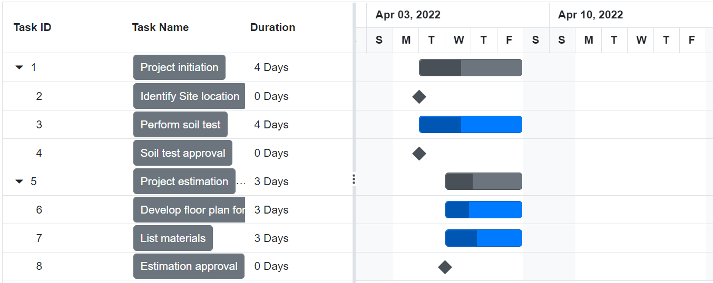

# Column template

A column template is used to customize the column’s look. The following code example explains how to define the custom template in Gantt Chart using the `Template` property.

> The column template feature is used to render the customized element value in the UI for a particular column. The data operations like filtering, sorting, etc., will not work based on the column template values. It will be handled based on the values you have provided to the particular column in the datasource.


```cshtml
@using Syncfusion.Blazor.Gantt
@using Syncfusion.Blazor.Buttons

<SfGantt DataSource="@TaskCollection" Height="450px" Width="100%" HighlightWeekends="true" ProjectStartDate="@ProjectStart" ProjectEndDate="@ProjectEnd">
    <GanttColumns>
        <GanttColumn Field="TaskId" HeaderText="Task ID" MinWidth="150" MaxWidth="250" AllowReordering="false"></GanttColumn>
        <GanttColumn Field="TaskName" HeaderText="Task Name">
            <Template>
                @{
                    @if (context != null)
                    {
                        <SfButton CssClass="e-bigger" Content="@((context as TaskData).TaskName)"></SfButton>
                    }
                }
            </Template>
        </GanttColumn>
        <GanttColumn Field="Duration" HeaderText="Duration"></GanttColumn>
    </GanttColumns>
    <GanttTaskFields Id="TaskId" Name="TaskName" StartDate="StartDate" EndDate="EndDate" Duration="Duration" Progress="Progress" ParentID="ParentId">
    </GanttTaskFields>
</SfGantt>

@code{
    private DateTime ProjectStart = new DateTime(2022, 3, 25);
    private DateTime ProjectEnd = new DateTime(2022, 7, 28);
    private List<TaskData> TaskCollection { get; set; }

    protected override void OnInitialized()
    {
        this.TaskCollection = GetTaskCollection();
    }

    public class TaskData
    {
        public int TaskId { get; set; }
        public string TaskName { get; set; }
        public DateTime? StartDate { get; set; }
        public DateTime? EndDate { get; set; }
        public string Duration { get; set; }
        public int Progress { get; set; }
        public int? ParentId { get; set; }
    }

    public static List<TaskData> GetTaskCollection()
    {
        List<TaskData> Tasks = new List<TaskData>() {
        new TaskData() { TaskId = 1, TaskName = "Project initiation", StartDate = new DateTime(2022, 04, 05), EndDate = new DateTime(2022, 04, 21) },
        new TaskData() { TaskId = 2, TaskName = "Identify Site location", StartDate = new DateTime(2022, 04, 05), Duration = "0", Progress = 30, ParentId = 1 },
        new TaskData() { TaskId = 3, TaskName = "Perform soil test", StartDate = new DateTime(2022, 04, 05), Duration = "4", Progress = 40, ParentId = 1 },
        new TaskData() { TaskId = 4, TaskName = "Soil test approval", StartDate = new DateTime(2022, 04, 05), Duration = "0", Progress = 30, ParentId = 1 },
        new TaskData() { TaskId = 5, TaskName = "Project estimation", StartDate = new DateTime(2022, 04, 06), EndDate = new DateTime(2022, 04, 21) },
        new TaskData() { TaskId = 6, TaskName = "Develop floor plan for estimation", StartDate = new DateTime(2022, 04, 06), Duration = "3", Progress = 30, ParentId = 5 },
        new TaskData() { TaskId = 7, TaskName = "List materials", StartDate = new DateTime(2022, 04, 06), Duration = "3", Progress = 40, ParentId = 5 },
        new TaskData() { TaskId = 8, TaskName = "Estimation approval", StartDate = new DateTime(2022, 04, 06), Duration = "0", Progress = 30, ParentId = 5 }
    };
        return Tasks;
    }
}
```

