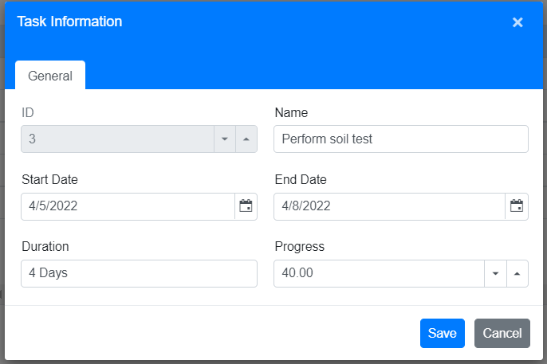
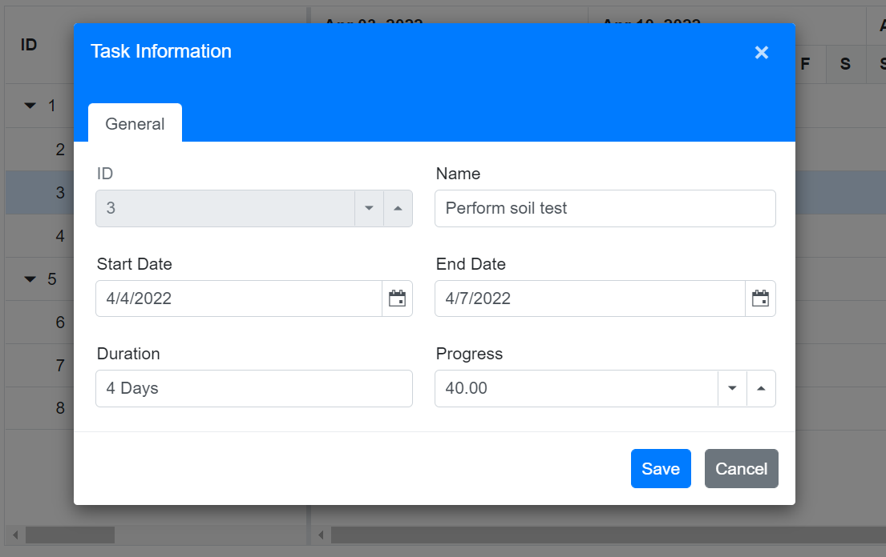
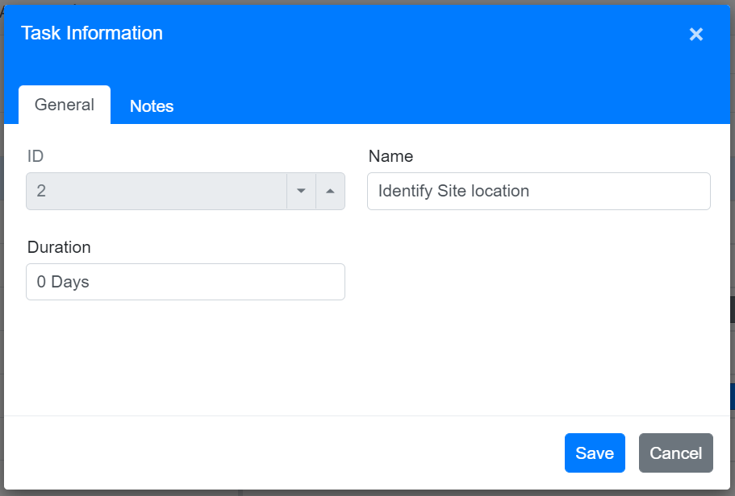
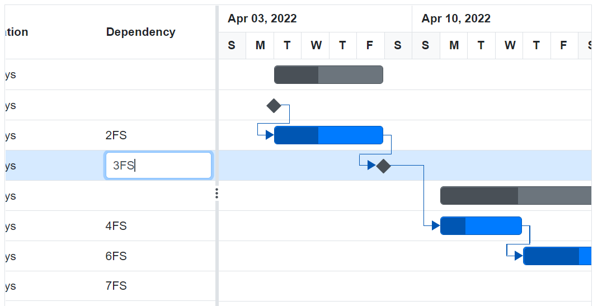
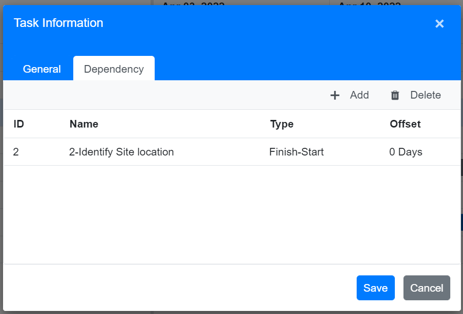
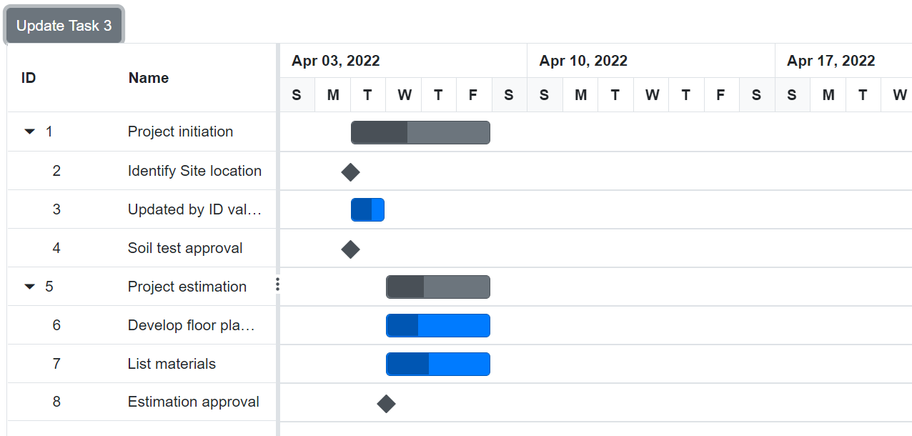

# Editing tasks in Blazor Gantt Chart Component

The editing feature can be enabled in the Gantt Chart component by enabling the [GanttEditSettings.AllowEditing](https://help.syncfusion.com/cr/blazor/Syncfusion.Blazor.Gantt.GanttEditSettings.html#Syncfusion_Blazor_Gantt_GanttEditSettings_AllowEditing) and [GanttEditSettings.AllowTaskbarEditing](https://help.syncfusion.com/cr/blazor/Syncfusion.Blazor.Gantt.GanttEditSettings.html#Syncfusion_Blazor_Gantt_GanttEditSettings_AllowTaskbarEditing) properties.

The following editing options are available to update the tasks in the Gantt chart:
* Cell
* Dialog
* Taskbar

## Cell editing

By setting the edit mode to auto using the [GanttEditSettings.Mode](https://help.syncfusion.com/cr/blazor/Syncfusion.Blazor.Gantt.GanttEditSettings.html#Syncfusion_Blazor_Gantt_GanttEditSettings_Mode) property, the tasks can be edited by double-clicking the Tree Grid cells.

The following code example shows you how to enable the cell editing in Gantt Chart component.

```cshtml
@using Syncfusion.Blazor.Gantt
<SfGantt DataSource="@TaskCollection" Height="450px" Width="900px">
    <GanttTaskFields Id="TaskId" Name="TaskName" StartDate="StartDate" EndDate="EndDate" Duration="Duration" Progress="Progress" ParentID="ParentId">
    </GanttTaskFields>
    <GanttEditSettings AllowEditing="true" Mode="EditMode.Auto"></GanttEditSettings>
</SfGantt>

@code{
    private List<TaskData> TaskCollection { get; set; }
    protected override void OnInitialized()
    {
        this.TaskCollection = GetTaskCollection();
    }

    public class TaskData
    {
        public int TaskId { get; set; }
        public string TaskName { get; set; }
        public DateTime StartDate { get; set; }
        public DateTime EndDate { get; set; }
        public string Duration { get; set; }
        public int Progress { get; set; }
        public int? ParentId { get; set; }
    }

    public static List<TaskData> GetTaskCollection()
    {
        List<TaskData> Tasks = new List<TaskData>()
        {
            new TaskData() { TaskId = 1, TaskName = "Project initiation", StartDate = new DateTime(2022, 04, 05), EndDate = new DateTime(2022, 04, 21), },
            new TaskData() { TaskId = 2, TaskName = "Identify Site location", StartDate = new DateTime(2022, 04, 05), Duration = "0", Progress = 30, ParentId = 1 },
            new TaskData() { TaskId = 3, TaskName = "Perform soil test", StartDate = new DateTime(2022, 04, 05), Duration = "4", Progress = 40, ParentId = 1 },
            new TaskData() { TaskId = 4, TaskName = "Soil test approval", StartDate = new DateTime(2022, 04, 05), Duration = "0", Progress = 30, ParentId = 1 },
            new TaskData() { TaskId = 5, TaskName = "Project estimation", StartDate = new DateTime(2022, 04, 06), EndDate = new DateTime(2022, 04, 21), },
            new TaskData() { TaskId = 6, TaskName = "Develop floor plan for estimation", StartDate = new DateTime(2022, 04, 06), Duration = "3", Progress = 30, ParentId = 5 },
            new TaskData() { TaskId = 7, TaskName = "List materials", StartDate = new DateTime(2022, 04, 06), Duration = "3", Progress = 40, ParentId = 5 },
            new TaskData() { TaskId = 8, TaskName = "Estimation approval", StartDate = new DateTime(2022, 04, 06), Duration = "0", Progress = 30, ParentId = 5 }
        };
        return Tasks;
    }
}
}
```

> When the edit mode is set to `Auto`, double-clicking on the Tree Grid side changes the cells to editable mode. Double-clicking on the chart side opens the edit dialog for editing the task details.

double click action on Tree Grid side


double click action on chart side



## Cell Edit Template

The cell [edit template](https://help.syncfusion.com/cr/blazor/Syncfusion.Blazor.Gantt.GanttColumn.html#Syncfusion_Blazor_Gantt_GanttColumn_EditTemplate) is used to add custom component for a particular column when the column is edited. In the below sample, we have rendered [SfDropDownList](https://help.syncfusion.com/cr/blazor/Syncfusion.Blazor.DropDowns.SfDropDownList-2.html) component for TaskName column and [SfMultiSelect](https://help.syncfusion.com/cr/blazor/Syncfusion.Blazor.DropDowns.SfMultiSelect-2.html) component for Assignee column.

```cshtml
@using Syncfusion.Blazor.Gantt
@using Syncfusion.Blazor.DropDowns
<SfGantt DataSource="@TaskCollection" Height="450px" Width="700px">
    <GanttTaskFields Id="TaskId" Name="TaskName" StartDate="StartDate" EndDate="EndDate" Duration="Duration" Progress="Progress" ParentID="ParentId">
    </GanttTaskFields>
    <GanttColumns>
        <GanttColumn Field="TaskId"></GanttColumn>
        <GanttColumn Field="TaskName">
            <EditTemplate>
                @{
                    var task = (context as TaskData);
                }
                <SfDropDownList DataSource="DropDownDataSource" ID="TaskName" @bind-Value="task.TaskName"></SfDropDownList>
            </EditTemplate>
        </GanttColumn>
        <GanttColumn Field="StartDate"></GanttColumn>
        <GanttColumn Field="EndDate"></GanttColumn>
        <GanttColumn Field="Assignee">
            <EditTemplate>
            @{
                    var task1 = (context as TaskData);
             }
            <SfMultiSelect TValue="string[]" TItem="Employee" @bind-Value="@task1.Assignee" DataSource="@Assignees">
                <MultiSelectFieldSettings Value="Name"></MultiSelectFieldSettings>
            </SfMultiSelect>
            </EditTemplate>
            <Template>
                @{
                    var d = (context as TaskData).Assignee;
                    @if(d != null)
                    {
                        <span>@String.Join(",", d)</span>
                    }
                    
                }
            </Template>
        </GanttColumn>
        <GanttColumn Field="Duration"></GanttColumn>
        <GanttColumn Field="Progress"></GanttColumn>
        
    </GanttColumns>
    <GanttEditSettings AllowEditing="true"></GanttEditSettings>
</SfGantt>

@code{
    
    private List<TaskData> TaskCollection { get; set; }
    public List<string> DropDownDataSource { get; set; }
    
    public class Employee
    {
        public string ID { get; set; }
        public string Name { get; set; }
    }
    List<Employee> Assignees = new List<Employee> {
    new Employee() { ID= "1", Name= "Martin Tamer" },
    new Employee() { ID= "2", Name= "Rose Fuller" },
    new Employee() { ID= "3", Name= "Jack Davolio" },
    new Employee() { ID= "4", Name= "Van Jack"},
    };
    protected override void OnInitialized()
    {
        this.TaskCollection = GetTaskCollection();
        this.DropDownDataSource = TaskCollection.Select(s => s.TaskName).Distinct().ToList();
    }
    
    public class TaskData
    {
        public int TaskId { get; set; }
        public string TaskName { get; set; }
        public DateTime StartDate { get; set; }
        public DateTime EndDate { get; set; }
        public string Duration { get; set; }
        public int Progress { get; set; }
        public string[] Assignee{ get; set; }
        public int? ParentId { get; set; }
    }

    public static List <TaskData> GetTaskCollection() {
    List <TaskData> Tasks = new List <TaskData> () {
        new TaskData() { TaskId = 1, TaskName = "Project initiation", StartDate = new DateTime(2022, 04, 05), EndDate = new DateTime(2022, 04, 21) , Assignee= new string[]{"Van Jack"}},
        new TaskData() { TaskId = 2, TaskName = "Identify Site location", StartDate = new DateTime(2022, 04, 05), Duration = "0", Progress = 30, ParentId = 1 },
        new TaskData() { TaskId = 3, TaskName = "Perform soil test", StartDate = new DateTime(2022, 04, 05), Duration = "4", Progress = 40, ParentId = 1 },
        new TaskData() { TaskId = 4, TaskName = "Soil test approval", StartDate = new DateTime(2022, 04, 05), Duration = "0", Progress = 30, ParentId = 1 },
        new TaskData() { TaskId = 5, TaskName = "Project estimation", StartDate = new DateTime(2022, 04, 06), EndDate = new DateTime(2022, 04, 21) },
        new TaskData() { TaskId = 6, TaskName = "Develop floor plan for estimation", StartDate = new DateTime(2022, 04, 06), Duration = "3", Progress = 30, ParentId = 5 },
        new TaskData() { TaskId = 7, TaskName = "List materials", StartDate = new DateTime(2022, 04, 06), Duration = "3", Progress = 40, ParentId = 5 , Assignee= new string[]{"Rose Fuller"}},
        new TaskData() { TaskId = 8, TaskName = "Estimation approval", StartDate = new DateTime(2022, 04, 06), Duration = "0", Progress = 30, ParentId = 5 }
    };
    return Tasks;
}
}
```

## Dialog editing

Modify the task details through the edit dialog by setting the `GanttEditSettings.Mode` as `Dialog`.

```cshtml
@using Syncfusion.Blazor.Gantt
<SfGantt DataSource="@TaskCollection" Height="450px" Width="900px">
    <GanttTaskFields Id="TaskId" Name="TaskName" StartDate="StartDate" EndDate="EndDate" Duration="Duration" Progress="Progress" ParentID="ParentId">
    </GanttTaskFields>
    <GanttEditSettings AllowEditing="true" Mode="Syncfusion.Blazor.Gantt.EditMode.Dialog"></GanttEditSettings>
</SfGantt>

@code{
    private List<TaskData> TaskCollection { get; set; }
    protected override void OnInitialized()
    {
        this.TaskCollection = GetTaskCollection();
    }

    public class TaskData
    {
        public int TaskId { get; set; }
        public string TaskName { get; set; }
        public DateTime StartDate { get; set; }
        public DateTime EndDate { get; set; }
        public string Duration { get; set; }
        public int Progress { get; set; }
        public int? ParentId { get; set; }
    }

    public static List<TaskData> GetTaskCollection()
    {
        List<TaskData> Tasks = new List<TaskData>() 
        {
            new TaskData() { TaskId = 1, TaskName = "Project initiation", StartDate = new DateTime(2022, 04, 05), EndDate = new DateTime(2022, 04, 21), },
            new TaskData() { TaskId = 2, TaskName = "Identify Site location", StartDate = new DateTime(2022, 04, 05), Duration = "0", Progress = 30, ParentId = 1 },
            new TaskData() { TaskId = 3, TaskName = "Perform soil test", StartDate = new DateTime(2022, 04, 05), Duration = "4", Progress = 40, ParentId = 1 },
            new TaskData() { TaskId = 4, TaskName = "Soil test approval", StartDate = new DateTime(2022, 04, 05), Duration = "0", Progress = 30, ParentId = 1 },
            new TaskData() { TaskId = 5, TaskName = "Project estimation", StartDate = new DateTime(2022, 04, 06), EndDate = new DateTime(2022, 04, 21), },
            new TaskData() { TaskId = 6, TaskName = "Develop floor plan for estimation", StartDate = new DateTime(2022, 04, 06), Duration = "3", Progress = 30, ParentId = 5 },
            new TaskData() { TaskId = 7, TaskName = "List materials", StartDate = new DateTime(2022, 04, 06), Duration = "3", Progress = 40, ParentId = 5 },
            new TaskData() { TaskId = 8, TaskName = "Estimation approval", StartDate = new DateTime(2022, 04, 06), Duration = "0", Progress = 30, ParentId = 5 }
        };
        return Tasks;
    }
}
```

`Note:` In dialog editing mode, the edit dialog appears when the Tree Grid or Gantt chart sides are double-clicked.



### Sections or tabs in Dialog

In the Gantt Chart dialog, you can define the required tabs or editing sections using the [GanttAddDialogFields](https://help.syncfusion.com/cr/blazor/Syncfusion.Blazor.Gantt.GanttAddDialogFields.html) and [GanttEditDialogFields](https://help.syncfusion.com/cr/blazor/Syncfusion.Blazor.Gantt.GanttEditDialogFields.html) properties. Every tab is defined using the `GanttAddDialogField.Type` or `GanttEditDialogField.Type` property.

```cshtml
@using Syncfusion.Blazor.Gantt
<SfGantt DataSource="@TaskCollection" Toolbar="@(new List<string>() { "Add", "Edit" })" Height="450px" Width="700px">
    <GanttTaskFields Id="TaskId" Name="TaskName" StartDate="StartDate" EndDate="EndDate"
                     Duration="Duration" Progress="Progress" ParentID="ParentId" ResourceInfo="ResourceId" Notes="Notes"
                     Dependency="Predecessor">
    </GanttTaskFields>
    <GanttResourceFields TResources="TaskResources" Name="ResourceName" Id="ResourceId" Resources="@ResourceCollection"></GanttResourceFields>
    <GanttEditSettings AllowAdding="true" AllowEditing="true" Mode="Syncfusion.Blazor.Gantt.EditMode.Dialog">
    </GanttEditSettings>
    <GanttEditDialogFields>
        <GanttEditDialogField Type="GanttDialogFieldType.General" HeaderText="General">
        </GanttEditDialogField>
        <GanttEditDialogField Type="GanttDialogFieldType.Dependency"></GanttEditDialogField>
        <GanttEditDialogField Type="GanttDialogFieldType.Resources"></GanttEditDialogField>
        <GanttEditDialogField Type="GanttDialogFieldType.Notes"></GanttEditDialogField>
    </GanttEditDialogFields>
    <GanttAddDialogFields>
        <GanttAddDialogField Type="GanttDialogFieldType.General" HeaderText="General Tab"></GanttAddDialogField>
        <GanttAddDialogField Type="GanttDialogFieldType.Dependency"></GanttAddDialogField>
    </GanttAddDialogFields>
</SfGantt>

@code{
    private List<TaskData> TaskCollection { get; set; }
    private List<TaskResources> ResourceCollection { get; set; }
    protected override void OnInitialized()
    {
        this.TaskCollection = GetTaskCollection();
        this.ResourceCollection = GetResourceCollections();
    }

    public class TaskData
    {
        public int TaskId { get; set; }
        public string TaskName { get; set; }
        public DateTime StartDate { get; set; }
        public DateTime EndDate { get; set; }
        public string Duration { get; set; }
        public int Progress { get; set; }
        public int? ParentId { get; set; }
        public List<TaskResources> ResourceId { get; set; }
        public string Notes { get; set; }
        public string Predecessor { get; set; }
    }
    public class TaskResources
    {
        public int ResourceId { get; set; }
        public string ResourceName { get; set; }
    }

    public static List <TaskResources> GetResourceCollections() {
    List <TaskResources> Resources = new List <TaskResources> () {
        new TaskResources() { ResourceId = 1, ResourceName = "Martin Tamer" },
        new TaskResources() { ResourceId = 2, ResourceName = "Rose Fuller" },
        new TaskResources() { ResourceId = 3, ResourceName = "Margaret Buchanan" },
        new TaskResources() { ResourceId = 4, ResourceName = "Fuller King" },
        new TaskResources() { ResourceId= 5, ResourceName= "Davolio Fuller" },
    };
    return Resources;
}

    public static List<TaskData> GetTaskCollection()
    {
        List<TaskData> Tasks = new List<TaskData>()
        {
            new TaskData() { TaskId = 1, TaskName = "Project initiation", StartDate = new DateTime(2022, 04, 05), EndDate = new DateTime(2022, 04, 21), },
            new TaskData() { TaskId = 2, TaskName = "Identify Site location", StartDate = new DateTime(2022, 04, 05), Duration = "0", Progress = 30, ResourceId = new List<TaskResources>(){ new TaskResources() { ResourceId=1} }, Notes = "Measure the total property area alloted for construction", ParentId = 1 },
            new TaskData() { TaskId = 3, TaskName = "Perform soil test", StartDate = new DateTime(2022, 04, 05), Duration = "4", Predecessor = "2", ResourceId = new List<TaskResources>(){ new TaskResources() { ResourceId=2}, new TaskResources() { ResourceId=3} }, Notes = "Obtain an engineered soil test of a plot where construction is planned from an engineer or company specializing in soil testing", ParentId = 1 },
            new TaskData() { TaskId = 4, TaskName = "Soil test approval", StartDate = new DateTime(2022, 04, 05), Duration = "0", Progress = 30, Predecessor = "3", ParentId = 1 },
            new TaskData() { TaskId = 5, TaskName = "Project estimation", StartDate = new DateTime(2022, 04, 06), EndDate = new DateTime(2022, 04, 21), },
            new TaskData() { TaskId = 6, TaskName = "Develop floor plan for estimation", StartDate = new DateTime(2022, 04, 06), Duration = "3", Progress = 30, Predecessor = "4", ResourceId = new List<TaskResources>(){ new TaskResources() { ResourceId=4}}, Notes = "Develop floor plans and obtain a materials list for estimations", ParentId = 5 },
            new TaskData() { TaskId = 7, TaskName = "List materials", StartDate = new DateTime(2022, 04, 06), Duration = "3", Predecessor = "6", Notes = "", ParentId = 5 },
            new TaskData() { TaskId = 8, TaskName = "Estimation approval", StartDate = new DateTime(2022, 04, 06), Duration = "0", Predecessor = "7", ResourceId = new List<TaskResources>(){ new TaskResources() { ResourceId=1}, new TaskResources() { ResourceId=5} }, Notes = "", ParentId = 5 }
        };
        return Tasks;
    }
}
```

Tabs in Edit Dialog


Tabs in Add Dialog


### Limiting data fields in general tab

In the Gantt Chart dialog, you can make only specific data source fields visible for editing by using the `GanttAddDialogFields` and `GanttEditDialogFields` properties. The data fields are defined with `GanttEditDialogField.Type` and `GanttEditDialogField.Fields` properties.

`Note:` You can also define the custom fields in the add/edit dialog General tab using the `Fields` property.

```cshtml
@using Syncfusion.Blazor.Gantt
<SfGantt DataSource="@TaskCollection" Toolbar="@(new List<string>() { "Add", "Edit" })" Height="450px" Width="700px">
    <GanttTaskFields Id="TaskId" Name="TaskName" StartDate="StartDate" EndDate="EndDate"
                     Duration="Duration" Progress="Progress" ParentID="ParentId" ResourceInfo="ResourceId" Notes="Notes"
                     Dependency="Predecessor">
    </GanttTaskFields>
    <GanttResourceFields TResources="TaskResources" Name="ResourceName" Id="ResourceId" Resources="@ResourceCollections"></GanttResourceFields>
    <GanttEditSettings AllowAdding="true" AllowEditing="true" Mode="Syncfusion.Blazor.Gantt.EditMode.Dialog">
    </GanttEditSettings>
    <GanttColumns>
        <GanttColumn Field="TaskId" Width="100"></GanttColumn>
        <GanttColumn Field="TaskName"></GanttColumn>
        <GanttColumn Field="StartDate"></GanttColumn>
        <GanttColumn Field="Duration"></GanttColumn>
        <GanttColumn Field="Progress"></GanttColumn>
    </GanttColumns>
    <GanttEditDialogFields>
        <GanttEditDialogField Type="GanttDialogFieldType.General" HeaderText="General"
               Fields="@(new string[]{ "TaskId", "TaskName", "Duration" })"></GanttEditDialogField>
        <GanttEditDialogField Type="GanttDialogFieldType.Notes"></GanttEditDialogField>
    </GanttEditDialogFields>
    <GanttAddDialogFields>
        <GanttAddDialogField Type="GanttDialogFieldType.General" HeaderText="General Tab"
                Fields="@(new string[]{ "TaskId", "TaskName", "Duration" })"></GanttAddDialogField>
        <GanttAddDialogField Type="GanttDialogFieldType.Dependency"></GanttAddDialogField>
    </GanttAddDialogFields>
</SfGantt>

@code{
    private List<TaskData> TaskCollection { get; set; }
    private List<TaskResources> ResourceCollections { get; set; }
    protected override void OnInitialized()
    {
        this.TaskCollection = GetTaskCollection();
        this.ResourceCollections = GetResourceCollections();
    }

    public class TaskData
    {
        public int TaskId { get; set; }
        public string TaskName { get; set; }
        public DateTime StartDate { get; set; }
        public DateTime EndDate { get; set; }
        public string Duration { get; set; }
        public int Progress { get; set; }
        public int? ParentId { get; set; }
        public List<TaskResources> ResourceId { get; set; }
        public string Notes { get; set; }
        public string Predecessor { get; set; }
    }
    public class TaskResources
    {
        public int ResourceId { get; set; }
        public string ResourceName { get; set; }
    }

    public static List <TaskResources> GetResourceCollections() {
    List <TaskResources> Resources = new List <TaskResources> () {
        new TaskResources() { ResourceId = 1, ResourceName = "Martin Tamer" },
        new TaskResources() { ResourceId = 2, ResourceName = "Rose Fuller" },
        new TaskResources() { ResourceId = 3, ResourceName = "Margaret Buchanan" },
        new TaskResources() { ResourceId = 4, ResourceName = "Fuller King" },
        new TaskResources() { ResourceId= 5, ResourceName= "Davolio Fuller" },
    };
    return Resources;
}

    public static List<TaskData> GetTaskCollection()
    {
        List<TaskData> Tasks = new List<TaskData>()
        {
            new TaskData() { TaskId = 1, TaskName = "Project initiation", StartDate = new DateTime(2022, 04, 05), EndDate = new DateTime(2022, 04, 21), },
            new TaskData() { TaskId = 2, TaskName = "Identify Site location", StartDate = new DateTime(2022, 04, 05), Duration = "0", Progress = 30, ResourceId = new List<TaskResources>(){ new TaskResources() { ResourceId=1} }, Notes = "Measure the total property area alloted for construction", ParentId = 1 },
            new TaskData() { TaskId = 3, TaskName = "Perform soil test", StartDate = new DateTime(2022, 04, 05), Duration = "4", Predecessor = "2", ResourceId = new List<TaskResources>(){ new TaskResources() { ResourceId=2}, new TaskResources() { ResourceId=3} }, Notes = "Obtain an engineered soil test of a plot where construction is planned from an engineer or company specializing in soil testing", ParentId = 1 },
            new TaskData() { TaskId = 4, TaskName = "Soil test approval", StartDate = new DateTime(2022, 04, 05), Duration = "0", Progress = 30, Predecessor = "3", ParentId = 1 },
            new TaskData() { TaskId = 5, TaskName = "Project estimation", StartDate = new DateTime(2022, 04, 06), EndDate = new DateTime(2022, 04, 21), },
            new TaskData() { TaskId = 6, TaskName = "Develop floor plan for estimation", StartDate = new DateTime(2022, 04, 06), Duration = "3", Progress = 30, Predecessor = "4", ResourceId = new List<TaskResources>(){ new TaskResources() { ResourceId=4}}, Notes = "Develop floor plans and obtain a materials list for estimations", ParentId = 5 },
            new TaskData() { TaskId = 7, TaskName = "List materials", StartDate = new DateTime(2022, 04, 06), Duration = "3", Predecessor = "6", Notes = "", ParentId = 5 },
            new TaskData() { TaskId = 8, TaskName = "Estimation approval", StartDate = new DateTime(2022, 04, 06), Duration = "0", Predecessor = "7", ResourceId = new List<TaskResources>(){ new TaskResources() { ResourceId=1}, new TaskResources() { ResourceId=5} }, Notes = "", ParentId = 5 }
        };
        return Tasks;
    }  
}
```

The following screenshot show the output of above code example.




## Prevent editing for specific tasks

On the taskbar edit action, the [TaskbarEditing](https://help.syncfusion.com/cr/blazor/Syncfusion.Blazor.Gantt.GanttEvents-1.html#Syncfusion_Blazor_Gantt_GanttEvents_1_TaskbarEditing) event will be triggered. You can prevent the taskbar from editing using the `TaskbarEditing` event. This can be done by setting the [Cancel](https://help.syncfusion.com/cr/blazor/Syncfusion.Blazor.Gantt.TaskbarEditingEventArgs-1.html#Syncfusion_Blazor_Gantt_TaskbarEditingEventArgs_1_Cancel) property of the taskbarEditing event argument to true.

For more information, refer to the following:
```cshtml
@using Syncfusion.Blazor.Gantt

<SfGantt DataSource="@TaskCollection" Height="350px" Width="700px">
    <GanttTaskFields Id="TaskId" Name="TaskName" StartDate="StartDate" EndDate="EndDate" Duration="Duration" Progress="Progress" ParentID="ParentId" Dependency="Predecessor">
    </GanttTaskFields>
    <GanttEditSettings AllowTaskbarEditing="true"></GanttEditSettings>
    <GanttEvents TaskbarEditing="TaskbarBeginEditHandler" TValue="TaskData"></GanttEvents>
</SfGantt>

@code{
    private void TaskbarBeginEditHandler(TaskbarEditingEventArgs<TaskData> args)
    {
        if(args.Data.TaskId == 3)
            args.Cancel = true;
    }

    private List<TaskData> TaskCollection { get; set; }
    protected override void OnInitialized()
    {
        this.TaskCollection = GetTaskCollection();
    }

    public class TaskData
    {
        public int TaskId { get; set; }
        public string TaskName { get; set; }
        public DateTime StartDate { get; set; }
        public DateTime EndDate { get; set; }
        public string Duration { get; set; }
        public int Progress { get; set; }
        public string Predecessor { get; set; }
        public int? ParentId { get; set; }
    }

    public static List<TaskData> GetTaskCollection()
    {
        List<TaskData> Tasks = new List<TaskData>()
        {
            new TaskData() { TaskId = 1, TaskName = "Project initiation", StartDate = new DateTime(2019, 04, 05), EndDate = new DateTime(2019, 04, 21), },
            new TaskData() { TaskId = 2, TaskName = "Identify Site location", StartDate = new DateTime(2019, 04, 05), Duration = "0", Progress = 30, ParentId = 1 },
            new TaskData() { TaskId = 3, TaskName = "Perform soil test", StartDate = new DateTime(2019, 04, 05), Duration = "4", Progress = 40, Predecessor = "2", ParentId = 1 },
            new TaskData() { TaskId = 4, TaskName = "Soil test approval", StartDate = new DateTime(2019, 04, 05), Duration = "0", Progress = 30, Predecessor = "3", ParentId = 1 },
            new TaskData() { TaskId = 5, TaskName = "Project estimation", StartDate = new DateTime(2019, 04, 06), EndDate = new DateTime(2019, 04, 21), Predecessor = "1FS", },
            new TaskData() { TaskId = 6, TaskName = "Develop floor plan for estimation", StartDate = new DateTime(2019, 04, 06), Duration = "3", Progress = 30, Predecessor = "4" , ParentId = 5 },
            new TaskData() { TaskId = 7, TaskName = "List materials", StartDate = new DateTime(2019, 04, 06), Duration = "3", Progress = 40, Predecessor = "6" , ParentId = 5 },
            new TaskData() { TaskId = 8, TaskName = "Estimation approval", StartDate = new DateTime(2019, 04, 06), Duration = "0", Progress = 30, Predecessor = "7" , ParentId = 5 },
        };
        return Tasks;
    }
}
```

## Task dependencies

In the Gantt Chart component, you can update the dependencies between tasks and link the tasks interactively. The task dependencies can be mapped from the data source using the [GanttTaskFields.Dependency](https://help.syncfusion.com/cr/blazor/Syncfusion.Blazor.Gantt.GanttTaskFields.html#Syncfusion_Blazor_Gantt_GanttTaskFields_Dependency) property.

You can update the task dependencies using the following ways:

* Edit dialog: Create or remove the task dependencies using the `Dependency` tab in the edit dialog.
* Cell editing: Create or remove the task links using cell editing.

The following code example demonstrates how to enable task dependency editing in the Gantt chart using the `EditSettings` property.

```cshtml
@using Syncfusion.Blazor.Gantt
<SfGantt DataSource="@TaskCollection" Height="450px" Width="700px">
    <GanttTaskFields Id="TaskId" Name="TaskName" StartDate="StartDate" EndDate="EndDate" Duration="Duration" Progress="Progress" ParentID="ParentId" Dependency="Predecessor">
    </GanttTaskFields>
    <GanttEditSettings AllowTaskbarEditing="true" AllowEditing="true" Mode="Syncfusion.Blazor.Gantt.EditMode.Auto"></GanttEditSettings>
</SfGantt>

@code{
    private List<TaskData> TaskCollection { get; set; }
    protected override void OnInitialized()
    {
        this.TaskCollection = GetTaskCollection();
    }

    public class TaskData
    {
        public int TaskId { get; set; }
        public string TaskName { get; set; }
        public DateTime StartDate { get; set; }
        public DateTime EndDate { get; set; }
        public string Duration { get; set; }
        public int Progress { get; set; }
        public string Predecessor { get; set; }
        public int? ParentId { get; set; }
    }

    public static List<TaskData> GetTaskCollection()
    {
        List<TaskData> Tasks = new List<TaskData>();
        Tasks.Add(new TaskData() { TaskId = 1, TaskName = "Project initiation", StartDate = new DateTime(2022, 04, 05), EndDate = new DateTime(2022, 04, 21), });
        Tasks.Add(new TaskData() { TaskId = 2, TaskName = "Identify Site location", StartDate = new DateTime(2022, 04, 05), Duration = "0", Progress = 30, ParentId = 1 });
        Tasks.Add(new TaskData() { TaskId = 3, TaskName = "Perform soil test", StartDate = new DateTime(2022, 04, 05), Duration = "4", Progress = 40, Predecessor = "2", ParentId = 1 });
        Tasks.Add(new TaskData() { TaskId = 4, TaskName = "Soil test approval", StartDate = new DateTime(2022, 04, 05), Duration = "0", Progress = 30, Predecessor = "3", ParentId = 1 });
        Tasks.Add(new TaskData() { TaskId = 5, TaskName = "Project estimation", StartDate = new DateTime(2022, 04, 06), EndDate = new DateTime(2022, 04, 21), });
        Tasks.Add(new TaskData() { TaskId = 6, TaskName = "Develop floor plan for estimation", StartDate = new DateTime(2022, 04, 06), Duration = "3", Progress = 30, Predecessor = "4", ParentId = 5 });
        Tasks.Add(new TaskData() { TaskId = 7, TaskName = "List materials", StartDate = new DateTime(2022, 04, 06), Duration = "3", Progress = 40, Predecessor = "6", ParentId = 5 });
        Tasks.Add(new TaskData() { TaskId = 8, TaskName = "Estimation approval", StartDate = new DateTime(2022, 04, 06), Duration = "0", Progress = 30, Predecessor = "7", ParentId = 5 });
        return Tasks;
    }
}
```

Updating with cell Edit



Updating with Dialog



## Update task values using method

Tasks' value can be dynamically updated by using the [UpdateRecordByIDAsync](https://help.syncfusion.com/cr/blazor/Syncfusion.Blazor.Gantt.SfGantt-1.html#Syncfusion_Blazor_Gantt_SfGantt_1_UpdateRecordByIDAsync__0_) method. You can call this method on any custom action. The following code example shows how to use this method to update a task.

> Using the `UpdateRecordByIDAsync` method, you cannot update the task ID value.

```cshtml
@using Syncfusion.Blazor.Gantt
<button @onclick="UpdateRecord">Update Task 3</button>
<SfGantt @ref="Gantt" DataSource="@TaskCollection" Height="450px" Width="900px">
    <GanttTaskFields Id="TaskId" Name="TaskName" StartDate="StartDate" EndDate="EndDate" Duration="Duration" Progress="Progress" ParentID="ParentId">
    </GanttTaskFields>
    <GanttEditSettings AllowEditing="true"></GanttEditSettings>
</SfGantt>

@code{
    public SfGantt<TaskData> Gantt;
    public void UpdateRecord()
    {
        this.Gantt.UpdateRecordByIDAsync(new TaskData() { TaskId = 3, TaskName = "Updated by ID value", Progress = 60});
    }
    private List<TaskData> TaskCollection { get; set; }
    protected override void OnInitialized()
    {
        this.TaskCollection = GetTaskCollection();
    }

    public class TaskData
    {
        public int TaskId { get; set; }
        public string TaskName { get; set; }
        public DateTime StartDate { get; set; }
        public DateTime EndDate { get; set; }
        public string Duration { get; set; }
        public int Progress { get; set; }
        public int? ParentId { get; set; }
    }

    public static List<TaskData> GetTaskCollection()
    {
        List<TaskData> Tasks = new List<TaskData>() {
            new TaskData() { TaskId = 1, TaskName = "Project initiation", StartDate = new DateTime(2022, 04, 05), EndDate = new DateTime(2022, 04, 21), },
            new TaskData() { TaskId = 2, TaskName = "Identify Site location", StartDate = new DateTime(2022, 04, 05), Duration = "0", Progress = 30, ParentId = 1 },
            new TaskData() { TaskId = 3, TaskName = "Perform soil test", StartDate = new DateTime(2022, 04, 05), Duration = "4", Progress = 40, ParentId = 1 },
            new TaskData() { TaskId = 4, TaskName = "Soil test approval", StartDate = new DateTime(2022, 04, 05), Duration = "0", Progress = 30, ParentId = 1 },
            new TaskData() { TaskId = 5, TaskName = "Project estimation", StartDate = new DateTime(2022, 04, 06), EndDate = new DateTime(2022, 04, 21), },
            new TaskData() { TaskId = 6, TaskName = "Develop floor plan for estimation", StartDate = new DateTime(2022, 04, 06), Duration = "3", Progress = 30, ParentId = 5 },
            new TaskData() { TaskId = 7, TaskName = "List materials", StartDate = new DateTime(2022, 04, 06), Duration = "3", Progress = 40, ParentId = 5 },
            new TaskData() { TaskId = 8, TaskName = "Estimation approval", StartDate = new DateTime(2022, 04, 06), Duration = "0", Progress = 30, ParentId = 5 }
        };
        return Tasks;
    }
}
```


