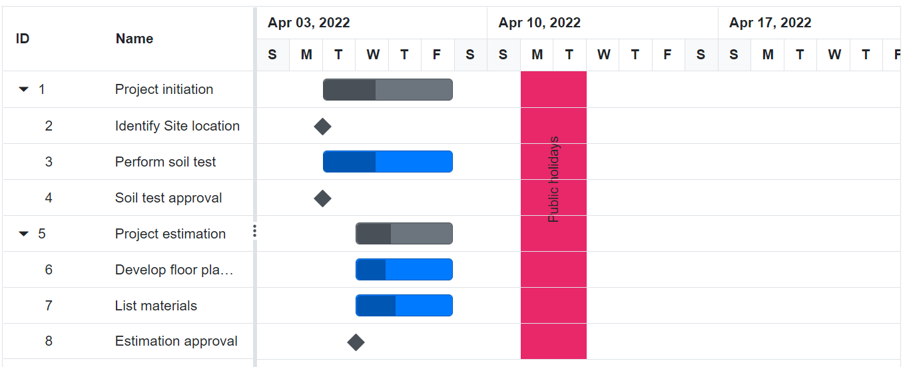

# Holidays in Blazor Gantt Chart Component

Non-working days in a project can be displayed in the Gantt Chart component using the `GanttHolidays` property. Each holiday can be defined with the following properties:

* `From`: Defines start date of the holiday(s).
* `To`: Defines end date of the holiday(s).
* `Label`: Defines the description or label for the holiday.
* `CssClass`: Formats the holidays label in the Gantt chart.

The following code example shows how to display the non-working days in the Gantt Chart component.

```cshtml
@using Syncfusion.Blazor.Gantt
<SfGantt DataSource="@TaskCollection" Height="450px" Width="900px">
    <GanttTaskFields Id="TaskId" Name="TaskName" StartDate="StartDate" EndDate="EndDate"
             Duration="Duration" Progress="Progress" ParentID="ParentId">
    </GanttTaskFields>
    <GanttHolidays>
        <GanttHoliday From="@Holiday1" To="@Holiday2" Label="Public holidays"
              CssClass="e-custom-holiday"></GanttHoliday>
        <GanttHoliday From="@Holiday3" To="@Holiday4" Label="Public holiday"
              CssClass="e-custom-holiday"></GanttHoliday>
    </GanttHolidays>
</SfGantt>
@code{
    private DateTime Holiday1 = new DateTime(2022, 04, 11);
    private DateTime Holiday2 = new DateTime(2022, 04, 12);
    private DateTime Holiday3 = new DateTime(2022, 04, 01);
    private DateTime Holiday4 = new DateTime(2022, 04, 01);
    private List<TaskData> TaskCollection { get; set; }
    protected override void OnInitialized()
    {
        this.TaskCollection = GetTaskCollection();
    }

    public class TaskData
    {
        public int TaskId { get; set; }
        public string TaskName { get; set; }
        public DateTime StartDate { get; set; }
        public DateTime EndDate { get; set; }
        public string Duration { get; set; }
        public int Progress { get; set; }
        public int? ParentId { get; set; }
    }

    public static List<TaskData> GetTaskCollection()
    {
        List<TaskData> Tasks = new List<TaskData>()
        {
            new TaskData() {
                TaskId = 1,
                TaskName = "Project initiation",
                StartDate = new DateTime(2022, 04, 02),
                EndDate = new DateTime(2022, 04, 21),
            },
            new TaskData() {
                TaskId = 2,
                TaskName = "Identify Site location",
                StartDate = new DateTime(2022, 04, 02),
                Duration = "0",
                Progress = 30,
                ParentId = 1
            },
            new TaskData() {
                TaskId = 3,
                TaskName = "Perform soil test",
                StartDate = new DateTime(2022, 04, 02),
                Duration = "4",
                Progress = 40,
                ParentId = 1
            },
            new TaskData() {
                TaskId = 4,
                TaskName = "Soil test approval",
                StartDate = new DateTime(2022, 04, 02),
                Duration = "0",
                Progress = 30,
                ParentId = 1
            },
            new TaskData() {
                TaskId = 5,
                TaskName = "Project estimation",
                StartDate = new DateTime(2022, 04, 02),
                EndDate = new DateTime(2022, 04, 21),
            },
            new TaskData() {
                TaskId = 6,
                TaskName = "Develop floor plan for estimation",
                StartDate = new DateTime(2022, 04, 04),
                Duration = "3",
                Progress = 30,
                ParentId = 5
            },
            new TaskData() {
                TaskId = 7,
                TaskName = "List materials",
                StartDate = new DateTime(2022, 04, 04),
                Duration = "3",
                Progress = 40,
                ParentId = 5
            },
            new TaskData() {
                TaskId = 8,
                TaskName = "Estimation approval",
                StartDate = new DateTime(2022, 04, 04),
                Duration = "0",
                Progress = 30,
                ParentId = 5
            }
        };
        return Tasks;
    }
}
<style>
    .e-gantt .e-gantt-chart .e-custom-holiday {
        background-color: #e82869;
    }
</style>
```

The following screenshot shows the output of Holidays in Gantt Chart component.



> You can refer to our [Blazor Gantt Chart](https://www.syncfusion.com/blazor-components/blazor-gantt-chart) feature tour page for its groundbreaking feature representations. You can also explore our [Blazor Gantt Chart example](https://blazor.syncfusion.com/demos/gantt-chart/default-functionalities) to know how to render and configure the Gantt.