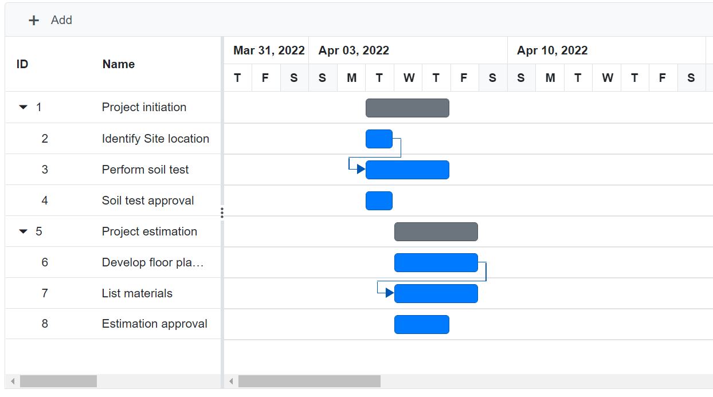
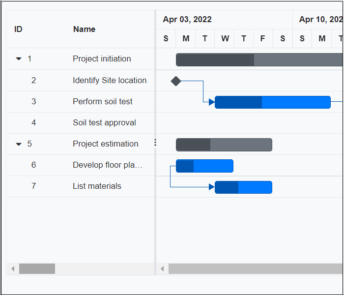
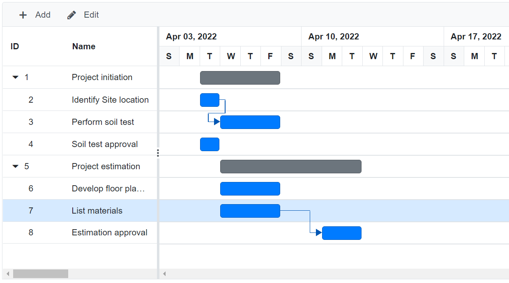

# Predecessor Validation

By default, Gantt tasks date values are validated based on predecessor values. You can disable/enable this validation by using the [EnablePredecessorValidation](https://help.syncfusion.com/cr/blazor/Syncfusion.Blazor.Gantt.SfGantt-1.html#Syncfusion_Blazor_Gantt_SfGantt_1_EnablePredecessorValidation) property. By default, `EnablePredecessorValidation` is true.

```cshtml
@using Syncfusion.Blazor.Gantt

<SfGantt @ref="Gantt" DataSource="@TaskCollection" Height="450px" Width="1000px" ProjectStartDate="ProjectStart" ProjectEndDate="ProjectEnd"
 Toolbar="@(new List<string>() { "Add", "Edit", "Update", "Cancel"})" EnablePredecessorValidation="false">
    <GanttTaskFields Id="TaskId" Name="TaskName" StartDate="StartDate"
                     Duration="Duration" Dependency="Predecessor" ParentID="ParentId"></GanttTaskFields>
    <GanttEditSettings AllowTaskbarEditing="true" AllowEditing="true" AllowAdding="true"></GanttEditSettings>
</SfGantt>

@code {
    public SfGantt<TaskData> Gantt;
    public DateTime ProjectStart = new DateTime(2019, 3, 31);
    public DateTime ProjectEnd = new DateTime(2019, 07, 06);
    public List<TaskData> TaskCollection { get; set; }

    protected override void OnInitialized()
    {
        this.TaskCollection = GetTaskCollection();
    }

    public class TaskData
    {
        public int TaskId { get; set; }
        public string TaskName { get; set; }
        public DateTime StartDate { get; set; }
        public string Duration { get; set; }
        public string Predecessor { get; set; }
        public int Progress { get; set; }
        public int? ParentId { get; set; }
    }

    public static List<TaskData> GetTaskCollection()
    {
        List<TaskData> Tasks = new List<TaskData>() {
            new TaskData() { TaskId = 1, TaskName = "Project initiation", StartDate = new DateTime(2019, 04, 02)},
            new TaskData() { TaskId = 2, TaskName = "Identify Site location", StartDate = new DateTime(2019, 04, 02), Progress = 30, ParentId = 1},
            new TaskData() { TaskId = 3, TaskName = "Perform soil test", StartDate = new DateTime(2019, 04, 02), Duration = "3", Progress = 40, Predecessor = "2fs", ParentId = 1 },
            new TaskData() { TaskId = 4, TaskName = "Soil test approval", StartDate = new DateTime(2019, 04, 02), Duration = "1", Progress = 30, ParentId = 1 },
            new TaskData() { TaskId = 5, TaskName = "Project estimation", StartDate = new DateTime(2019, 04, 02) },
            new TaskData() { TaskId = 6, TaskName = "Develop floor plan for estimation", StartDate = new DateTime(2019, 04, 04), Duration = "3", Progress = 30, ParentId = 5 },
            new TaskData() { TaskId = 7, TaskName = "List materials", StartDate = new DateTime(2019, 04, 04), Duration = "3", Progress = 40, Predecessor = "6", ParentId = 5 },
            new TaskData() { TaskId = 8, TaskName = "Estimation approval", StartDate = new DateTime(2019, 04, 04), Duration = "2", Progress = 30, ParentId = 5 }
        };
        return Tasks;
    }
}
```


## Custom validation using OnActionBegin event

In Gantt, the task relationship link can be broken by editing the start date, end date, and duration value of task. When the task relationship is broken on any edit action, it can be handled in Gantt in the following ways.

### Validation mode

When editing the tasks with predecessor links, then the [OnActionBegin](https://help.syncfusion.com/cr/blazor/Syncfusion.Blazor.Gantt.GanttEvents-1.html#Syncfusion_Blazor_Gantt_GanttEvents_1_OnActionBegin) event will be triggered with [RequestType](https://help.syncfusion.com/cr/blazor/Syncfusion.Blazor.Gantt.GanttActionEventArgs-1.html#Syncfusion_Blazor_Gantt_GanttActionEventArgs_1_RequestType) argument as `ValidateLinkedTask`. You can validate the editing action within the `OnActionBegin` event using the [ValidateMode](https://help.syncfusion.com/cr/blazor/Syncfusion.Blazor.Gantt.GanttActionEventArgs-1.html#Syncfusion_Blazor_Gantt_GanttActionEventArgs_1_ValidateMode) event argument. The `ValidateMode` event argument has the following properties:

Argument |Default value |Description
-----|-----|-----
args.ValidateMode.RespectLink | false | In this validation mode, the predecessor links get high priority. For example, in FS type, with this mode enabled, when the successor task is moved before the predecessor task’s end date, the editing will be reverted, and dates will be validated based on the dependency links.
args.ValidateMode.PreserveLinkWithEditing | true | In this validation mode, the taskbar editing will be considered along with the dependency links. This relationship will be maintained by updating the offset value of predecessors.

By default, the `PreserveLinkWithEditing` validation mode will be enabled, so the predecessors are updated with offset values.



The following code example explains enabling the `RespectLink` validation mode while editing the linked tasks in the `OnActionBegin` event.

```cshtml
@using Syncfusion.Blazor.Gantt
<SfGantt DataSource="@TaskCollection" Height="450px" Width="700px">
    <GanttTaskFields Id="TaskId" Name="TaskName" StartDate="StartDate" EndDate="EndDate" Duration="Duration" Progress="Progress"
        Dependency="Predecessor" ParentID="ParentId"></GanttTaskFields>
    <GanttEditSettings AllowTaskbarEditing="true"></GanttEditSettings>
    <GanttEvents TValue="TaskData" OnActionBegin="ActionBegin"></GanttEvents>
</SfGantt>

@code{
    public List<TaskData> TaskCollection { get; set; }
    protected override void OnInitialized()
    {
        this.TaskCollection = GetTaskCollection();
    }
    public void ActionBegin(GanttActionEventArgs<TaskData> args) {
        if(args.RequestType.ToString() == "ValidateLinkedTask") {
            args.ValidateMode.RespectLink = true;
        }
    }
    public class TaskData
    {
        public int TaskId { get; set; }
        public string TaskName { get; set; }
        public DateTime StartDate { get; set; }
        public DateTime EndDate { get; set; }
        public string Duration { get; set; }
        public int Progress { get; set; }
        public string Predecessor { get; set; }
        public int? ParentId { get; set; }
    }

    public static List <TaskData> GetTaskCollection() {
        List <TaskData> Tasks = new List <TaskData> () {
            new TaskData() { TaskId = 1, TaskName = "Project initiation", StartDate = new DateTime(2019, 04, 02), EndDate = new DateTime(2019, 04, 21) },
            new TaskData() { TaskId = 2, TaskName = "Identify Site location", StartDate = new DateTime(2019, 04, 02), Duration = "0", Progress = 30, ParentId = 1 },
            new TaskData() { TaskId = 3, TaskName = "Perform soil test", StartDate = new DateTime(2019, 04, 02), Duration = "4", Progress = 40, Predecessor = "2", ParentId = 1 },
            new TaskData() { TaskId = 4, TaskName = "Soil test approval", StartDate = new DateTime(2019, 04, 02), Duration = "0", Progress = 30, ParentId = 1 },
            new TaskData() { TaskId = 5, TaskName = "Project estimation", StartDate = new DateTime(2019, 04, 02), EndDate = new DateTime(2019, 04, 21) },
            new TaskData() { TaskId = 6, TaskName = "Develop floor plan for estimation", StartDate = new DateTime(2019, 04, 04), Duration = "3", Progress = 30, ParentId = 5 },
            new TaskData() { TaskId = 7, TaskName = "List materials", StartDate = new DateTime(2019, 04, 04), Duration = "3", Progress = 40, Predecessor = "6", ParentId = 5 },
            new TaskData() { TaskId = 8, TaskName = "Estimation approval", StartDate = new DateTime(2019, 04, 04),  Duration = "0", Progress = 30, ParentId = 5 }
        };
        return Tasks;
    }
}
```


### Predecessor offset validation

On taskbar editing, the [OnActionBegin](https://help.syncfusion.com/cr/blazor/Syncfusion.Blazor.Gantt.GanttEvents-1.html#Syncfusion_Blazor_Gantt_GanttEvents_1_OnActionBegin) event will be triggered with [PredecessorOffsetValidation](https://help.syncfusion.com/cr/blazor/Syncfusion.Blazor.Gantt.GanttActionEventArgs-1.html#Syncfusion_Blazor_Gantt_GanttActionEventArgs_1_PredecessorOffSetValidation) argument. When `PredecessorOffsetValidation` is enabled, the taskbar can be dragged such that it does not violate the predecessor value.
The taskbar can be dragged above the given predecessor offset value and it gets reverted to the minimum predecessor value if dragged below the predecessor offset value.

```cshtml
@using Syncfusion.Blazor.Gantt

<SfGantt @ref="Gantt" DataSource="@TaskCollection" Height="450px" Width="1000px" ProjectStartDate="ProjectStart" ProjectEndDate="ProjectEnd"
 Toolbar="@(new List<string>() { "Add", "Edit", "Update", "Cancel"})">
    <GanttTaskFields Id="TaskId" Name="TaskName" StartDate="StartDate"
                     Duration="Duration" Dependency="Predecessor" ParentID="ParentId"></GanttTaskFields>
    <GanttEditSettings AllowTaskbarEditing="true" AllowEditing="true" AllowAdding="true"></GanttEditSettings>
    <GanttEvents OnActionBegin="ActionBegin" TValue="TaskData"></GanttEvents>
</SfGantt>

@code {
    public SfGantt<TaskData> Gantt;
    public DateTime ProjectStart = new DateTime(2019, 3, 24);
    public DateTime ProjectEnd = new DateTime(2019, 07, 06);
    public List<TaskData> TaskCollection { get; set; }

    protected override void OnInitialized()
    {
        this.TaskCollection = GetTaskCollection();
    }

    public void ActionBegin(GanttActionEventArgs<TaskData> args)
    {
        args.PredecessorOffSetValidation = true;
    }

    public class TaskData
    {
        public int TaskId { get; set; }
        public string TaskName { get; set; }
        public DateTime StartDate { get; set; }
        public string Duration { get; set; }
        public string Predecessor { get; set; }
        public int Progress { get; set; }
        public int? ParentId { get; set; }
    }

    public static List<TaskData> GetTaskCollection()
    {
        List<TaskData> Tasks = new List<TaskData>() {
            new TaskData() { TaskId = 1, TaskName = "Project initiation", StartDate = new DateTime(2019, 04, 02)},
            new TaskData() { TaskId = 2, TaskName = "Identify Site location", StartDate = new DateTime(2019, 04, 02), Progress = 30, ParentId = 1},
            new TaskData() { TaskId = 3, TaskName = "Perform soil test", StartDate = new DateTime(2019, 04, 02), Duration = "3", Progress = 40, Predecessor = "2fs", ParentId = 1 },
            new TaskData() { TaskId = 4, TaskName = "Soil test approval", StartDate = new DateTime(2019, 04, 02), Duration = "1", Progress = 30, ParentId = 1 },
            new TaskData() { TaskId = 5, TaskName = "Project estimation", StartDate = new DateTime(2019, 04, 02) },
            new TaskData() { TaskId = 6, TaskName = "Develop floor plan for estimation", StartDate = new DateTime(2019, 04, 04), Duration = "3", Progress = 30, ParentId = 5 },
            new TaskData() { TaskId = 7, TaskName = "List materials", StartDate = new DateTime(2019, 04, 04), Duration = "3", Progress = 40, Predecessor = "6", ParentId = 5 },
            new TaskData() { TaskId = 8, TaskName = "Estimation approval", StartDate = new DateTime(2019, 04, 04), Duration = "2", Progress = 30, ParentId = 5 }
        };
        return Tasks;
    }
}
```


> When `PredecessorOffsetValidation` is enabled, the predecessor offset will not be updated on dragging the taskbar. You can update the predecessor offset either by cell edit or dialog edit.

### Auto-link validation

When the connector lines are drawn between tasks, the task date gets validated based on predecessor values. You can restrict this validation on predecessor drawing using the [OnActionBegin](https://help.syncfusion.com/cr/blazor/Syncfusion.Blazor.Gantt.GanttEvents-1.html#Syncfusion_Blazor_Gantt_GanttEvents_1_OnActionBegin) event which gets triggered with the [Action](https://help.syncfusion.com/cr/blazor/Syncfusion.Blazor.Gantt.GanttActionEventArgs-1.html#Syncfusion_Blazor_Gantt_GanttActionEventArgs_1_Action) argument as `DrawConnectorLine`. You can enable/disable the validation using [EnableAutoLinkValidation](https://help.syncfusion.com/cr/blazor/Syncfusion.Blazor.Gantt.GanttActionEventArgs-1.html#Syncfusion_Blazor_Gantt_GanttActionEventArgs_1_EnableAutoLinkValidation) event argument. By default, `EnableAutoLinkValidation` is true.

In the below code example, the connector line which is connected from task id 2 to task id 3 is rendered at load time. Hence validation happens. Whereas, the connector line from task id 6 to task id 7 is drawn dynamically and validation is restricted here by disabling the `EnableAutoLinkValidation` property.

```cshtml
@using Syncfusion.Blazor.Gantt

<SfGantt @ref="Gantt" DataSource="@TaskCollection" Height="450px" Width="1000px" Toolbar="@(new List<string>() { "Add", "Edit", "Update", "Cancel"})">
    <GanttTaskFields Id="TaskId" Name="TaskName" StartDate="StartDate"
                     Duration="Duration" Dependency="Predecessor" ParentID="ParentId"></GanttTaskFields>
    <GanttEditSettings AllowTaskbarEditing="true" AllowEditing="true" AllowAdding="true"></GanttEditSettings>
    <GanttEvents OnActionBegin="ActionBegin" TValue="TaskData"></GanttEvents>
</SfGantt>

@code {
    public SfGantt<TaskData> Gantt;
    public DateTime ProjectStart = new DateTime(2019, 3, 24);
    public DateTime ProjectEnd = new DateTime(2019, 7, 6);
    public List<TaskData> TaskCollection { get; set; }

    protected override void OnInitialized()
    {
        this.TaskCollection = GetTaskCollection();
    }

    public void ActionBegin(GanttActionEventArgs<TaskData> args)
    {
        if (args.Action != null && args.Action.Equals("DrawConnectorLine", StringComparison.Ordinal))
        {
            args.EnableAutoLinkValidation = false;
        }
    }

    public class TaskData
    {
        public int TaskId { get; set; }
        public string TaskName { get; set; }
        public DateTime StartDate { get; set; }
        public string Duration { get; set; }
        public string Predecessor { get; set; }
        public int Progress { get; set; }
        public int? ParentId { get; set; }
    }

    public static List<TaskData> GetTaskCollection()
    {
        List<TaskData> Tasks = new List<TaskData>() {
            new TaskData() { TaskId = 1, TaskName = "Project initiation", StartDate = new DateTime(2019, 04, 02)},
            new TaskData() { TaskId = 2, TaskName = "Identify Site location", StartDate = new DateTime(2019, 04, 02), Progress = 30, ParentId = 1},
            new TaskData() { TaskId = 3, TaskName = "Perform soil test", StartDate = new DateTime(2019, 04, 02), Duration = "3", Progress = 40, Predecessor = "2fs", ParentId = 1 },
            new TaskData() { TaskId = 4, TaskName = "Soil test approval", StartDate = new DateTime(2019, 04, 02), Duration = "1", Progress = 30, ParentId = 1 },
            new TaskData() { TaskId = 5, TaskName = "Project estimation", StartDate = new DateTime(2019, 04, 02) },
            new TaskData() { TaskId = 6, TaskName = "Develop floor plan for estimation", StartDate = new DateTime(2019, 04, 04), Duration = "3", Progress = 30, ParentId = 5 },
            new TaskData() { TaskId = 7, TaskName = "List materials", StartDate = new DateTime(2019, 04, 04), Duration = "3", Progress = 40, ParentId = 5 },
            new TaskData() { TaskId = 8, TaskName = "Estimation approval", StartDate = new DateTime(2019, 04, 04), Duration = "2", Progress = 30, ParentId = 5 }
        };
        return Tasks;
    }
}
```



> [EnablePredecessorValidation](https://help.syncfusion.com/cr/blazor/Syncfusion.Blazor.Gantt.SfGantt-1.html#Syncfusion_Blazor_Gantt_SfGantt_1_EnablePredecessorValidation) is used to enable/disable validation based on predecessor values both on load time and on edit actions like cell editing, dialog editing, and on predecessor drawing. Whereas, [EnableAutoLinkValidation](https://help.syncfusion.com/cr/blazor/Syncfusion.Blazor.Gantt.GanttActionEventArgs-1.html#Syncfusion_Blazor_Gantt_GanttActionEventArgs_1_EnableAutoLinkValidation) event argument is used to enable/disable validation only on predecessor drawing. 