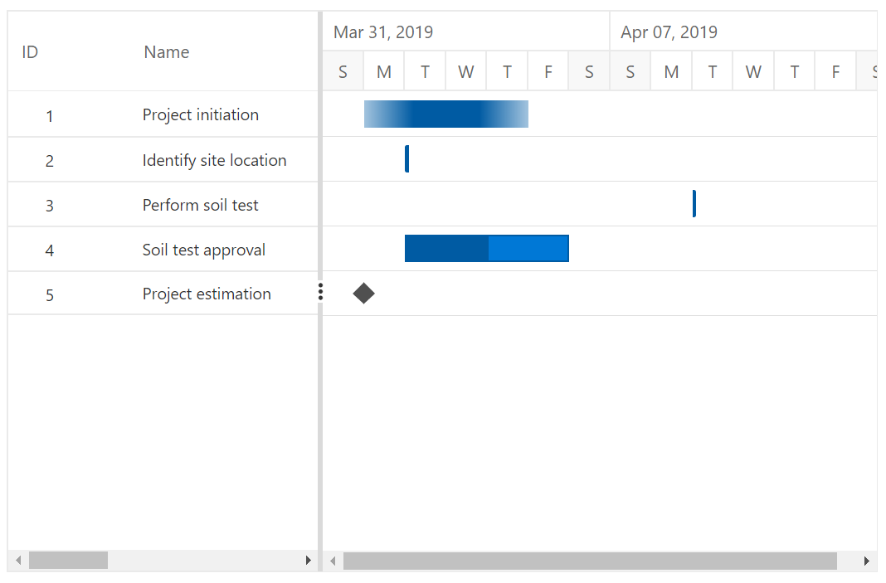
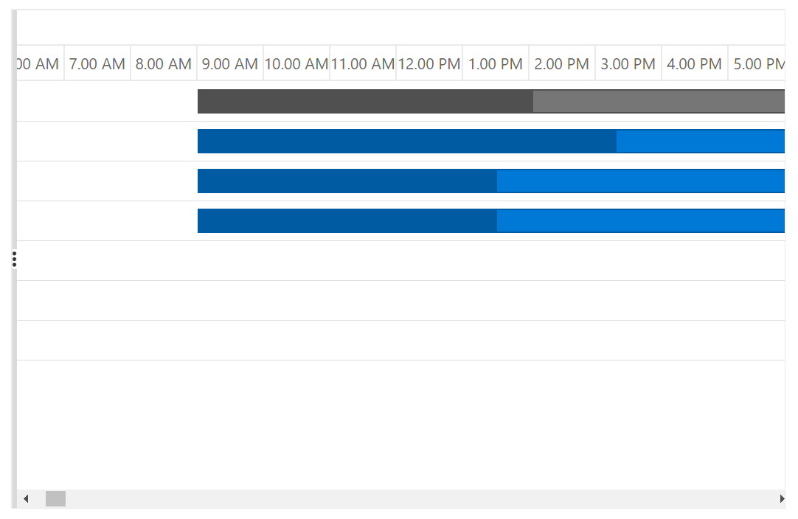
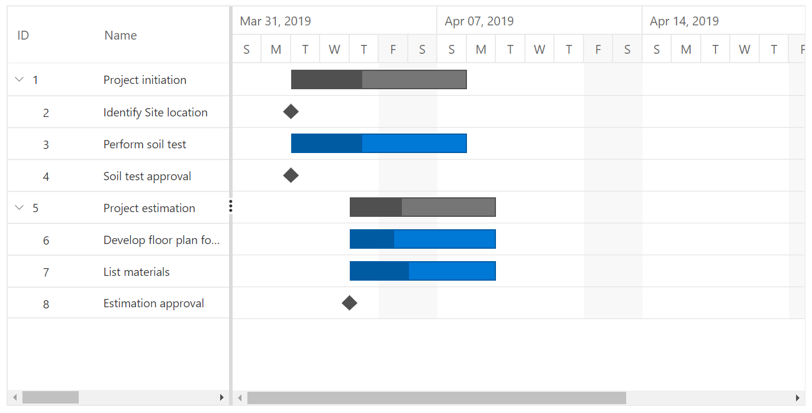

# Scheduling Tasks in Blazor Gantt Chart Component

By default, Gantt tasks are validated based on the child tasks with some factors like working time, holidays, weekends, and predecessors. The Gantt provides support for automatic and manual task scheduling modes. It is used to indicate whether the start date and end date of all the tasks will be automatically validated or not. `TaskMode` is the property used to change the schedule mode of a task.

The Gantt Chart component supports three types of modes. They are:

* `Auto`: All the tasks will be automatically validated.
* `Manual`: All the tasks will be manually validated by the user.
* `Custom`: Tasks will be validated as Auto or Manual based on the value mapped in the data source.

> The default value of `TaskMode` is `Auto`.

## Automatically Scheduled Tasks

When the `TaskMode` property is set as `Auto`, the start date and end date of all the tasks in the project will be automatically validated. That is, dates will be validated based on various factors such as working time, holidays, weekends, and predecessors.

```cshtml
@using Syncfusion.Blazor.Gantt
<SfGantt DataSource="@TaskCollection" Height="450px" TaskMode="ScheduleMode.Auto" Width="900px" TreeColumnIndex="1" Toolbar="@(new List<string>() { "Add", "Edit", "Update", "Delete", "Cancel", "ExpandAll", "CollapseAll" })">
    <GanttTaskFields Id="TaskId" Name="TaskName" StartDate="StartDate" EndDate="EndDate" Duration="Duration" Progress="Progress"
            ParentID="ParentId">
    </GanttTaskFields>
    <GanttEditSettings AllowEditing="true" AllowAdding="true" AllowDeleting="true"></GanttEditSettings>
</SfGantt>

@code{
    public List<TaskData> TaskCollection { get; set; }
    protected override void OnInitialized()
    {
        this.TaskCollection = GetTaskCollection();
    }
    public class TaskData
    {
        public int TaskId { get; set; }
        public string TaskName { get; set; }
        public DateTime StartDate { get; set; }
        public DateTime EndDate { get; set; }
        public string Duration { get; set; }
        public int Progress { get; set; }
        public int? ParentId { get; set; }
    }
    public static List <TaskData> GetTaskCollection() {
        List <TaskData> Tasks = new List <TaskData> () {
            new TaskData() {
                TaskId = 1,
                TaskName = "Project initiation",
                StartDate = new DateTime(2019, 03, 28),
                EndDate = new DateTime(2019, 07, 28),
                Duration="4"
            },
            new TaskData() {
                TaskId = 2,
                TaskName = "Identify Site location",
                StartDate = new DateTime(2019, 03, 29),
                Progress = 30,
                ParentId = 1,
                Duration="2"
            },
            new TaskData() {
                TaskId = 3,
                TaskName = "Perform soil test",
                StartDate = new DateTime(2019, 03, 29),
                ParentId = 1,
                Duration="4"
            },
            new TaskData() {
                TaskId = 4,
                TaskName = "Soil test approval",
                StartDate = new DateTime(2019, 03, 29),
                Duration = "1",
                Progress = 30,
                ParentId = 1,
            },
            new TaskData() {
                TaskId = 5,
                TaskName = "Project estimation",
                StartDate = new DateTime(2019, 03, 29),
                EndDate = new DateTime(2019, 04, 2),
                Duration="4"
            },
            new TaskData() {
                TaskId = 6,
                TaskName = "Develop floor plan for estimation",
                StartDate = new DateTime(2019, 03, 29),
                Duration = "3",
                Progress = 30,
                ParentId = 5
            },
            new TaskData() {
                TaskId = 7,
                TaskName = "List materials",
                StartDate = new DateTime(2019, 04, 01),
                Duration = "3",
                Progress = 30,
                ParentId = 5
            },
            new TaskData() {
                TaskId = 8,
                TaskName = "Estimation approval",
                StartDate = new DateTime(2019, 04, 01),
                Duration = "2",
                ParentId = 5
            }
        };
        return Tasks;
    }
}
```

## Manually Scheduled Tasks

When the `TaskMode` property is set as `Manual`, the start date and end date of all the tasks in the project will be the same as given in the data source. That is, dates will not be validated based on factors such as dependencies between tasks, holidays, weekends, working time.
We can restrict this mode in predecessor validation alone. That is, we can automatically validate the dates based on predecessor values by enabling the `ValidateManualTasksOnLinking` property.

```cshtml
@using Syncfusion.Blazor.Gantt
<SfGantt DataSource="@TaskCollection" Height="450px" TaskMode="ScheduleMode.Manual" ValidateManualTasksOnLinking="true" Width="900px" TreeColumnIndex="1" Toolbar="@(new List<string>() { "Add", "Edit", "Update", "Delete", "Cancel", "ExpandAll", "CollapseAll" })">
    <GanttTaskFields Id="TaskId" Name="TaskName" StartDate="StartDate" EndDate="EndDate" Duration="Duration" Progress="Progress"
            ParentID="ParentId">
    </GanttTaskFields>
    <GanttEditSettings AllowEditing="true" AllowAdding="true" AllowDeleting="true" AllowTaskbarEditing="true"></GanttEditSettings>
</SfGantt>

@code{
    public List<TaskData> TaskCollection { get; set; }
    protected override void OnInitialized()
    {
        this.TaskCollection = GetTaskCollection();
    }
    public class TaskData
    {
        public int TaskId { get; set; }
        public string TaskName { get; set; }
        public DateTime StartDate { get; set; }
        public DateTime EndDate { get; set; }
        public string Duration { get; set; }
        public int Progress { get; set; }
        public string Predecessor { get; set; }
        public int? ParentId { get; set; }
    }
    public static List <TaskData> GetTaskCollection() {
        List <TaskData> Tasks = new List <TaskData> () {
            new TaskData() {
                TaskId = 1,
                TaskName = "Project initiation",
                StartDate = new DateTime(2019, 03, 28),
                EndDate = new DateTime(2019, 07, 28),
                Duration="4"
            },
            new TaskData() {
                TaskId = 2,
                TaskName = "Identify Site location",
                StartDate = new DateTime(2019, 03, 29),
                Progress = 30,
                ParentId = 1,
                Duration="2"
            },
            new TaskData() {
                TaskId = 3,
                TaskName = "Perform soil test",
                StartDate = new DateTime(2019, 03, 29),
                ParentId = 1,
                Duration="4"
            },
            new TaskData() {
                TaskId = 4,
                TaskName = "Soil test approval",
                StartDate = new DateTime(2019, 03, 29),
                Duration = "4",
                Progress = 30,
                ParentId = 1,
            },
            new TaskData() {
                TaskId = 5,
                TaskName = "Project estimation",
                StartDate = new DateTime(2019, 03, 29),
                EndDate = new DateTime(2019, 04, 2),
                Duration="4"
            },
            new TaskData() {
                TaskId = 6,
                TaskName = "Develop floor plan for estimation",
                StartDate = new DateTime(2019, 03, 29),
                Duration = "3",
                Progress = 30,
                ParentId = 5
            },
            new TaskData() {
                TaskId = 7,
                TaskName = "List materials",
                StartDate = new DateTime(2019, 04, 01),
                Duration = "3",
                Progress = 30,
                ParentId = 5
            },
            new TaskData() {
                TaskId = 8,
                TaskName = "Estimation approval",
                StartDate = new DateTime(2019, 04, 01),
                Duration = "2",
                ParentId = 5
            }
        };
        return Tasks;
    }
}
```


## Custom

If we want to use some specific task mode for specific tasks, then we can set the `TaskMode` property  as `Custom`. So, the scheduling mode for each task will be mapped from the data source field. The `Boolean` property `GanttTaskFields.Manual` is used to map the manual scheduling mode field from the data source.

```cshtml
@using Syncfusion.Blazor.Gantt
<SfGantt DataSource="@TaskCollection" TaskMode="ScheduleMode.Custom" Toolbar="@(new List<string>() { "Add", "Cancel", "CollapseAll", "Delete", "Edit", "ExpandAll", "Update" })" Height="450px" Width="1000px">
    <GanttTaskFields Id="TaskId" Name="TaskName" StartDate="StartDate" EndDate="EndDate" Duration="Duration" Progress="Progress" ParentID="ParentId" Manual="IsManual">
    </GanttTaskFields>
    <GanttEditSettings AllowTaskbarEditing="true" AllowEditing="true" AllowAdding="true" AllowDeleting="true" Mode="Syncfusion.Blazor.Gantt.EditMode.Auto"></GanttEditSettings>
</SfGantt>

@code{
    public List<TaskData> TaskCollection { get; set; }
    protected override void OnInitialized()
    {
        this.TaskCollection = GetTaskCollection();
    }
    public class TaskData
    {
        public int TaskId { get; set; }
        public string TaskName { get; set; }
        public DateTime StartDate { get; set; }
        public DateTime EndDate { get; set; }
        public string Duration { get; set; }
        public int Progress { get; set; }
        public int? ParentId { get; set; }
        public string IsManual { get; set; }
    }
    public static List<TaskData> GetTaskCollection()
    {
        List<TaskData> Tasks = new List<TaskData>() {
        new TaskData() {
            TaskId = 1,
            TaskName = "Project initiation",
            StartDate = new DateTime(2019, 04, 02),
            EndDate = new DateTime(2019, 04, 21)
        },
        new TaskData() {
            TaskId = 2,
            TaskName = "Identify Site location",
            StartDate = new DateTime(2019, 04, 02),
            Duration = "5",
            Progress = 30,
            ParentId = 1,
            IsManual="true",
        },
        new TaskData() {
            TaskId = 3,
            TaskName = "Perform soil test",
            StartDate = new DateTime(2019, 04, 02),
            Duration = "4",
            Progress = 40,
            IsManual="true",
            ParentId = 1
        },
        new TaskData() {
            TaskId = 4,
            TaskName = "Soil test approval",
            StartDate = new DateTime(2019, 04, 02),
            Duration = "5",
            Progress = 30,
            ParentId = 1
        },
        new TaskData() {
            TaskId = 5,
            TaskName = "Project estimation",
            StartDate = new DateTime(2019, 04, 02),
            EndDate = new DateTime(2019, 04, 21),
            IsManual="true",
        },
        new TaskData() {
            TaskId = 6,
            TaskName = "Develop floor plan for estimation",
            StartDate = new DateTime(2019, 04, 04),
            Duration = "3",
            Progress = 30,
            ParentId = 5
        },
        new TaskData() {
            TaskId = 7,
            TaskName = "List materials",
            StartDate = new DateTime(2019, 04, 04),
            Duration = "3",
            Progress = 40,
            ParentId = 5
        },
        new TaskData() {
            TaskId = 8,
            TaskName = "Estimation approval",
            StartDate = new DateTime(2019, 04, 04),
            Duration = "3",
            Progress = 30,
            IsManual="true",
            ParentId = 5
        }
    };
    return Tasks;
    }
}

```


## Unscheduled Tasks

Unscheduled tasks are planned for a project without any definite schedule dates. The Gantt Chart component supports rendering the unscheduled tasks. You can create or update the tasks with anyone of start date, end date, and duration values or none. You can enable or disable the unscheduled tasks by using the `AllowUnscheduledTasks` property. The following images represent the various types of unscheduled tasks in Gantt Chart.

### Start Date Only


### End Date Only


### Duration Only


### Milestone

A milestone is a task that has no start and end dates, but it has a duration value of zero. It is represented as follows.


## Define Unscheduled Tasks in Data Source

You can define the various types of unscheduled tasks in the data source as follows

```cshtml
@using Syncfusion.Blazor.Gantt
<SfGantt DataSource="@TaskCollection" Height="450px" Width="700px" AllowUnscheduledTasks="true">
    <GanttTaskFields Id="TaskId" Name="TaskName" StartDate="StartDate" EndDate="EndDate"
            Duration="Duration" Progress="Progress" Child="SubTasks">
    </GanttTaskFields>
</SfGantt>

@code{
    public List<TaskData> TaskCollection { get; set; }
    protected override void OnInitialized()
    {
        this.TaskCollection = GetTaskCollection();
    }

    public class TaskData
    {
        public int TaskId { get; set; }
        public string TaskName { get; set; }
        public DateTime? StartDate { get; set; }
        public DateTime? EndDate { get; set; }
        public string Duration { get; set; }
        public int Progress { get; set; }
    }

    public static List <TaskData> GetTaskCollection() {
    List <TaskData> Tasks = new List <TaskData> () {
        new TaskData() {
            TaskId = 1,
            TaskName = "Project initiation",
            Duration = "4"
        },
        new TaskData() {
            TaskId = 2,
            TaskName = "Identify site location",
            StartDate = new DateTime(2019, 04, 02)
        },
        new TaskData() {
            TaskId = 3,
            TaskName = "Perform soil test",
            EndDate = new DateTime(2019, 04, 08)
        },
        new TaskData() {
            TaskId = 4,
            TaskName = "Soil test approval",
            StartDate = new DateTime(2019, 04, 02),
            EndDate = new DateTime(2019, 04, 06),
            Progress = 50
        },
        new TaskData() {
            TaskId = 5,
            TaskName = "Project estimation",
            Duration = "0"
        }
    };

    return Tasks;
}
}
```



> NOTE
> If the `AllowUnscheduledTasks` property is set to false, then the Gantt Chart component automatically calculates the scheduled date values with a default value of duration 1 and the project start date is considered as the start date for the task.

## Working Time Range

In the Gantt Chart component, working hours in a day for a project can be defined by using the `GanttDayWorkingTime` property. Based on the working hours, automatic date scheduling and duration validations for a task are performed.

The following code snippet explains how to define the working time range for the project in Gantt Chart.

```cshtml
@using Syncfusion.Blazor.Gantt
<SfGantt DataSource="@TaskCollection" Height="450px" Width="700px">
    <GanttTaskFields Id="TaskId" Name="TaskName" StartDate="StartDate" EndDate="EndDate"
              Duration="Duration" Progress="Progress" Child="SubTasks">
    </GanttTaskFields>
    <GanttDayWorkingTimeCollection>
        <GanttDayWorkingTime From="9" To="18"></GanttDayWorkingTime>
    </GanttDayWorkingTimeCollection>
    <GanttTimelineSettings TimelineUnitSize="75">
        <GanttTopTierSettings Unit="TimelineViewMode.Day" Format="MMM dd,yyyy"></GanttTopTierSettings>
        <GanttBottomTierSettings Unit="TimelineViewMode.Hour" Format="h.mm tt"></GanttBottomTierSettings>
    </GanttTimelineSettings>
</SfGantt>

@code{
    public List<TaskData> TaskCollection { get; set; }
    protected override void OnInitialized()
    {
        this.TaskCollection = GetTaskCollection();
    }

    public class TaskData
    {
        public int TaskId { get; set; }
        public string TaskName { get; set; }
        public DateTime StartDate { get; set; }
        public DateTime EndDate { get; set; }
        public string Duration { get; set; }
        public int Progress { get; set; }
        public List<TaskData> SubTasks { get; set; }
    }

    public static List <TaskData> GetTaskCollection() {
    List <TaskData> Tasks = new List <TaskData> () {
        new TaskData() {
            TaskId = 1,
            TaskName = "Project initiation",
            StartDate = new DateTime(2019, 04, 02),
            EndDate = new DateTime(2019, 04, 21),
            SubTasks = (new List <TaskData> () {
                new TaskData() {
                    TaskId = 2,
                    TaskName = "Identify site location",
                    StartDate = new DateTime(2019, 04, 02),
                    Duration = "1",
                    Progress = 70,
                },
                new TaskData() {
                    TaskId = 3,
                    TaskName = "Perform soil test",
                    StartDate = new DateTime(2019, 04, 02),
                    Duration = "1",
                    Progress = 50
                },
                new TaskData() {
                    TaskId = 4,
                    TaskName = "Soil test approval",
                    StartDate = new DateTime(2019, 04, 02),
                    Duration = "1",
                    Progress = 50
                },
            })
        },
        new TaskData() {
            TaskId = 5,
            TaskName = "Project estimation",
            StartDate = new DateTime(2019, 04, 02),
            EndDate = new DateTime(2019, 04, 21),
            SubTasks = (new List <TaskData> () {
                new TaskData() {
                    TaskId = 6,
                    TaskName = "Develop floor plan for estimation",
                    StartDate = new DateTime(2019, 04, 04),
                    Duration = "1",
                    Progress = 70
                },
                new TaskData() {
                    TaskId = 7,
                    TaskName = "List materials",
                    StartDate = new DateTime(2019, 04, 04),
                    Duration = "1",
                    Progress = 50
                },
            })
        }
    };

    return Tasks;
}
}
```

The following screen shot shows working time range in Gantt Chart component.



> NOTE
>* Individual tasks can lie between any time within the defined working time range of the project.
>* The `GanttDayWorkingTime` property is used to define the working time for the whole project.

## Weekend or Non-working Days

Non-working days/weekends are used to represent the non-productive days in a project. You can exclude the non-working days in a work week using the `WorkWeek` property in Gantt Chart.

```cshtml
@using Syncfusion.Blazor.Gantt
<SfGantt DataSource="@TaskCollection" WorkWeek="@(new string[] { "Sunday", "Monday", "Tuesday", "Wednesday", "Thursday" })"
          HighlightWeekends="true" Height="450px" Width="900px">
    <GanttTaskFields Id="TaskId" Name="TaskName" StartDate="StartDate" EndDate="EndDate"
              Duration="Duration" Progress="Progress" Child="SubTasks">
    </GanttTaskFields>
</SfGantt>

@code{
    public List<TaskData> TaskCollection { get; set; }
    protected override void OnInitialized()
    {
        this.TaskCollection = GetTaskCollection();
    }

    public class TaskData
    {
        public int TaskId { get; set; }
        public string TaskName { get; set; }
        public DateTime StartDate { get; set; }
        public DateTime EndDate { get; set; }
        public string Duration { get; set; }
        public int Progress { get; set; }
        public List<TaskData> SubTasks { get; set; }
    }

    public static List <TaskData> GetTaskCollection() {
    List <TaskData> Tasks = new List <TaskData> () {
        new TaskData() {
            TaskId = 1,
            TaskName = "Project initiation",
            StartDate = new DateTime(2019, 04, 02),
            EndDate = new DateTime(2019, 04, 21),
            SubTasks = (new List <TaskData> () {
                new TaskData() {
                    TaskId = 2,
                    TaskName = "Identify Site location",
                    StartDate = new DateTime(2019, 04, 02),
                    Duration = "0",
                    Progress = 30,
                },
                new TaskData() {
                    TaskId = 3,
                    TaskName = "Perform soil test",
                    StartDate = new DateTime(2019, 04, 02),
                    Duration = "4",
                    Progress = 40,
                },
                new TaskData() {
                    TaskId = 4,
                    TaskName = "Soil test approval",
                    StartDate = new DateTime(2019, 04, 02),
                    Duration = "0",
                    Progress = 30
                },
            })
        },
        new TaskData() {
            TaskId = 5,
            TaskName = "Project estimation",
            StartDate = new DateTime(2019, 04, 02),
            EndDate = new DateTime(2019, 04, 21),
            SubTasks = (new List <TaskData> () {
                new TaskData() {
                    TaskId = 6,
                    TaskName = "Develop floor plan for estimation",
                    StartDate = new DateTime(2019, 04, 04),
                    Duration = "3",
                    Progress = 30,
                },
                new TaskData() {
                    TaskId = 7,
                    TaskName = "List materials",
                    StartDate = new DateTime(2019, 04, 04),
                    Duration = "3",
                    Progress = 40
                },
                new TaskData() {
                    TaskId = 8,
                    TaskName = "Estimation approval",
                    StartDate = new DateTime(2019, 04, 04),
                    Duration = "0",
                    Progress = 30,
                }
            })
        }
    };

    return Tasks;
}
}
```



> By default, Saturdays and Sundays are considered as non-working days/weekend in a project.
> In the Gantt Chart component, you can make weekend as working day by setting the `IncludeWeekend` property to `true`.
> You can refer to our [Blazor Gantt Chart](https://www.syncfusion.com/blazor-components/blazor-gantt-chart) feature tour page for its groundbreaking feature representations. You can also explore our [Blazor Gantt Chart example](https://blazor.syncfusion.com/demos/gantt-chart/default-functionalities?theme=bootstrap4) to knows how to render and configure the gantt.