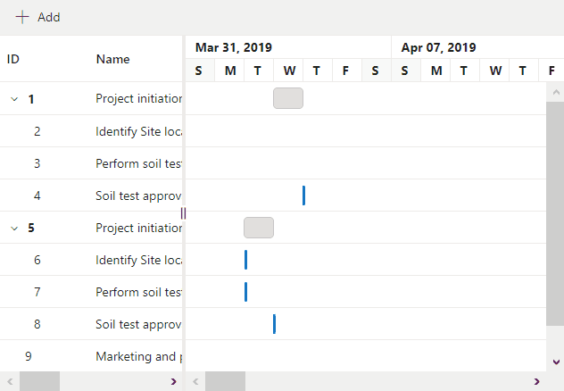

# Taskbar editing in Blazor Gantt Chart Component

Modify the task details through user interaction, such as resizing and dragging the taskbar, by enabling the `GanttEditSettings.AllowTaskbarEditing` property.

```cshtml
@using Syncfusion.Blazor.Gantt
<SfGantt DataSource="@TaskCollection" Height="450px" Width="900px">
    <GanttTaskFields Id="TaskId" Name="TaskName" StartDate="StartDate" EndDate="EndDate" Duration="Duration" Progress="Progress" ParentID="ParentId">
    </GanttTaskFields>
    <GanttEditSettings AllowEditing="true" AllowTaskbarEditing="true"></GanttEditSettings>
</SfGantt>

@code{
    private List<TaskData> TaskCollection { get; set; }
    protected override void OnInitialized()
    {
        this.TaskCollection = GetTaskCollection();
    }

    public class TaskData
    {
        public int TaskId { get; set; }
        public string TaskName { get; set; }
        public DateTime StartDate { get; set; }
        public DateTime EndDate { get; set; }
        public string Duration { get; set; }
        public int Progress { get; set; }
        public int? ParentId { get; set; }
    }

    public static List<TaskData> GetTaskCollection()
    {
        List<TaskData> Tasks = new List<TaskData>() {
            new TaskData() { TaskId = 1, TaskName = "Project initiation", StartDate = new DateTime(2022, 04, 02), EndDate = new DateTime(2022, 04, 21), },
            new TaskData() { TaskId = 2, TaskName = "Identify Site location", StartDate = new DateTime(2022, 04, 02), Duration = "0", Progress = 30, ParentId = 1 },
            new TaskData() { TaskId = 3, TaskName = "Perform soil test", StartDate = new DateTime(2022, 04, 02), Duration = "4", Progress = 40, ParentId = 1 },
            new TaskData() { TaskId = 4, TaskName = "Soil test approval", StartDate = new DateTime(2022, 04, 02), Duration = "0", Progress = 30, ParentId = 1 },
            new TaskData() { TaskId = 5, TaskName = "Project estimation", StartDate = new DateTime(2022, 04, 02), EndDate = new DateTime(2022, 04, 21), },
            new TaskData() { TaskId = 6, TaskName = "Develop floor plan for estimation", StartDate = new DateTime(2022, 04, 04), Duration = "3", Progress = 30, ParentId = 5 },
            new TaskData() { TaskId = 7, TaskName = "List materials", StartDate = new DateTime(2022, 04, 04), Duration = "3", Progress = 40, ParentId = 5 },
            new TaskData() { TaskId = 8, TaskName = "Estimation approval", StartDate = new DateTime(2022, 04, 04), Duration = "0", Progress = 30, ParentId = 5 }
        };
        return Tasks;
    }
}
```

## Creating taskbar on draw action

A taskbar can be drawn in an empty row by drag and drop interaction. This can be achieved by enabling [GanttEditSettings.AllowSchedulingOnDrag](https://help.syncfusion.com/cr/blazor/Syncfusion.Blazor.Gantt.GanttEditSettings.html#Syncfusion_Blazor_Gantt_GanttEditSettings_AllowSchedulingOnDrag) and [GanttEditSettings.AllowTaskbarEditing](https://help.syncfusion.com/cr/blazor/Syncfusion.Blazor.Gantt.GanttEditSettings.html#Syncfusion_Blazor_Gantt_GanttEditSettings_AllowTaskbarEditing) property.
A taskbar can be drawn only when [AllowUnscheduledTasks](https://help.syncfusion.com/cr/blazor/Syncfusion.Blazor.Gantt.SfGantt-1.html#Syncfusion_Blazor_Gantt_SfGantt_1_AllowUnscheduledTasks) property is set to true and when a task has no start and end date.

```cshtml
@using Syncfusion.Blazor.Gantt
<SfGantt DataSource="@TaskCollection" Height="100%" Width="100%" AllowUnscheduledTasks="true">
    <GanttTaskFields Id="TaskId" Name="TaskName" StartDate="StartDate" EndDate="EndDate" Duration="Duration" Progress="Progress" ParentID="ParentId">
    </GanttTaskFields>
    <GanttEditSettings AllowTaskbarEditing="true" AllowSchedulingOnDrag="true"></GanttEditSettings>
</SfGantt>

@code {
    public SfGantt<TaskData> Gantt;
    public List<TaskData> TaskCollection { get; set; }
    protected override void OnInitialized()
    {
        this.TaskCollection = GetTaskCollection();
    }
    public class TaskData
    {
        public int TaskId { get; set; }
        public string TaskName { get; set; }
        public DateTime StartDate { get; set; }
        public DateTime EndDate { get; set; }
        public string Duration { get; set; }
        public int Progress { get; set; }
        public int? ParentId { get; set; }
    }
    public static List<TaskData> GetTaskCollection()
    {
        List<TaskData> Tasks = new List<TaskData>() {
            new TaskData() { TaskId = 1, TaskName = "Project initiation", StartDate = new DateTime(2019, 04, 02) },
            new TaskData() { TaskId = 2, TaskName = "Identify Site location", Progress = 30, ParentId = 1 },
            new TaskData() { TaskId = 3, TaskName = "Perform soil test", Progress = 40, ParentId = 1 },
            new TaskData() { TaskId = 4, TaskName = "Soil test approval", EndDate =new DateTime(2019, 04, 03), Progress = 30, ParentId = 1 },
            new TaskData() { TaskId = 5, TaskName = "Project initiation", StartDate = new DateTime(2019, 04, 04) },
            new TaskData() { TaskId = 6, TaskName = "Identify Site location", StartDate = new DateTime(2019, 04, 02), Progress = 30, ParentId = 5 },
            new TaskData() { TaskId = 7, TaskName = "Perform soil test", StartDate = new DateTime(2019, 04, 02), Progress = 40, ParentId = 5 },
            new TaskData() { TaskId = 8, TaskName = "Soil test approval", EndDate = new DateTime(2019, 04, 02), Progress = 30, ParentId = 5 },
            new TaskData() { TaskId=9, TaskName="Marketing and presales", StartDate=new DateTime(2019,06,26), EndDate=new DateTime(2019,07,01) },
            new TaskData() { TaskId = 10, TaskName = "Important improvement", StartDate = new DateTime(2019, 06, 14), EndDate = new DateTime(2019, 06, 19) }
        };
        return Tasks;
    }
}
```
