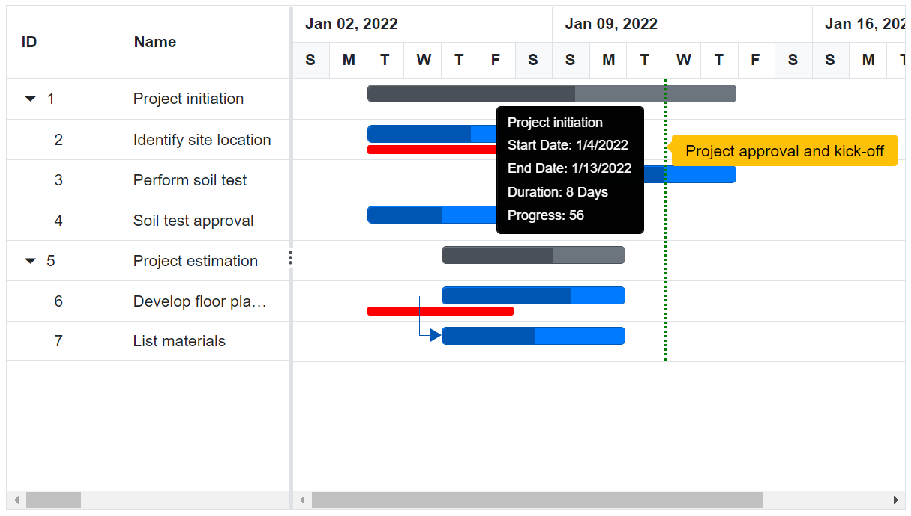
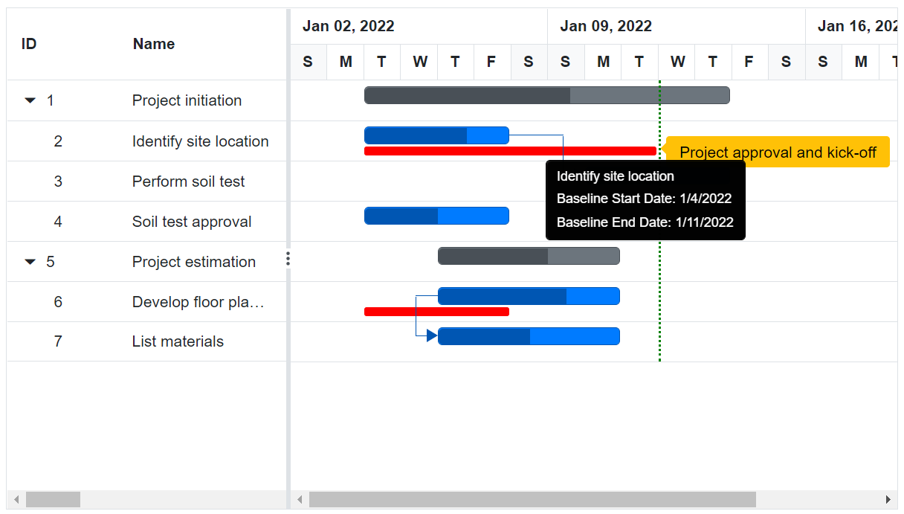
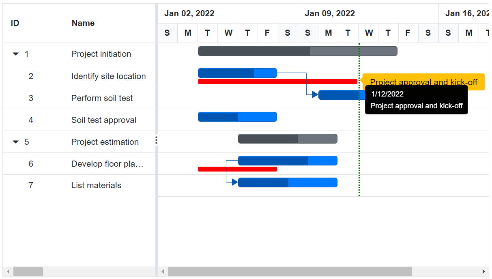
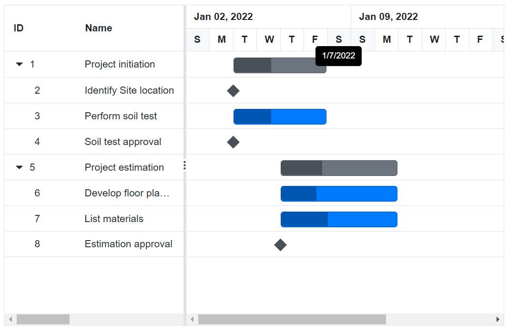
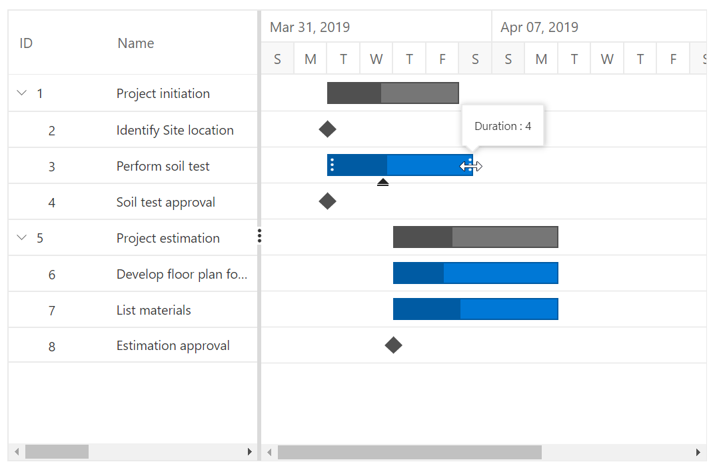

# Tooltip in Blazor Gantt Chart Component

The [Blazor Gantt Chart](https://www.syncfusion.com/blazor-components/blazor-gantt-chart) component has a support to display a tooltip for various UI elements like taskbar, timeline cells, and grid cells

## Enable tooltip

In the Gantt Chart component, you can enable or disable the mouse hover tooltip for the following UI elements using the `GanttTooltipSettings.ShowTooltip` property:

* Taskbar
* Connector line
* Baseline
* Event marker

```cshtml
@using Syncfusion.Blazor.Gantt
<SfGantt DataSource="@TaskCollection" RenderBaseline="true" BaselineColor="Red" Height="450px" Width="800px">
    <GanttTaskFields Id="TaskId" Name="TaskName" StartDate="StartDate" EndDate="EndDate" Duration="Duration" Progress="Progress" Dependency="Predecessor" ParentID="ParentId"
                     BaselineStartDate="BaselineStartDate" BaselineEndDate="BaselineEndDate">
    </GanttTaskFields>
    <GanttEventMarkers>
        <GanttEventMarker Day="@Event" Label="Project approval and kick-off"
                          CssClass="e-custom-event-marker"></GanttEventMarker>
    </GanttEventMarkers>
</SfGantt>

@code{
        public DateTime Event = new DateTime(2022, 01, 10);
        private List<TaskData> TaskCollection { get; set; }
        protected override void OnInitialized()
        {
            this.TaskCollection = GetTaskCollection();
        }

        public class TaskData
        {
            public int TaskId { get; set; }
            public string TaskName { get; set; }
            public DateTime StartDate { get; set; }
            public DateTime EndDate { get; set; }
            public string Duration { get; set; }
            public int Progress { get; set; }
            public int? ParentId { get; set; }
            public DateTime? BaselineStartDate { get; set; }
            public DateTime? BaselineEndDate { get; set; }
            public string Predecessor { get; set; }
        }

        private static List<TaskData> GetTaskCollection()
        {
            List<TaskData> Tasks = new List<TaskData>() {
                new TaskData() {
                    TaskId = 1,
                    TaskName = "Project initiation",
                    StartDate = new DateTime(2022, 01, 04),
                    EndDate = new DateTime(2022, 01, 17),
                },
                new TaskData() {
                    TaskId = 2,
                    TaskName = "Identify site location",
                    StartDate = new DateTime(2022, 01, 04),
                    Duration = "4",
                    BaselineStartDate = new DateTime(2022, 01, 04),
                    BaselineEndDate = new DateTime(2022, 01, 08),
                    Progress = 70,
                    ParentId = 1,
                },
                new TaskData() {
                    TaskId = 3,
                    TaskName = "Perform soil test",
                    StartDate = new DateTime(2022, 01, 04),
                    Duration = "4",
                    Predecessor = "2FS",
                    Progress = 50,
                    ParentId = 1,
                },
                new TaskData() {
                    TaskId = 4,
                    TaskName = "Soil test approval",
                    StartDate = new DateTime(2022, 01, 04),
                    Duration = "4",
                    Progress = 50,
                    ParentId = 1,
                },
                new TaskData() {
                    TaskId = 5,
                    TaskName = "Project estimation",
                    StartDate = new DateTime(2022, 01, 04),
                    EndDate = new DateTime(2022, 01, 17),
                },
                new TaskData() {
                    TaskId = 6,
                    TaskName = "Develop floor plan for estimation",
                    StartDate = new DateTime(2022, 01, 04),
                    Duration = "3",
                    Progress = 70,
                    BaselineStartDate = new DateTime(2022, 01, 04),
                    BaselineEndDate = new DateTime(2022, 01, 06),
                    ParentId = 5,
                },
                new TaskData() {
                    TaskId = 7,
                    TaskName = "List materials",
                    StartDate = new DateTime(2022, 01, 04),
                    Duration = "3",
                    Predecessor = "6SS",
                    Progress = 50,
                    ParentId = 5,
                }
        };
        return Tasks;
    }
}
<style>
    .e-gantt .e-gantt-chart .e-custom-event-marker {
        width: 1px;
        border-left: 2px green dotted;
    }
</style>
```

Taskbar Tooltip



Dependency Tooltip


Baseline Tooltip



Event Marker Tooltip



> The default value of the `GanttTooltipSettings.ShowTooltip` property is true.

## Timeline cells tooltip

In the Gantt Chart component, you can enable or disable the mouse hover tooltip of timeline cells using the `GanttTimelineSettings.ShowTooltip` property. The default value of this property is true. The following code example shows how to enable the timeline cells tooltip in Gantt Chart.

```cshtml
@using Syncfusion.Blazor.Gantt
<SfGantt DataSource="@TaskCollection" Height="450px" Width="700px">
    <GanttTaskFields Id="TaskId" Name="TaskName" StartDate="StartDate" EndDate="EndDate"
                     Duration="Duration" Progress="Progress" ParentID="ParentId">
    </GanttTaskFields>
    <GanttTimelineSettings ShowTooltip="true"></GanttTimelineSettings>
</SfGantt>

@code{
    private List<TaskData> TaskCollection { get; set; }
    protected override void OnInitialized()
    {
        this.TaskCollection = GetTaskCollection();
    }

    public class TaskData
    {
        public int TaskId { get; set; }
        public string TaskName { get; set; }
        public DateTime StartDate { get; set; }
        public DateTime EndDate { get; set; }
        public string Duration { get; set; }
        public int Progress { get; set; }
        public int? ParentId { get; set; }
    }

    private static List<TaskData> GetTaskCollection()
    {
        List<TaskData> Tasks = new List<TaskData>()
        {
            new TaskData() {
                TaskId = 1,
                TaskName = "Project initiation",
                StartDate = new DateTime(2022, 01, 04),
                EndDate = new DateTime(2022, 01, 17),
                },
            new TaskData() {
                TaskId = 2,
                TaskName = "Identify Site location",
                StartDate = new DateTime(2022, 01, 04),
                Duration = "0",
                Progress = 30,
                ParentId = 1,
            },
            new TaskData() {
                TaskId = 3,
                TaskName = "Perform soil test",
                StartDate = new DateTime(2022, 01, 04),
                Duration = "4",
                Progress = 40,
                ParentId = 1,
            },
            new TaskData() {
                TaskId = 4,
                TaskName = "Soil test approval",
                StartDate = new DateTime(2022, 01, 04),
                Duration = "0",
                Progress = 30,
                ParentId = 1,
            },
            new TaskData() {
                TaskId = 5,
                TaskName = "Project estimation",
                StartDate = new DateTime(2022, 01, 04),
                EndDate = new DateTime(2022, 01, 17),
            },
            new TaskData() {
                TaskId = 6,
                TaskName = "Develop floor plan for estimation",
                StartDate = new DateTime(2022, 01, 06),
                Duration = "3",
                Progress = 30,
                ParentId = 5,
            },
            new TaskData() {
                TaskId = 7,
                TaskName = "List materials",
                StartDate = new DateTime(2022, 01, 06),
                Duration = "3",
                Progress = 40,
                ParentId = 5,
            },
            new TaskData() {
                TaskId = 8,
                TaskName = "Estimation approval",
                StartDate = new DateTime(2022, 01, 06),
                Duration = "0",
                Progress = 30,
                ParentId = 5,
            }
        };
        return Tasks;
    }
}
```



## Cell tooltip

You can enable or disable the Grid cell tooltip using the `GanttColumn.ClipMode` property.

```cshtml
@using Syncfusion.Blazor.Gantt
@using Syncfusion.Blazor.Grids
<SfGantt DataSource="@TaskCollection" Height="450px" Width="700px">
    <GanttTaskFields Id="TaskId" Name="TaskName" StartDate="StartDate" EndDate="EndDate"
                     Duration="Duration" Progress="Progress" ParentID="ParentId">
    </GanttTaskFields>
    <GanttColumns>
        <GanttColumn Field="TaskId"></GanttColumn>
        <GanttColumn Field="TaskName" Width="100" ClipMode="ClipMode.EllipsisWithTooltip"></GanttColumn>
        <GanttColumn Field="StartDate"></GanttColumn>
        <GanttColumn Field="Duration" ClipMode="ClipMode.Clip"></GanttColumn>
        <GanttColumn Field="Progress"></GanttColumn>
    </GanttColumns>
</SfGantt>

@code{
    private List<TaskData> TaskCollection { get; set; }
    protected override void OnInitialized()
    {
        this.TaskCollection = GetTaskCollection();
    }

    public class TaskData
    {
        public int TaskId { get; set; }
        public string TaskName { get; set; }
        public DateTime StartDate { get; set; }
        public DateTime EndDate { get; set; }
        public string Duration { get; set; }
        public int Progress { get; set; }
        public int? ParentId { get; set; }
    }

    private static List<TaskData> GetTaskCollection()
    {
        List<TaskData> Tasks = new List<TaskData>()
    {
            new TaskData() {
                TaskId = 1,
                TaskName = "Project initiation",
                StartDate = new DateTime(2022, 01, 04),
                EndDate = new DateTime(2022, 01, 17),
                },
            new TaskData() {
                TaskId = 2,
                TaskName = "Identify Site location",
                StartDate = new DateTime(2022, 01, 04),
                Duration = "0",
                Progress = 30,
                ParentId = 1,
            },
            new TaskData() {
                TaskId = 3,
                TaskName = "Perform soil test",
                StartDate = new DateTime(2022, 01, 04),
                Duration = "4",
                Progress = 40,
                ParentId = 1,
            },
            new TaskData() {
                TaskId = 4,
                TaskName = "Soil test approval",
                StartDate = new DateTime(2022, 01, 04),
                Duration = "0",
                Progress = 30,
                ParentId = 1,
            },
            new TaskData() {
                TaskId = 5,
                TaskName = "Project estimation",
                StartDate = new DateTime(2022, 01, 04),
                EndDate = new DateTime(2022, 01, 17),
            },
            new TaskData() {
                TaskId = 6,
                TaskName = "Develop floor plan for estimation",
                StartDate = new DateTime(2022, 01, 06),
                Duration = "3",
                Progress = 30,
                ParentId = 5,
            },
            new TaskData() {
                TaskId = 7,
                TaskName = "List materials",
                StartDate = new DateTime(2022, 01, 06),
                Duration = "3",
                Progress = 40,
                ParentId = 5,
            },
            new TaskData() {
                TaskId = 8,
                TaskName = "Estimation approval",
                StartDate = new DateTime(2022, 01, 06),
                Duration = "0",
                Progress = 30,
                ParentId = 5,
            }
        };
        return Tasks;
    }
}
```

### Clip mode

The clip mode provides options to display its overflow cell content and it can be defined by the `GanttColumn.ClipMode` property.

The following are three types of `ClipMode`:

* `Clip`: Truncates the cell content when it overflows its area.
* `Ellipsis`: Displays ellipsis when content of the cell overflows its area.
* `EllipsisWithTooltip`: Displays ellipsis when content of the cell overflows its area; it displays the tooltip content when hover over ellipsis.

> NOTE
> By default, all the column's `ClipMode` property is defined as `EllipsisWithTooltip`.

## Tooltip template

### Taskbar tooltip

The default tooltip in the Gantt Chart component can be customized using the `GanttTooltipSettings.TaskbarTemplate` property. You can map the template script element’s ID value or template string directly to this property.

```cshtml
@using Syncfusion.Blazor.Gantt
<SfGantt DataSource="@TaskCollection" Height="450px" Width="700px">
    <GanttTaskFields Id="TaskId" Name="TaskName" StartDate="StartDate" EndDate="EndDate"
                     Duration="Duration" Progress="Progress" ParentID="ParentId">
    </GanttTaskFields>
    <GanttTooltipSettings ShowTooltip="true" TValue="TaskData">
        <TaskbarTemplate>
            @{
                <div>TaskID: @context.TaskId</div>
            }
        </TaskbarTemplate>
    </GanttTooltipSettings>
</SfGantt>

@code{
    private List<TaskData> TaskCollection { get; set; }
    protected override void OnInitialized()
    {
        this.TaskCollection = GetTaskCollection();
    }

    public class TaskData
    {
        public int TaskId { get; set; }
        public string TaskName { get; set; }
        public DateTime StartDate { get; set; }
        public DateTime EndDate { get; set; }
        public string Duration { get; set; }
        public int Progress { get; set; }
        public int? ParentId { get; set; }
    }

    private static List<TaskData> GetTaskCollection()
    {
        List<TaskData> Tasks = new List<TaskData>()
        {
            new TaskData() {
                TaskId = 1,
                TaskName = "Project initiation",
                StartDate = new DateTime(2022, 01, 04),
                EndDate = new DateTime(2022, 01, 17),
                },
            new TaskData() {
                TaskId = 2,
                TaskName = "Identify Site location",
                StartDate = new DateTime(2022, 01, 04),
                Duration = "0",
                Progress = 30,
                ParentId = 1,
            },
            new TaskData() {
                TaskId = 3,
                TaskName = "Perform soil test",
                StartDate = new DateTime(2022, 01, 04),
                Duration = "4",
                Progress = 40,
                ParentId = 1,
            },
            new TaskData() {
                TaskId = 4,
                TaskName = "Soil test approval",
                StartDate = new DateTime(2022, 01, 04),
                Duration = "0",
                Progress = 30,
                ParentId = 1,
            },
            new TaskData() {
                TaskId = 5,
                TaskName = "Project estimation",
                StartDate = new DateTime(2022, 01, 04),
                EndDate = new DateTime(2022, 01, 17),
            },
            new TaskData() {
                TaskId = 6,
                TaskName = "Develop floor plan for estimation",
                StartDate = new DateTime(2022, 01, 06),
                Duration = "3",
                Progress = 30,
                ParentId = 5,
            },
            new TaskData() {
                TaskId = 7,
                TaskName = "List materials",
                StartDate = new DateTime(2022, 01, 06),
                Duration = "3",
                Progress = 40,
                ParentId = 5,
            },
            new TaskData() {
                TaskId = 8,
                TaskName = "Estimation approval",
                StartDate = new DateTime(2022, 01, 06),
                Duration = "0",
                Progress = 30,
                ParentId = 5,
            }
        };
        return Tasks;
    }
}
```

The below screenshot shows the output of above code example.


<!-- Taskbar editing tooltip

The taskbar editing tooltip can be customized using the `GanttTooltipSettings.Editing` property. The following code example shows how to customize the taskbar editing tooltip in Gantt Chart.

```cshtml
@using Syncfusion.Blazor.Gantt
<SfGantt DataSource="@TaskCollection" Height="450px" Width="700px">
    <GanttTaskFields Id="TaskId" Name="TaskName" StartDate="StartDate" EndDate="EndDate" Duration="Duration" Progress="Progress" Child="SubTasks">
    </GanttTaskFields>
    <GanttTooltipSettings ShowTooltip="true" TValue="TaskData">
        <EditingTemplate>
            @{
                <div>Duration: @context.Duration</div>
            }
        </EditingTemplate>
    </GanttTooltipSettings>
    <GanttEditSettings AllowTaskbarEditing="true"></GanttEditSettings>
</SfGantt>
@code{
    public List<TaskData> TaskCollection { get; set; }
    protected override void OnInitialized()
    {
        this.TaskCollection = GetTaskCollection();
    }

    public class TaskData
    {
        public int TaskId { get; set; }
        public string TaskName { get; set; }
        public DateTime StartDate { get; set; }
        public DateTime EndDate { get; set; }
        public string Duration { get; set; }
        public int Progress { get; set; }
        public List<TaskData> SubTasks { get; set; }
    }

    public static List <TaskData> GetTaskCollection() {
    List <TaskData> Tasks = new List <TaskData> () {
        new TaskData() {
            TaskId = 1,
            TaskName = "Project initiation",
            StartDate = new DateTime(2019, 04, 02),
            EndDate = new DateTime(2019, 04, 21),
            SubTasks = (new List <TaskData> () {
                new TaskData() {
                    TaskId = 2,
                    TaskName = "Identify site location",
                    StartDate = new DateTime(2019, 04, 02),
                    Duration = "4",
                    Progress = 70
                },
                new TaskData() {
                    TaskId = 3,
                    TaskName = "Perform soil test",
                    StartDate = new DateTime(2019, 04, 02),
                    Duration = "4",
                    Progress = 50
                },
                new TaskData() {
                    TaskId = 4,
                    TaskName = "Soil test approval",
                    StartDate = new DateTime(2019, 04, 02),
                    Duration = "4",
                    Progress = 50
                },
            })
        },
        new TaskData() {
            TaskId = 5,
            TaskName = "Project estimation",
            StartDate = new DateTime(2019, 04, 02),
            EndDate = new DateTime(2019, 04, 21),
            SubTasks = (new List <TaskData> () {
                new TaskData() {
                    TaskId = 6,
                    TaskName = "Develop floor plan for estimation",
                    StartDate = new DateTime(2019, 04, 04),
                    Duration = "3",
                    Progress = 70,
                },
                new TaskData() {
                    TaskId = 7,
                    TaskName = "List materials",
                    StartDate = new DateTime(2019, 04, 04),
                    Duration = "3",
                    Progress = 50
                },
            })
        }
    };

    return Tasks;
}
}
```

The below screenshot shows the output of above code example.

 -->

### Baseline tooltip

A baseline tooltip can be customized using the `GanttTooltipSettings.BaselineTemplate` property. The following code example shows how to customize the baseline tooltip in Gantt Chart.

```cshtml
@using Syncfusion.Blazor.Gantt
<SfGantt DataSource="@TaskCollection" RenderBaseline="true"
         BaselineColor="Red" Height="450px" Width="800px">
    <GanttTaskFields Id="TaskId" Name="TaskName" StartDate="StartDate" EndDate="EndDate"
                     Duration="Duration" Progress="Progress" BaselineStartDate="BaselineStartDate" BaselineEndDate="BaselineEndDate" ParentID="ParentId">
    </GanttTaskFields>
    <GanttTooltipSettings ShowTooltip="true" TValue="TaskData">
        <BaselineTemplate>
            @{
                <div>Baseline StartDate: @context.BaselineStartDate.ToShortDateString()</div>
            }
        </BaselineTemplate>
    </GanttTooltipSettings>
</SfGantt>

@code{
    private List<TaskData> TaskCollection { get; set; }
    protected override void OnInitialized()
    {
        this.TaskCollection = GetTaskCollection();
    }

    public class TaskData
    {
        public int TaskId { get; set; }
        public string TaskName { get; set; }
        public DateTime StartDate { get; set; }
        public DateTime EndDate { get; set; }
        public string Duration { get; set; }
        public int Progress { get; set; }
        public int? ParentId { get; set; }
        public DateTime BaselineStartDate { get; set; }
        public DateTime BaselineEndDate { get; set; }
        public string Predecessor { get; set; }
    }

    public static List<TaskData> GetTaskCollection()
    {
        List<TaskData> Tasks = new List<TaskData>() 
        {
                new TaskData() {
                    TaskId = 1,
                    TaskName = "Project initiation",
                    StartDate = new DateTime(2022, 01, 04),
                    EndDate = new DateTime(2022, 01, 17),
                },
                new TaskData() {
                    TaskId = 2,
                    TaskName = "Identify site location",
                    StartDate = new DateTime(2022, 01, 04),
                    Duration = "4",
                    BaselineStartDate = new DateTime(2022, 01, 04),
                    BaselineEndDate = new DateTime(2022, 01, 08),
                    Progress = 70,
                    ParentId = 1,
                },
                new TaskData() {
                    TaskId = 3,
                    TaskName = "Perform soil test",
                    StartDate = new DateTime(2022, 01, 04),
                    Duration = "4",
                    Predecessor = "2FS",
                    Progress = 50,
                    ParentId = 1,
                },
                new TaskData() {
                    TaskId = 4,
                    TaskName = "Soil test approval",
                    StartDate = new DateTime(2022, 01, 04),
                    Duration = "4",
                    Progress = 50,
                    ParentId = 1,
                },
                new TaskData() {
                    TaskId = 5,
                    TaskName = "Project estimation",
                    StartDate = new DateTime(2022, 01, 04),
                    EndDate = new DateTime(2022, 01, 17),
                },
                new TaskData() {
                    TaskId = 6,
                    TaskName = "Develop floor plan for estimation",
                    StartDate = new DateTime(2022, 01, 04),
                    Duration = "3",
                    Progress = 70,
                    BaselineStartDate = new DateTime(2022, 01, 04),
                    BaselineEndDate = new DateTime(2022, 01, 06),
                    ParentId = 5,
                },
                new TaskData() {
                    TaskId = 7,
                    TaskName = "List materials",
                    StartDate = new DateTime(2022, 01, 04),
                    Duration = "3",
                    Predecessor = "6SS",
                    Progress = 50,
                    ParentId = 5,
                }
        };
        return Tasks;
    }
}
```

The following screenshot shows the template for baseline in Gantt Chart.


### Manual taskbar tooltip

A manual taskbar tooltip can be customized using the `GanttTooltipSettings.ManualTaskbarTemplate` property. The following code example shows how to customize the manual taskbar tooltip in Gantt Chart.

```cshtml
@using Syncfusion.Blazor.Gantt

<SfGantt DataSource="@TaskCollection" Height="450px" TaskMode="ScheduleMode.Manual" ValidateManualTasksOnLinking="true" Width="900px" TreeColumnIndex="1" Toolbar="@(new List<string>() { "Add", "Edit", "Update", "Delete", "Cancel", "ExpandAll", "CollapseAll" })">
    <GanttTaskFields Id="TaskId" Name="TaskName" StartDate="StartDate" EndDate="EndDate" Duration="Duration" Progress="Progress"
                     ParentID="ParentId" Dependency="Predecessor">
    </GanttTaskFields>
    <GanttEditSettings AllowEditing="true" AllowAdding="true" AllowDeleting="true" AllowTaskbarEditing="true"></GanttEditSettings>
    <GanttTooltipSettings ShowTooltip="true" TValue="TaskData">
        <ManualTaskbarTemplate>
            @{
                <div> StartDate: @context.StartDate.ToShortDateString()</div>
                <div> EndDate: @context.EndDate.ToShortDateString()</div>
            }
        </ManualTaskbarTemplate>
    </GanttTooltipSettings>
</SfGantt>

@code{
    private List<TaskData> TaskCollection { get; set; }
    protected override void OnInitialized()
    {
        this.TaskCollection = GetTaskCollection();
    }

    public class TaskData
    {
        public int TaskId { get; set; }
        public string TaskName { get; set; }
        public DateTime StartDate { get; set; }
        public DateTime EndDate { get; set; }
        public string Duration { get; set; }
        public int Progress { get; set; }
        public int? ParentId { get; set; }
    }

    private static List<TaskData> GetTaskCollection()
    {
        List<TaskData> Tasks = new List<TaskData>()
        {
            new TaskData() {
                TaskId = 1,
                TaskName = "Project initiation",
                StartDate = new DateTime(2022, 01, 04),
                EndDate = new DateTime(2022, 01, 17),
                },
            new TaskData() {
                TaskId = 2,
                TaskName = "Identify Site location",
                StartDate = new DateTime(2022, 01, 04),
                Duration = "0",
                Progress = 30,
                ParentId = 1,
            },
            new TaskData() {
                TaskId = 3,
                TaskName = "Perform soil test",
                StartDate = new DateTime(2022, 01, 04),
                Duration = "4",
                Progress = 40,
                ParentId = 1,
            },
            new TaskData() {
                TaskId = 4,
                TaskName = "Soil test approval",
                StartDate = new DateTime(2022, 01, 04),
                Duration = "0",
                Progress = 30,
                ParentId = 1,
            },
            new TaskData() {
                TaskId = 5,
                TaskName = "Project estimation",
                StartDate = new DateTime(2022, 01, 04),
                EndDate = new DateTime(2022, 01, 17),
            },
            new TaskData() {
                TaskId = 6,
                TaskName = "Develop floor plan for estimation",
                StartDate = new DateTime(2022, 01, 06),
                Duration = "3",
                Progress = 30,
                ParentId = 5,
            },
            new TaskData() {
                TaskId = 7,
                TaskName = "List materials",
                StartDate = new DateTime(2022, 01, 06),
                Duration = "3",
                Progress = 40,
                ParentId = 5,
            },
            new TaskData() {
                TaskId = 8,
                TaskName = "Estimation approval",
                StartDate = new DateTime(2022, 01, 06),
                Duration = "0",
                Progress = 30,
                ParentId = 5,
            }
        };
        return Tasks;
    }
}
```

