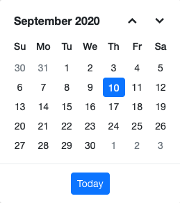

<!-- markdownlint-disable MD024 -->

# Getting started with Blazor Server Side App in VS for Mac

This article provides a step-by-step instructions for building Blazor Server App with `Blazor Calendar` component using [Visual Studio for Mac](https://visualstudio.microsoft.com/vs/mac/).

## Prerequisites

* [System requirements for Blazor components](https://blazor.syncfusion.com/documentation/system-requirements)

## Create a Blazor Server Side App in Visual Studio for Mac

You can create **Blazor Server App** using in Visual Studio for mac by the following way.

* [Create a project using Microsoft Templates](https://docs.microsoft.com/en-us/aspnet/core/blazor/tooling?pivots=macos)

## Install Syncfusion Blazor Packages in the App

Syncfusion Blazor components are available in [nuget.org](https://www.nuget.org/packages?q=syncfusion.blazor). To use Syncfusion Blazor components in the application, add reference to the corresponding NuGet. Refer to [NuGet packages topic](https://blazor.syncfusion.com/documentation/nuget-packages) for available NuGet packages list with component details.

To add Blazor Calendar component in the app, open the NuGet package manager in Visual Studio (*Tools → NuGet Package Manager → Manage NuGet Packages for Solution*), search for [Syncfusion.Blazor.Calendars](https://www.nuget.org/packages/Syncfusion.Blazor.Calendars/) and then install it.

## Register Syncfusion Blazor Service

Open `~/_Imports.razor` file and import the `Syncfusion.Blazor` namespace.




@using Syncfusion.Blazor




Now, register the Syncfusion Blazor Service in the Blazor Server App. Open the `~/Startup.cs` file and register the Syncfusion Blazor Service. Here, Syncfusion Blazor Service is registered by setting [IgnoreScriptIsolation](https://help.syncfusion.com/cr/blazor/Syncfusion.Blazor.GlobalOptions.html#Syncfusion_Blazor_GlobalOptions_IgnoreScriptIsolation) property as true to load the scripts externally in the [next steps](#add-script-reference).




using Syncfusion.Blazor;

namespace BlazorApp
{
    public class Startup
    {
        ...
        public void ConfigureServices(IServiceCollection services)
        {
            services.AddRazorPages();
            services.AddServerSideBlazor();
            services.AddSyncfusionBlazor(options => { options.IgnoreScriptIsolation = true; );
        }
        ...
    }
}



## Add Style Sheet

Checkout the [Blazor Themes topic](https://blazor.syncfusion.com/documentation/appearance/themes) to learn different ways to refer themes in Blazor application, and to have the expected appearance for Syncfusion Blazor components. Here, the theme is referred using [Static Web Assets](https://blazor.syncfusion.com/documentation/appearance/themes#static-web-assets).

To add theme to the app, open the NuGet package manager in Visual Studio (*Tools → NuGet Package Manager → Manage NuGet Packages for Solution*), search for [Syncfusion.Blazor.Themes](https://www.nuget.org/packages/Syncfusion.Blazor.Themes/) and then install it. Then, the theme style sheet from NuGet can be referred inside the `<head>` of the **~/Pages/_Host.cshtml** page.




<head>
    ....
    <link href="_content/Syncfusion.Blazor.Themes/bootstrap5.css" rel="stylesheet" />
</head>




## Add Script Reference

Checkout [Adding Script Reference topic](https://blazor.syncfusion.com/documentation/common/adding-script-references) to learn different ways to add script reference in Blazor Application. In this getting started walk-through, the required scripts are referenced externally inside the `<head>` as follows,




<head>
    ....
    <link href="_content/Syncfusion.Blazor.Themes/bootstrap5.css" rel="stylesheet" />
    
</head>




> Syncfusion recommends to reference scripts using [Static Web Assets](https://blazor.syncfusion.com/documentation/common/adding-script-references#static-web-assets), [CDN](https://blazor.syncfusion.com/documentation/common/adding-script-references#cdn-reference) and [CRG](https://blazor.syncfusion.com/documentation/common/custom-resource-generator) by [disabling JavaScript isolation](https://blazor.syncfusion.com/documentation/common/adding-script-references#disable-javascript-isolation) for better loading performance of the Blazor application.

## Add Syncfusion Blazor component

* Open **~/_Imports.razor** file or any razor page under the `~/Pages` folder where the component is to be added and import the `Syncfusion.Blazor.Calendars` namespace.




@using Syncfusion.Blazor
@using Syncfusion.Blazor.Calendars




* Now, add the Syncfusion Calendar component in .razor file. Here, the Calendar component is added in the **~/Pages/Index.razor** page under the `~/Pages` folder.




<SfCalendar TValue="DateTime" />




* <kbd>⌘</kbd>+<kbd>F5</kbd> to run the app. Then, the Syncfusion Blazor Calendar component will be rendered in the default web browser.

> You need to include a valid license key (either paid or trial key) within your applications. Please refer to this [help topic](https://blazor.syncfusion.com/documentation/getting-started/license-key/overview) for more information.

## See also

* [Getting Started with Blazor WebAssembly for Mac](https://blazor.syncfusion.com/documentation/getting-started/blazor-webassembly-visual-studio-mac)