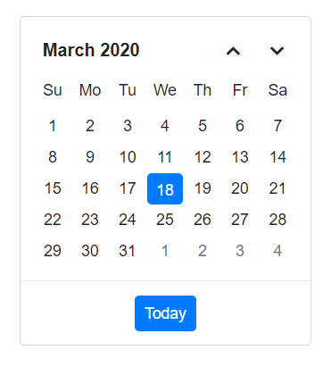

#  Getting Started with Blazor WebAssembly App in .NET CLI

This article provides a step-by-step instructions for building Blazor WebAssembly App with `Blazor Calendar` component using the [.NET CLI](https://dotnet.microsoft.com/download/dotnet/).

## Prerequisites

Latest version of the [.NET Core SDK](https://dotnet.microsoft.com/en-us/download). If you previously installed the SDK, you can determine the installed version by executing the following command in a command prompt (Windows) or terminal (macOS) or command shell (Linux).




dotnet --version




## Create a Blazor WebAssembly project using .NET CLI

Run the `dotnet new blazorwasm` command to create a new Blazor WebAssembly application in a command prompt (Windows) or terminal (macOS) or command shell (Linux).




dotnet new blazorwasm -o BlazorApp
cd BlazorApp




For a hosted Blazor WebAssembly experience, add the hosted option (-ho or --hosted) option to the command.




dotnet new blazorwasm -o BlazorApp -ho




This command creates new Blazor WebAssembly app project and places it in a new directory called `BlazorApp` inside your current location. See [Create Blazor app topic](https://dotnet.microsoft.com/en-us/learn/aspnet/blazor-tutorial/create) and [dotnet new CLI command](https://docs.microsoft.com/en-us/dotnet/core/tools/dotnet-new) topics for more details.

N> If you have installed multiple SDK versions and need any specific framework version (net6.0/net7.0) project, then add `-f` flag along with `dotnet new blazorwasm` comment. Refer [here](https://docs.microsoft.com/en-us/dotnet/core/tools/dotnet-new#blazorwasm) for the available options.

## Install Syncfusion Blazor packages in the App

Syncfusion Blazor components are available in [nuget.org](https://www.nuget.org/packages?q=syncfusion.blazor). To use Syncfusion Blazor components in the application, add reference to the corresponding NuGet. Refer to [NuGet packages topic](https://blazor.syncfusion.com/documentation/nuget-packages) for available NuGet packages list with component details and [Benefits of using individual NuGet packages](https://blazor.syncfusion.com/documentation/nuget-packages#benefits-of-using-individual-nuget-packages).

Add Syncfusion.Blazor.Calendars NuGet package to the application using the following command in the command prompt (Windows) or terminal (Linux and macOS) to install a NuGet package. See [Install and manage packages using the dotnet CLI](https://docs.microsoft.com/en-us/nuget/consume-packages/install-use-packages-dotnet-cli) topics for more details.




dotnet add package Syncfusion.Blazor.Calendars --version {{ site.releaseversion }}
dotnet restore







PM> NuGet\Install-Package Syncfusion.Blazor.Calendars -Version {{ site.releaseversion }}




## Register Syncfusion Blazor Service

Open **~/_Imports.razor** file and import the `Syncfusion.Blazor` namespace.




@using Syncfusion.Blazor




Now, Open **~/Program.cs** file and register the Syncfusion Blazor Service in the client web app. 




using Microsoft.AspNetCore.Components.Web;
using Microsoft.AspNetCore.Components.WebAssembly.Hosting;
using Syncfusion.Blazor;

var builder = WebAssemblyHostBuilder.CreateDefault(args);
builder.RootComponents.Add<App>("#app");
builder.RootComponents.Add<HeadOutlet>("head::after");

builder.Services.AddScoped(sp => new HttpClient { BaseAddress = new Uri(builder.HostEnvironment.BaseAddress) });

builder.Services.AddSyncfusionBlazor();
await builder.Build().RunAsync();
....




## Add style sheet

Checkout the [Blazor Themes topic](https://blazor.syncfusion.com/documentation/appearance/themes) to learn different ways ([Static Web Assets](https://blazor.syncfusion.com/documentation/appearance/themes#static-web-assets), [CDN](https://blazor.syncfusion.com/documentation/appearance/themes#cdn-reference) and [CRG](https://blazor.syncfusion.com/documentation/common/custom-resource-generator)) to refer themes in Blazor application, and to have the expected appearance for Syncfusion Blazor components. Here, the theme is referred using [Static Web Assets](https://blazor.syncfusion.com/documentation/appearance/themes#static-web-assets). Refer to [Enable static web assets usage](https://blazor.syncfusion.com/documentation/appearance/themes#enable-static-web-assets-usage) topic to use static assets in your project.

To add theme to the app, Add `Syncfusion.Blazor.Themes` NuGet package to the application using the following command in the command prompt (Windows) or terminal (Linux and macOS) to install the NuGet package.




dotnet add package Syncfusion.Blazor.Themes --version {{ site.releaseversion }}
dotnet restore







PM> NuGet\Install-Package Syncfusion.Blazor.Themes -Version {{ site.releaseversion }}




Then the theme style from can be referred inside the `<head>` of the **wwwroot/index.html** file in client web app.



<head>
    ...
    <link href="_content/Syncfusion.Blazor.Themes/bootstrap5.css" rel="stylesheet" />
    
</head>



## Add script reference

Checkout [Adding Script Reference topic](https://blazor.syncfusion.com/documentation/common/adding-script-references) to learn different ways to add script reference in Blazor Application. In this getting started walk-through, the required scripts are referred using [Static Web Assets](https://blazor.syncfusion.com/documentation/common/adding-script-references#static-web-assets) externally inside the `<head>` of **wwwroot/index.html** file in client web app. Refer to [Enable static web assets usage](https://blazor.syncfusion.com/documentation/common/adding-script-references#enable-static-web-assets-usage) topic to use static assets in your project.




<head>
    ...
    <link href="_content/Syncfusion.Blazor.Themes/bootstrap5.css" rel="stylesheet" />
    
  
</head>




N> Syncfusion recommends to reference scripts using [Static Web Assets](https://blazor.syncfusion.com/documentation/common/adding-script-references#static-web-assets), [CDN](https://blazor.syncfusion.com/documentation/common/adding-script-references#cdn-reference) and [CRG](https://blazor.syncfusion.com/documentation/common/custom-resource-generator) by [disabling JavaScript isolation](https://blazor.syncfusion.com/documentation/common/adding-script-references#disable-javascript-isolation) for better loading performance of the Blazor application.

## Add Syncfusion Blazor component

* Open **~/_Imports.razor** file or any razor page under the `~/Pages` folder where the component is to be added and import the `Syncfusion.Blazor.Calendars` namespace.




@using Syncfusion.Blazor
@using Syncfusion.Blazor.Calendars




* Now, add the Syncfusion Calendar component in .razor file. Here, the Calendar component is added in the `~/Pages/Index.razor` page under the `~/Pages` folder.




<SfCalendar TValue="DateTime" />




* In the command prompt (Windows) or terminal (Linux and macOS) to run the following command to build and start the app. The app listening on `http://localhost:<port number>` and view it in the browser.




dotnet run




N> You need to include a valid license key (either paid or trial key) within your applications. Refer to this [help topic](https://blazor.syncfusion.com/documentation/getting-started/license-key/overview) for more information.

## See Also

* [Getting Started with Blazor Server App using .NET CLI](https://blazor.syncfusion.com/documentation/getting-started/blazor-server-side-dotnet-cli)
