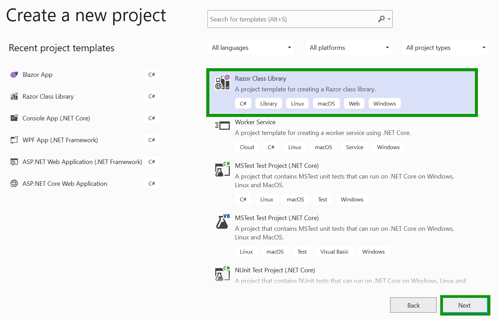
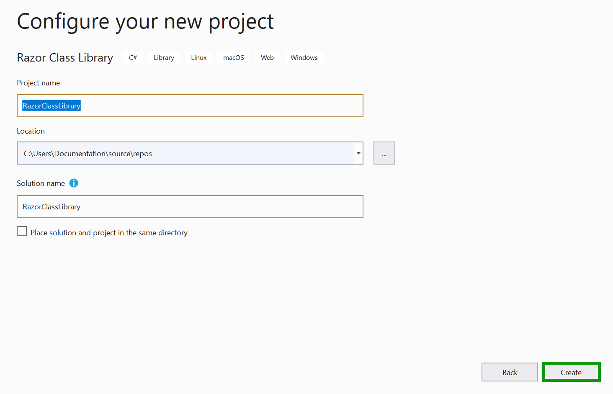
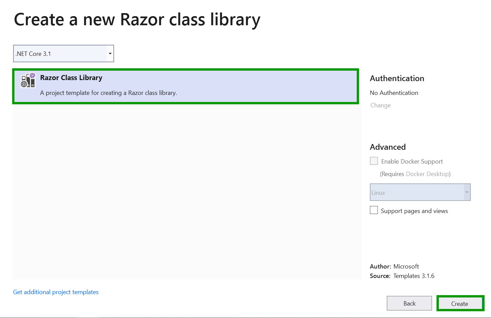
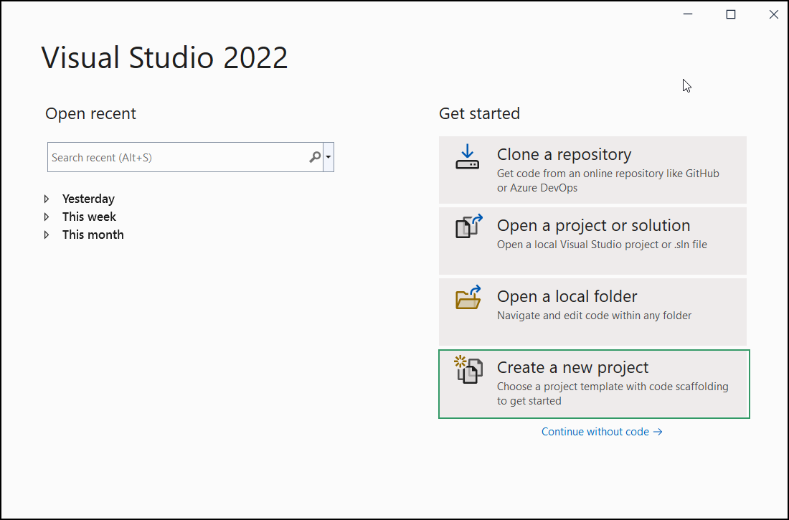
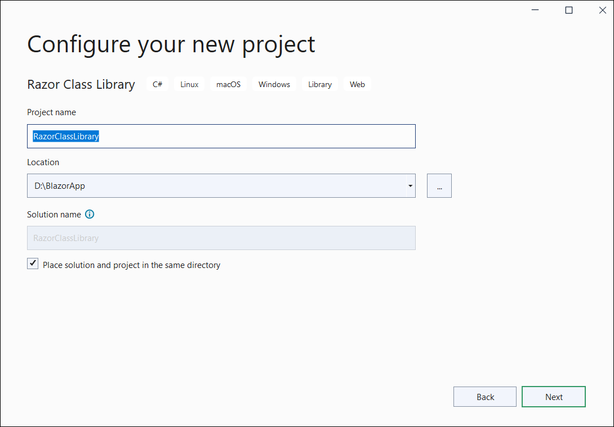

# Creating Razor Class Library (RCL) using Syncfusion Blazor components

This section provides information about creating Razor Class Library with the Syncfusion Blazor components using [Visual Studio](https://visualstudio.microsoft.com/vs/).

## Prerequisites

* [Visual Studio 2019](https://visualstudio.microsoft.com/vs/) / [Visual Studio 2022 Preview](https://visualstudio.microsoft.com/vs/preview)
* [.NET Core SDK 3.1.8](https://dotnet.microsoft.com/download/dotnet/3.1) / [.NET 5.0 SDK](https://dotnet.microsoft.com/download/dotnet/5.0) / [.NET 6.0 SDK](https://dotnet.microsoft.com/download/dotnet/6.0)

> **.NET Core SDK 3.1.8** requires Visual Studio 2019 16.7 or later. <br /> **.NET 5** requires Visual Studio 2019 16.8 or later. <br /> **.NET 6** requires Visual Studio 2022 Preview 4.1 or later.

## Create a Razor Class Library using Syncfusion Blazor components in Visual Studio 2019

1. Choose **Create a new project** from the Visual Studio dashboard.

    

2. Select **Razor Class Library** from the template, and then click the **Next** button.

    

3. Now, the project configuration window will popup. Click **Create** button to create a new project with the default project configuration.

    

4. Choose **Razor Class Library** from the dashboard and click **Create** button to create a new Razor Class Library Server application. Select the target framework **.NET Core 3.1**  or **.NET5.0** at the top based on your required target.

    

    > If existing .NET Standard version is 2.0 in `RazorClassLibrary.csproj`, then change it to **.NET Standard2.1** or above.

    ```xml
    <PropertyGroup>
        <TargetFramework>netstandard2.1</TargetFramework>
        ....
    </PropertyGroup>
    ```

## Create a Razor Class Library using Syncfusion Blazor components in Visual Studio 2022

1. Choose **Create a new project** from the Visual Studio dashboard.

    

2. Select **Razor Class Library** from the template, and then click the **Next** button.

    

3. Now, the project configuration window will popup. Click **Create** button to create a new project with the default project configuration.

    

4. Select the target Framework **.NET 6** at the top of the Application based on your required target that you want and then click the **Create** button to create a new Razor Class Library application.

    

### Importing Syncfusion Blazor component in Razor Class Library

You can use any one of the below standards to install the Syncfusion Blazor library in your Razor Class Library Server application.

#### Using Syncfusion Blazor individual NuGet Packages [New standard]

> Starting with Volume 4, 2020 (v18.4.0.30) release, Syncfusion provides [individual NuGet packages](https://blazor.syncfusion.com/documentation/nuget-packages/) for our Syncfusion Blazor components. We highly recommend this new standard for your Blazor production applications. Refer to [this section](https://blazor.syncfusion.com/documentation/nuget-packages/#benefits-of-using-individual-nuget-packages) to know the benefits of the individual NuGet packages.

1. Now, install **Syncfusion.Blazor.Calendars** NuGet package to the newly created RLC by using the `NuGet Package Manager`. For more details about the available NuGet packages, refer to the [Individual NuGet Packages](https://blazor.syncfusion.com/documentation/nuget-packages/) documentation.

2. Right-click the project, and then select Manage NuGet Packages.

    

3. Search **Syncfusion.Blazor.Calendars** keyword in the Browse tab and install **Syncfusion.Blazor.Calendars** NuGet package in RLC.

    

4. The Syncfusion Blazor Calendars package will be included in the newly created project once the installation process is completed.

5. Now, import and add the Syncfusion Blazor components in the `~/Component.razor` file. For example, the Calendar component is imported and added in the **~/Component.razor** page.

    ```cshtml
    @using Syncfusion.Blazor.Calendars

    <div class="my-component">
    This Blazor component is defined in the <strong>RazorClassLibrary</strong> package.
    </div><br />

    <SfCalendar TValue="DateTime"></SfCalendar>
    ```

#### Using Syncfusion.Blazor NuGet Package [Old standard]

W> If you prefer the above new standard (individual NuGet packages), then skip this section. Using both old and new standards in the same application will throw ambiguous compilation errors.

1. Now, install **Syncfusion.Blazor** NuGet package to the newly created RLC by using the `NuGet Package Manager`. Right-click the project and select Manage NuGet Packages.

    

2. Search **Syncfusion.Blazor** keyword in the Browse tab and install **Syncfusion.Blazor** NuGet package in RLC.

    

3. The Syncfusion Blazor package will be installed in the project once the installation process is completed.

4. Open **~/_Imports.razor** file in RLC and import the `Syncfusion.Blazor`.

    ```cshtml
    @using Syncfusion.Blazor
    ```

5. Now, import and add the Syncfusion Blazor components in the `~/Component.razor` file. For example, the Calendar component is imported and added in the **~/Component.razor** page.

    ```cshtml
    @using Syncfusion.Blazor.Calendars

    <div class="my-component">
    This Blazor component is defined in the <strong>RazorClassLibrary</strong> package.
    </div><br />

    <SfCalendar TValue="DateTime"></SfCalendar>
    ```

## Create a Blazor Server project in Visual Studio with Razor Class Library (RCL)

Refer to the [Blazor Tooling documentation](https://docs.microsoft.com/en-us/aspnet/core/blazor/tooling?view=aspnetcore-5.0&pivots=windows) to create a new Blazor Server-Side Application using Visual Studio.

### Configure the Razor Class Library and Blazor Server Application

1. Now, Right-click the solution, and then select Add/Existing Project.

    

2. Add the **Razor Class Library** project by selecting the `RazorClassLibrary.csproj` file.

    

    > Razor Class Library project is added to the existing Blazor Server Application.

3. Right-click the Blazor App project, and then select Add/Project reference. Now, click the checkbox and configure the **Razor Class Library** and **Blazor Server Application**.

    

    

### Importing Razor Class Library in the Blazor Server Application

1. Open **~/_Imports.razor** file in Blazor App and import the `RazorClassLibrary`.

    ```cshtml
    @using RazorClassLibrary
    ```

2. Now, register the Syncfusion Blazor Service to the Blazor Server App.

    a) For **.NET 6** project, open the **~/Program.cs** file and register the Syncfusion Blazor Service.

    ```c#
    // For .NET 6 project, add the Syncfusion Blazor Service in Program.cs file.
    using Microsoft.AspNetCore.Components;
    using Microsoft.AspNetCore.Components.Web;
    using Syncfusion.Blazor;

    var builder = WebApplication.CreateBuilder(args);

    builder.Services.AddRazorPages();
    builder.Services.AddServerSideBlazor();
    ....
    builder.Services.AddSyncfusionBlazor();
    var app = builder.Build();
    ....
    ....
    ```

    b) For **.NET 5** or **.NET Core SDK 3.1** project, open the **~/Startup.cs** file and register the Syncfusion Blazor Service.

    ```c#
    // For .NET 5 or .NET Core SDK 3.1 project, add the Syncfusion Blazor Service in Startup.cs file.
    using Syncfusion.Blazor;

    namespace WebApplication1
    {
        public class Startup
        {
            public void ConfigureServices(IServiceCollection services)
            {
                ....
                ....
                services.AddSyncfusionBlazor();
            }
        }
    }
    ```

3. Now, add the Syncfusion Blazor theme to the Blazor Server App.

    a) For **.NET 6** project, add the Syncfusion bootstrap4 theme in the `<head>` element of the **~/Pages/_Layout.cshtml** page.

    ```html
    <head>
        ....
        ....
        // Using individual NuGet packages
        <link href="_content/Syncfusion.Blazor.Themes/bootstrap4.css" rel="stylesheet" />
        
        // (or)
        
        // Using overall NuGet package
        <link href="_content/Syncfusion.Blazor/styles/bootstrap4.css" rel="stylesheet" />
    </head>
    ```

    b) For **.NET 5** or **.NET Core SDK 3.1** project, add the Syncfusion bootstrap4 theme in the `<head>` element of the **~/Pages/_Host.cshtml** page.

    ```html
    <head>
        ....
        ....
        // Using individual NuGet packages
        <link href="_content/Syncfusion.Blazor.Themes/bootstrap4.css" rel="stylesheet" />
        
        // (or)
        
        // Using overall NuGet package
        <link href="_content/Syncfusion.Blazor/styles/bootstrap4.css" rel="stylesheet" />
    </head>
    ```

    W> `Syncfusion.Blazor` package should not to be installed along with [individual NuGet packages](https://blazor.syncfusion.com/documentation/nuget-packages/). If you are using individual NuGet packages, you have to add the above `Syncfusion.Blazor.Themes` static web assets (styles) reference in the application. Or else, you have to add the above `Syncfusion.Blazor` styles reference for overall NuGet package.

    > Also, you can refer to the themes through the CDN version by using the following link instead of package theme reference.
    [https://cdn.syncfusion.com/blazor/{{ site.blazorversion }}/styles/bootstrap4.css](https://cdn.syncfusion.com/blazor/{{ site.blazorversion }}/styles/bootstrap4.css).

4. Now, add the created custom component that is imported with Syncfusion Blazor component from Razor Class Library in any web page (razor) in the `~/Pages` folder. For example, the custom component with imported Syncfusion Blazor Calendar component from Razor Class Library is added to the **~/Pages/Index.razor** page as like below.

    ```cshtml
    <Component></Component>
    ```

5. Run the application, The Syncfusion Blazor Calendar component will be rendered in the default web browser.

    

## Create a Blazor WebAssembly project in Visual Studio with Razor Class Library (RCL)

Refer to the [Blazor Tooling documentation](https://docs.microsoft.com/en-us/aspnet/core/blazor/tooling?view=aspnetcore-5.0&pivots=windows) to create a new Blazor Server-Side Application using Visual Studio.

### Configure the Razor Class Library and Blazor WebAssembly Application

1. Now, Right-click the solution, and then select Add/Existing Project.

    

2. Add the **Razor Class Library** project by selecting `RazorClassLibrary.csproj` file.

    

    > Razor Class Library project is added to the existing Blazor WebAssembly Application.

3. Right-click the Blazor App project, and then select Add/Project reference. Now, click the checkbox and configure the **Razor Class Library** and **Blazor WebAssembly Application**.

    

    

### Importing Razor Class Library in the Blazor WebAssembly Application

1. Open **~/_Imports.razor** file in Blazor WebAssembly App and import the `RazorClassLibrary`.

    ```cshtml
    @using RazorClassLibrary
    ```

2. Open the **~/Program.cs** file and register the Syncfusion Blazor Service from RCL.

    ```c#
    // For .NET 6 project.
    using Microsoft.AspNetCore.Components;
    using Microsoft.AspNetCore.Components.Web;
    using Syncfusion.Blazor;

    var builder = WebApplication.CreateBuilder(args);

    builder.Services.AddRazorPages();
    builder.Services.AddServerSideBlazor();
    ....
    builder.Services.AddSyncfusionBlazor();
    var app = builder.Build();
    ....
    ....
    ```

    ```c#
    // For .NET 5 or .NET Core SDK 3.1 project.
    using Syncfusion.Blazor;

    namespace BlazorApp
    {
        public class Program
        {
            public static async Task Main(string[] args)
            {
                ....
                ....
                builder.Services.AddSyncfusionBlazor();
                await builder.Build.RunAsync();
            }
        }
    }
    ```

3. Add the Syncfusion bootstrap4 theme in the `<head>` element of the **~/wwwroot/index.html** page.

    ```html
    <head>
        ....
        ....
        // Using individual NuGet packages
        <link href="_content/Syncfusion.Blazor.Themes/bootstrap4.css" rel="stylesheet" />
        
        // (or)
        
        // Using overall NuGet package
        <link href="_content/Syncfusion.Blazor/styles/bootstrap4.css" rel="stylesheet" />
    </head>
    ```

    W> `Syncfusion.Blazor` package should not to be installed along with [individual NuGet packages](https://blazor.syncfusion.com/documentation/nuget-packages/). If you are using individual NuGet packages, you have to add the above `Syncfusion.Blazor.Themes` static web assets (styles) reference in the application. Or else, you have to add the above `Syncfusion.Blazor` styles reference for overall NuGet package.

    > Also, you can refer to the themes through the CDN version by using the following link instead of package theme reference.
    [https://cdn.syncfusion.com/blazor/{{ site.blazorversion }}/styles/bootstrap4.css](https://cdn.syncfusion.com/blazor/{{ site.blazorversion }}/styles/bootstrap4.css).

4. Now, add the created custom component that is imported with Syncfusion Blazor component from Razor Class Library in any web page (razor) in the `~/Pages` folder. For example, the custom component with imported Syncfusion Blazor Calendar component from Razor Class Library is added to the **~/Pages/Index.razor** page as like below.

    ```cshtml
    <Component></Component>
    ```

5. Run the application, The Syncfusion Blazor Calendar component will be rendered in the default web browser.

    
