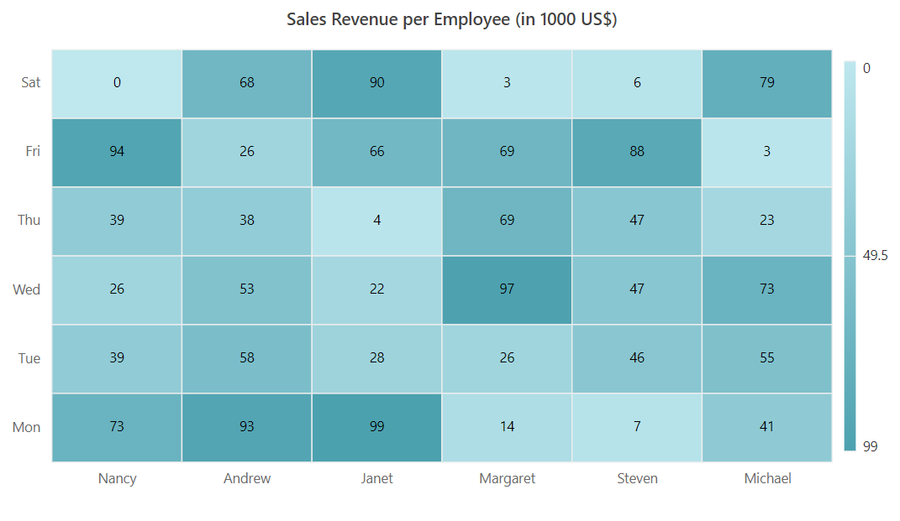
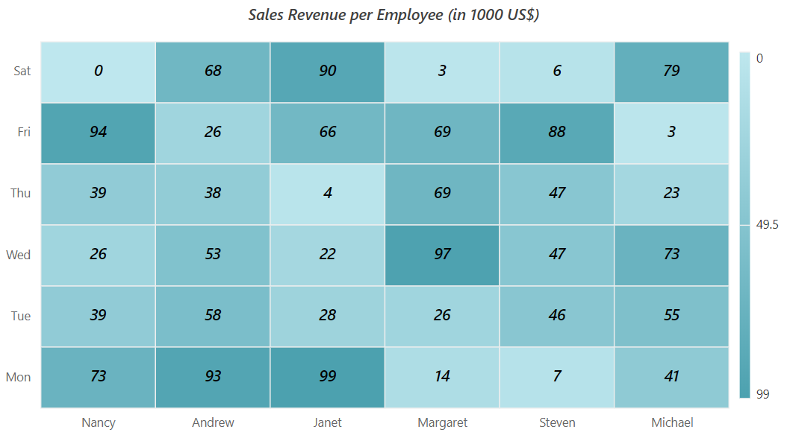

# Appearance

## Cell customizations

You can customize the cell by using the `CellSettings`

### Border

Change the width, color, and radius of the heat map cells by using the `HeatMapCellBorder` tag.

```csharp

@using Syncfusion.Blazor.HeatMap

<SfHeatMap DataSource="@HeatMapData">
    <HeatMapXAxis Labels="@XAxisLabels"></HeatMapXAxis>
    <HeatMapYAxis Labels="@YAxisLabels"></HeatMapYAxis>
    <HeatMapTitleSettings Text="Sales Revenue per Employee (in 1000 US$)">
    </HeatMapTitleSettings>
    <HeatMapCellSettings ShowLabel="true" TileType="CellType.Rect">
         <HeatMapCellBorder Width = "1" Radius = "4" Color = "White" ></HeatMapCellBorder>
    </HeatMapCellSettings>
    <HeatMapLegendSettings ShowLabel="true"></HeatMapLegendSettings>
</SfHeatMap>

@code{
    int[,] GetDefaultData()
    {
        int[,] dataSource = new int[,]
        {
            {73, 39, 26, 39, 94, 0},
            {93, 58, 53, 38, 26, 68},
            {99, 28, 22, 4, 66, 90},
            {14, 26, 97, 69, 69, 3},
            {7, 46, 47, 47, 88, 6},
            {41, 55, 73, 23, 3, 79},
        };
        return dataSource;
    }
    string[] XAxisLabels = new string[] {"Nancy", "Andrew", "Janet", "Margaret", "Steven", "Michael" };
    string[] YAxisLabels = new string[] { "Mon", "Tue", "Wed", "Thu", "Fri", "Sat" };
    public object HeatMapData { get; set; }
    protected override void OnInitialized()
    {
        HeatMapData = GetDefaultData();
    }
}

```


### Cell highlighting

Enable or disable the cell highlighting while hover over the heat map cells by using the  `EnableCellHighlighting` property.

>Note: The cell highlighting only works in a SVG rendering mode.

```csharp

@using Syncfusion.Blazor.HeatMap

<SfHeatMap DataSource="@HeatMapData">
    <HeatMapXAxis Labels="@XAxisLabels"></HeatMapXAxis>
    <HeatMapYAxis Labels="@YAxisLabels"></HeatMapYAxis>
    <HeatMapTitleSettings Text="Sales Revenue per Employee (in 1000 US$)">
    </HeatMapTitleSettings>
    <HeatMapCellSettings ShowLabel="true" TileType="CellType.Rect" EnableCellHighlighting="true"></HeatMapCellSettings>
    <HeatMapLegendSettings ShowLabel="true" Position="LegendPosition.Right" EnableSmartLegend="true" ToggleVisibility="true"></HeatMapLegendSettings>
</SfHeatMap>

@code{
    int[,] GetDefaultData()
        {
            int[,] dataSource = new int[,]
            {
                {73, 39, 26, 39, 94, 0},
                {93, 58, 53, 38, 26, 68},
                {99, 28, 22, 4, 66, 90},
                {14, 26, 97, 69, 69, 3},
                {7, 46, 47, 47, 88, 6},
                {41, 55, 73, 23, 3, 79}
            };
            return dataSource;
        }
    string[] XAxisLabels = new string[] {"Nancy", "Andrew", "Janet", "Margaret", "Steven", "Michael" };
    string[] YAxisLabels = new string[] { "Mon", "Tue", "Wed", "Thu", "Fri", "Sat" };
    public object HeatMapData { get; set; }
    protected override void OnInitialized()
    {
        HeatMapData = GetDefaultData();
    }
}

```


## Margin

Set the margin for the heat map from its container by using the `HeatMapMargin` property.

```csharp

@using Syncfusion.Blazor.HeatMap

<SfHeatMap DataSource="@HeatMapData">
    <HeatMapXAxis Labels="@XAxisLabels"></HeatMapXAxis>
    <HeatMapYAxis Labels="@YAxisLabels"></HeatMapYAxis>
    <HeatMapTitleSettings Text="Sales Revenue per Employee (in 1000 US$)">
    </HeatMapTitleSettings>
    <HeatMapCellSettings ShowLabel="true" TileType="CellType.Rect"></HeatMapCellSettings>
    <HeatMapMargin Left="15" Right="15" Top="15" Bottom="15"></HeatMapMargin>
    <HeatMapLegendSettings ShowLabel="true" Position="LegendPosition.Right" EnableSmartLegend="true" ToggleVisibility="true"></HeatMapLegendSettings>
</SfHeatMap>

@code{
     int[,] GetDefaultData()
        {
            int[,] dataSource = new int[,]
            {
                {73, 39, 26, 39, 94, 0},
                {93, 58, 53, 38, 26, 68},
                {99, 28, 22, 4, 66, 90},
                {14, 26, 97, 69, 69, 3},
                {7, 46, 47, 47, 88, 6},
                {41, 55, 73, 23, 3, 79}
            };
            return dataSource;
        }
    string[] XAxisLabels = new string[] {"Nancy", "Andrew", "Janet", "Margaret", "Steven", "Michael" };
    string[] YAxisLabels = new string[] { "Mon", "Tue", "Wed", "Thu", "Fri", "Sat" };
    public object HeatMapData { get; set; }
    protected override void OnInitialized()
    {
        HeatMapData = GetDefaultData();
    }
}

```


## Title

The title is used to provide a quick information about the data plotted in heat map. The `Text` property is used to set the title for heat map. You can also customize text style of a title by using the `HeatMapTitleTextStyle` tag.

```csharp

@using Syncfusion.Blazor.HeatMap

<SfHeatMap DataSource="@HeatMapData">
    <HeatMapXAxis Labels="@XAxisLabels"></HeatMapXAxis>
    <HeatMapYAxis Labels="@YAxisLabels"></HeatMapYAxis>
    <HeatMapTitleSettings Text="Sales Revenue per Employee (in 1000 US$)">
        <HeatMapTitleTextStyle Size = "15px" FontWeight = "500" FontStyle = "Italic" FontFamily = "Segoe UI"></HeatMapTitleTextStyle>
    </HeatMapTitleSettings>
    <HeatMapCellSettings ShowLabel="true" TileType="CellType.Rect"></HeatMapCellSettings>
    <HeatMapMargin Left="15" Right="15" Top="15" Bottom="15"></HeatMapMargin>
    <HeatMapLegendSettings ShowLabel="true" Position="LegendPosition.Right" EnableSmartLegend="true" ToggleVisibility="true"></HeatMapLegendSettings>
</SfHeatMap>

@code{
    int[,] GetDefaultData()
        {
            int[,] dataSource = new int[,]
            {
                {73, 39, 26, 39, 94, 0},
                {93, 58, 53, 38, 26, 68},
                {99, 28, 22, 4, 66, 90},
                {14, 26, 97, 69, 69, 3},
                {7, 46, 47, 47, 88, 6},
                {41, 55, 73, 23, 3, 79}
            };
            return dataSource;
    }
    string[] XAxisLabels = new string[] {"Nancy", "Andrew", "Janet", "Margaret", "Steven", "Michael" };
    string[] YAxisLabels = new string[] { "Mon", "Tue", "Wed", "Thu", "Fri", "Sat" };
    public object HeatMapData { get; set; }
    protected override void OnInitialized()
    {
        HeatMapData = GetDefaultData();
    }
}

```


## Data label

You can toggle the visibility of data labels by using the `ShowLabel` property. By default, the data label will be visible.

```csharp

@using Syncfusion.Blazor.HeatMap

<SfHeatMap DataSource="@HeatMapData">
    <HeatMapXAxis Labels="@XAxisLabels"></HeatMapXAxis>
    <HeatMapYAxis Labels="@YAxisLabels"></HeatMapYAxis>
    <HeatMapTitleSettings Text="Sales Revenue per Employee (in 1000 US$)">
    </HeatMapTitleSettings>
    <HeatMapCellSettings ShowLabel="true" TileType="CellType.Rect"></HeatMapCellSettings>
    <HeatMapMargin Left="15" Right="15" Top="15" Bottom="15"></HeatMapMargin>
</SfHeatMap>

@code{
    int[,] GetDefaultData()
        {
            int[,] dataSource = new int[,]
            {
                {73, 39, 26, 39, 94, 0},
                {93, 58, 53, 38, 26, 68},
                {99, 28, 22, 4, 66, 90},
                {14, 26, 97, 69, 69, 3},
                {7, 46, 47, 47, 88, 6},
                {41, 55, 73, 23, 3, 79}
            };
            return dataSource;
        }
    string[] XAxisLabels = new string[] {"Nancy", "Andrew", "Janet", "Margaret", "Steven", "Michael" };
    string[] YAxisLabels = new string[] { "Mon", "Tue", "Wed", "Thu", "Fri", "Sat" };
    public object HeatMapData { get; set; }
    protected override void OnInitialized()
    {
        HeatMapData = GetDefaultData();
    }
}

```



### Text style

You can customize the font family, font size, and color of the data label by using the `HeatMapCellTextStyle` tag in the `HeatMapCellSettings` tag.

```csharp

@using Syncfusion.Blazor.HeatMap

<SfHeatMap DataSource="@HeatMapData">
    <HeatMapXAxis Labels="@XAxisLabels"></HeatMapXAxis>
    <HeatMapYAxis Labels="@YAxisLabels"></HeatMapYAxis>
    <HeatMapTitleSettings Text="Sales Revenue per Employee (in 1000 US$)">
        <HeatMapTitleTextStyle Size="15px" FontWeight="500" FontStyle="Italic" FontFamily="Segoe UI"></HeatMapTitleTextStyle>
    </HeatMapTitleSettings>
    <HeatMapCellSettings ShowLabel="true" TileType="CellType.Rect">
        <HeatMapCellTextStyle Size="15px" FontWeight="500" FontStyle="Italic" FontFamily="Segoe UI"></HeatMapCellTextStyle>
    </HeatMapCellSettings>
    <HeatMapMargin Left="15" Right="15" Top="15" Bottom="15"></HeatMapMargin>
</SfHeatMap>

@code{
    int[,] GetDefaultData()
    {
        int[,] dataSource = new int[,]
        {
            {73, 39, 26, 39, 94, 0},
            {93, 58, 53, 38, 26, 68},
            {99, 28, 22, 4, 66, 90},
            {14, 26, 97, 69, 69, 3},
            {7, 46, 47, 47, 88, 6},
            {41, 55, 73, 23, 3, 79}
        };
        return dataSource;
    }
    string[] XAxisLabels = new string[] {"Nancy", "Andrew", "Janet", "Margaret", "Steven", "Michael" };
    string[] YAxisLabels = new string[] { "Mon", "Tue", "Wed", "Thu", "Fri", "Sat" };
    public object HeatMapData { get; set; }
    protected override void OnInitialized()
    {
        HeatMapData = GetDefaultData();
    }
}

```



### Format

You can change the format of the data label, such as currency, decimal, percent etc. by using `Format` property.

```csharp

@using Syncfusion.Blazor.HeatMap

<SfHeatMap DataSource="@HeatMapData">
    <HeatMapXAxis Labels="@XAxisLabels"></HeatMapXAxis>
    <HeatMapYAxis Labels="@YAxisLabels"></HeatMapYAxis>
    <HeatMapTitleSettings Text="Sales Revenue per Employee (in 1000 US$)">
    </HeatMapTitleSettings>
    <HeatMapCellSettings ShowLabel="true" TileType="CellType.Rect" Format="{value} $"></HeatMapCellSettings>
    <HeatMapMargin Left="15" Right="15" Top="15" Bottom="15"></HeatMapMargin>
</SfHeatMap>

@code{
    int[,] GetDefaultData()
    {
        int[,] dataSource = new int[,]
        {
            {73, 39, 26, 39, 94, 0},
            {93, 58, 53, 38, 26, 68},
            {99, 28, 22, 4, 66, 90},
            {14, 26, 97, 69, 69, 3},
            {7, 46, 47, 47, 88, 6},
            {41, 55, 73, 23, 3, 79}
        };
        return dataSource;
    }
    string[] XAxisLabels = new string[] {"Nancy", "Andrew", "Janet", "Margaret", "Steven", "Michael" };
    string[] YAxisLabels = new string[] { "Mon", "Tue", "Wed", "Thu", "Fri", "Sat" };
    public object HeatMapData { get; set; }
    protected override void OnInitialized()
    {
        HeatMapData = GetDefaultData();
    }
}

```


