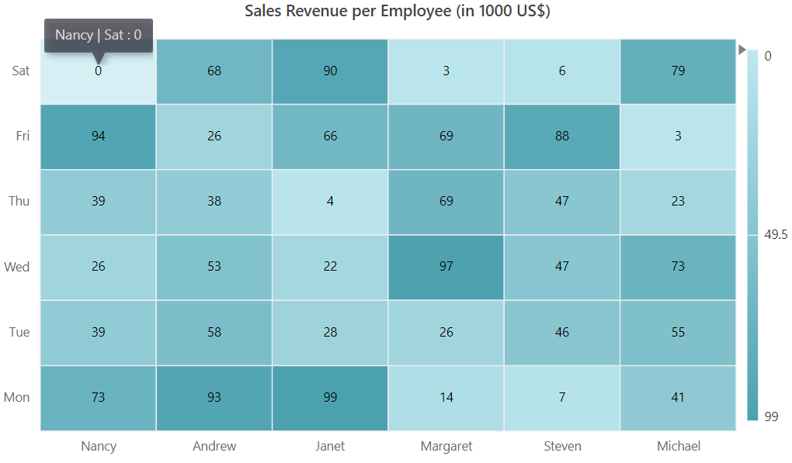
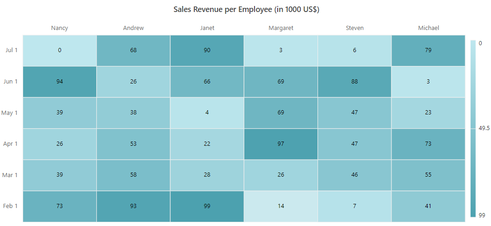
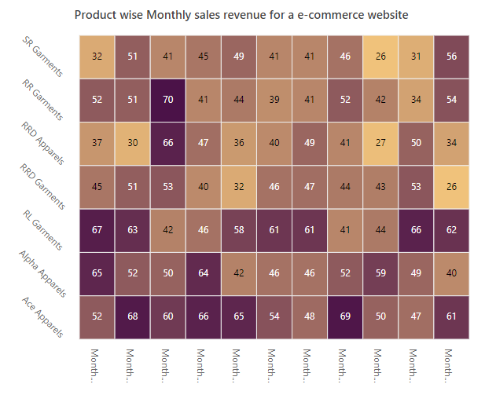
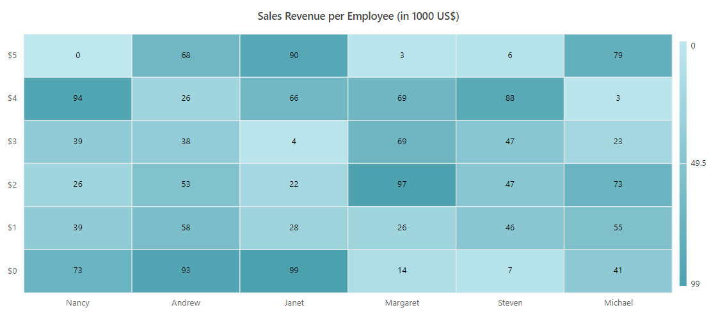
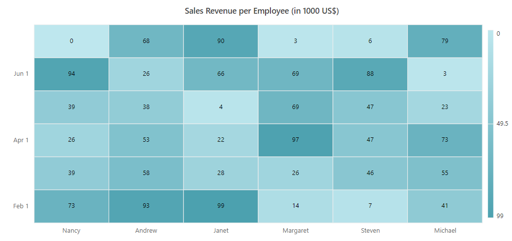
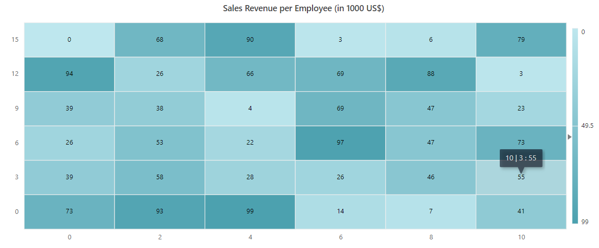

# Axis in Blazor HeatMap Chart Component

Heat map consists of two axes namely, `X-axis` and `Y-axis` that displays the row headers and column headers to plot the data points respectively. You can define the type, format, and other customizing options for both axes in the heat map.

## Types

There are three different axis types available in the heat map, which defines the data type of the axis labels. You can define the axis type by using the `ValueType` property in the heat map.

### Category axis

Category axis type is used to represent the string values in axis labels.

```cshtml

@using Syncfusion.Blazor.HeatMap

<SfHeatMap DataSource="@HeatMapData">
    <HeatMapTitleSettings Text="Sales Revenue per Employee (in 1000 US$)">
    </HeatMapTitleSettings>
    <HeatMapXAxis Labels="@XAxisLabels" ValueType="Syncfusion.Blazor.HeatMap.ValueType.Category"></HeatMapXAxis>
    <HeatMapYAxis Labels="@YAxisLabels" ValueType="Syncfusion.Blazor.HeatMap.ValueType.Category"></HeatMapYAxis>
</SfHeatMap>

@code{
    int[,] GetDefaultData()
    {
        int[,] dataSource = new int[,]
        {
            {73, 39, 26, 39, 94, 0},
            {93, 58, 53, 38, 26, 68},
            {99, 28, 22, 4, 66, 90},
            {14, 26, 97, 69, 69, 3},
            {7, 46, 47, 47, 88, 6},
            {41, 55, 73, 23, 3, 79}
        };
        return dataSource;
    }
    string[] XAxisLabels = new string[] {"Nancy", "Andrew", "Janet", "Margaret", "Steven", "Michael" };
    string[] YAxisLabels = new string[] { "Mon", "Tue", "Wed", "Thu", "Fri", "Sat" };
    public object HeatMapData { get; set; }
    protected override void OnInitialized()
    {
        HeatMapData = GetDefaultData();
    }
}


```



### Numeric axis

Numeric axis type is used to represent the numeric values in axis labels.

```cshtml

@using Syncfusion.Blazor.HeatMap

<SfHeatMap DataSource="@HeatMapData">
    <HeatMapTitleSettings Text="Sales Revenue per Employee (in 1000 US$)"></HeatMapTitleSettings>
    <HeatMapXAxis Labels="@XAxisLabels" ValueType="Syncfusion.Blazor.HeatMap.ValueType.Numeric"></HeatMapXAxis>
    <HeatMapYAxis Labels="@YAxisLabels" ValueType="Syncfusion.Blazor.HeatMap.ValueType.Numeric"></HeatMapYAxis>
</SfHeatMap>

@code{
    int[,] GetDefaultData()
    {
        int[,] dataSource = new int[,]
        {
            {73, 39, 26, 39, 94, 0},
            {93, 58, 53, 38, 26, 68},
            {99, 28, 22, 4, 66, 90},
            {14, 26, 97, 69, 69, 3},
            {7, 46, 47, 47, 88, 6},
            {41, 55, 73, 23, 3, 79}
        };
        return dataSource;
    }
    string[] XAxisLabels = new string[] {"Nancy", "Andrew", "Janet", "Margaret", "Steven", "Michael" };
    string[] YAxisLabels = new string[] { "Mon", "Tue", "Wed", "Thu", "Fri", "Sat" };
    public object HeatMapData { get; set; }
    protected override void OnInitialized()
    {
        HeatMapData = GetDefaultData();
    }
}

```


### Date-time axis

Date-time axis type is used to represent the date-time values in axis labels with a specific format. In date-time axis, you can define the start and end date/time using the `Minimum` and `Maximum` properties.

```cshtml

@using Syncfusion.Blazor.HeatMap

<SfHeatMap DataSource="@HeatMapData">
    <HeatMapTitleSettings Text="Sales Revenue per Employee (in 1000 US$)">
    </HeatMapTitleSettings>
    <HeatMapXAxis Labels="@XAxisLabels" ValueType="Syncfusion.Blazor.HeatMap.ValueType.Category"></HeatMapXAxis>
    <HeatMapYAxis Labels="@YAxisLabels" ValueType="Syncfusion.Blazor.HeatMap.ValueType.DateTime" Minimum="@Minimum" Maximum="@Maximum" IntervalType="IntervalType.Months"></HeatMapYAxis>
</SfHeatMap>

@code{
    int[,] GetDefaultData()
    {
        int[,] dataSource = new int[,]
        {
            {73, 39, 26, 39, 94, 0},
            {93, 58, 53, 38, 26, 68},
            {99, 28, 22, 4, 66, 90},
            {14, 26, 97, 69, 69, 3},
            {7, 46, 47, 47, 88, 6},
            {41, 55, 73, 23, 3, 79}
        };
        return dataSource;
    }
    public object Minimum = new DateTime(2007, 2, 1);
    public object Maximum = new DateTime(2007, 7, 1);
    string[] XAxisLabels = new string[] {"Nancy", "Andrew", "Janet", "Margaret", "Steven", "Michael" };
    string[] YAxisLabels = new string[] { "Mon", "Tue", "Wed", "Thu", "Fri", "Sat" };
    public object HeatMapData { get; set; }
    protected override void OnInitialized()
    {
        HeatMapData = GetDefaultData();
    }
}

```


## Inversed axis

Heat map supports inversing the axis origin for both axes, where the axis labels are placed in an inversed manner. You can enable axis inversing by enabling the `IsInversed` property.

```cshtml

@using Syncfusion.Blazor.HeatMap

<SfHeatMap DataSource="@HeatMapData">
    <HeatMapTitleSettings Text="Sales Revenue per Employee (in 1000 US$)">
    </HeatMapTitleSettings>
    <HeatMapXAxis Labels="@XAxisLabels" ValueType="Syncfusion.Blazor.HeatMap.ValueType.Category" IsInversed="true"></HeatMapXAxis>
    <HeatMapYAxis Labels="@YAxisLabels" ValueType="Syncfusion.Blazor.HeatMap.ValueType.DateTime" Minimum="@Minimum" Maximum="@Maximum" IntervalType="IntervalType.Months"></HeatMapYAxis>
</SfHeatMap>

@code{
    int[,] GetDefaultData()
    {
        int[,] dataSource = new int[,]
        {
            {73, 39, 26, 39, 94, 0},
            {93, 58, 53, 38, 26, 68},
            {99, 28, 22, 4, 66, 90},
            {14, 26, 97, 69, 69, 3},
            {7, 46, 47, 47, 88, 6},
            {41, 55, 73, 23, 3, 79}
        };
        return dataSource;
    }
    public object Minimum = new DateTime(2007, 2, 1);
    public object Maximum = new DateTime(2007, 7, 1);
    string[] XAxisLabels = new string[] {"Nancy", "Andrew", "Janet", "Margaret", "Steven", "Michael" };
    string[] YAxisLabels = new string[] { "Mon", "Tue", "Wed", "Thu", "Fri", "Sat" };
    public object HeatMapData { get; set; }
    protected override void OnInitialized()
    {
        HeatMapData = GetDefaultData();
    }
}

```


## Opposed axis

In heat map, you can place the axis label in an opposite position of its default axis label position by using the `OpposedPosition` property.

```cshtml

@using Syncfusion.Blazor.HeatMap

<SfHeatMap DataSource="@HeatMapData">
    <HeatMapTitleSettings Text="Sales Revenue per Employee (in 1000 US$)">
    </HeatMapTitleSettings>
    <HeatMapXAxis Labels="@XAxisLabels" ValueType="Syncfusion.Blazor.HeatMap.ValueType.Category" OpposedPosition="true"></HeatMapXAxis>
    <HeatMapYAxis Labels="@YAxisLabels" ValueType="Syncfusion.Blazor.HeatMap.ValueType.DateTime" Minimum="@Minimum" Maximum="@Maximum" IntervalType="IntervalType.Months"></HeatMapYAxis>
</SfHeatMap>

@code{
    int[,] GetDefaultData()
    {
        int[,] dataSource = new int[,]
        {
            {73, 39, 26, 39, 94, 0},
            {93, 58, 53, 38, 26, 68},
            {99, 28, 22, 4, 66, 90},
            {14, 26, 97, 69, 69, 3},
            {7, 46, 47, 47, 88, 6},
            {41, 55, 73, 23, 3, 79}
        };
        return dataSource;
    }
    public object Minimum = new DateTime(2007, 2, 1);
    public object Maximum = new DateTime(2007, 7, 1);
    string[] XAxisLabels = new string[] {"Nancy", "Andrew", "Janet", "Margaret", "Steven", "Michael" };
    string[] YAxisLabels = new string[] { "Mon", "Tue", "Wed", "Thu", "Fri", "Sat" };
    public object HeatMapData { get; set; }
    protected override void OnInitialized()
    {
        HeatMapData = GetDefaultData();
    }
}

```



## Axis labels customization

### Customizing the text style

The text style of the axis labels can be customized using the following options available in the [HeatMapXAxisTextStyle](https://help.syncfusion.com/cr/blazor/Syncfusion.Blazor.HeatMap.HeatMapXAxisTextStyle.html) for x-axis and [HeatMapYAxisTextStyle](https://help.syncfusion.com/cr/blazor/Syncfusion.Blazor.HeatMap.HeatMapYAxisTextStyle.html) for y-axis.

* `Color` - It is used to change the text color of the axis labels.
* `FontFamily` - It is used to change the font family of the axis labels.
* `FontStyle` - It is used to change the font style of the axis labels.
* `FontWeight` - It is used to change the font weight of the axis labels.
* `Size` - It is used to change the font size of the axis labels.
* `TextAlignment` - It is used to position and align the axis labels. This property takes values such as **Near**, **Center**, and **Far**.
* `TextOverflow` - When the axis label exceeds the intended space, this property is used to trim or wrap it. This property takes values such as **None**, **Trim**, and **Wrap**.

```cshtml

@using Syncfusion.Blazor.HeatMap

<SfHeatMap DataSource="@HeatMapData">
    <HeatMapTitleSettings Text="Product wise Monthly sales revenue for a e-commerce website">
        <HeatMapTitleTextStyle Size="15px" FontWeight="500" FontStyle="Normal" FontFamily="Segoe UI"></HeatMapTitleTextStyle>
    </HeatMapTitleSettings>
    <HeatMapXAxis Labels="@XAxisLabels" OpposedPosition="true">
        <HeatMapXAxisTextStyle Color="Red" Size="15px" FontWeight="650" FontStyle="Normal" FontFamily="Segoe UI" TextAlignment="Alignment.Center" TextOverflow="TextOverflow.Wrap"></HeatMapXAxisTextStyle>
    </HeatMapXAxis>
    <HeatMapYAxis Labels="@YAxisLabels" MaxLabelLength="70">
        <HeatMapYAxisTextStyle Color="Red" Size="15px" FontWeight="650" FontStyle="Normal" FontFamily="Segoe UI" TextAlignment="Alignment.Center" TextOverflow="TextOverflow.Wrap"></HeatMapYAxisTextStyle>
    </HeatMapYAxis>
    <HeatMapPaletteSettings>
        <HeatMapPalettes>
            <HeatMapPalette Color="#F0C27B"></HeatMapPalette>
            <HeatMapPalette Color="#4B1248"></HeatMapPalette>
        </HeatMapPalettes>
    </HeatMapPaletteSettings>
    <HeatMapLegendSettings Visible="false">
    </HeatMapLegendSettings>
</SfHeatMap>

@code {
    int[,] GetDefaultData()
    {
        int[,] dataSource = new int[,]
        {
            {52, 65, 67, 45, 37, 52, 32},
            {68, 52, 63, 51, 30, 51, 51},
            {60, 50, 42, 53, 66, 70, 41},
            {66, 64, 46, 40, 47, 41, 45},
            {65, 42, 58, 32, 36, 44, 49},
            {54, 46, 61, 46, 40, 39, 41},
            {48, 46, 61, 47, 49, 41, 41},
            {69, 52, 41, 44, 41, 52, 46},
            {50, 59, 44, 43, 27, 42, 26},
            {47, 49, 66, 53, 50, 34, 31},
            {61, 40, 62, 26, 34, 54, 56}
        };
        return dataSource;
    }
    string[] XAxisLabels = new string[] { "Month of Feburary 2023", "Month of March 2023", "Month of April 2023", "Month of May 2023", "Month of June 2023", "Month of July 2023", "Month of August 2023", "Month of September 2023", "Month of October 2023", "Month of November 2023", "Month of December 2023" };
    string[] YAxisLabels = new string[] { "Ace Apparels", "Alpha Apparels", "RL Garments", "RRD Garments", "RRD Apparels", "RR Garments", "SR Garments" };
    public object HeatMapData { get; set; }
    protected override void OnInitialized()
    {
        HeatMapData = GetDefaultData();
    }
}

```


### Providing line breaks

Axis labels with line breaks improve the readability of the HeatMap by splitting the text on an axis into multiple lines. The **"\<br>"** character is used to add line breaks to the axis labels.

```cshtml

@using Syncfusion.Blazor.HeatMap

<SfHeatMap DataSource="@HeatMapData">
    <HeatMapXAxis Labels="@XAxisLabels"></HeatMapXAxis>
    <HeatMapYAxis Labels="@YAxisLabels" MaxLabelLength="60"></HeatMapYAxis>
</SfHeatMap>

@code {
    int[,] GetDefaultData()
    {
        int[,] dataSource = new int[,]
        {
            {1, 76},
            {19, 3}
        };
        return dataSource;
    }
    string[] XAxisLabels = new string[] { "Actual<br>Accept", "Actual<br>Reject" };
    string[] YAxisLabels = new string[] { "Actual<br>Accept", "Actual<br>Reject" };
    public object HeatMapData { get; set; }
    protected override void OnInitialized()
    {
        HeatMapData = GetDefaultData();
    }
}

```


### Customizing axis labels when intersecting

When the axis labels intersect, [LabelIntersectAction](https://help.syncfusion.com/cr/blazor/Syncfusion.Blazor.HeatMap.HeatMapCommonAxis.html#Syncfusion_Blazor_HeatMap_HeatMapCommonAxis_LabelIntersectAction) property is used to handle the intersection. The `LabelIntersectAction` property can take the following values.

* **None** - It specifies that no action is taken when the axis labels intersect.
* **Trim** - It specifies to trim the axis labels when they intersect.
* **Rotate45** - When the axis labels intersect, they are rotated to 45 degrees.
* **MultipleRows** - It specifies to show all the axis labels as multiple rows when they intersect.

The below example demonstrates to trim the axis labels by using the `LabelIntersectAction` property.

```cshtml

@using Syncfusion.Blazor.HeatMap

<SfHeatMap DataSource="@HeatMapData">
    <HeatMapTitleSettings Text="Product wise Monthly sales revenue for a e-commerce website">
        <HeatMapTitleTextStyle Size="15px" FontWeight="500" FontStyle="Normal" FontFamily="Segoe UI"></HeatMapTitleTextStyle>
    </HeatMapTitleSettings>
    <HeatMapXAxis Labels="@XAxisLabels" OpposedPosition="true" EnableTrim="true" LabelIntersectAction="LabelIntersectAction.Trim">
        <HeatMapXAxisTextStyle Color="Red" Size="15px" FontWeight="650" FontStyle="Normal" FontFamily="Segoe UI" TextAlignment="Alignment.Center" TextOverflow="TextOverflow.Wrap"></HeatMapXAxisTextStyle>
    </HeatMapXAxis>
    <HeatMapYAxis Labels="@YAxisLabels" EnableTrim="true" LabelIntersectAction="LabelIntersectAction.Trim">
        <HeatMapYAxisTextStyle Color="Red" Size="15px" FontWeight="650" FontStyle="Normal" FontFamily="Segoe UI" TextAlignment="Alignment.Center" TextOverflow="TextOverflow.Wrap"></HeatMapYAxisTextStyle>
    </HeatMapYAxis>
    <HeatMapPaletteSettings>
        <HeatMapPalettes>
            <HeatMapPalette Color="#F0C27B"></HeatMapPalette>
            <HeatMapPalette Color="#4B1248"></HeatMapPalette>
        </HeatMapPalettes>
    </HeatMapPaletteSettings>
    <HeatMapLegendSettings Visible="false">
    </HeatMapLegendSettings>
</SfHeatMap>

@code {
    int[,] GetDefaultData()
    {
        int[,] dataSource = new int[,]
        {
            {52, 65, 67, 45, 37, 52, 32},
            {68, 52, 63, 51, 30, 51, 51},
            {60, 50, 42, 53, 66, 70, 41},
            {66, 64, 46, 40, 47, 41, 45},
            {65, 42, 58, 32, 36, 44, 49},
            {54, 46, 61, 46, 40, 39, 41},
            {48, 46, 61, 47, 49, 41, 41},
            {69, 52, 41, 44, 41, 52, 46},
            {50, 59, 44, 43, 27, 42, 26},
            {47, 49, 66, 53, 50, 34, 31},
            {61, 40, 62, 26, 34, 54, 56}
        };
        return dataSource;
    }
    string[] XAxisLabels = new string[] { "Month of Feburary 2023", "Month of March 2023", "Month of April 2023", "Month of May 2023", "Month of June 2023", "Month of July 2023", "Month of August 2023", "Month of September 2023", "Month of October 2023", "Month of November 2023", "Month of December 2023" };
    string[] YAxisLabels = new string[] { "Ace Apparels", "Alpha Apparels", "RL Garments", "RRD Garments", "RRD Apparels", "RR Garments", "SR Garments" };
    public object HeatMapData { get; set; }
    protected override void OnInitialized()
    {
        HeatMapData = GetDefaultData();
    }
}

```


### Rotating axis labels

The axis labels can be rotated to a desired angle by using the [LabelRotation](https://help.syncfusion.com/cr/blazor/Syncfusion.Blazor.HeatMap.HeatMapCommonAxis.html#Syncfusion_Blazor_HeatMap_HeatMapCommonAxis_LabelRotation) property.

```cshtml

@using Syncfusion.Blazor.HeatMap

<SfHeatMap DataSource="@HeatMapData">
    <HeatMapTitleSettings Text="Product wise Monthly sales revenue for a e-commerce website">
        <HeatMapTitleTextStyle Size="15px" FontWeight="500" FontStyle="Normal" FontFamily="Segoe UI"></HeatMapTitleTextStyle>
    </HeatMapTitleSettings>
    <HeatMapXAxis Labels="@XAxisLabels" LabelRotation="90" OpposedPosition="true">
    </HeatMapXAxis>
    <HeatMapYAxis Labels="@YAxisLabels" LabelRotation="45">
    </HeatMapYAxis>
    <HeatMapPaletteSettings>
        <HeatMapPalettes>
            <HeatMapPalette Color="#F0C27B"></HeatMapPalette>
            <HeatMapPalette Color="#4B1248"></HeatMapPalette>
        </HeatMapPalettes>
    </HeatMapPaletteSettings>
    <HeatMapLegendSettings Visible="false">
    </HeatMapLegendSettings>
</SfHeatMap>

@code {
    int[,] GetDefaultData()
    {
        int[,] dataSource = new int[,]
        {
            {52, 65, 67, 45, 37, 52, 32},
            {68, 52, 63, 51, 30, 51, 51},
            {60, 50, 42, 53, 66, 70, 41},
            {66, 64, 46, 40, 47, 41, 45},
            {65, 42, 58, 32, 36, 44, 49},
            {54, 46, 61, 46, 40, 39, 41},
            {48, 46, 61, 47, 49, 41, 41},
            {69, 52, 41, 44, 41, 52, 46},
            {50, 59, 44, 43, 27, 42, 26},
            {47, 49, 66, 53, 50, 34, 31},
            {61, 40, 62, 26, 34, 54, 56}
        };
        return dataSource;
    }
    string[] XAxisLabels = new string[] { "Month of Feburary 2023", "Month of March 2023", "Month of April 2023", "Month of May 2023", "Month of June 2023", "Month of July 2023", "Month of August 2023", "Month of September 2023", "Month of October 2023", "Month of November 2023", "Month of December 2023" };
    string[] YAxisLabels = new string[] { "Ace Apparels", "Alpha Apparels", "RL Garments", "RRD Garments", "RRD Apparels", "RR Garments", "SR Garments" };
    public object HeatMapData { get; set; }
    protected override void OnInitialized()
    {
        HeatMapData = GetDefaultData();
    }
}

```



### Label formatting

HeatMap supports formatting the axis labels by using the [LabelFormat](https://help.syncfusion.com/cr/blazor/Syncfusion.Blazor.HeatMap.HeatMapCommonAxis.html#Syncfusion_Blazor_HeatMap_HeatMapCommonAxis_LabelFormat) property. Using this property, you can customize the axis label by global string format (‘P’, ‘C’, etc) or customized format like ‘{value}°C’.

```cshtml

@using Syncfusion.Blazor.HeatMap

<SfHeatMap DataSource="@HeatMapData">
    <HeatMapTitleSettings Text="Sales Revenue per Employee (in 1000 US$)">
    </HeatMapTitleSettings>
    <HeatMapXAxis Labels="@XAxisLabels" ValueType="Syncfusion.Blazor.HeatMap.ValueType.Category"></HeatMapXAxis>
    <HeatMapYAxis Labels="@YAxisLabels" ValueType="Syncfusion.Blazor.HeatMap.ValueType.Numeric"  LabelFormat="${value}"></HeatMapYAxis>
</SfHeatMap>

@code{
    int[,] GetDefaultData()
    {
        int[,] dataSource = new int[,]
        {
            {73, 39, 26, 39, 94, 0},
            {93, 58, 53, 38, 26, 68},
            {99, 28, 22, 4, 66, 90},
            {14, 26, 97, 69, 69, 3},
            {7, 46, 47, 47, 88, 6},
            {41, 55, 73, 23, 3, 79}
        };
        return dataSource;
    }
    public object Minimum = new DateTime(2007, 2, 1);
    public object Maximum = new DateTime(2007, 7, 1);
    string[] XAxisLabels = new string[] {"Nancy", "Andrew", "Janet", "Margaret", "Steven", "Michael" };
    string[] YAxisLabels = new string[] { "Mon", "Tue", "Wed", "Thu", "Fri", "Sat" };
    public object HeatMapData { get; set; }
    protected override void OnInitialized()
    {
        HeatMapData = GetDefaultData();
    }
}

```



## Axis intervals

In heat map, you can define an interval between the axis labels using the `Interval` property. In date-time axis, you can change the interval mode by using the `IntervalType` property. The date-time axis supports the following interval types.

```cshtml

@using Syncfusion.Blazor.HeatMap

<SfHeatMap DataSource="@HeatMapData">
    <HeatMapTitleSettings Text="Sales Revenue per Employee (in 1000 US$)">
    </HeatMapTitleSettings>
    <HeatMapXAxis Labels="@XAxisLabels" ValueType="Syncfusion.Blazor.HeatMap.ValueType.Category"></HeatMapXAxis>
    <HeatMapYAxis Labels="@YAxisLabels" ValueType="Syncfusion.Blazor.HeatMap.ValueType.DateTime" Minimum="@Minimum" Interval=2 Maximum="@Maximum" IntervalType="IntervalType.Months"></HeatMapYAxis>
</SfHeatMap>

@code{
    int[,] GetDefaultData()
    {
        int[,] dataSource = new int[,]
        {
        {73, 39, 26, 39, 94, 0},
        {93, 58, 53, 38, 26, 68},
        {99, 28, 22, 4, 66, 90},
        {14, 26, 97, 69, 69, 3},
        {7, 46, 47, 47, 88, 6},
        {41, 55, 73, 23, 3, 79}
            };
        return dataSource;
    }
    public object Minimum = new DateTime(2007, 2, 1);
    public object Maximum = new DateTime(2007, 7, 1);
    string[] XAxisLabels = new string[] { "Nancy", "Andrew", "Janet", "Margaret", "Steven", "Michael" };
    string[] YAxisLabels = new string[] { "Mon", "Tue", "Wed", "Thu", "Fri", "Sat" };
    public object HeatMapData { get; set; }
    protected override void OnInitialized()
    {
        HeatMapData = GetDefaultData();
    }
}

```



## Axis label increment

Axis label increment in the heat map is used to display the axis labels with regular interval values in numeric and date-time axes. The labels will be displayed with tick gaps when you set the label interval. But, to achieve the same behavior without tick gaps, use the label increment. You can set the axis label increment using the `Increment` property and the default value of this property is 1.

```cshtml

@using Syncfusion.Blazor.HeatMap

<SfHeatMap DataSource="@HeatMapData">
    <HeatMapTitleSettings Text="Sales Revenue per Employee (in 1000 US$)">
    </HeatMapTitleSettings>
    <HeatMapXAxis Labels="@XAxisLabels" ValueType="Syncfusion.Blazor.HeatMap.ValueType.Numeric" Increment=2></HeatMapXAxis>
    <HeatMapYAxis Labels="@YAxisLabels" ValueType="Syncfusion.Blazor.HeatMap.ValueType.Numeric" Increment=3></HeatMapYAxis>
</SfHeatMap>

@code{
    int[,] GetDefaultData()
    {
        int[,] dataSource = new int[,]
        {
        {73, 39, 26, 39, 94, 0},
        {93, 58, 53, 38, 26, 68},
        {99, 28, 22, 4, 66, 90},
        {14, 26, 97, 69, 69, 3},
        {7, 46, 47, 47, 88, 6},
        {41, 55, 73, 23, 3, 79}
        };
        return dataSource;
    }
    string[] XAxisLabels = new string[] { "Nancy", "Andrew", "Janet", "Margaret", "Steven", "Michael" };
    string[] YAxisLabels = new string[] { "Mon", "Tue", "Wed", "Thu", "Fri", "Sat" };
    public object HeatMapData { get; set; }
    protected override void OnInitialized()
    {
        HeatMapData = GetDefaultData();
    }
}

```



## Multilevel labels

Multilevel labels are used to classify a group of axis labels as a single category, which is then displayed with a label. By using multiple [HeatMapMultiLevelLabel](https://help.syncfusion.com/cr/blazor/Syncfusion.Blazor.HeatMap.HeatMapMultiLevelLabels.html) tag, you can add multiple levels on top of the axis labels.

To divide and group the axis labels, you can use multiple [HeatMapAxisMultiLevelCategories](https://help.syncfusion.com/cr/blazor/Syncfusion.Blazor.HeatMap.HeatMapAxisMultiLevelCategories.html) tags. The starting and ending indexes of the axis labels can be set using the [Start](https://help.syncfusion.com/cr/blazor/Syncfusion.Blazor.HeatMap.HeatMapAxisMultiLevelCategories.html#Syncfusion_Blazor_HeatMap_HeatMapAxisMultiLevelCategories_Start) and [End](https://help.syncfusion.com/cr/blazor/Syncfusion.Blazor.HeatMap.HeatMapAxisMultiLevelCategories.html#Syncfusion_Blazor_HeatMap_HeatMapAxisMultiLevelCategories_End) properties in the [HeatMapAxisMultiLevelCategories](https://help.syncfusion.com/cr/blazor/Syncfusion.Blazor.HeatMap.HeatMapAxisMultiLevelCategories.html) tag. The [Text](https://help.syncfusion.com/cr/blazor/Syncfusion.Blazor.HeatMap.HeatMapAxisMultiLevelCategories.html#Syncfusion_Blazor_HeatMap_HeatMapAxisMultiLevelCategories_Text) property can be used to specify a name for the grouped axis labels.

The multilevel labels can be customized by using the following properties and tags.
* [Overflow](https://help.syncfusion.com/cr/blazor/Syncfusion.Blazor.HeatMap.HeatMapMultiLevelLabel.html#Syncfusion_Blazor_HeatMap_HeatMapMultiLevelLabel_Overflow) - It is used to trim or wrap the multilevel labels when the label overflows the intended space. NOTE: This property is only for x-axis.
* [Alignment](https://help.syncfusion.com/cr/blazor/Syncfusion.Blazor.HeatMap.HeatMapMultiLevelLabel.html#Syncfusion_Blazor_HeatMap_HeatMapMultiLevelLabel_Alignment) - It is used to place and align the multilevel labels.
* [MaximumTextWidth](https://help.syncfusion.com/cr/blazor/Syncfusion.Blazor.HeatMap.HeatMapAxisMultiLevelCategories.html#Syncfusion_Blazor_HeatMap_HeatMapAxisMultiLevelCategories_MaximumTextWidth) - It is used to set the maximum width of the text. When the text length exceeds the maximum text width, the overflow action will be performed.
* [HeatMapAxisMultiLevelLabelsTextStyle](https://help.syncfusion.com/cr/blazor/Syncfusion.Blazor.HeatMap.HeatMapAxisMultiLevelLabelsTextStyle.html) - It is used to customize the font style of the multilevel labels.
* [HeatMapXAxisMultiLevelLabelBorder](https://help.syncfusion.com/cr/blazor/Syncfusion.Blazor.HeatMap.HeatMapXAxisMultiLevelLabelBorder.html) - It is used to customize the border of the multilevel labels displayed in the x-axis.
* [HeatMapYAxisMultiLevelLabelBorder](https://help.syncfusion.com/cr/blazor/Syncfusion.Blazor.HeatMap.HeatMapYAxisMultiLevelLabelBorder.html) - It is used to customize the border of the multilevel labels displayed in the y-axis.

```cshtml

@using Syncfusion.Blazor.HeatMap

<SfHeatMap DataSource="@DataSource">
    <HeatMapEvents TooltipRendering="@TooltipRendering" CellRendering="@CellRender"></HeatMapEvents>
    <HeatMapXAxis Labels="@XLabels">
        <HeatMapXAxisTextStyle Color="Black"></HeatMapXAxisTextStyle>
        <HeatMapAxisLabelBorder Width="1" Type="BorderType.Rectangle" Color="#a19d9d"></HeatMapAxisLabelBorder>
        <HeatMapMultiLevelLabels>
            <HeatMapMultiLevelLabel>
                <HeatMapXAxisMultiLevelLabelBorder Width="1" Type="BorderType.Rectangle" Color="#a19d9d"></HeatMapXAxisMultiLevelLabelBorder>
                <HeatMapAxisMultiLevelLabelsTextStyle Color="Black" FontWeight="Bold"></HeatMapAxisMultiLevelLabelsTextStyle>
                <HeatMapAxisMultiLevelCategories Start="0" End="2" Text="Electronics">
                </HeatMapAxisMultiLevelCategories>
                <HeatMapAxisMultiLevelCategories Start="3" End="4" Text="Beauty and personal care">
                </HeatMapAxisMultiLevelCategories>
                <HeatMapAxisMultiLevelCategories Start="5" End="7" Text="Fashion">
                </HeatMapAxisMultiLevelCategories>
                <HeatMapAxisMultiLevelCategories Start="8" End="10" Text="Household">
                </HeatMapAxisMultiLevelCategories>
            </HeatMapMultiLevelLabel>
        </HeatMapMultiLevelLabels>
    </HeatMapXAxis>
    <HeatMapYAxis Labels="@YLabels" IsInversed=true>
        <HeatMapAxisLabelBorder Width="0"></HeatMapAxisLabelBorder>
        <HeatMapYAxisTextStyle Color="Black"></HeatMapYAxisTextStyle>
        <HeatMapMultiLevelLabels>
            <HeatMapMultiLevelLabel>
                <HeatMapYAxisMultiLevelLabelBorder Width="1" Type="BorderType.Brace" Color="#a19d9d"></HeatMapYAxisMultiLevelLabelBorder>
                <HeatMapAxisMultiLevelLabelsTextStyle Color="Black" FontWeight="Bold"></HeatMapAxisMultiLevelLabelsTextStyle>
                <HeatMapAxisMultiLevelCategories Start="0" End="2" Text="Q1">
                </HeatMapAxisMultiLevelCategories>
                <HeatMapAxisMultiLevelCategories Start="3" End="5" Text="Q2">
                </HeatMapAxisMultiLevelCategories>
                <HeatMapAxisMultiLevelCategories Start="6" End="8" Text="Q3">
                </HeatMapAxisMultiLevelCategories>
                <HeatMapAxisMultiLevelCategories Start="9" End="11" Text="Q4">
                </HeatMapAxisMultiLevelCategories>
            </HeatMapMultiLevelLabel>
            <HeatMapMultiLevelLabel>
                <HeatMapYAxisMultiLevelLabelBorder Width="1" Type="BorderType.Brace" Color="#a19d9d"></HeatMapYAxisMultiLevelLabelBorder>
                <HeatMapAxisMultiLevelLabelsTextStyle Color="Black" FontWeight="Bold"></HeatMapAxisMultiLevelLabelsTextStyle>
                <HeatMapAxisMultiLevelCategories Start="0" End="5" Text="First Half Yearly">
                </HeatMapAxisMultiLevelCategories>
                <HeatMapAxisMultiLevelCategories Start="6" End="11" Text="Second Half Yearly">
                </HeatMapAxisMultiLevelCategories>
            </HeatMapMultiLevelLabel>
            <HeatMapMultiLevelLabel>
                <HeatMapYAxisMultiLevelLabelBorder Width="1" Type="BorderType.Brace" Color="#a19d9d"></HeatMapYAxisMultiLevelLabelBorder>
                <HeatMapAxisMultiLevelLabelsTextStyle Color="Black" FontWeight="Bold"></HeatMapAxisMultiLevelLabelsTextStyle>
                <HeatMapAxisMultiLevelCategories Start="0" End="11" Text="Yearly">
                </HeatMapAxisMultiLevelCategories>
            </HeatMapMultiLevelLabel>
        </HeatMapMultiLevelLabels>
    </HeatMapYAxis>
    <HeatMapCellSettings ShowLabel="true" Format="$ {value}K">
        <HeatMapCellBorder Width="0"></HeatMapCellBorder>
    </HeatMapCellSettings>
    <HeatMapPaletteSettings>
        <HeatMapPalettes>
            <HeatMapPalette Color="#F0ADCE"></HeatMapPalette>
            <HeatMapPalette Color="#19307B"></HeatMapPalette>
        </HeatMapPalettes>
    </HeatMapPaletteSettings>
    <HeatMapLegendSettings Visible="false">
    </HeatMapLegendSettings>
    <HeatMapTooltipSettings Enable="true">
        <HeatMapFont Size="12px" FontWeight="500"></HeatMapFont>
    </HeatMapTooltipSettings>
</SfHeatMap>

@code{
    public string[] XLabels = new string[] { "Laptop", "Mobile", "Gaming", "Cosmetics", "Fragrance", "Watches", "Handbags", "Apparel", "Kitchenware", "Furniture", "Home Decor" };
    public string[] YLabels = new string[] { "Jan", "Feb", "Mar", "Apr", "May", "Jun", "Jul", "Aug", "Sep", "Oct", "Nov", "Dec" };
    int[,] DataSource;
    public void TooltipRendering(TooltipEventArgs args)
    {
        args.Content = new string[] { args.XLabel + " | " + args.YLabel + " : $ " + args.Value + "K" };
    }
    public void CellRender(HeatMapCellRenderEventArgs args)
    {
        string CellValue = (double.Parse(args.CellValue) / 10).ToString();
        args.CellValue = CellValue;
    }
    public static int[,] GetMultiLevelData()
    {
        int[,] dataSource = new int[,]
        {
                {52, 65, 67, 45, 37, 52, 32, 76, 60, 64, 82, 91},
                {68, 52, 63, 51, 30, 51, 51, 81, 70, 60, 88, 80},
                {60, 50, 42, 53, 66, 70, 41, 69, 76, 74, 86, 97},
                {66, 64, 46, 40, 47, 41, 45, 76, 83, 69, 92, 84},
                {65, 42, 58, 32, 36, 44, 49, 79, 83, 69, 83, 93},
                {54, 46, 61, 46, 40, 39, 41, 69, 61, 84, 84, 87},
                {48, 46, 61, 47, 49, 41, 41, 67, 78, 83, 98, 87},
                {69, 52, 41, 44, 41, 52, 46, 71, 63, 84, 83, 91},
                {50, 59, 44, 43, 27, 42, 26, 64, 76, 65, 81, 86},
                {47, 49, 66, 53, 50, 34, 31, 79, 78, 79, 89, 95},
                {61, 40, 62, 26, 34, 54, 56, 74, 83, 78, 95, 98}

        };
        return dataSource;
    }

    protected override void OnInitialized()
    {
        DataSource = GetMultiLevelData();
    }
}

```

