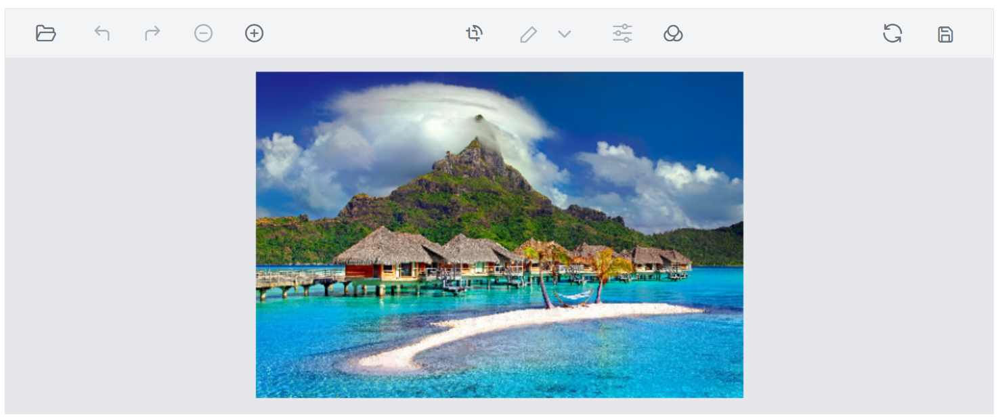
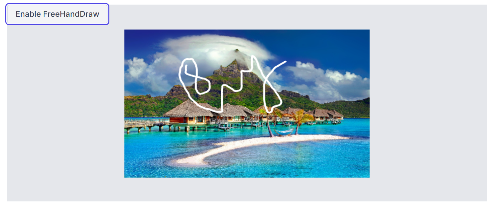
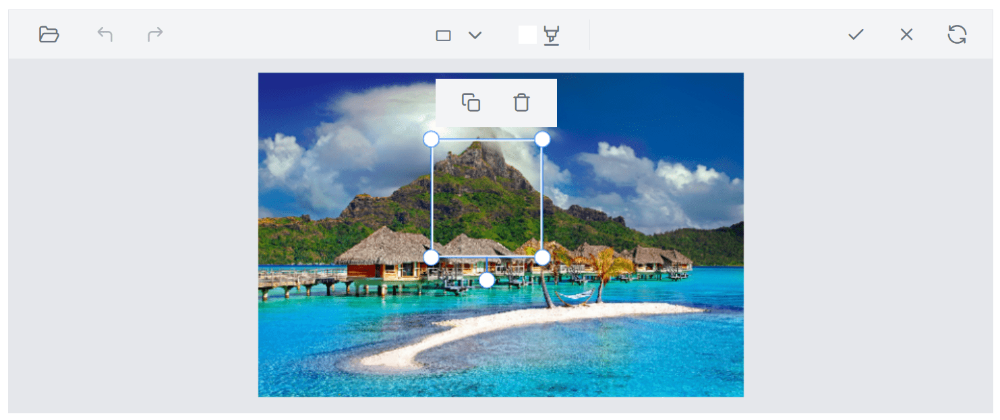

# Toolbar in the Blazor Image Editor Component

The toolbars in the Blazor Image Editor are a key component for interacting with and editing images. They provide a range of tools and options that can be customized to suit the needs and preferences. Add or remove items from the toolbar to create a personalized set of tools, or they can even create their own custom toolbar from scratch. This flexibility and customization allow them to create a unique image editing experience that is tailored to their specific needs and workflow. 

In the Image Editor, the toolbar property provides the ability to customize the toolbar by adding or removing items, as well as defining a completely custom toolbar. This feature is valuable for creating a personalized image editing experience that aligns with specific requirements and workflows. 

## Built-in Toolbar Items

Specifies the toolbar items to perform UI interactions. Refer to the built-in toolbar items for the default value.

* Crop
* Annotation
* Zoom
* Finetune
* Filter
* Confirm
* Reset
* Save

## Add a Custom Toolbar items

The [`Toolbar`](https://help.syncfusion.com/cr/blazor/Syncfusion.Blazor.ImageEditor.SfImageEditor.html#Syncfusion_Blazor_ImageEditor_SfImageEditor_Toolbar) property in the Image Editor allows to add or remove toolbar items to include only the tools they frequently use, streamlining the editing process and reducing clutter. 

Here is an example of adding custom toolbar items to rotate and flip transformation using [`Toolbar`](https://help.syncfusion.com/cr/blazor/Syncfusion.Blazor.ImageEditor.SfImageEditor.html#Syncfusion_Blazor_ImageEditor_SfImageEditor_Toolbar) property. 

```cshtml
@using Syncfusion.Blazor.ImageEditor

<SfImageEditor @ref="ImageEditor" Toolbar="customToolbarItem" Height="400">
    <ImageEditorEvents Created="OpenAsync" ToolbarItemClicked="ToolbarItemClicked"></ImageEditorEvents>
</SfImageEditor>

@code {
    SfImageEditor ImageEditor;
    private List<ImageEditorToolbarItemModel> customToolbarItem = new List<ImageEditorToolbarItemModel>()
    {
        new ImageEditorToolbarItemModel { Name = "Zoom" },
        new ImageEditorToolbarItemModel { Name = "Annotation" },
        new ImageEditorToolbarItemModel { Name = "Confirm" },
        new ImageEditorToolbarItemModel { Text = "Rotate", TooltipText = "Rotate", Align = ItemAlign.Center }
    };

    private async void OpenAsync()
    {
        await ImageEditor.OpenAsync("nature.png");
    }

    private async void ToolbarItemClicked(Syncfusion.Blazor.Navigations.ClickEventArgs args)
    {
        if (args.Item.Text == "Rotate")
        {
            await ImageEditor.RotateAsync(90);
        }
    }
}
```


## Show or Hide a toolbar 

The [`Toolbar`](https://help.syncfusion.com/cr/blazor/Syncfusion.Blazor.ImageEditor.SfImageEditor.html#Syncfusion_Blazor_ImageEditor_SfImageEditor_Toolbar) property controls the visibility of the toolbar in the Image Editor. When the toolbar property is set to an empty list, the toolbar is hidden. Conversely, if the toolbar property contains a list of items, the toolbar is shown, displaying the specified items. This feature provides flexibility for users to personalize their image editing experience. 

Here is an example of hiding the toolbar of the image editor using [`Toolbar`](https://help.syncfusion.com/cr/blazor/Syncfusion.Blazor.ImageEditor.SfImageEditor.html#Syncfusion_Blazor_ImageEditor_SfImageEditor_Toolbar) property.

```cshtml
@using Syncfusion.Blazor.ImageEditor

<SfImageEditor @ref="ImageEditor" Toolbar="customToolbarItem" Height="400">
    <ImageEditorEvents Created="OpenAsync"></ImageEditorEvents>
</SfImageEditor>

@code {
    SfImageEditor ImageEditor;
    private List<ImageEditorToolbarItemModel> customToolbarItem = new List<ImageEditorToolbarItemModel>(){ };

    private async void OpenAsync()
    {
        await ImageEditor.OpenAsync("nature.png");
    }
}
```


## Show or Hide a toolbar item

The [`Toolbar`](https://help.syncfusion.com/cr/blazor/Syncfusion.Blazor.ImageEditor.SfImageEditor.html#Syncfusion_Blazor_ImageEditor_SfImageEditor_Toolbar) property is utilized to control the visibility of toolbar items in the Image Editor. By default, the toolbar property includes the default toolbar items. So, if you wish to hide the default toolbar items then you need to explicitly define the required items using [`Toolbar`](https://help.syncfusion.com/cr/blazor/Syncfusion.Blazor.ImageEditor.SfImageEditor.html#Syncfusion_Blazor_ImageEditor_SfImageEditor_Toolbar) property. This allows you to customize the toolbar by displaying only the specific items you require, tailoring the editing experience to your preferences. 

Here is an example of hiding the cropping and selection toolbar items using [`Toolbar`](https://help.syncfusion.com/cr/blazor/Syncfusion.Blazor.ImageEditor.SfImageEditor.html#Syncfusion_Blazor_ImageEditor_SfImageEditor_Toolbar) property.

```cshtml
@using Syncfusion.Blazor.ImageEditor

<SfImageEditor @ref="ImageEditor" Toolbar="customToolbarItem" Height="400">
    <ImageEditorEvents Created="OpenAsync"></ImageEditorEvents>
</SfImageEditor>

@code {
    SfImageEditor ImageEditor;
    private List<ImageEditorToolbarItemModel> customToolbarItem = new List<ImageEditorToolbarItemModel>()
    {
        new ImageEditorToolbarItemModel { Name = "Zoom" },
        new ImageEditorToolbarItemModel { Name = "Annotation" },
        new ImageEditorToolbarItemModel { Name = "Finetune" },
        new ImageEditorToolbarItemModel { Name = "Filter" },
        new ImageEditorToolbarItemModel { Name = "Confirm" },
        new ImageEditorToolbarItemModel { Name = "Reset" },
        new ImageEditorToolbarItemModel { Name = "Save" }
    };

    private async void OpenAsync()
    {
        await ImageEditor.OpenAsync("nature.png");
    }
}
```


## Enable or disable a toolbar item

The [`Toolbar`](https://help.syncfusion.com/cr/blazor/Syncfusion.Blazor.ImageEditor.SfImageEditor.html#Syncfusion_Blazor_ImageEditor_SfImageEditor_Toolbar) property is employed to enable or disable toolbar items in the Image Editor. This provides the flexibility to control the availability and functionality of custom toolbar items based on your specific requirements.

Here is an example of disabling the custom toolbar item using [`Toolbar`](https://help.syncfusion.com/cr/blazor/Syncfusion.Blazor.ImageEditor.SfImageEditor.html#Syncfusion_Blazor_ImageEditor_SfImageEditor_Toolbar) property.

```cshtml
@using Syncfusion.Blazor.ImageEditor

<SfImageEditor @ref="ImageEditor" Toolbar="customToolbarItem" Height="400">
    <ImageEditorEvents Created="OpenAsync"></ImageEditorEvents>
</SfImageEditor>

@code {
    SfImageEditor ImageEditor;
    private List<ImageEditorToolbarItemModel> customToolbarItem = new List<ImageEditorToolbarItemModel>()
    {
        new ImageEditorToolbarItemModel { Name = "Zoom" },
        new ImageEditorToolbarItemModel { Name = "Crop" },
        new ImageEditorToolbarItemModel { Name = "Annotation", Disabled = true },
        new ImageEditorToolbarItemModel { Name = "Finetune", Disabled = true },
        new ImageEditorToolbarItemModel { Name = "Filter" },
        new ImageEditorToolbarItemModel { Name = "Confirm" },
        new ImageEditorToolbarItemModel { Name = "Reset" },
        new ImageEditorToolbarItemModel { Name = "Save" }
    };

    private async void OpenAsync()
    {
        await ImageEditor.OpenAsync("nature.png");
    }
}
```



## Toolbar template

The [`ToolbarTemplate`](https://help.syncfusion.com/cr/blazor/Syncfusion.Blazor.ImageEditor.ImageEditorTemplates.html#Syncfusion_Blazor_ImageEditor_ImageEditorTemplates_ToolbarTemplate) property in the Image Editor provides the capability to fully customize the toolbar by supplying a custom template. This feature is valuable when you want to create a distinct and personalized image editing experience that goes beyond the default toolbar or the customizable toolbar options offered by the Image Editor. By defining a custom template for the toolbar, you have complete control over its layout, appearance, and functionality. This empowers you to design a unique and tailored toolbar that aligns perfectly with your specific requirements and desired user experience. 

Here is an example of using [`ToolbarTemplate`](https://help.syncfusion.com/cr/blazor/Syncfusion.Blazor.ImageEditor.ImageEditorTemplates.html#Syncfusion_Blazor_ImageEditor_ImageEditorTemplates_ToolbarTemplate) to render only the button to toggle the freehand draw option. 
The toolbar of the Image Editor can be replaced with the user specific UI using the [`toolbarTemplate`](https://ej2.syncfusion.com/react/documentation/api/image-editor/#toolbartemplate) property.

```cshtml
@using Syncfusion.Blazor.ImageEditor
@using Syncfusion.Blazor.Buttons

<SfImageEditor @ref="ImageEditor" Height="400">
    <ImageEditorTemplates> 
        <ToolbarTemplate> 
            <SfButton OnClick="EnableFreehandDrawAsync">Enable FreeHandDraw</SfButton>
        </ToolbarTemplate>
    </ImageEditorTemplates>
    <ImageEditorEvents Created="OpenAsync"></ImageEditorEvents>
</SfImageEditor>

@code {
    SfImageEditor ImageEditor;

    private async void OpenAsync()
    {
        await ImageEditor.OpenAsync("nature.png");
    }

    private async void EnableFreehandDrawAsync()
    {
        await ImageEditor.EnableFreehandDrawAsync();
    }
}
```



## Customize Contextual Toolbar

The [`ToolbarUpdating`](https://help.syncfusion.com/cr/blazor/Syncfusion.Blazor.ImageEditor.ImageEditorEvents.html#Syncfusion_Blazor_ImageEditor_ImageEditorEvents_ToolbarUpdating) event is triggered when inserting or selecting annotations, which opens the contextual toolbar in the Blazor Image Editor. Within this event, the [`ToolbarItems`](https://help.syncfusion.com/cr/blazor/Syncfusion.Blazor.ImageEditor.ToolbarEventArgs.html#Syncfusion_Blazor_ImageEditor_ToolbarEventArgs_ToolbarItems) property in the [`ToolbarEventArgs`](https://help.syncfusion.com/cr/blazor/Syncfusion.Blazor.ImageEditor.ToolbarEventArgs.html) is utilized to add or remove contextual toolbar items.

In the following example, the contextual toolbar for rectangle will be rendered with only stroke color by excluding fill color and stroke width using toolbarUpdating event.

```cshtml
@using Syncfusion.Blazor.ImageEditor
@using Syncfusion.Blazor.Navigations

<SfImageEditor @ref="ImageEditor" Toolbar="customToolbarItem" Height="400">
    <ImageEditorEvents Created="OpenAsync" ToolbarUpdating="ToolbarUpdating"></ImageEditorEvents>
</SfImageEditor>

@code {
    SfImageEditor ImageEditor;
    private List<ImageEditorToolbarItemModel> customToolbarItem = new List<ImageEditorToolbarItemModel>()
    {
        new ImageEditorToolbarItemModel { Name = "Annotation" },
        new ImageEditorToolbarItemModel { Name = "Confirm" },
        new ImageEditorToolbarItemModel { Name = "Reset" }
    };

    private async void OpenAsync()
    {
        await ImageEditor.OpenAsync("nature.png");
    }

    private void ToolbarUpdating(ToolbarEventArgs args)
    {
        if (args.ToolbarType == ShapeType.Rectangle)
        {
            args.ToolbarItems = new List<ImageEditorToolbarItemModel>() { new ImageEditorToolbarItemModel { Name = "StrokeColor" } };
        }
    }
}
```



## Enable or disable a contextual toolbar item

The [`ToolbarUpdating`](https://help.syncfusion.com/cr/blazor/Syncfusion.Blazor.ImageEditor.ImageEditorEvents.html#Syncfusion_Blazor_ImageEditor_ImageEditorEvents_ToolbarUpdating) event is triggered when inserting or selecting annotations, which opens the contextual toolbar in the Blazor Image Editor. Within this event, the [`ToolbarItems`](https://help.syncfusion.com/cr/blazor/Syncfusion.Blazor.ImageEditor.ToolbarEventArgs.html#Syncfusion_Blazor_ImageEditor_ToolbarEventArgs_ToolbarItems) property in the [`ToolbarEventArgs`](https://help.syncfusion.com/cr/blazor/Syncfusion.Blazor.ImageEditor.ToolbarEventArgs.html) is utilized to enable or disable contextual toolbar items.

To enable or disable the default toolbar items, you can achieve this by setting the [`Disabled`](https://help.syncfusion.com/cr/blazor/Syncfusion.Blazor.Navigations.ItemModel.html#Syncfusion_Blazor_Navigations_ItemModel_Disabled) property to true within the [`ImageEditorToolbarItemModel`](https://help.syncfusion.com/cr/blazor/Syncfusion.Blazor.ImageEditor.ImageEditorToolbarItemModel.html) that is part of the [`ToolbarItems`](https://help.syncfusion.com/cr/blazor/Syncfusion.Blazor.ImageEditor.ToolbarEventArgs.html#Syncfusion_Blazor_ImageEditor_ToolbarEventArgs_ToolbarItems) property. This approach enables you to selectively enable or disable specific default toolbar items according to your needs. By customizing the toolbar in the Image Editor, you can provide a tailored and personalized toolbar experience.

## Toolbar item clicked event 

The [`ToolbarItemClicked`](https://help.syncfusion.com/cr/blazor/Syncfusion.Blazor.ImageEditor.ImageEditorEvents.html#Syncfusion_Blazor_ImageEditor_ImageEditorEvents_ToolbarItemClicked) event is triggered when a toolbar item is clicked in the Blazor Image Editor. This event is particularly useful when you have added custom options to both the main toolbar and contextual toolbar, as it allows you to capture the user's interaction with those custom options. By subscribing to the [`ToolbarItemClicked`](https://help.syncfusion.com/cr/blazor/Syncfusion.Blazor.ImageEditor.ImageEditorEvents.html#Syncfusion_Blazor_ImageEditor_ImageEditorEvents_ToolbarItemClicked) event, you can execute specific actions or handle logic based on the toolbar item that was clicked.

Here is an example of toolbar item clicking event using [`ToolbarItemClicked`](https://help.syncfusion.com/cr/blazor/Syncfusion.Blazor.ImageEditor.ImageEditorEvents.html#Syncfusion_Blazor_ImageEditor_ImageEditorEvents_ToolbarItemClicked) property. 

```cshtml
@using Syncfusion.Blazor.ImageEditor

<SfImageEditor @ref="ImageEditor" Height="400">
    <ImageEditorEvents Created="OpenAsync" ToolbarItemClicked="ToolbarItemClicked"></ImageEditorEvents>
</SfImageEditor>

@code {
    SfImageEditor ImageEditor;

    private async void OpenAsync()
    {
        await ImageEditor.OpenAsync("nature.png");
    }

    private void ToolbarItemClicked(Syncfusion.Blazor.Navigations.ClickEventArgs args) 
    { 
        //Customize the code 
    } 
}
```

