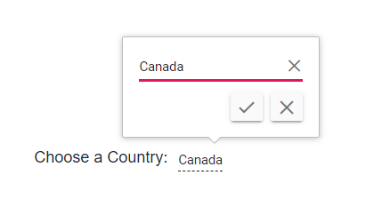
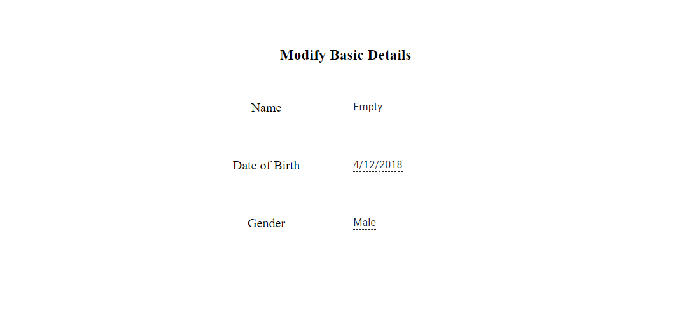
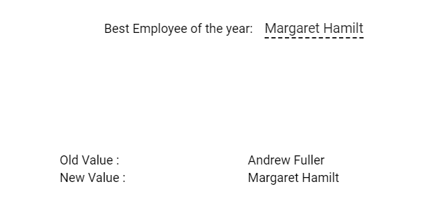

<!-- markdownlint-disable MD024 -->

# Getting Started with Blazor In-place Editor Component

This section briefly explains about how to include [Blazor In-place Editor](https://www.syncfusion.com/blazor-components/blazor-in-place-editor) component in your Blazor Server App and Blazor WebAssembly App using Visual Studio.

## Prerequisites

* [System requirements for Blazor components](https://blazor.syncfusion.com/documentation/system-requirements)

## Create a new Blazor App in Visual Studio

You can create **Blazor Server App** or **Blazor WebAssembly App** using Visual Studio in one of the following ways,

* [Create a Project using Microsoft Templates](https://docs.microsoft.com/en-us/aspnet/core/blazor/tooling?pivots=windows)

* [Create a Project using Syncfusion Blazor Extension](https://blazor.syncfusion.com/documentation/visual-studio-integration/vs2019-extensions/create-project)

## Install Syncfusion Blazor InPlaceEditor NuGet in the App

Syncfusion Blazor components are available in [nuget.org](https://www.nuget.org/packages?q=syncfusion.blazor). To use Syncfusion Blazor components in the application, add reference to the corresponding NuGet. Refer to [NuGet packages topic](https://blazor.syncfusion.com/documentation/nuget-packages) for available NuGet packages list with component details and [Benefits of using individual NuGet packages](https://blazor.syncfusion.com/documentation/nuget-packages#benefits-of-using-individual-nuget-packages).

To add Blazor In-place Editor component in the app, open the NuGet package manager in Visual Studio (*Tools → NuGet Package Manager → Manage NuGet Packages for Solution*), search for [Syncfusion.Blazor.InPlaceEditor](https://www.nuget.org/packages/Syncfusion.Blazor.InPlaceEditor) and then install it.

## Register Syncfusion Blazor Service

Open **~/_Imports.razor** file and import the Syncfusion.Blazor namespace.




@using Syncfusion.Blazor




Now, register the Syncfusion Blazor Service in the Blazor Server App or Blazor WebAssembly App. Here, Syncfusion Blazor Service is registered by setting [IgnoreScriptIsolation](https://help.syncfusion.com/cr/blazor/Syncfusion.Blazor.GlobalOptions.html#Syncfusion_Blazor_GlobalOptions_IgnoreScriptIsolation) property as true to load the scripts externally in the [next steps](#add-script-reference).

> From 2022 Vol1 (20.1) version - The default value of `IgnoreScriptIsolation` is changed as `true`, so, you don’t have to set `IgnoreScriptIsolation` property explicitly to refer scripts externally.

### Blazor Server App

* For **.NET 6** app, open the **~/Program.cs** file and register the Syncfusion Blazor Service.

* For **.NET 5 and .NET 3.X** app, open the **~/Startup.cs** file and register the Syncfusion Blazor Service.




using Microsoft.AspNetCore.Components;
using Microsoft.AspNetCore.Components.Web;
using Syncfusion.Blazor;

var builder = WebApplication.CreateBuilder(args);

// Add services to the container.
builder.Services.AddRazorPages();
builder.Services.AddServerSideBlazor();
builder.Services.AddSyncfusionBlazor(options => { options.IgnoreScriptIsolation = true; });

var app = builder.Build();
....





using Syncfusion.Blazor;

namespace BlazorApplication
{
    public class Startup
    {
        ...
        public void ConfigureServices(IServiceCollection services)
        {
            services.AddRazorPages();
            services.AddServerSideBlazor();
            services.AddSyncfusionBlazor(options => { options.IgnoreScriptIsolation = true; });
        }
        ...
    }
}




### Blazor WebAssembly App

Open **~/Program.cs** file and register the Syncfusion Blazor Service in the client web app.




using Microsoft.AspNetCore.Components.Web;
using Microsoft.AspNetCore.Components.WebAssembly.Hosting;
using Syncfusion.Blazor;

var builder = WebAssemblyHostBuilder.CreateDefault(args);
builder.RootComponents.Add<App>("#app");
builder.RootComponents.Add<HeadOutlet>("head::after");

builder.Services.AddScoped(sp => new HttpClient { BaseAddress = new Uri(builder.HostEnvironment.BaseAddress) });

builder.Services.AddSyncfusionBlazor(options => { options.IgnoreScriptIsolation = true; });
await builder.Build().RunAsync();
....





using Syncfusion.Blazor;

namespace WebApplication1
{
    public class Program
    {
        public static async Task Main(string[] args)
        {
            ....
            builder.Services.AddSyncfusionBlazor(options => { options.IgnoreScriptIsolation = true; });
            await builder.Build().RunAsync();
        }
    }
}




## Add style sheet

Checkout the [Blazor Themes topic](https://blazor.syncfusion.com/documentation/appearance/themes) to learn different ways ([Static Web Assets](https://blazor.syncfusion.com/documentation/appearance/themes#static-web-assets), [CDN](https://blazor.syncfusion.com/documentation/appearance/themes#cdn-reference) and [CRG](https://blazor.syncfusion.com/documentation/common/custom-resource-generator)) to refer themes in Blazor application, and to have the expected appearance for Syncfusion Blazor components. Here, the theme is referred using [Static Web Assets](https://blazor.syncfusion.com/documentation/appearance/themes#static-web-assets). Refer to [Enable static web assets usage](https://blazor.syncfusion.com/documentation/appearance/themes#enable-static-web-assets-usage) topic to use static assets in your project.

To add theme to the app, open the NuGet package manager in Visual Studio (*Tools → NuGet Package Manager → Manage NuGet Packages for Solution*), search for [Syncfusion.Blazor.Themes](https://www.nuget.org/packages/Syncfusion.Blazor.Themes/) and then install it. Then, the theme style sheet from NuGet can be referred as follows,

> If you are using [Syncfusion.Blazor](https://www.nuget.org/packages/Syncfusion.Blazor/) single NuGet, you don't have to refer [Syncfusion.Blazor.Themes](https://www.nuget.org/packages/Syncfusion.Blazor.Themes/) NuGet. Since style sheets already inside the assets of `Syncfusion.Blazor` NuGet. 

### Blazor Server App

* For .NET 6 app, add the Syncfusion bootstrap5 theme in the `<head>` of the **~/Pages/_Layout.cshtml** file.

* For .NET 5 and .NET 3.X app, add the Syncfusion bootstrap5 theme in the `<head>` of the **~/Pages/_Host.cshtml** file.




<head>
    ...
    <link href="_content/Syncfusion.Blazor.Themes/bootstrap5.css" rel="stylesheet" />
    <!--Refer theme style sheet as below if you are using Syncfusion.Blazor Single NuGet-->
    <!--<link href="_content/Syncfusion.Blazor/styles/bootstrap5.css" rel="stylesheet" />-->
</head>





<head>
    ...
    <link href="_content/Syncfusion.Blazor.Themes/bootstrap5.css" rel="stylesheet" />
    <!--Refer theme style sheet as below if you are using Syncfusion.Blazor Single NuGet-->
    <!--<link href="_content/Syncfusion.Blazor/styles/bootstrap5.css" rel="stylesheet" />-->
</head>




### Blazor WebAssembly App

For Blazor WebAssembly App, Refer the theme style sheet from NuGet in the `<head>` of **wwwroot/index.html** file in the client web app.




<head>
    ...
    <link href="_content/Syncfusion.Blazor.Themes/bootstrap5.css" rel="stylesheet" />
    <!--Refer theme style sheet as below if you are using Syncfusion.Blazor Single NuGet-->
    <!--<link href="_content/Syncfusion.Blazor/styles/bootstrap5.css" rel="stylesheet" />-->
</head>




## Add script reference

Checkout [Adding Script Reference topic](https://blazor.syncfusion.com/documentation/common/adding-script-references) to learn different ways to add script reference in Blazor Application. In this getting started walk-through, the required scripts are referred using [Static Web Assets](https://blazor.syncfusion.com/documentation/common/adding-script-references#static-web-assets) externally inside the `<head>` as follows. Refer to [Enable static web assets usage](https://blazor.syncfusion.com/documentation/common/adding-script-references#enable-static-web-assets-usage) topic to use static assets in your project.

### Blazor Server App

* For **.NET 6** app, refer script in the `<head>` of the **~/Pages/_Layout.cshtml** file.

* For **.NET 5 and .NET 3.X** app, refer script in the `<head>` of the **~/Pages/_Host.cshtml** file.




<head>
    ....
    <link href="_content/Syncfusion.Blazor.Themes/bootstrap5.css" rel="stylesheet" />
    
    <!--Use below script reference if you are using Syncfusion.Blazor Single NuGet-->
    <!---->
</head>





<head>
    ....
    <link href="_content/Syncfusion.Blazor.Themes/bootstrap5.css" rel="stylesheet" />
    
    <!--Use below script reference if you are using Syncfusion.Blazor Single NuGet-->
    <!---->
</head>




### Blazor WebAssembly App

For Blazor WebAssembly App, refer script in the `<head>` of the **~/index.html** file.




<head>
    ....
    <link href="_content/Syncfusion.Blazor.Themes/bootstrap5.css" rel="stylesheet" />
    
    <!--Use below script reference if you are using Syncfusion.Blazor Single NuGet-->
    <!---->
</head>




> Syncfusion recommends to reference scripts using [Static Web Assets](https://blazor.syncfusion.com/documentation/common/adding-script-references#static-web-assets), [CDN](https://blazor.syncfusion.com/documentation/common/adding-script-references#cdn-reference) and [CRG](https://blazor.syncfusion.com/documentation/common/custom-resource-generator) by [disabling JavaScript isolation](https://blazor.syncfusion.com/documentation/common/adding-script-references#disable-javascript-isolation) for better loading performance of the Blazor application.

## Add Blazor In-Place Editor component

* Open **~/_Imports.razor** file or any other page under the `~/Pages` folder where the component is to be added and import the **Syncfusion.Blazor.InPlaceEditor** namespace.




@using Syncfusion.Blazor
@using Syncfusion.Blazor.InPlaceEditor
@using Syncfusion.Blazor.Inputs




* Now, add the Syncfusion In-place Editor component in razor file. Here, the In-place Editor component is added in the **~/Pages/Index.razor** file under the **~/Pages** folder.




<table>
    <tr>
        <td>
            <label class="control-label" style="text-align: left;font-size: 14px;font-weight: 400">
                TextBox
            </label>
        </td>
        <td>
            <SfInPlaceEditor @bind-Value="@TextValue" TValue="string">
                <EditorComponent>
                    <SfTextBox @bind-Value="@TextValue" Placeholder="Enter employee name"></SfTextBox>
                </EditorComponent>
            </SfInPlaceEditor>
        </td>
    </tr>
</table>

@code {
    public string TextValue = "Andrew";
}




> The type of component editor must be configured in the 'Type' Editor In-place property. Also, the two-way binding between the In-place Editor and its EditorComponent should be configured. It's used to update the editor component value into the In-place Editor component.

* Press <kbd>Ctrl</kbd>+<kbd>F5</kbd> (Windows) or <kbd>⌘</kbd>+<kbd>F5</kbd> (macOS) to run the application. Then, the Syncfusion `Blazor In-place Editor` component will be rendered in the default web browser.

> [View Sample in GitHub](https://github.com/SyncfusionExamples/Blazor-Getting-Started-Examples/tree/main/InPlaceEditor).

## Render In-place Editor with popup

The following code explains how to initialize a simple In-place Editor with popup in the Blazor page.




@using Syncfusion.Blazor.InPlaceEditor
@using Syncfusion.Blazor.DropDowns

<table>
    <tr>
        <td>
            <label class="control-label">
                Choose a Country:
            </label>
        </td>
        <td>
            <SfInPlaceEditor Type="Syncfusion.Blazor.InPlaceEditor.InputType.AutoComplete" @bind-Value="@AutoValue" Mode="RenderMode.Popup" TValue="string">
                <EditorComponent>
                    <SfAutoComplete TValue="string" TItem="Countries" @bind-Value="@AutoValue" Placeholder="e.g. Australia" DataSource="@LocalData">
                        <AutoCompleteFieldSettings Value="Name"></AutoCompleteFieldSettings>
                    </SfAutoComplete>
                </EditorComponent>
            </SfInPlaceEditor>
        </td>
    </tr>
</table>

@code {
    public string AutoValue = "Australia";

    public class Countries
    {
        public string Name { get; set; }
        public string Code { get; set; }
    }

    List<Countries> LocalData = new List<Countries> {
        new Countries() { Name = "Australia", Code = "AU" },
        new Countries() { Name = "Bermuda", Code = "BM" },
        new Countries() { Name = "Canada", Code = "CA" },
        new Countries() { Name = "Cameroon", Code = "CM" },
        new Countries() { Name = "Denmark", Code = "DK" }
    };
}




## Configuring DropDownList

You can render the Blazor DropDownList by changing the [Type](https://help.syncfusion.com/cr/blazor/Syncfusion.Blazor.InPlaceEditor.SfInPlaceEditor-1.html#Syncfusion_Blazor_InPlaceEditor_SfInPlaceEditor_1_Type) property as `DropDownList` and configuring the `DropDownList` component inside the Editor component.




@using Syncfusion.Blazor.DropDowns
@using Syncfusion.Blazor.InPlaceEditor

<SfInPlaceEditor @bind-Value="@DropdownValue" Type="Syncfusion.Blazor.InPlaceEditor.InputType.DropDownList" TValue="string">
    <EditorComponent>
        <SfDropDownList TValue="string" TItem="Games"  @bind-Value="@DropdownValue" Placeholder="Select a game" DataSource="@LocalData">
            <DropDownListFieldSettings Value="ID" Text="Text"></DropDownListFieldSettings>
        </SfDropDownList>
    </EditorComponent>
</SfInPlaceEditor>

@code {
    public string DropdownValue = "Cricket";

    public class Games
    {
        public string ID { get; set; }
        public string Text { get; set; }
    }
    List<Games> LocalData = new List<Games> {
    new Games() { ID= "Game1", Text= "American Football" },
    new Games() { ID= "Game2", Text= "Badminton" },
    new Games() { ID= "Game3", Text= "Basketball" },
    new Games() { ID= "Game4", Text= "Cricket" },
    new Games() { ID= "Game5", Text= "Football" },
    new Games() { ID= "Game6", Text= "Golf" },
    new Games() { ID= "Game7", Text= "Hockey" },
    new Games() { ID= "Game8", Text= "Rugby"},
    new Games() { ID= "Game9", Text= "Snooker" },
    new Games() { ID= "Game10", Text= "Tennis"},
  };
}




## Integrate DatePicker

You can render the Blazor `DatePicker` by changing the `Type` property as `Date` and configuring the `DatePicker` component inside the Editor component. Also, configure its properties directly in the `Datepicker` component.




@using Syncfusion.Blazor.InPlaceEditor
@using Syncfusion.Blazor.Calendars

<SfInPlaceEditor Type="Syncfusion.Blazor.InPlaceEditor.InputType.Date" TValue="DateTime?" @bind-Value="@DateValue">
    <EditorComponent>
        <SfDatePicker TValue="DateTime?" @bind-Value="@DateValue" Placeholder="Choose a Date"></SfDatePicker>
    </EditorComponent>
</SfInPlaceEditor>

@code {
    public DateTime? DateValue { get; set; } = new DateTime(DateTime.Now.Year, DateTime.Now.Month, DateTime.Now.Day);

}




In the following code, it is configured to render the `DatePicker`, `DropDownList` and `Textbox` components.




@using Syncfusion.Blazor.InPlaceEditor
@using Syncfusion.Blazor.Inputs
@using Syncfusion.Blazor.Calendars
@using Syncfusion.Blazor.DropDowns

    <h3> Modify Basic Details </h3>
    <table style="margin: 10px auto;">
        <tr>
            <td>Name</td>
            <td class='left'>
                <SfInPlaceEditor @bind-Value="@TextValue" TValue="string">
                    <EditorComponent>
                        <SfTextBox @bind-Value="@TextValue" Placeholder="Enter your name"></SfTextBox>
                    </EditorComponent>
                </SfInPlaceEditor>
            </td>
        </tr>
        <tr>
            <td>Date of Birth</td>
            <td class='left'>
                <SfInPlaceEditor Type="Syncfusion.Blazor.InPlaceEditor.InputType.Date" TValue="DateTime?" @bind-Value="@DateValue">
                    <EditorComponent>
                        <SfDatePicker TValue="DateTime?" @bind-Value="@DateValue" Placeholder="Select date"></SfDatePicker>
                    </EditorComponent>
                </SfInPlaceEditor>
            </td>
        </tr>
        <tr>
            <td>Gender</td>
            <td class='left'>
                <SfInPlaceEditor @bind-Value="@DropdownValue" Type="Syncfusion.Blazor.InPlaceEditor.InputType.DropDownList"  TValue="string">
                    <EditorComponent>
                        <SfDropDownList Width="90%" TItem="Gender" TValue="string" DataSource="@dropdownData" @bind-Value="@DropdownValue">
                            <DropDownListFieldSettings Text="text" Value="text"></DropDownListFieldSettings>
                        </SfDropDownList>
                    </EditorComponent>
                </SfInPlaceEditor>
            </td>
        </tr>
    </table>

@code {
    public DateTime? DateValue { get; set; } = new DateTime(DateTime.Now.Year, DateTime.Now.Month, DateTime.Now.Day);
    public string TextValue = "Andrew";
    public string DropdownValue = "Male";

    public class Gender
    {
        public string value { get; set; }
        public string text { get; set; }
    }
    List<Gender> dropdownData = new List<Gender>()
    {
        new Gender(){ text= "Male" },
        new Gender(){ text= "Female" }
    };
}




## Submitting data to the server (save)

You can submit editor value to the server by configuring the [SaveUrl](https://help.syncfusion.com/cr/blazor/Syncfusion.Blazor.InPlaceEditor.SfInPlaceEditor-1.html#Syncfusion_Blazor_InPlaceEditor_SfInPlaceEditor_1_SaveUrl), [Adaptor](https://help.syncfusion.com/cr/blazor/Syncfusion.Blazor.InPlaceEditor.SfInPlaceEditor-1.html#Syncfusion_Blazor_InPlaceEditor_SfInPlaceEditor_1_Adaptor) and [PrimaryKey](https://help.syncfusion.com/cr/blazor/Syncfusion.Blazor.InPlaceEditor.SfInPlaceEditor-1.html#Syncfusion_Blazor_InPlaceEditor_SfInPlaceEditor_1_PrimaryKey) properties.

| Property   | Usage                                           |
|------------|---------------------------------------------------------|
| **`SaveUrl`**        | Gets the URL for server submit action.        |
| **`Adaptor`**    | Specifies the adaptor type that is used by DataManager to communicate with DataSource.                |
| **`PrimaryKey`** | Defines the unique primary key of editable field which can be used for saving data in the data-base.|

> The `PrimaryKey` property is mandatory. If it is not set, edited data are not sent to the server.

## Refresh In-place Editor with modified value

The edited data is submitted to the server and you can see the new values getting reflected in the In-place Editor.




@using Syncfusion.Blazor.DropDowns
@using Syncfusion.Blazor.InPlaceEditor

    

        Best Employee of the year:

        <SfInPlaceEditor @ref="InPlaceObj" PrimaryKey="Employee" Name="Employee" Adaptor="Adaptors.UrlAdaptor" SaveUrl="https://ej2services.syncfusion.com/production/web-services/api/Editor/UpdateData" Type="Syncfusion.Blazor.InPlaceEditor.InputType.DropDownList" @bind-Value="@DropdownValue" TValue="string">
            <EditorComponent>
                <SfDropDownList TValue="string" TItem="Employees" Placeholder="Select employee" PopupHeight="200px" DataSource="@LocalData">
                    <DropDownListFieldSettings Value="ID" Text="Text"></DropDownListFieldSettings>
                </SfDropDownList>
            </EditorComponent>t
            <InPlaceEditorEvents Created="@OnCreate" OnActionSuccess="@OnSuccess" TValue="string"></InPlaceEditorEvents>
        </SfInPlaceEditor>

    

    <table style="margin:60px auto;width:25%">
        <tr>
            <td style="text-align: left">
                Old Value :
            </td>
            <td id="oldValue" style="text-align: left">
                @PreviousValue
            </td>
        </tr>
        <tr>
            <td style="text-align: left">
                New Value :
            </td>
            <td id="newValue" style="text-align: left">
                @CurrentValue
            </td>
        </tr>
    </table>

@code {
    SfInPlaceEditor<string> InPlaceObj;
    public string PreviousValue { get; set; }
    public string DropdownValue = "Andrew";
    public string CurrentValue { get; set; }

    public class Employees
    {
        public string ID { get; set; }
        public string Text { get; set; }
    }
    List<Employees> LocalData = new List<Employees> {
    new Employees() { ID= "Andrew", Text= "Andrew" },
    new Employees() { ID= "Margaret Hamilit", Text= "Margaret Hamilit" },
    new Employees() { ID= "Fuller", Text= "Fuller" },
    new Employees() { ID= "John Smith", Text= "John Smith" },
    new Employees() { ID= "Victoria", Text= "Victoria" },
    new Employees() { ID= "David", Text= "David" },
    new Employees() { ID= "Johnson", Text= "Johnson" },
    new Employees() { ID= "Rosy", Text= "Rosy"}
  };

    public void OnCreate(Object args)
    {
        this.CurrentValue = this.DropdownValue;
    }

    public void OnSuccess(ActionEventArgs<string> args)
    {
        this.PreviousValue = this.CurrentValue;
        this.CurrentValue = args.Value;
    }
}




## See Also

* [Getting Started with Syncfusion Blazor for client-side in .NET Core CLI](../getting-started/blazor-webassembly-dotnet-cli/)

* [Getting Started with Syncfusion Blazor for server-side in Visual Studio](../getting-started/blazor-server-side-visual-studio/)

* [Getting Started with Syncfusion Blazor for server-side in .NET Core CLI](../getting-started/blazor-server-side-dotnet-cli/)